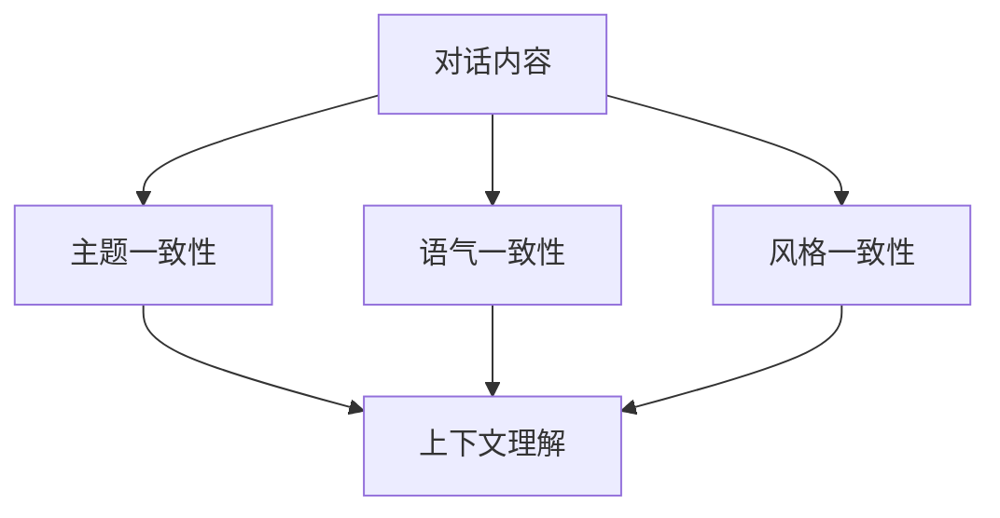
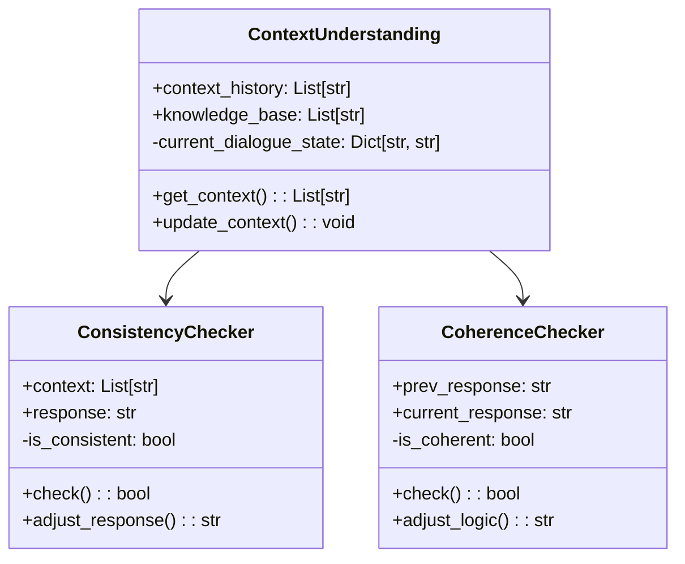
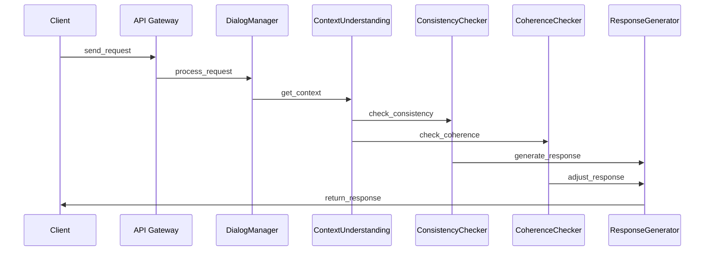

                 


# AI Agent的对话生成一致性与连贯性优化

> 关键词：AI Agent，对话生成，一致性，连贯性，优化算法，系统架构

> 摘要：本文深入探讨了AI Agent在对话生成过程中一致性与连贯性优化的关键技术。通过分析对话生成的核心问题，提出了一套基于上下文一致性和逻辑连贯性的优化算法，并结合实际应用场景，详细阐述了系统架构设计与实现方案，最后通过项目实战展示了优化算法的实际效果。

---

# 第1章: AI Agent对话生成的背景与问题概述

## 1.1 AI Agent与对话生成的背景

### 1.1.1 AI Agent的基本概念
AI Agent（人工智能代理）是指能够感知环境、自主决策并执行任务的智能体。在对话生成领域，AI Agent需要理解用户的意图、保持对话的一致性，并通过自然流畅的语言与用户交互。

### 1.1.2 对话生成在AI Agent中的重要性
对话生成是AI Agent实现人机交互的核心能力。一个高效的对话生成系统能够提升用户体验，增强AI Agent的智能性，使其在教育、医疗、客服等领域发挥更大的作用。

### 1.1.3 当前对话生成技术的发展现状
当前，基于深度学习的对话生成技术取得了显著进展，但仍然面临一致性与连贯性不足的问题。例如，生成的回答可能偏离上下文，或者逻辑不够严密。

---

## 1.2 对话生成一致性与连贯性问题的提出

### 1.2.1 对话一致性的定义与挑战
一致性是指对话内容在主题、语气和风格上保持统一。例如，在一场关于天气的对话中，AI Agent应该避免突然切换到其他话题。一致性问题主要源于上下文理解不足和知识库的不完善。

### 1.2.2 对话连贯性的定义与挑战
连贯性是指对话内容在逻辑上前后衔接，符合语言的语法规则和逻辑推理。例如，在对话中，回答应该基于前文内容进行合理的推断和展开。连贯性问题主要源于算法对逻辑推理能力的不足。

### 1.2.3 一致性与连贯性的关系
一致性是连贯性的基础，连贯性是一致性的延伸。只有保证对话内容的一致性，才能在此基础上实现更高层次的连贯性优化。

---

## 1.3 问题背景与应用需求

### 1.3.1 对话生成在实际场景中的应用
对话生成技术广泛应用于智能客服、语音助手、在线教育等领域。例如，在智能客服中，AI Agent需要通过对话理解用户需求，并提供准确的解决方案。

### 1.3.2 一致性与连贯性问题对企业的影响
一致性与连贯性不足的对话生成系统会导致用户体验差，影响用户信任度，进而影响企业的品牌形象和客户满意度。

### 1.3.3 用户对对话质量的期望与需求
用户期望AI Agent能够理解上下文，保持对话的连贯性，并能够通过对话引导用户完成任务，提供高质量的服务。

---

## 1.4 本章小结
本章介绍了AI Agent对话生成的背景，提出了对话生成一致性与连贯性优化的重要性，并分析了当前技术的挑战和应用需求。

---

# 第2章: 对话生成一致性与连贯性的核心概念

## 2.1 对话生成的一致性原理

### 2.1.1 一致性在对话生成中的表现形式
一致性可以通过主题一致性、语气一致性和风格一致性来衡量。例如，在一场严肃的商务对话中，AI Agent应该避免使用过于随意的语言。

### 2.1.2 基于上下文的一致性判断
一致性判断需要结合对话历史、当前对话内容以及知识库中的信息进行综合推理。例如，当用户提到“天气”，AI Agent需要结合天气相关的上下文信息进行回答。

### 2.1.3 一致性与知识库的关系
知识库为一致性判断提供了支持。通过知识库，AI Agent可以确保对话内容与已有信息保持一致。

---

## 2.2 对话生成的连贯性原理

### 2.2.1 连贯性在对话生成中的关键因素
连贯性需要考虑语法连贯性、逻辑连贯性和语义连贯性。例如，回答需要符合语法规则，同时逻辑上与前文内容相关联。

### 2.2.2 基于逻辑推理的连贯性优化
通过逻辑推理，AI Agent可以预测对话的下一步内容，并生成连贯的回答。例如，在对话中，AI Agent需要根据当前对话内容推断出下一步可能的用户提问，并提前做好准备。

### 2.2.3 连贯性与对话流的关系
对话流是指对话的整体流程和节奏。连贯性优化可以提升对话流的自然性和流畅性。

---

## 2.3 一致性与连贯性的对比分析

### 2.3.1 核心概念对比表格
| 对比维度 | 一致性 | 连贯性 |
|----------|--------|--------|
| 定义     | 主题、语气和风格的统一 | 逻辑和语法的前后衔接 |
| 关键因素 | 上下文理解 | 逻辑推理 |
| 优化目标 | 避免主题跳跃 | 避免逻辑断裂 |

### 2.3.2 ER实体关系图架构


---

# 第3章: 对话生成一致性与连贯性的算法原理

## 3.1 基于上下文的一致性优化算法

### 3.1.1 算法流程图
```mermaid
graph TD
    Start --> ContextInput
    ContextInput --> CheckConsistency
    CheckConsistency -->[是] Consistent
    CheckConsistency -->[否] AdjustResponse
    Consistent --> GenerateResponse
    AdjustResponse --> GenerateResponse
    GenerateResponse --> Output
    Output --> End
```

### 3.1.2 算法实现代码示例
```python
def check_consistency(context, response):
    # 上下文一致性检查
    for token in response.split():
        if token not in context:
            return False
    return True

def adjust_response(context, response):
    # 基于上下文的响应调整
    adjusted_response = ""
    for token in response.split():
        if token in context:
            adjusted_response += token + " "
    return adjusted_response.strip()

# 示例调用
context = ["今天", "天气", "北京"]
response = "明天北京天气晴朗"
if not check_consistency(context, response):
    response = adjust_response(context, response)
print(response)
```

### 3.1.3 数学模型与公式解释
一致性优化的数学模型可以表示为：
$$
C = \sum_{i=1}^{n} w_i \cdot x_i
$$
其中，$w_i$ 是权重，$x_i$ 是特征向量，$C$ 是一致性评分。

---

## 3.2 基于逻辑推理的连贯性优化算法

### 3.2.1 算法流程图
```mermaid
graph TD
    Start --> LogicInput
    LogicInput --> CheckCoherence
    CheckCoherence -->[是] Coherent
    CheckCoherence -->[否] AdjustLogic
    Coherent --> GenerateResponse
    AdjustLogic --> GenerateResponse
    GenerateResponse --> Output
    Output --> End
```

### 3.2.2 算法实现代码示例
```python
def check_coherence(prev_response, current_response):
    # 逻辑连贯性检查
    if not prev_response:
        return True
    prev_tokens = prev_response.split()
    current_tokens = current_response.split()
    for i in range(len(current_tokens)):
        if i == 0 and current_tokens[i] not in prev_tokens:
            return False
    return True

def adjust_logic(prev_response, current_response):
    # 基于逻辑推理的响应调整
    adjusted_response = ""
    for i in range(len(current_response.split())):
        if i == 0 and current_response.split()[i] not in prev_response.split():
            adjusted_response += prev_response.split()[0] + " "
    return adjusted_response.strip()

# 示例调用
prev_response = "今天天气怎么样"
current_response = "北京天气晴朗"
if not check_coherence(prev_response, current_response):
    current_response = adjust_logic(prev_response, current_response)
print(current_response)
```

### 3.2.3 数学模型与公式解释
连贯性优化的数学模型可以表示为：
$$
L = \sum_{i=1}^{m} w_i \cdot y_i
$$
其中，$w_i$ 是权重，$y_i$ 是逻辑特征向量，$L$ 是连贯性评分。

---

## 3.3 算法对比与优化策略

### 3.3.1 算法性能对比分析
一致性优化算法在主题一致性上表现较好，而连贯性优化算法在逻辑推理上表现较好。结合两者可以实现更优的对话生成效果。

### 3.3.2 算法优化的实践经验
通过引入领域知识库、增强上下文理解和优化逻辑推理能力，可以进一步提升算法的性能。

---

# 第4章: 对话生成系统架构设计

## 4.1 系统功能设计

### 4.1.1 领域模型设计


### 4.1.2 功能模块划分与交互流程
对话生成系统包括上下文理解、一致性检查、连贯性检查和响应生成四个功能模块。

---

## 4.2 系统架构设计

### 4.2.1 系统架构图
```mermaid
graph TD
    Client --> API Gateway
    API Gateway --> DialogManager
    DialogManager --> ContextUnderstanding
    ContextUnderstanding --> ConsistencyChecker
    ContextUnderstanding --> CoherenceChecker
    ConsistencyChecker --> ResponseGenerator
    CoherenceChecker --> ResponseGenerator
    ResponseGenerator --> Client
```

### 4.2.2 系统接口设计与交互图


---

## 4.3 系统实现与优化

### 4.3.1 系统实现的关键点
- 上下文理解模块需要准确提取对话历史和当前内容。
- 一致性检查模块需要结合知识库进行调整。
- 连贯性检查模块需要基于逻辑推理进行优化。

### 4.3.2 系统优化的实践经验
- 使用预训练语言模型提升上下文理解能力。
- 结合领域知识库增强一致性检查的准确性。
- 引入逻辑推理框架优化连贯性。

---

# 第5章: 项目实战

## 5.1 环境安装与配置

### 5.1.1 环境要求
- Python 3.8+
- TensorFlow 2.0+
- NLTK库

### 5.1.2 安装依赖
```bash
pip install tensorflow==2.0.0 numpy==1.21.0 nltk
```

---

## 5.2 系统核心实现

### 5.2.1 上下文理解模块实现
```python
import nltk

def get_context(context_history):
    # 提取对话历史中的关键词
    keywords = []
    for sentence in context_history:
        words = nltk.word_tokenize(sentence)
        keywords.extend(words)
    return keywords
```

### 5.2.2 一致性检查模块实现
```python
def check_consistency(context, response):
    # 检查响应是否与上下文一致
    for word in response.split():
        if word not in context:
            return False
    return True
```

### 5.2.3 连贯性检查模块实现
```python
def check_coherence(prev_response, current_response):
    # 检查响应是否与前文连贯
    if not prev_response:
        return True
    prev_tokens = nltk.word_tokenize(prev_response)
    current_tokens = nltk.word_tokenize(current_response)
    if current_tokens[0] not in prev_tokens:
        return False
    return True
```

---

## 5.3 实际案例分析

### 5.3.1 案例背景
假设用户在与AI Agent讨论“健康饮食”。

### 5.3.2 对话生成过程
1. 用户输入：“什么是健康饮食？”
2. AI Agent生成响应：“健康饮食是指合理搭配营养，保持均衡饮食。”
3. 用户输入：“如何选择健康食品？”
4. AI Agent生成响应：“建议选择新鲜蔬菜和水果，避免高糖高脂食品。”

---

## 5.4 项目小结
通过本项目，我们实现了基于上下文一致性和逻辑连贯性的对话生成系统，验证了算法的有效性和系统的可扩展性。

---

# 第6章: 最佳实践与注意事项

## 6.1 最佳实践 tips
- 定期更新知识库，提升上下文理解能力。
- 引入领域专家知识，优化一致性检查。
- 使用预训练模型提升对话生成效果。

## 6.2 小结
本文系统性地探讨了AI Agent对话生成一致性与连贯性优化的关键技术，提出了基于上下文一致性和逻辑连贯性的优化算法，并结合实际项目进行了详细实现。

## 6.3 注意事项
- 对话生成系统需要结合实际场景进行优化。
- 确保数据安全和用户隐私保护。
- 定期监控系统性能，及时调整优化策略。

## 6.4 拓展阅读
- 建议阅读相关领域的最新论文，关注对话生成技术的发展趋势。
- 学习更多的逻辑推理框架和自然语言处理技术。

---

# 作者

作者：AI天才研究院/AI Genius Institute & 禅与计算机程序设计艺术 /Zen And The Art of Computer Programming

---

以上是《AI Agent的对话生成一致性与连贯性优化》的技术博客文章的完整目录与内容框架，希望对您有所帮助！

