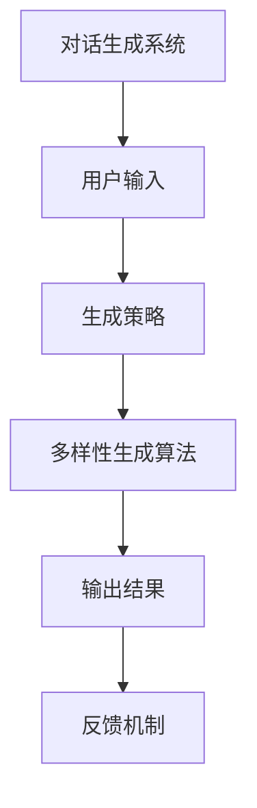
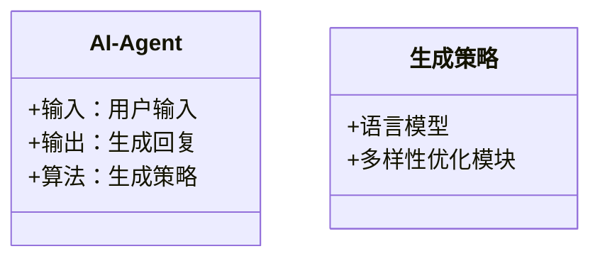
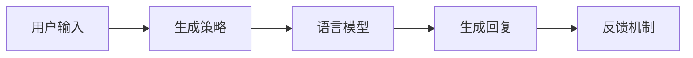
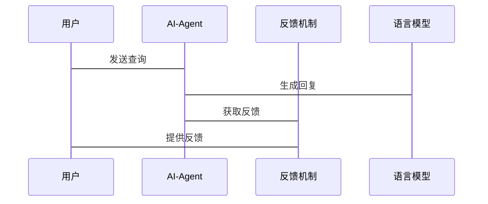

                 


# AI Agent的对话生成多样性：避免单调回复

## 关键词：AI Agent、对话生成、多样性、生成模型、对抗训练

## 摘要：  
在AI Agent的对话生成中，避免单调回复是实现自然流畅交互的重要挑战。本文详细探讨了对话生成的多样性的关键问题，从算法原理、系统架构到实际案例，系统地分析了如何通过改进生成模型和优化训练策略来提升对话的多样性。文章还结合了Mermaid图和数学公式，深入解释了相关概念和技术实现。

---

# 第一部分: AI Agent对话生成多样性概述

## 第1章: 问题背景与核心概念

### 1.1 问题背景  
#### 1.1.1 当前对话生成的挑战  
在AI Agent的应用中，对话生成是实现人机交互的核心技术。然而，现有的生成模型往往容易陷入生成回复的单调性问题，导致用户体验差。  

#### 1.1.2 单调回复的负面影响  
单调回复不仅降低了用户体验，还可能让用户对AI Agent的信任度下降，影响产品竞争力。  

#### 1.1.3 生成多样性的重要性  
生成多样性的目标是让AI Agent在对话中能够灵活应对不同的输入和场景，提供丰富且自然的回复，提升用户满意度。  

### 1.2 对话生成的基本概念  
#### 1.2.1 对话生成的定义  
对话生成是指通过算法从输入中生成符合语义和语法的自然语言回复的过程。  

#### 1.2.2 AI Agent的定义与特点  
AI Agent是一种能够感知环境并主动执行任务的智能体，其核心能力包括理解输入、生成回复和学习优化。  

#### 1.2.3 对话生成多样性的定义与度量  
多样性指的是生成回复的丰富性和独特性，可以通过熵值、困惑度等指标进行度量。  

### 1.3 问题描述与解决目标  
#### 1.3.1 当前对话生成中的主要问题  
现有生成模型在处理复杂语义和上下文时，容易生成重复或单一的回复。  

#### 1.3.2 生成多样性解决的目标  
通过优化生成策略，提升AI Agent的回复多样性，使其能够生成丰富且自然的对话内容。  

#### 1.3.3 边界与外延  
对话生成的多样性应在保证回复正确性和相关性的前提下进行优化。  

### 1.4 核心概念结构与组成  
#### 1.4.1 对话生成的流程模型  
输入 → 解释 → 生成策略 → 输出  
  
#### 1.4.2 AI Agent的交互模型  
用户输入 → 解析 → 生成回复 → 用户反馈  

#### 1.4.3 多样性生成的机制  
通过引入随机性、上下文建模和对抗训练等方法，提升生成的多样性。  

---

## 第2章: 核心概念与联系  

### 2.1 核心概念原理  
#### 2.1.1 对话生成的原理分析  
对话生成基于语言模型，通过概率分布生成回复。  

#### 2.1.2 AI Agent的核心算法  
主流算法包括基于Transformer的生成模型和强化学习算法。  

#### 2.1.3 多样性生成的数学模型  
多样性生成可以通过优化目标函数中的惩罚项实现。  

### 2.2 核心概念属性对比  
#### 2.2.1 对话生成的多样性与一致性对比  
多样性强调生成的丰富性，一致性强调回复的相关性。  

#### 2.2.2 AI Agent的生成能力与约束条件对比  
生成能力受限于模型的训练数据和算法能力。  

#### 2.2.3 不同生成算法的性能对比  
基于马尔可夫链的生成算法在短文本生成中表现较好，而基于Transformer的模型在长文本生成中更具优势。  

### 2.3 ER实体关系图  


---

## 第3章: 算法原理与数学模型  

### 3.1 算法原理  
#### 3.1.1 基于马尔可夫链的生成模型  
马尔可夫链用于建模语言的时序性，通过状态转移生成回复。  

#### 3.1.2 基于强化学习的生成算法  
通过定义奖励函数，优化生成策略，提升回复的多样性和质量。  

#### 3.1.3 基于对抗训练的多样性优化  
引入对抗网络，通过生成器和判别器的对抗训练，提升生成回复的多样性。  

### 3.2 数学模型与公式  
#### 3.2.1 多样性度量公式  
$$ D = \frac{1}{N} \sum_{i=1}^{N} \text{div}(y_i) $$  
其中，$D$表示多样性度量，$y_i$表示第$i$个生成的回复，$\text{div}(y_i)$表示回复的多样性指标。  

#### 3.2.2 强化学习的奖励函数  
$$ R = \sum_{i=1}^{M} r_i \cdot p_i $$  
其中，$R$表示总奖励，$r_i$表示第$i$个奖励项，$p_i$表示对应的概率。  

#### 3.2.3 对抗训练  
生成器的目标是最小化判别器的分类损失，判别器的目标是区分生成样本和真实样本。  

---

## 第4章: 系统分析与架构设计  

### 4.1 系统分析  
#### 4.1.1 问题场景介绍  
用户与AI Agent进行对话时，希望得到多样化的回复。  

#### 4.1.2 项目介绍  
本项目旨在优化AI Agent的对话生成算法，提升回复的多样性和自然性。  

### 4.2 系统架构设计  
#### 4.2.1 领域模型设计  


#### 4.2.2 系统架构设计  


#### 4.2.3 系统接口设计  
用户输入接口、生成策略接口、反馈接口。  

#### 4.2.4 系统交互设计  


---

## 第5章: 项目实战  

### 5.1 环境安装  
安装必要的依赖库，如Python、TensorFlow、Keras等。  

### 5.2 核心实现  
#### 5.2.1 生成策略实现  
```python
def generate_response(input_text):
    # 生成策略实现
    pass
```

#### 5.2.2 多样性优化实现  
```python
def diversity_optimization():
    # 多样性优化实现
    pass
```

### 5.3 案例分析  
通过实际案例分析，展示如何优化生成策略，提升回复的多样性。  

### 5.4 总结  
项目实现的关键点和经验总结。  

---

## 第6章: 总结与最佳实践  

### 6.1 总结  
通过优化生成策略和算法改进，可以有效提升AI Agent对话生成的多样性。  

### 6.2 最佳实践  
#### 6.2.1 生成策略的选择  
根据具体场景选择合适的生成算法。  

#### 6.2.2 训练数据的优化  
确保训练数据的多样性和代表性。  

#### 6.2.3 反馈机制的引入  
通过用户反馈不断优化生成策略。  

### 6.3 注意事项  
避免过度追求多样性而忽略回复的相关性和正确性。  

### 6.4 拓展阅读  
推荐相关领域的优秀论文和书籍。  

---

## 作者：AI天才研究院/AI Genius Institute & 禅与计算机程序设计艺术 /Zen And The Art of Computer Programming  

---

**全文完**

