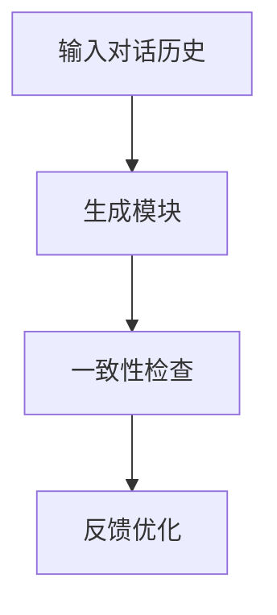
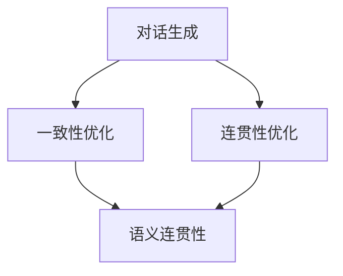
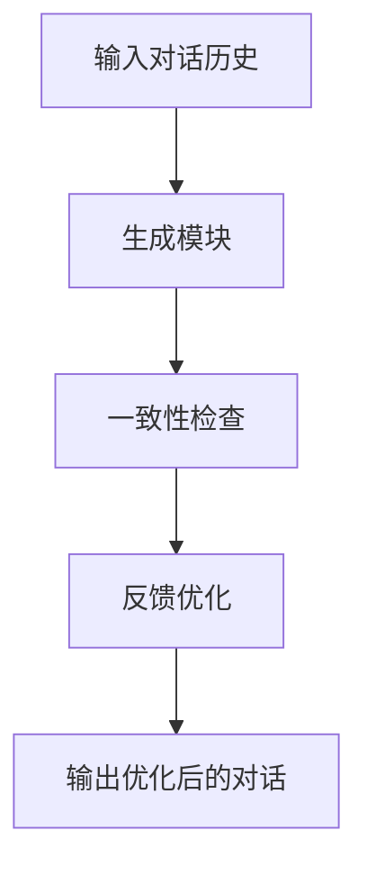
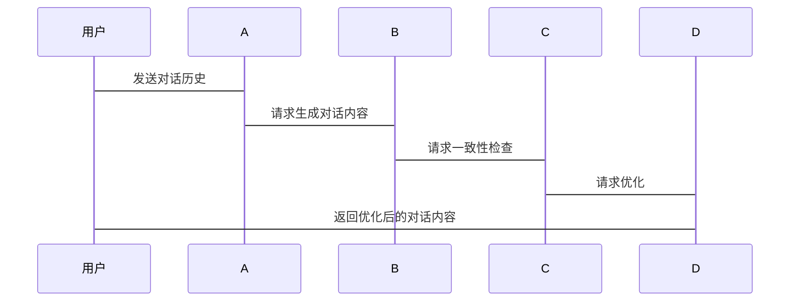

                 


# AI Agent的对话生成的一致性与连贯性优化

## 关键词：AI Agent, 对话生成, 一致性优化, 连贯性优化, 自然语言处理, 一致性评分, 连贯性评分

## 摘要：  
AI Agent的对话生成在自然语言处理领域具有重要意义，但对话的一致性和连贯性问题一直是技术难点。本文系统地分析了对话生成中一致性与连贯性的核心概念，探讨了多种优化算法，并通过数学模型和系统架构设计，提出了提升对话生成一致性和连贯性的解决方案。文章还结合实际案例，展示了如何在项目中实现这些优化方法，并总结了最佳实践和未来研究方向。

---

## 第一章: AI Agent对话生成的背景与问题

### 1.1 问题背景  
- **对话生成的定义与应用场景**：对话生成是AI Agent与人类交互的核心能力，广泛应用于智能客服、虚拟助手、教育机器人等领域。  
- **当前对话生成技术的局限性**：现有技术在对话的一致性和连贯性方面存在不足，例如上下文记忆不充分、逻辑推理能力有限、知识库利用不足等问题。  
- **一致性与连贯性问题的重要性**：对话生成的一致性是指对话内容在逻辑和语义上保持一致；连贯性是指对话在语义和语境上自然衔接。这两者是衡量对话生成质量的重要指标，直接影响用户体验和任务成功率。  

### 1.2 问题描述  
- **对话生成中的不一致现象**：例如前后矛盾、信息重复、逻辑跳跃等。  
- **对话连贯性不足的表现形式**：例如上下文断裂、话题转移不自然、语义跳跃等。  
- **用户对对话一致性和连贯性的需求**：用户期望与AI Agent的对话逻辑清晰、内容连贯、自然流畅，这不仅是技术挑战，也是用户体验的关键因素。  

### 1.3 问题解决的思路  
- **引入上下文记忆机制**：通过记忆网络或Transformer架构，增强对话的上下文关联性。  
- **增强对话生成的逻辑推理能力**：结合推理模型，提升对话的逻辑性和一致性。  
- **结合外部知识库提升一致性**：利用知识图谱或外部数据库，确保对话内容的准确性与一致性。  

### 1.4 边界与外延  
- **对话生成的边界条件**：对话生成需要在特定的领域或任务范围内进行，例如客服对话、教育对话等。  
- **一致性与连贯性的外延范围**：一致性关注内容的逻辑性，连贯性关注语义的自然衔接，两者相互关联但又有区别。  
- **相关概念的对比分析**：通过对比分析，明确一致性与连贯性的区别与联系，避免混淆。  

### 1.5 概念结构与核心要素  
- **对话生成的系统架构**：包括输入处理模块、生成模块、一致性检查模块和反馈优化模块。  
- **一致性与连贯性的核心要素**：包括上下文记忆、逻辑推理、语义理解、知识库利用等。  
- **各要素之间的关系图**：通过mermaid图展示各要素之间的关系，例如：  


---

## 第二章: 对话生成的核心概念与联系

### 2.1 对话生成的原理  
- **基于语言模型的生成方法**：如GPT系列模型，通过概率预测生成对话内容。  
- **基于规则的生成方法**：通过预定义的规则和模板生成对话。  
- **基于强化学习的生成方法**：通过强化学习优化对话生成策略，例如使用策略梯度方法。  

### 2.2 一致性与连贯性的定义  
- **对话一致性的定义**：对话内容在逻辑、语义和上下文中保持一致，避免前后矛盾。  
- **对话连贯性的定义**：对话内容在语义和语境上自然衔接，形成流畅的对话流程。  
- **一致性与连贯性的区别与联系**：一致性关注逻辑性，连贯性关注语义衔接，两者共同决定对话的质量。  

### 2.3 核心概念对比分析  
- **不同一致性优化方法的对比**：例如基于记忆网络的方法 vs 基于逻辑推理的方法。  
- **不同连贯性优化方法的对比**：例如基于语言模型的平滑方法 vs 基于知识图谱的连贯性优化。  
- **方法优缺点对比表格**：通过表格形式展示不同方法的优缺点，帮助读者选择合适的方法。  

### 2.4 实体关系图  
- **核心概念的关系图**：通过mermaid图展示对话生成、一致性优化、连贯性优化三者之间的关系。  


---

## 第三章: 算法原理与数学模型

### 3.1 一致性优化算法  
- **基于记忆网络的生成方法**：通过记忆网络记录对话历史，增强上下文记忆能力。  
- **一致性评分函数**：定义一致性评分函数，评估对话内容的一致性。  
- **优化算法**：通过梯度下降优化一致性评分函数，提升对话一致性。  

### 3.2 连贯性优化算法  
- **基于注意力机制的生成方法**：通过Transformer的注意力机制，增强对话的连贯性。  
- **连贯性评分函数**：定义连贯性评分函数，评估对话内容的连贯性。  
- **优化算法**：通过强化学习优化连贯性评分函数，提升对话连贯性。  

### 3.3 数学模型  
- **一致性评分函数的数学模型**：  
  $$ C = \sum_{i=1}^{n} \text{sim}(s_i, s_{i+1}) $$  
  其中，$s_i$ 是对话历史中的第 $i$ 个句子，$\text{sim}$ 是相似度计算函数。  
- **连贯性评分函数的数学模型**：  
  $$ S = \sum_{i=1}^{m} \text{coher}(a_i, a_{i+1}) $$  
  其中，$a_i$ 是对话中的第 $i$ 个动作，$\text{coher}$ 是连贯性计算函数。  

---

## 第四章: 系统分析与架构设计

### 4.1 问题场景介绍  
- **目标任务**：提升AI Agent对话生成的一致性和连贯性。  
- **问题约束**：对话生成需要在实时交互中完成，对计算资源要求较高。  

### 4.2 系统功能设计  
- **领域模型**：通过mermaid类图展示系统功能模块之间的关系。  
```mermaid
classDiagram
class A[输入处理模块]
class B[生成模块]
class C[一致性检查模块]
class D[反馈优化模块]
A --> B
B --> C
C --> D
```

### 4.3 系统架构设计  
- **系统架构图**：通过mermaid图展示系统的整体架构。  


### 4.4 系统接口设计  
- **输入接口**：接收用户输入的对话历史和当前对话内容。  
- **输出接口**：输出优化后的对话内容，包括一致性检查和连贯性优化的结果。  

### 4.5 系统交互流程  
- **交互流程图**：通过mermaid序列图展示系统交互流程。  


---

## 第五章: 项目实战与案例分析

### 5.1 环境安装  
- **安装依赖**：安装Python、TensorFlow、Keras等必要的工具和库。  

### 5.2 核心实现代码  
- **一致性评分函数的实现**：  
  ```python
  def compute_consistency_score(history, current_response):
      # 计算历史对话与当前回复的一致性评分
      pass
  ```
- **连贯性评分函数的实现**：  
  ```python
  def compute_coherence_score(history, current_response):
      # 计算历史对话与当前回复的连贯性评分
      pass
  ```

### 5.3 代码解读与分析  
- **代码功能分析**：解释代码的每个部分，说明其在一致性与连贯性优化中的作用。  

### 5.4 实际案例分析  
- **案例分析**：通过具体案例展示如何优化对话生成的一致性和连贯性。  

### 5.5 项目总结  
- **项目成果**：总结项目实现的效果和优化的成果。  

---

## 第六章: 最佳实践与小结

### 6.1 最佳实践 tips  
- **优化建议**：如何选择合适的一致性与连贯性优化方法。  
- **系统设计注意事项**：如何设计高效的对话生成系统架构。  

### 6.2 小结  
- **总结全文**：回顾文章的核心内容，强调一致性与连贯性优化的重要性。  

### 6.3 注意事项  
- **潜在问题**：如何避免一致性与连贯性优化中的常见问题。  

### 6.4 拓展阅读  
- **推荐阅读资料**：推荐相关的技术论文、书籍和资源，供读者深入学习。  

---

## 作者：AI天才研究院/AI Genius Institute & 禅与计算机程序设计艺术 /Zen And The Art of Computer Programming

