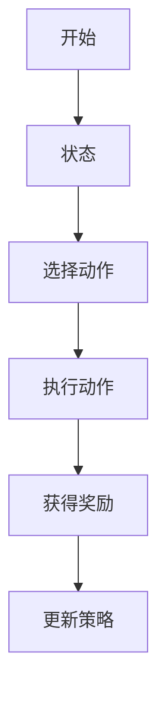
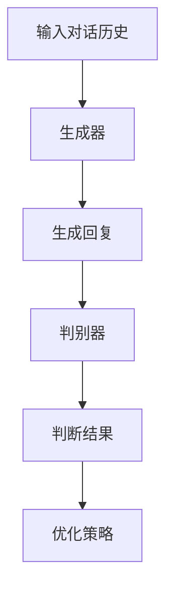
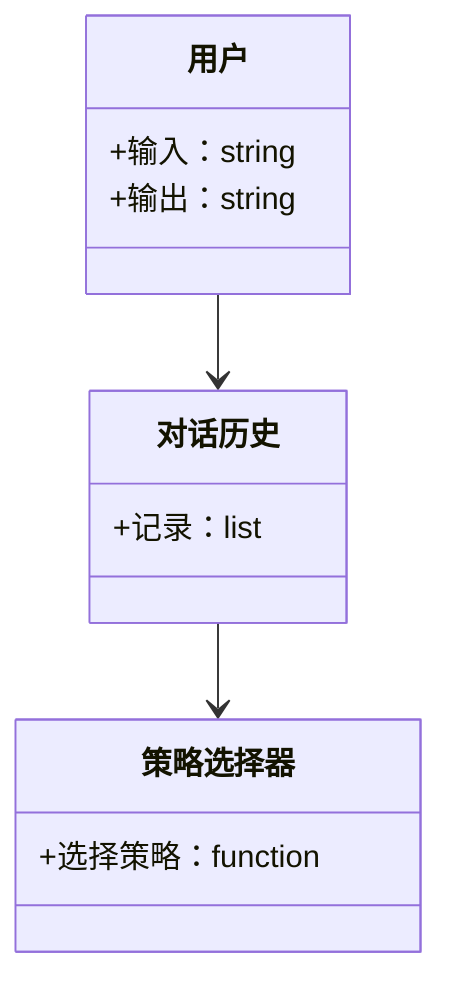

                 


# AI Agent的对话策略优化：提升交互质量和效率

> 关键词：AI Agent，对话策略优化，交互质量，强化学习，自然语言处理，用户体验

> 摘要：本文深入探讨了AI Agent对话策略优化的关键技术，分析了其核心概念、算法原理、系统架构，并通过实际案例展示了优化策略的应用。文章从背景介绍、核心概念、算法原理、系统分析、项目实战到最佳实践，全面解析了如何提升对话交互的质量和效率。

---

# 第1章: AI Agent与对话策略优化概述

## 1.1 AI Agent的基本概念
### 1.1.1 AI Agent的定义与分类
AI Agent（人工智能代理）是指能够感知环境并采取行动以实现目标的智能实体。根据功能和应用场景的不同，AI Agent可以分为以下几类：
- **简单反射型Agent**：基于预设规则直接响应输入，适用于简单的对话任务。
- **基于模型的反射型Agent**：利用内部模型理解和预测用户需求，提供更复杂的交互。
- **目标驱动型Agent**：具有明确的目标，主动规划和执行对话策略。

### 1.1.2 对话交互的基本原理
对话交互是AI Agent与用户之间通过语言进行信息交换的过程。其基本原理包括：
1. **输入处理**：接收用户的输入并解析其含义。
2. **意图识别**：识别用户的意图和需求。
3. **策略选择**：根据当前状态选择最优的回应策略。
4. **输出生成**：生成符合策略的回复并返回给用户。

### 1.1.3 对话策略优化的定义与目标
对话策略优化是指通过改进AI Agent的策略选择机制，使其在对话过程中更高效、更准确地满足用户需求。其目标包括提高用户满意度、减少对话轮数、提升信息准确性和增强上下文理解能力。

## 1.2 对话策略优化的背景与重要性
### 1.2.1 当前对话交互的主要挑战
- **意图识别不准确**：用户输入可能存在歧义，导致Agent理解错误。
- **上下文理解不足**：对话历史信息未被充分利用，影响回应的相关性。
- **策略选择单一**：缺乏多样化的回应策略，导致对话体验单调。

### 1.2.2 对话策略优化的必要性
- **提升用户体验**：优化策略使对话更加自然流畅，提高用户满意度。
- **提高交互效率**：通过更智能的策略选择，减少不必要的对话轮数。
- **增强适应性**：使AI Agent能够更好地应对复杂多变的用户需求。

### 1.2.3 优化对话策略的实际应用场景
- **智能客服**：通过优化策略提高问题解决效率。
- **虚拟助手**：提升日常交互的便捷性和准确性。
- **教育辅助**：提供更个性化的学习指导。

## 1.3 对话策略优化的核心要素
### 1.3.1 对话上下文的理解与处理
- **上下文解析**：基于对话历史信息，理解当前对话的背景和上下文。
- **记忆机制**：通过记忆技术（如记忆网络）保留对话相关信息。

### 1.3.2 用户意图识别的关键技术
- **自然语言处理技术**：利用NLP技术分析用户输入，提取关键信息。
- **意图分类模型**：使用机器学习模型对用户意图进行分类。

### 1.3.3 策略选择与执行机制
- **策略选择算法**：基于当前状态和用户意图，选择最优的回应策略。
- **动态调整机制**：根据对话进展实时调整策略，确保对话流畅。

---

# 第2章: 对话策略优化的核心概念与联系

## 2.1 对话策略优化的基本原理
### 2.1.1 基于规则的对话策略
- **规则定义**：通过预设规则定义对话流程，例如“如果用户提到天气，则回复当前天气信息”。
- **优点**：简单易懂，适用于特定场景。
- **缺点**：缺乏灵活性，难以应对复杂情况。

### 2.1.2 基于模型的对话策略
- **模型驱动**：利用机器学习模型（如深度神经网络）学习对话模式，自动生成回应。
- **优点**：灵活性高，能够处理复杂场景。
- **缺点**：需要大量数据和计算资源，模型训练成本较高。

### 2.1.3 基于强化学习的对话策略
- **强化学习机制**：通过强化学习算法（如DQN）优化策略选择，基于奖励机制调整行为。
- **优点**：能够动态适应对话环境，提升交互质量。
- **缺点**：训练过程复杂，需要大量交互数据。

## 2.2 对话策略优化的核心概念对比
### 2.2.1 基于规则与基于模型的对比分析
| 对比维度 | 基于规则 | 基于模型 |
|----------|----------|----------|
| 灵活性    | 低       | 高       |
| 复杂性    | 低       | 高       |
| 适应性    | 低       | 高       |

### 2.2.2 强化学习与其他优化方法的对比
| 对比维度 | 强化学习 | 基于规则 | 基于模型 |
|----------|----------|----------|----------|
| 训练成本 | 高       | 低       | 中       |
| 适应性   | 高       | 低       | 中       |
| 实时性   | 高       | 中       | 中       |

### 2.2.3 对话策略优化的优缺点分析
- **优点**：提升用户体验，提高交互效率，增强系统适应性。
- **缺点**：需要大量数据和计算资源，模型训练复杂度高。

## 2.3 对话策略优化的ER实体关系图
```mermaid
er
    entity(用户) 
    entity(对话历史) 
    entity(意图识别) 
    entity(策略选择) 
    entity(系统反馈)
```

---

# 第3章: 对话策略优化的算法原理

## 3.1 基于强化学习的对话策略优化
### 3.1.1 强化学习的基本原理
- **状态空间**：对话的当前状态，包括用户意图、对话历史等。
- **动作空间**：可能的回应策略。
- **奖励机制**：根据用户反馈和对话效果给予奖励。

### 3.1.2 DQN算法在对话优化中的应用


### 3.1.3 Python实现示例
```python
import numpy as np
import random

class DQN:
    def __init__(self, state_size, action_size):
        self.state_size = state_size
        self.action_size = action_size
        # 省略网络定义和训练代码
```

## 3.2 基于生成对抗网络的对话策略优化
### 3.2.1 GAN的基本原理
- **生成器**：生成符合对话策略的回复。
- **判别器**：判断回复是否符合用户期望。

### 3.2.2 GAN在对话优化中的应用


### 3.2.3 Python实现示例
```python
import torch
import torch.nn as nn

class Generator(nn.Module):
    def __init__(self, hidden_size):
        super(Generator, self).__init__()
        self.fc = nn.Linear(hidden_size, hidden_size)

    def forward(self, input):
        output = self.fc(input)
        return output
```

---

# 第4章: 对话策略优化的系统分析与架构设计

## 4.1 问题场景介绍
- **目标**：优化AI Agent的对话策略，提升交互质量和效率。
- **范围**：涵盖从用户输入处理到策略选择的整个流程。

## 4.2 系统功能设计
### 4.2.1 领域模型设计


### 4.2.2 系统架构设计


## 4.3 系统接口设计
- **输入接口**：接收用户的文本输入。
- **输出接口**：返回优化后的回复。

---

# 第5章: 对话策略优化的项目实战

## 5.1 环境安装
- **工具安装**：安装Python、TensorFlow、Keras等框架。
- **数据准备**：收集和整理对话数据集。

## 5.2 核心代码实现
### 5.2.1 对话策略选择器实现
```python
def choose_strategy(context, options):
    # 简单基于规则的策略选择
    best_option = max(options, key=lambda x: score(context, x))
    return best_option
```

### 5.2.2 强化学习模型实现
```python
class DQN:
    def __init__(self, state_size, action_size):
        self.model = self._build_model()
        # 省略训练代码
```

## 5.3 实际案例分析
### 5.3.1 案例背景
- **用户输入**：我需要帮助安排会议时间。
- **对话历史**：用户询问可用时间。

### 5.3.2 优化策略应用
- **策略选择**：根据用户日历信息推荐最佳时间。
- **系统反馈**：确认用户选择的时间。

---

# 第6章: 对话策略优化的最佳实践

## 6.1 小结与总结
- **小结**：对话策略优化通过提升交互质量和效率，显著改善用户体验。
- **总结**：结合强化学习和生成对抗网络等技术，优化策略选择，实现更智能的对话交互。

## 6.2 注意事项
- **数据质量**：确保训练数据的多样性和代表性。
- **模型调优**：持续优化模型参数，提升策略选择的准确性。
- **用户反馈**：及时收集用户反馈，不断改进策略。

## 6.3 未来趋势
- **多模态对话**：结合视觉和语音信息，提供更丰富的交互体验。
- **个性化策略**：根据用户偏好定制专属对话策略。

---

作者：AI天才研究院/AI Genius Institute & 禅与计算机程序设计艺术 /Zen And The Art of Computer Programming

