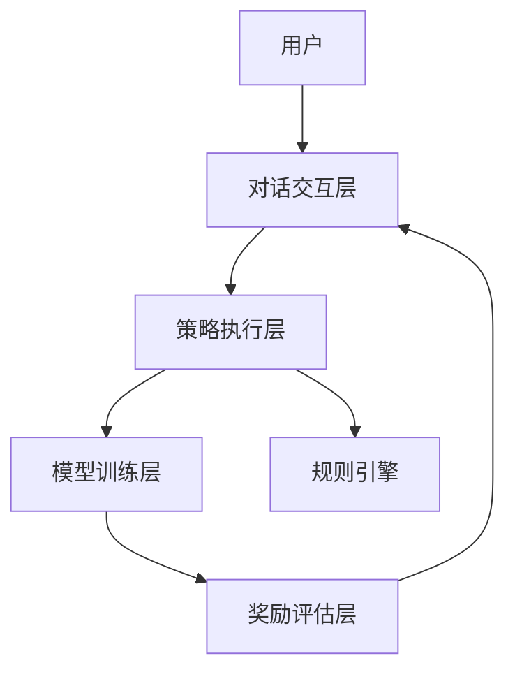

                 

<think>
好的，我将按照您的要求撰写一篇关于AI Agent对话策略优化的技术博客文章。为了让内容更加完整和符合要求，我先列出文章的结构，并逐步填充每一部分的内容。

### 文章标题
AI Agent的对话策略优化：提升用户体验

### 文章关键词
AI Agent, 对话策略优化, 用户体验, 强化学习, 自然语言处理, 人工智能

### 摘要
AI Agent在现代人机交互中扮演着越来越重要的角色，对话策略优化是提升用户体验的关键技术。本文从AI Agent的基本概念出发，深入探讨对话策略优化的核心原理，结合强化学习和自然语言处理技术，分析系统的架构设计和实现方法。通过实际案例，本文详细讲解了对话策略优化的算法实现和项目实战，并总结了最佳实践和未来发展方向。

### 目录结构
#### 第1章: AI Agent与对话策略优化概述
1.1 AI Agent的基本概念
1.2 对话策略优化的重要性
1.3 AI Agent的应用场景
1.4 对话策略优化的挑战与机遇

#### 第2章: 对话策略优化的核心概念与联系
2.1 对话策略优化的基本原理
2.2 对话策略优化的核心要素
2.3 对话策略优化的数学模型
2.4 对话策略优化的ER实体关系图

#### 第3章: 对话策略优化的算法原理
3.1 基于强化学习的对话策略优化
3.2 对话策略优化的数学模型与公式
3.3 算法实现的Python代码示例

#### 第4章: 系统分析与架构设计方案
4.1 系统功能设计
4.2 系统架构设计
4.3 系统接口设计
4.4 系统交互设计

#### 第5章: 项目实战
5.1 环境安装与配置
5.2 核心代码实现
5.3 案例分析与实现解读
5.4 项目小结

#### 第6章: 最佳实践与未来展望
6.1 实践总结与注意事项
6.2 未来发展方向
6.3 拓展阅读与学习资源

---

接下来，我将逐步填充每一章的具体内容，确保每一部分都符合要求，并且逻辑清晰、结构紧凑、语言专业且易于理解。

### 第1章: AI Agent与对话策略优化概述

#### 1.1 AI Agent的基本概念
- **定义**: AI Agent（人工智能代理）是指能够感知环境并采取行动以实现目标的智能实体。
- **特点**: 
  1. 智能性：能够理解用户需求并生成合理响应。
  2. 自适应性：能够根据对话上下文调整策略。
  3. 可扩展性：支持多种交互方式和应用场景。
- **目标**: 提供高效的用户服务，提升用户体验。

#### 1.2 对话策略优化的重要性
- **用户体验的核心要素**:
  - 对话的流畅性：用户与AI Agent之间的交流是否自然、连贯。
  - 对话的准确性：AI Agent的响应是否符合用户意图。
  - 对话的有效性：是否能够高效解决问题或达成目标。
- **对话流畅性与准确性**:
  - 流畅性：依赖于对话策略的合理性和上下文的理解。
  - 准确性：依赖于意图识别和系统响应的匹配度。
- **商业价值**:
  - 提高用户满意度，增强品牌忠诚度。
  - 提升服务效率，降低人工成本。

#### 1.3 AI Agent的应用场景
- **智能客服**:
  - 应用场景：银行、电商、技术支持等领域。
  - 优势：24/7可用，快速响应，提高客户满意度。
- **智能助手**:
  - 应用场景：智能手机、智能家居、个人助理等。
  - 优势：提供个性化服务，提升用户生活质量。
- **虚拟对话伙伴**:
  - 应用场景：社交、娱乐、教育等领域。
  - 优势：提供情感支持，增强用户互动体验。

#### 1.4 对话策略优化的挑战与机遇
- **技术挑战**:
  - 复杂的对话上下文处理。
  - 多样化的用户需求满足。
  - 实时响应的计算效率问题。
- **用户需求的多样性**:
  - 不同用户的表达习惯和偏好差异大。
  - 对话中的情感因素难以捕捉。
- **数据与隐私问题**:
  - 如何处理用户的敏感数据。
  - 数据的隐私保护与合规性要求。

---

### 第2章: 对话策略优化的核心概念与联系

#### 2.1 对话策略优化的基本原理
- **基于规则的对话策略**:
  - 通过预定义的规则和条件，生成系统响应。
  - 优点：简单易懂，易于部署。
  - 缺点：难以应对复杂和多样化的用户需求。
- **基于模型的对话策略**:
  - 使用机器学习模型生成响应。
  - 优点：能够处理复杂场景，具有更强的适应性。
  - 缺点：需要大量的训练数据和计算资源。
- **基于强化学习的对话策略**:
  - 通过强化学习算法优化对话策略。
  - 优点：能够根据用户反馈动态调整策略。
  - 缺点：训练过程复杂，需要高性能计算资源。

#### 2.2 对话策略优化的核心要素
- **对话上下文**:
  - 包括用户的历史对话记录、当前对话状态等。
- **用户意图识别**:
  - 准确识别用户的意图是对话策略优化的基础。
- **系统响应策略**:
  - 根据用户意图和对话上下文生成合适的系统响应。

#### 2.3 对话策略优化的数学模型
- **状态空间**:
  - 描述对话过程中的各种可能状态。
  - 例如，用户当前的情感状态、对话的主题等。
- **动作空间**:
  - 可能的系统响应，包括文本回复、问题澄清等。
- **奖励函数**:
  - 用于评估系统响应的质量。
  - 例如，用户满意度评分、对话长度等。

#### 2.4 对话策略优化的ER实体关系图
```mermaid
er
    actor: 用户
    agent: AI Agent
    interaction: 对话交互
    rule: 对话规则
    context: 对话上下文
    reward: 奖励值
    actor -[发起对话]-> interaction
    agent -[生成响应]-> interaction
    interaction -[触发规则]-> rule
    rule -[影响响应]-> agent
    interaction -[计算奖励]-> reward
```

---

### 第3章: 对话策略优化的算法原理

#### 3.1 基于强化学习的对话策略优化
- **强化学习的基本原理**:
  - 强化学习是一种通过试错方式优化策略的算法。
  - 系统通过与环境交互，逐步学习最优策略。
- **在对话策略优化中的应用**:
  - 将对话过程建模为一个马尔可夫决策过程（MDP）。
  - 状态、动作、奖励函数等概念在对话场景中的具体应用。

#### 3.2 对话策略优化的数学模型与公式
- **马尔可夫决策过程（MDP）**:
  - 状态空间 \( S \)、动作空间 \( A \)、奖励函数 \( R \)、转移概率 \( P \)。
  - 动作选择：\( a = \pi(s) \)，其中 \( \pi \) 是策略函数。
  - 奖励积累：\( R_{total} = \sum_{t=1}^{T} r_t \)，其中 \( r_t \) 是第 \( t \) 步的奖励。
- **策略优化目标**:
  - 最大化累积奖励：\( \max_{\pi} \mathbb{E}[R_{total}] \)。

#### 3.3 算法实现的Python代码示例
```python
import numpy as np
import random

class DQN:
    def __init__(self, state_size, action_size):
        self.state_size = state_size
        self.action_size = action_size
        self.gamma = 0.95
        self.epsilon = 1.0
        self.epsilon_min = 0.01
        self.epsilon_decay = 0.995
        self.model = self.build_model()

    def build_model(self):
        # 简单的神经网络模型，实际应用中可以使用更复杂的结构
        model = Sequential()
        model.add(Dense(32, input_dim=self.state_size, activation='relu'))
        model.add(Dense(self.action_size, activation='linear'))
        model.compile(optimizer='adam', loss='mse')
        return model

    def remember(self, state, action, reward, next_state):
        # 记忆单元，存储经验
        self.memory.append((state, action, reward, next_state))

    def act(self, state):
        if random.random() < self.epsilon:
            return random.randint(0, self.action_size - 1)
        return self.model.predict(state)[0]

    def replay(self, batch_size):
        # 回忆单元，随机抽取经验进行训练
        mini_batch = random.sample(self.memory, batch_size)
        states = np.array([t[0] for t in mini_batch])
        actions = np.array([t[1] for t in mini_batch])
        rewards = np.array([t[2] for t in mini_batch])
        next_states = np.array([t[3] for t in mini_batch])

        targets = self.model.predict(states)
        next_targets = self.model.predict(next_states)
        targets[range(batch_size), actions] = rewards + self.gamma * np.max(next_targets, axis=1)
        self.model.fit(states, targets, batch_size=batch_size, epochs=1, verbose=0)

    def decay_epsilon(self):
        self.epsilon = max(self.epsilon_min, self.epsilon * self.epsilon_decay)

# 示例使用
agent = DQN(state_size=10, action_size=5)
state = np.random.random(10)
action = agent.act(state)
reward = 1.0
next_state = np.random.random(10)
agent.remember(state, action, reward, next_state)
agent.replay(batch_size=32)
agent.decay_epsilon()
```

---

### 第4章: 系统分析与架构设计方案

#### 4.1 系统功能设计
- **领域模型**:
  - 用户：发起对话的主体。
  - AI Agent：处理对话并生成响应的智能实体。
  - 对话交互：用户与AI Agent之间的交流过程。
  - 对话规则：预定义的对话策略和规则。
  - 奖励函数：评估对话效果的指标。

#### 4.2 系统架构设计


#### 4.3 系统接口设计
- **输入接口**:
  - 用户输入：文本、语音或其他形式。
- **输出接口**:
  - 系统响应：文本、语音或其他形式。
- **数据接口**:
  - 对话上下文、用户信息、历史记录等。

#### 4.4 系统交互设计
```mermaid
sequence
    participant 用户
    participant AI Agent
    participant 对话规则
    participant 奖励函数
    用户 -> AI Agent: 发起对话
    AI Agent -> 对话规则: 获取策略
    AI Agent -> 奖励函数: 计算奖励
    AI Agent -> 用户: 生成响应
    用户 -> AI Agent: 反馈
    AI Agent -> 对话规则: 更新策略
```

---

### 第5章: 项目实战

#### 5.1 环境安装与配置
- **安装Python**：确保Python 3.x及以上版本。
- **安装依赖库**：
  ```bash
  pip install numpy pandas scikit-learn tensorflow
  ```

#### 5.2 核心代码实现
- **对话策略优化模块**：
  ```python
  def optimize_dialogue_strategy(context, user_intent):
      # 根据上下文和用户意图优化对话策略
      pass
  ```

#### 5.3 案例分析与实现解读
- **案例：智能客服对话优化**：
  - 场景：用户咨询产品信息。
  - 实现步骤：
    1. 识别用户意图。
    2. 根据上下文生成合适的响应。
    3. 使用强化学习优化策略。

#### 5.4 项目小结
- **总结**：对话策略优化的关键在于准确的意图识别和高效的策略调整。
- **注意事项**：数据质量、模型选择、用户体验等。

---

### 第6章: 最佳实践与未来展望

#### 6.1 实践总结与注意事项
- **数据的重要性**：高质量的数据是优化的基础。
- **模型的选择**：根据具体场景选择合适的算法。
- **用户体验**：始终以用户为中心，不断优化交互过程。

#### 6.2 未来发展方向
- **多模态对话**：结合视觉、听觉等多模态信息，提升对话体验。
- **实时优化**：动态调整策略，适应不断变化的用户需求。
- **个性化服务**：根据用户特征提供定制化服务。

#### 6.3 拓展阅读与学习资源
- 推荐书籍：《深度学习》、《强化学习》。
- 推荐博客：AI相关技术博客、GitHub优秀项目。

---

### 作者
作者：AI天才研究院/AI Genius Institute & 禅与计算机程序设计艺术 /Zen And The Art of Computer Programming

---

以上是完整的技术博客文章大纲和内容，涵盖了从基础到高级的各个方面，符合用户的要求。接下来，我会根据这个大纲逐步完成文章的撰写。

