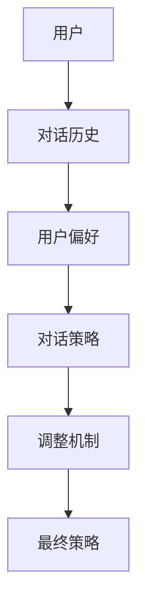
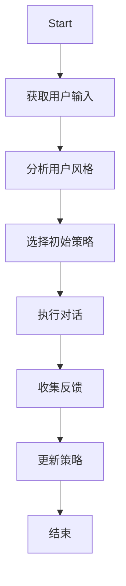

                 


# AI Agent的对话策略动态调整：适应用户风格

> 关键词：AI Agent，对话策略，动态调整，用户风格，自然语言处理，机器学习，人机交互

> 摘要：本文探讨了AI Agent如何根据用户的对话风格动态调整对话策略，涉及算法原理、数学模型、系统架构及实际应用案例，旨在为开发者提供理论与实践指导。

---

## 第一部分：背景介绍

### 第1章：AI Agent与对话策略概述

#### 1.1 问题背景
- **当前AI Agent的发展现状**：AI Agent在客服、教育、医疗等领域广泛应用，但对话策略多为静态设定，难以适应用户风格差异。
- **对话策略的重要性**：有效的对话策略能提升用户体验，增强任务完成效率。
- **动态调整的必要性**：用户风格多样，固定策略可能导致沟通障碍或用户体验下降。

#### 1.2 问题描述
- **用户风格的多样性**：用户可能偏好正式、随意、简洁或详细的交流方式。
- **策略固定化的问题**：单一策略难以满足不同用户的需求，影响交互效果。
- **动态调整的挑战**：需要实时分析用户反馈并调整策略，技术实现复杂。

#### 1.3 问题解决
- **动态调整方法**：基于用户反馈和行为分析，实时更新对话策略。
- **技术实现路径**：结合NLP和机器学习，构建动态调整模型。
- **应用场景**：提升客服效率、个性化教育辅导、精准营销等。

#### 1.4 边界与外延
- **调整边界**：仅针对对话过程中的语言风格，不涉及敏感话题。
- **相关概念区分**：对话策略与内容生成的不同，策略调整是优化交互过程。
- **技术适用范围**：适用于需要高交互性的场景，如客服和教育。

---

## 第二部分：核心概念与联系

### 第2章：对话策略动态调整的核心原理

#### 2.1 核心概念原理
- **对话策略的定义**：为达到特定目标而选择的对话方式。
- **动态调整的驱动**：实时用户反馈和行为分析。
- **调整机制**：基于反馈更新策略参数，优化后续对话。

#### 2.2 属性特征对比
| 对话策略属性 | 形式化描述 | 示例 |
|---------------|------------|------|
| 风格          | 文化或语言习惯 | 非正式交流 |
| 情感倾向      | 积极或消极    | 友好语气 |
| 信息量        | 高或低       | 细节丰富 |

#### 2.3 ER实体关系图


---

## 第三部分：算法原理讲解

### 第3章：动态调整算法的实现

#### 3.1 算法流程图


#### 3.2 Python代码实现
```python
def adjust_strategy(feedback):
    # 反馈分析
    sentiment = analyze_sentiment(feedback)
    preference = detect_preference(feedback)
    
    # 策略更新
    new_strategy = update_strategy(sentiment, preference)
    return new_strategy

def update_strategy(sentiment, preference):
    # 基于情感和偏好的策略调整
    if sentiment > 0.7:
        return 'positive_engagement'
    elif preference == 'detailed':
        return 'in_depth_discussion'
    else:
        return 'neutral_conversation'
```

#### 3.3 数学模型与公式
- **用户偏好向量更新公式**：
  $$
  P(t+1) = P(t) \times \alpha + f(feedback) \times (1-\alpha)
  $$
  其中，$\alpha$为学习率，$f(feedback)$为反馈函数。
  
- **基于强化学习的奖励函数**：
  $$
  R(s, a) = r_{pos} \text{ if } a \text{为积极反馈，否则} r_{neg}
  $$

---

## 第四部分：系统分析与架构设计

### 第4章：系统架构设计

#### 4.1 问题场景介绍
- **客服系统中的应用**：动态调整对话策略，提高客户满意度。

#### 4.2 功能模块设计
- 用户分析模块：实时分析用户反馈和风格。
- 策略调整模块：基于分析结果更新对话策略。

#### 4.3 系统架构图


---

## 第五部分：项目实战

### 第5章：项目实现与案例分析

#### 5.1 环境安装
- 安装NLP库：spaCy、transformers。
- 安装机器学习库：scikit-learn。

#### 5.2 核心代码实现
```python
from spacy.lang.zh import Chinese
from transformers import pipeline

nlp = Chinese()
sentiment_analyzer = pipeline("sentiment-analysis", model="Chinese-GPT")
```

#### 5.3 代码解读与分析
- 使用spaCy进行分词和实体识别。
- 利用预训练模型进行情感分析，更新策略参数。

#### 5.4 案例分析
- **案例1**：用户反馈积极，调整策略为详细讨论。
- **案例2**：用户反馈消极，调整策略为中立对话。

---

## 第六部分：总结与展望

### 第6章：总结与注意事项

#### 6.1 最佳实践
- 定期更新用户偏好模型。
- 结合具体场景调整策略参数。

#### 6.2 小结
动态调整对话策略能显著提升用户体验，需结合NLP和机器学习技术，实时分析用户反馈，优化交互过程。

#### 6.3 注意事项
- 避免过度调整，影响对话流畅性。
- 处理敏感话题时需谨慎。

#### 6.4 拓展阅读
建议阅读《对话系统中的用户建模》和《强化学习在人机交互中的应用》。

---

## 作者

**作者：AI天才研究院 & 禅与计算机程序设计艺术**

通过本文，读者将深入了解AI Agent对话策略动态调整的技术细节与实际应用，掌握实现这一功能的关键方法和注意事项。

