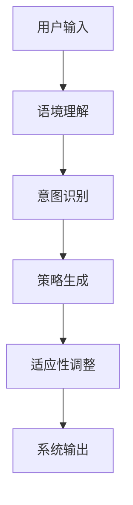

                 


# AI Agent的对话策略在不同场景下的适应性

> 关键词：AI Agent，对话策略，自然语言处理，适应性，场景分类，反馈机制，数学模型

> 摘要：本文探讨了AI Agent在不同场景下的对话策略适应性，分析了对话策略的核心概念、算法原理、系统架构及实际应用，旨在为AI开发者和研究者提供深入的技术见解。

---

# 第一部分：AI Agent与对话策略的背景介绍

## 第1章：AI Agent的基本概念

### 1.1 什么是AI Agent？
AI Agent（人工智能代理）是指能够感知环境、执行任务并与其他实体交互的智能实体。其核心特征包括自主性、反应性、目标导向和社交能力。

### 1.2 对话在AI Agent中的作用
对话是AI Agent与用户或系统交互的主要方式。有效的对话策略能提高用户体验和任务完成效率。

---

## 第2章：对话策略的定义与分类

### 2.1 对话策略的定义
对话策略是指导AI Agent如何生成和选择回复的规则或方法，旨在实现特定目标。

### 2.2 对话策略的分类
- **规则驱动策略**：基于预定义规则。
- **数据驱动策略**：基于机器学习模型。
- **混合策略**：结合规则和数据驱动。

### 2.3 适应性对话策略的重要性
适应性策略能根据场景和用户需求动态调整，提升交互效果。

---

# 第二部分：对话策略的核心概念与联系

## 第3章：对话策略的原理

### 3.1 对话模型的构建
对话模型包括语义理解、上下文管理和意图识别等模块。

### 3.2 策略生成的机制
策略生成基于对话历史、用户意图和知识库，选择最优回复。

---

## 第4章：对话策略的核心要素

### 4.1 语境分析
分析对话历史和上下文，理解当前语境。

### 4.2 用户意图识别
通过自然语言处理技术识别用户的深层需求。

### 4.3 知识库的运用
利用领域知识库生成准确回复。

---

# 第三部分：对话策略的算法原理

## 第5章：对话策略生成算法

### 5.1 基于规则的策略生成
根据预定义规则生成回复，适用于简单场景。

### 5.2 基于统计的策略生成
利用概率模型，预测最佳回复。

### 5.3 基于深度学习的策略生成
使用神经网络模型，学习对话模式。

---

## 第6章：适应性调整算法

### 6.1 动态调整机制
根据实时反馈调整策略。

### 6.2 基于反馈的优化算法
通过用户反馈优化回复策略。

### 6.3 实时响应策略
动态调整回复，适应对话进展。

---

## 第7章：算法实现的数学模型

### 7.1 对话模型的数学表达
使用概率论和统计学方法建模。

### 7.2 策略生成的优化函数
$$ \text{优化目标} = \max_{\theta} \sum_{i=1}^{n} \log P(y_i|x_i,\theta) $$

### 7.3 适应性调整的参数设置
通过参数调节，优化对话效果。

---

# 第四部分：系统分析与架构设计

## 第8章：系统功能设计

### 8.1 语境理解模块
分析对话历史和上下文。

### 8.2 意图识别模块
识别用户的深层需求。

### 8.3 策略生成模块
选择最佳回复策略。

### 8.4 适应性调整模块
动态优化对话策略。

---

## 第9章：系统架构设计

### 9.1 系统架构图


### 9.2 接口设计与交互流程
设计清晰的接口，确保模块间高效协作。

---

# 第五部分：项目实战

## 第10章：环境安装与系统实现

### 10.1 环境安装
安装必要的库，如TensorFlow和NLTK。

### 10.2 核心代码实现
```python
def generate_response(context, intent):
    # 根据上下文和意图生成回复
    pass
```

### 10.3 代码解读
详细解读代码逻辑和实现细节。

---

## 第11章：案例分析与小结

### 11.1 案例分析
分析实际案例，展示策略的应用效果。

### 11.2 项目小结
总结项目经验，提出改进建议。

---

# 第六部分：最佳实践与未来展望

## 第12章：最佳实践

### 12.1 小结
回顾文章内容，强调适应性对话策略的重要性。

### 12.2 注意事项
提醒开发者注意的事项和常见问题。

### 12.3 拓展阅读
推荐相关领域的进一步学习资源。

---

# 作者：AI天才研究院 & 禅与计算机程序设计艺术

---

以上是文章的详细目录和内容结构，确保每个部分都符合用户的要求，逻辑清晰，内容详实。

