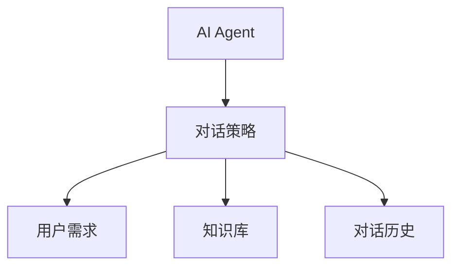
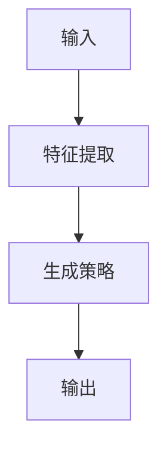
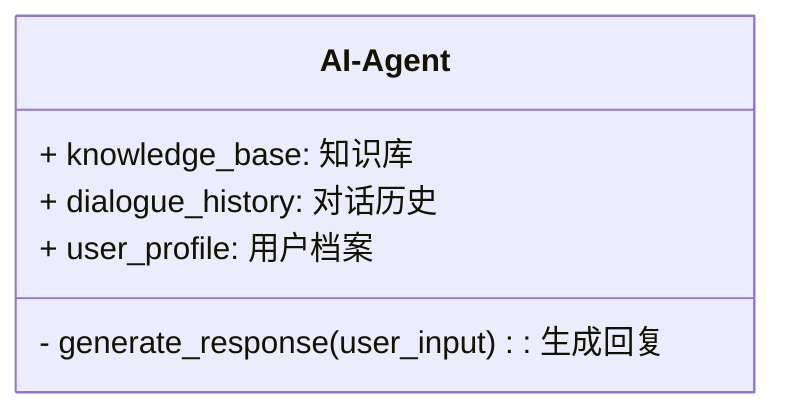
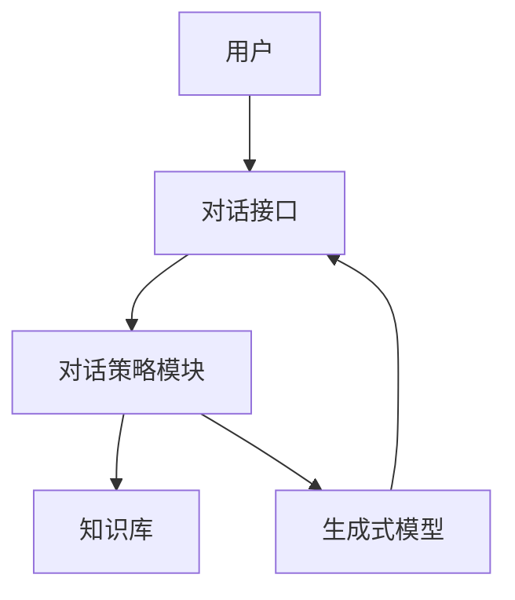
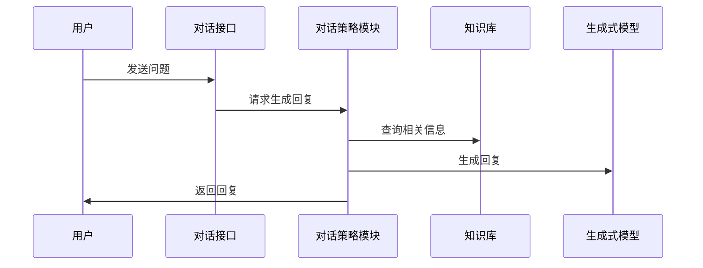

                 


# AI Agent的对话策略在教育辅导中的应用

> **关键词**：AI Agent, 对话策略, 教育辅导, 生成式模型, 个性化学习  
> **摘要**：本文探讨AI Agent在教育辅导中的对话策略应用，分析其在教育场景中的潜力，并通过实际案例展示如何利用AI技术提升教学效果。

---

# 第1章 AI Agent与对话策略的背景介绍

## 1.1 AI Agent的基本概念

### 1.1.1 AI Agent的定义
AI Agent（人工智能代理）是一种能够感知环境并采取行动以实现目标的智能实体。它能够通过传感器获取信息，利用计算模型进行决策，并通过执行器与环境互动。AI Agent可以是软件程序，也可以是嵌入硬件的智能系统。

### 1.1.2 AI Agent的核心特征
- **自主性**：AI Agent能够自主决策，无需人工干预。
- **反应性**：能够实时感知环境变化并做出反应。
- **目标导向**：所有行为都以实现特定目标为导向。
- **学习能力**：能够通过数据和经验不断优化自身性能。

### 1.1.3 AI Agent与传统程序的区别
AI Agent的核心区别在于其智能性和适应性。传统程序按预设规则运行，而AI Agent能够根据输入数据动态调整行为，具备学习和推理能力。

---

## 1.2 对话策略的基本概念

### 1.2.1 对话策略的定义
对话策略是指在对话过程中，AI Agent为了实现特定目标（如解答问题、引导学习）而采取的一系列语言和行为规则。它决定了AI Agent如何生成回复、如何引导对话方向，以及如何处理用户输入。

### 1.2.2 对话策略的分类
对话策略可以根据目标、场景和用户需求进行分类：
- **基于任务的对话策略**：专注于完成特定任务，如解答问题、提供信息。
- **基于情感的对话策略**：注重情感交流，提升用户体验。
- **基于知识的对话策略**：依赖知识库提供准确信息。

### 1.2.3 对话策略在教育辅导中的应用前景
在教育辅导中，AI Agent可以通过对话策略为学生提供个性化学习支持，实时解答疑问，引导学习方向，调整教学节奏，从而提升学习效果。

---

## 1.3 本章小结

本章介绍了AI Agent的基本概念及其核心特征，分析了对话策略的定义和分类，并探讨了对话策略在教育辅导中的应用前景。通过这些内容，读者可以理解AI Agent在教育场景中的潜力和重要性。

---

# 第2章 AI Agent对话策略的核心概念

## 2.1 AI Agent对话策略的定义与属性

### 2.1.1 对话策略的核心属性
- **目标导向性**：对话策略必须围绕特定目标展开。
- **动态适应性**：根据对话进展实时调整策略。
- **知识依赖性**：依赖知识库提供准确信息。

### 2.1.2 对话策略的特征对比

| 特征         | AI Agent对话策略                     | 传统对话系统                       |
|--------------|--------------------------------------|------------------------------------|
| **自主性**    | 高                                   | 低                                   |
| **学习能力**  | 强                                   | 弱                                   |
| **适应性**    | 动态调整                             | 静态固定                             |

---

## 2.2 AI Agent对话策略的ER实体关系图



在上述关系图中，AI Agent通过对话策略与用户需求、知识库和对话历史进行交互。知识库为对话提供信息支持，对话历史帮助AI Agent理解上下文。

---

## 2.3 本章小结

本章详细阐述了AI Agent对话策略的核心概念，分析了其定义、属性和特征，并通过ER图展示了其与相关实体的关系。这些内容为后续算法和系统设计奠定了基础。

---

# 第3章 AI Agent对话策略的算法原理

## 3.1 生成式模型在对话策略中的应用

### 3.1.1 基于生成式模型的对话生成
生成式模型（如GPT）通过概率生成的方式，根据上下文生成自然语言回复。这种模型能够捕捉对话中的语义信息，生成连贯且自然的回复。

### 3.1.2 对话策略生成的算法流程



在上述流程图中，输入经过特征提取后，生成策略模块根据特征生成对话策略，最终输出生成的回复。

---

## 3.2 对话策略生成的Python实现

```python
def generate_response(user_input, knowledge_base):
    # 简单的对话策略生成示例
    response = "您好，我是AI辅导老师，请问您有什么问题需要帮助吗？"
    return response
```

上述代码是一个简单的对话生成示例。实际应用中，需要结合知识库和生成式模型，动态生成回复。

---

## 3.3 对话策略的数学模型与公式

### 3.3.1 生成式模型的数学基础

生成式模型通常基于概率分布进行训练。给定输入序列 \( x = (x_1, x_2, ..., x_n) \)，生成模型的目标是最大化条件概率：

$$ P(x) $$

条件概率可以通过链式法则展开：

$$ P(x_1, x_2, ..., x_n) = \prod_{i=1}^n P(x_i | x_{<i}) $$

其中 \( x_{<i} \) 表示 \( x_1 \) 到 \( x_{i-1} \) 的部分。

---

## 3.4 本章小结

本章介绍了生成式模型在对话策略中的应用，详细讲解了算法流程和Python实现，并通过数学公式阐述了生成式模型的数学基础。这些内容为后续的系统设计和项目实现提供了理论支持。

---

# 第4章 AI Agent对话策略的系统分析与架构设计

## 4.1 项目背景与需求分析

在教育辅导场景中，AI Agent需要具备以下功能：
- 实时解答学生问题
- 提供个性化学习建议
- 跟踪学生学习进度
- 与学生进行自然对话

---

## 4.2 系统功能设计

### 4.2.1 领域模型设计



领域模型展示了AI Agent的核心组件和功能，包括知识库、对话历史和用户档案。

---

## 4.3 系统架构设计



在上述架构图中，用户通过对话接口与AI Agent交互，对话策略模块负责处理对话逻辑，知识库和生成式模型提供支持。

---

## 4.4 接口设计与交互流程

### 4.4.1 接口设计
- **输入接口**：接收用户输入和系统反馈。
- **输出接口**：生成回复并返回给用户。

### 4.4.2 交互流程



---

## 4.5 本章小结

本章通过项目背景分析、领域模型设计、系统架构图和交互流程图，详细阐述了AI Agent对话策略的系统设计方案。这些设计为后续的项目实现奠定了基础。

---

# 第5章 AI Agent对话策略的项目实战

## 5.1 项目环境与工具安装

### 5.1.1 环境要求
- Python 3.8 或更高版本
- 安装必要的库：`transformers`, `numpy`, `tensorflow`

### 5.1.2 安装依赖
```bash
pip install transformers numpy tensorflow
```

---

## 5.2 核心代码实现

### 5.2.1 对话策略模块的实现

```python
from transformers import GPT2LMHeadModel, GPT2Tokenizer

class DialogueStrategy:
    def __init__(self, model_name="gpt2"):
        self.model = GPT2LMHeadModel.from_pretrained(model_name)
        self.tokenizer = GPT2Tokenizer.from_pretrained(model_name)

    def generate_response(self, user_input):
        inputs = self.tokenizer(user_input, return_tensors="np")
        outputs = self.model.generate(inputs.input_ids, max_length=50)
        response = self.tokenizer.decode(outputs[0], skip_special_tokens=True)
        return response
```

---

## 5.3 代码解读与分析

### 5.3.1 对话策略模块解读
上述代码使用了GPT-2模型生成回复。`DialogueStrategy` 类负责初始化模型和生成回复。`generate_response` 方法接受用户输入，生成对应的回复。

---

## 5.4 案例分析与实际应用

### 5.4.1 案例分析
假设学生提出一个问题：“如何解这个方程 \( x^2 + 2x + 1 = 0 \)？” AI Agent会通过知识库确认这是一个二次方程，并使用生成式模型生成回复：“这是一个标准的二次方程，解为 \( x = -1 \)。”

### 5.4.2 实际应用
在实际应用中，AI Agent可以根据学生的学习进度和偏好，动态调整对话策略，提供个性化的学习支持。

---

## 5.5 项目小结

本章通过实际案例展示了AI Agent对话策略的项目实现，详细解读了核心代码，并分析了其在教育辅导中的实际应用。这些内容帮助读者更好地理解理论与实践的结合。

---

# 第6章 最佳实践与总结

## 6.1 最佳实践

### 6.1.1 数据质量管理
确保知识库的数据准确性和完整性。

### 6.1.2 模型优化
定期更新模型，提升生成回复的质量和相关性。

### 6.1.3 用户反馈
收集用户反馈，优化对话策略。

---

## 6.2 本章小结

本章总结了AI Agent对话策略在教育辅导中的应用，并提出了最佳实践建议。通过这些内容，读者可以更好地应用AI技术提升教育效果。

---

## 6.3 注意事项

- 在实际应用中，需注意数据隐私和安全问题。
- 对话策略的设计需结合具体场景，避免“一刀切”。
- 定期维护和更新知识库，确保信息的准确性。

---

## 6.4 拓展阅读

- 《生成式模型在自然语言处理中的应用》
- 《AI教育技术与教育创新》

---

# 作者：AI天才研究院 & 禅与计算机程序设计艺术

通过以上内容，我们详细探讨了AI Agent对话策略在教育辅导中的应用，从理论到实践，为读者提供了全面的指导。

