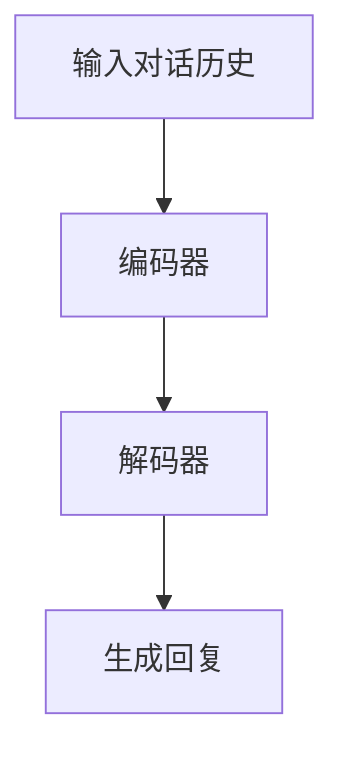
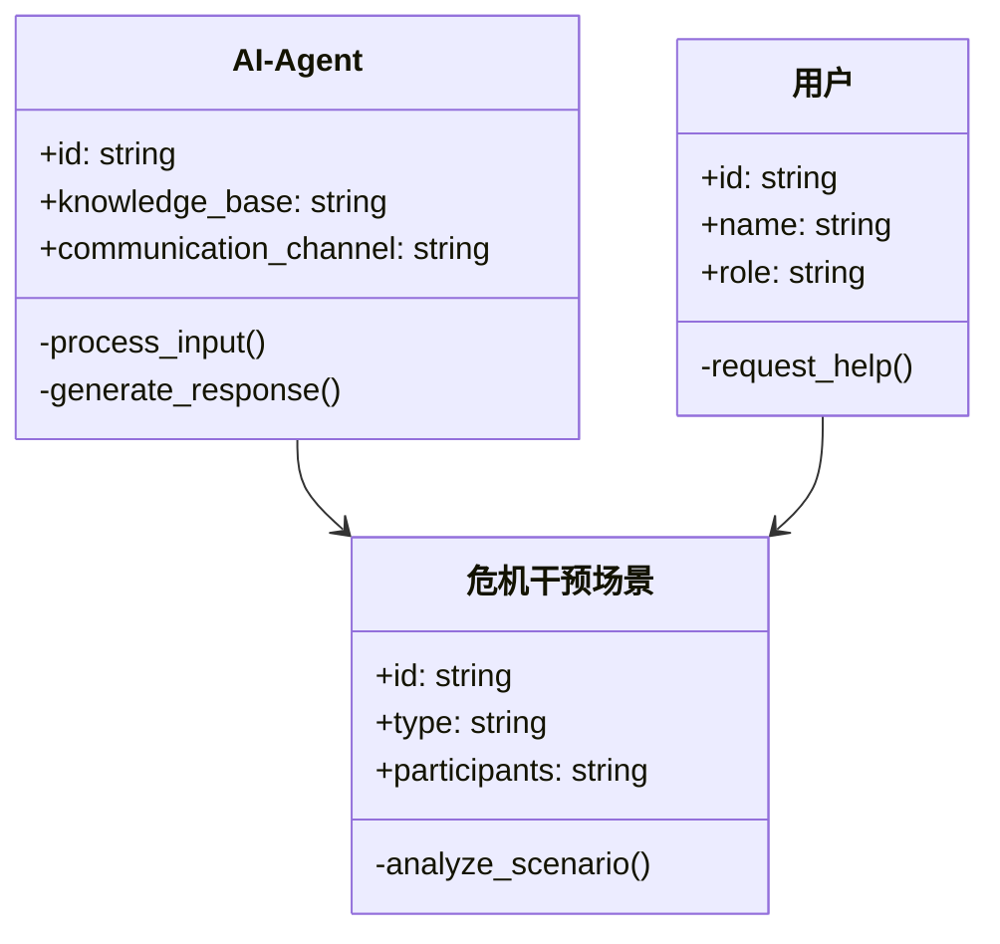

                 


```markdown
# AI Agent的对话系统在危机干预中的应用

## 关键词
AI Agent, 对话系统, 危机干预, 自然语言处理, 机器学习, 应急响应, 心理辅导

## 摘要
本文探讨AI Agent在对话系统中的应用，特别是在危机干预中的作用。通过分析算法原理、系统架构和实际案例，展示如何利用AI技术提高危机应对效率和效果。内容涵盖从理论到实践的全过程，提供深度的技术分析和实用建议。

---

## 第一部分: AI Agent的对话系统在危机干预中的应用概述

### 第1章: AI Agent与对话系统的背景介绍
#### 1.1 AI Agent的基本概念
- **1.1.1 AI Agent的定义与特点**
  - AI Agent的定义：智能体，能够感知环境并采取行动以实现目标。
  - 特点：自主性、反应性、社会性、持续性。

- **1.1.2 对话系统的定义与分类**
  - 对话系统的定义：通过自然语言处理与用户交互的系统。
  - 分类：基于规则、统计模型、深度学习模型。

- **1.1.3 危机干预的定义与应用场景**
  - 危机干预：在危机事件中提供支持和解决方案。
  - 应用场景：心理辅导、应急响应、公共安全。

#### 1.2 危机干预中的AI Agent特点
- **1.2.1 智能性与实时性**
  - AI Agent能够快速分析和处理信息。
  
- **1.2.2 可扩展性与可定制性**
  - 系统可适应不同场景和用户需求。

---

### 第2章: AI Agent在危机干预中的核心概念与联系
#### 2.1 核心概念原理
- **2.1.1 AI Agent的核心原理**
  - 感知、推理、决策、行动。

- **2.1.2 对话系统的原理与实现**
  - 自然语言处理、语义理解、生成回复。

- **2.1.3 危机干预中的AI Agent特点**
  - 快速响应、准确判断、情绪识别。

#### 2.2 核心概念属性特征对比表
| **属性**       | **AI Agent**         | **传统对话系统**       |
|-----------------|----------------------|------------------------|
| **智能性**       | 高                   | 低                     |
| **学习能力**     | 强                   | 无                     |
| **实时性**       | 高                   | 一般                   |
| **自适应性**     | 强                   | 无                     |

#### 2.3 ER实体关系图
```mermaid
er
    entity(AI Agent) {
        id: string
        knowledge_base: string
        communication_channel: string
    }
    entity(危机干预场景) {
        id: string
        type: string
        participants: string
    }
    entity(用户) {
        id: string
        name: string
        role: string
    }
    relation(AI Agent, 危机干预场景, "参与")
    relation(用户, 危机干预场景, "参与")
```

---

### 第3章: AI Agent对话系统的算法原理
#### 3.1 算法原理概述
- **3.1.1 自然语言处理模型**
  - 使用Transformer架构。
  - 注意力机制（Attention）：$$\text{Attention}(Q,K,V) = \text{softmax}\left(\frac{QK^T}{\sqrt{d_k}}\right)V$$

- **3.1.2 对话生成模型**
  - 基于Seq2Seq结构。
  - 解码器中的交叉注意力机制：$$\text{Cross Attention}(Q,K,V) = \text{softmax}\left(\frac{QK^T}{\sqrt{d_k}}\right)V$$

#### 3.2 算法实现流程图


#### 3.3 代码实现
```python
import torch
import torch.nn as nn

class Transformer(nn.Module):
    def __init__(self, d_model, nhead, dropout=0.1):
        super().__init__()
        self.encoder = nn.TransformerEncoder(
            nn.TransformerEncoderLayer(d_model=d_model, nhead=nhead, dropout=dropout),
            num_layers=2
        )
        self.decoder = nn.TransformerDecoder(
            nn.TransformerDecoderLayer(d_model=d_model, nhead=nhead, dropout=dropout),
            num_layers=2
        )

    def forward(self, src, tgt):
        enc_output = self.encoder(src)
        dec_output = self.decoder(tgt, enc_output)
        return dec_output
```

---

### 第4章: 系统分析与架构设计
#### 4.1 系统应用场景
- 心理危机干预、应急响应、公共安全事件处理。

#### 4.2 系统功能设计
- **4.2.1 领域模型**


- **4.2.2 系统架构**


---

### 第5章: 项目实战
#### 5.1 环境安装
- Python 3.8+
- PyTorch 1.9+
- Transformers库

#### 5.2 核心代码实现
```python
from transformers import AutoTokenizer, AutoModelForSeq2Seq

tokenizer = AutoTokenizer.from_pretrained("facebook/incoder-1b")
model = AutoModelForSeq2Seq.from_pretrained("facebook/incoder-1b")

def generate_response(input_text):
    inputs = tokenizer(input_text, return_tensors="pt")
    outputs = model.generate(**inputs, max_length=50)
    return tokenizer.decode(outputs[0], skip_special_tokens=True)
```

#### 5.3 代码解读与分析
- 使用预训练模型进行对话生成。
- 动态加载模型，适应不同场景。

#### 5.4 实际案例分析
- 心理辅导案例：识别用户情绪，提供支持性回应。

---

### 第6章: 最佳实践与总结
#### 6.1 小结
- AI Agent在危机干预中的优势和挑战。

#### 6.2 注意事项
- 数据隐私保护、模型鲁棒性、用户体验优化。

#### 6.3 拓展阅读
- 推荐书籍和论文，深入学习AI Agent和对话系统。

#### 6.4 项目实战小结
- 通过案例分析，总结成功经验与改进方向。

---

## 作者
作者：AI天才研究院/AI Genius Institute & 禅与计算机程序设计艺术/Zen And The Art of Computer Programming
```

