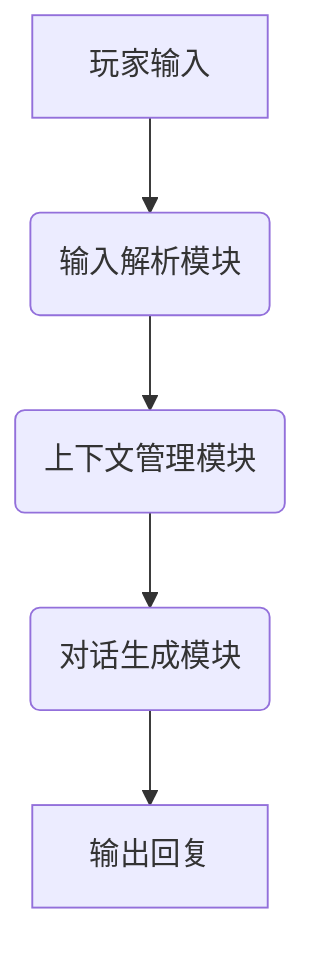
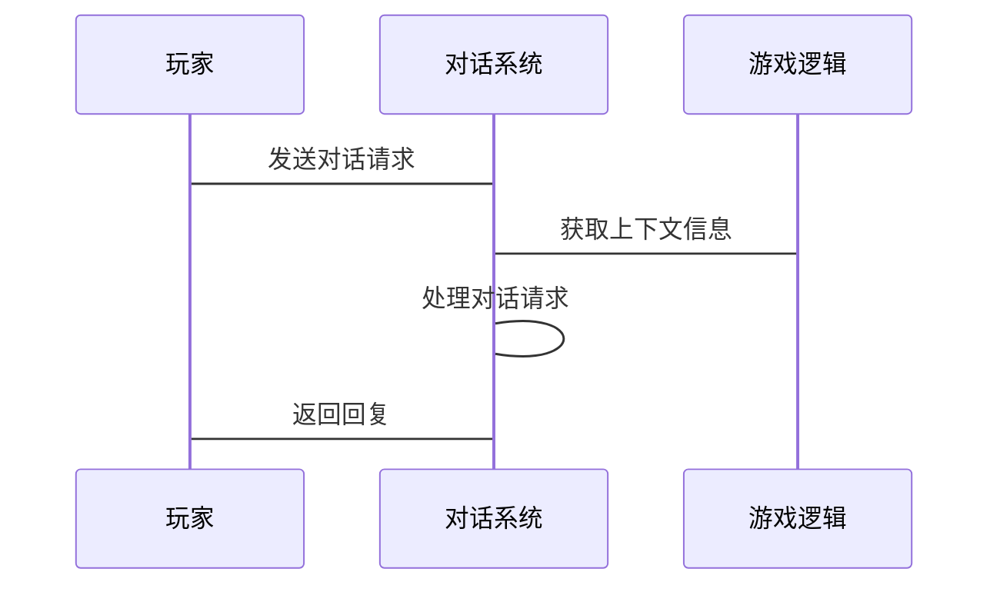

                 


# AI Agent的对话系统在多人游戏中的应用

## 关键词：AI Agent, 对话系统, 多人游戏, 自然语言处理, 游戏AI, 智能对话

## 摘要：本文详细探讨了AI Agent在多人游戏中的对话系统应用，分析了对话系统的构成、实现原理、算法模型以及在游戏中的具体应用。文章从基础概念到算法实现，从系统设计到项目实战，全面阐述了AI Agent对话系统在多人游戏中的价值和挑战。通过丰富的案例和详细的代码实现，为读者提供了从理论到实践的完整指导。

---

## 第1章: AI Agent与对话系统基础

### 1.1 AI Agent的基本概念

#### 1.1.1 AI Agent的定义
AI Agent（人工智能代理）是指能够感知环境、自主决策并执行任务的智能实体。在多人游戏中，AI Agent通常表现为游戏中的NPC（非玩家角色）或智能对手。

#### 1.1.2 AI Agent的核心特征
- **自主性**：能够自主决策，无需外部干预。
- **反应性**：能够实时感知环境并做出反应。
- **学习能力**：能够通过数据和经验优化行为。
- **协作性**：能够与其他AI Agent或玩家协作完成任务。

#### 1.1.3 对话系统的定义与分类
对话系统是指通过文本或语音与用户进行交互的系统。在多人游戏中，对话系统通常分为以下几类：
- **规则驱动对话系统**：基于预定义的规则生成回复。
- **基于深度学习的对话系统**：利用神经网络模型生成动态回复。
- **混合型对话系统**：结合规则和深度学习的混合模型。

### 1.2 多人游戏中的对话场景

#### 1.2.1 多人游戏的定义与特点
- 多人游戏是指允许多个玩家同时参与的游戏，通常具有实时互动和多人协作的特点。
- 游戏中的对话系统能够增强玩家的沉浸感和游戏体验。

#### 1.2.2 游戏中的对话系统应用
- **NPC对话**：玩家与游戏中的NPC进行对话，推动剧情发展。
- **玩家协作对话**：玩家之间通过对话进行协作，完成任务。
- **智能对手对话**：智能对手通过对话与玩家互动，增加游戏的挑战性。

#### 1.2.3 对话系统在游戏中的作用
- 提供更丰富的游戏体验。
- 增强玩家与游戏世界的互动。
- 通过对话推动剧情发展。

### 1.3 本章小结
- AI Agent是实现多人游戏中智能NPC或智能对手的核心技术。
- 对话系统通过自然语言处理技术，为游戏中的交互提供了可能性。

---

## 第2章: 对话系统的核心原理

### 2.1 对话系统的构成要素

#### 2.1.1 语义理解模块
- **语义理解**：通过自然语言处理技术，理解用户的意图和情感。
- **关键词提取**：从输入文本中提取关键信息。

#### 2.1.2 情境感知模块
- **上下文管理**：维护对话的上下文信息，确保回复的相关性。
- **用户状态识别**：识别用户的当前状态（如情绪、意图）。

#### 2.1.3 响应生成模块
- **回复生成**：基于输入和上下文生成合适的回复。
- **多轮对话管理**：维护多轮对话的连贯性。

### 2.2 对话系统的实现流程

#### 2.2.1 信息输入与解析
- 用户输入的文本或语音被解析为结构化数据。

#### 2.2.2 上下文管理
- 维护对话的上下文信息，确保每次回复的相关性。

#### 2.2.3 响应生成与输出
- 根据解析的信息和上下文生成回复，并输出给用户。

### 2.3 对话系统的评价指标

#### 2.3.1 对话准确率
- 回复与用户意图的匹配程度。

#### 2.3.2 对话流畅度
- 回复的连贯性和自然性。

#### 2.3.3 用户满意度
- 用户对对话系统的整体体验和满意度。

### 2.4 本章小结
- 对话系统由语义理解、情境感知和响应生成三个核心模块组成。
- 对话系统的实现流程包括信息输入、上下文管理和响应生成三个阶段。

---

## 第3章: AI Agent在多人游戏中的应用

### 3.1 多人游戏中的AI Agent类型

#### 3.1.1 简单AI Agent
- 基于简单的规则和条件判断，实现基本的对话功能。

#### 3.1.2 基于规则的AI Agent
- 通过预定义的规则和条件，生成固定的回复。

#### 3.1.3 基于深度学习的AI Agent
- 使用深度学习模型（如Transformer）生成动态回复。

### 3.2 对话系统在游戏中的具体应用

#### 3.2.1 游戏NPC对话系统
- NPC通过对话推动剧情发展，提供游戏线索。

#### 3.2.2 多人协作任务中的对话系统
- 玩家通过对话协作完成任务，增强团队合作体验。

#### 3.2.3 竞争场景中的对话系统
- 智能对手通过对话增加游戏的挑战性和互动性。

### 3.3 对话系统在游戏中的挑战

#### 3.3.1 上下文管理的复杂性
- 多人对话中需要管理多个玩家的上下文。

#### 3.3.2 多人协作中的同步问题
- 确保玩家之间的对话和行动同步。

#### 3.3.3 对话系统的实时性要求
- 在多人游戏中，对话系统需要实时响应。

### 3.4 本章小结
- 多人游戏中的AI Agent需要支持多种对话场景，包括NPC对话、协作对话和竞争对话。
- 对话系统的实现需要考虑上下文管理、同步问题和实时性要求。

---

## 第4章: 对话系统的算法原理

### 4.1 基于规则的对话系统

#### 4.1.1 规则引擎的工作原理
- 通过预定义的规则和条件，生成固定的回复。

#### 4.1.2 规则库的构建与管理
- 设计和维护规则库，确保规则的准确性和完整性。

#### 4.1.3 规则系统的优缺点
- 优点：简单易懂，实现成本低。
- 缺点：灵活性差，难以应对复杂对话场景。

### 4.2 基于深度学习的对话系统

#### 4.2.1 神经网络模型的对话生成
- 使用神经网络模型（如LSTM或Transformer）生成回复。

#### 4.2.2 Transformer架构在对话系统中的应用
- Transformer模型通过自注意力机制，捕捉对话中的长距离依赖关系。

#### 4.2.3 基于预训练的对话模型
- 使用大规模语料库进行预训练，提升对话系统的生成能力。

### 4.3 对话系统的数学模型

#### 4.3.1 Transformer模型的数学表达
- Transformer的自注意力机制公式：
  $$\text{Attention}(Q, K, V) = \text{softmax}\left(\frac{QK^T}{\sqrt{d_k}}\right)V$$

#### 4.3.2 损失函数
- 使用交叉熵损失函数，优化模型的生成能力：
  $$\text{Loss} = -\sum_{i=1}^{n} \text{log}P(y_i|y_{<i})$$

### 4.4 本章小结
- 基于规则的对话系统适用于简单的对话场景，而基于深度学习的对话系统能够处理更复杂的对话任务。
- Transformer模型通过自注意力机制，显著提升了对话系统的生成能力。

---

## 第5章: 系统分析与架构设计

### 5.1 问题场景介绍
- 在多人游戏中，对话系统需要支持多个玩家的实时对话，同时与游戏逻辑和图形界面无缝集成。

### 5.2 系统功能设计
- **领域模型**：定义系统的功能模块和交互流程。

### 5.3 系统架构设计

#### 5.3.1 系统架构图


#### 5.3.2 系统接口设计
- **输入接口**：接收玩家的输入文本或语音。
- **输出接口**：输出生成的回复。

#### 5.3.3 系统交互流程


### 5.4 本章小结
- 对话系统需要与游戏逻辑和图形界面无缝集成。
- 系统架构设计包括输入解析、上下文管理和对话生成三个核心模块。

---

## 第6章: 项目实战

### 6.1 环境安装
- **Python 3.8+**
- **深度学习框架（如TensorFlow或PyTorch）**
- **自然语言处理库（如Hugging Face Transformers）**

### 6.2 核心实现代码

#### 6.2.1 对话生成模块
```python
from transformers import AutoTokenizer, AutoModelForSeq2Seq
import torch

tokenizer = AutoTokenizer.from_pretrained('facebook/blenderbot')
model = AutoModelForSeq2Seq.from_pretrained('facebook/blenderbot')

def generate_response(input_text):
    inputs = tokenizer(input_text, return_tensors='pt')
    outputs = model.generate(inputs.input_ids, max_length=50)
    response = tokenizer.decode(outputs[0], skip_special_tokens=True)
    return response
```

#### 6.2.2 上下文管理模块
```python
class ContextManager:
    def __init__(self):
        self.context = {}
    
    def update_context(self, user_id, text):
        self.context[user_id] = text
    
    def get_context(self, user_id):
        return self.context.get(user_id, "")
```

### 6.3 代码应用解读
- 对话生成模块使用预训练的深度学习模型生成回复。
- 上下文管理模块维护每个用户的对话上下文。

### 6.4 案例分析
- 在一个多人在线角色扮演游戏中，玩家通过对话生成模块与NPC互动，推动剧情发展。

### 6.5 项目小结
- 对话系统的核心实现包括输入解析、上下文管理和对话生成。
- 通过代码实现，读者可以快速搭建一个简单的对话系统。

---

## 第7章: 最佳实践与小结

### 7.1 最佳实践
- **数据多样性**：确保训练数据的多样性和代表性。
- **模型优化**：通过调参和微调提升模型性能。
- **实时性优化**：优化对话系统的响应速度。

### 7.2 小结
- AI Agent的对话系统在多人游戏中具有重要的应用价值。
- 通过本文的介绍，读者可以全面了解对话系统的实现原理和应用方法。

### 7.3 注意事项
- 对话系统的实现需要结合游戏的具体需求和场景。
- 注意保护用户隐私，确保数据安全。

### 7.4 拓展阅读
- 《深度学习中的自然语言处理》
- 《游戏AI编程基础》

---

## 作者：AI天才研究院/AI Genius Institute & 禅与计算机程序设计艺术 /Zen And The Art of Computer Programming

---

以上是《AI Agent的对话系统在多人游戏中的应用》的技术博客文章的完整内容，涵盖了从基础概念到算法实现、系统设计再到项目实战的各个方面。

