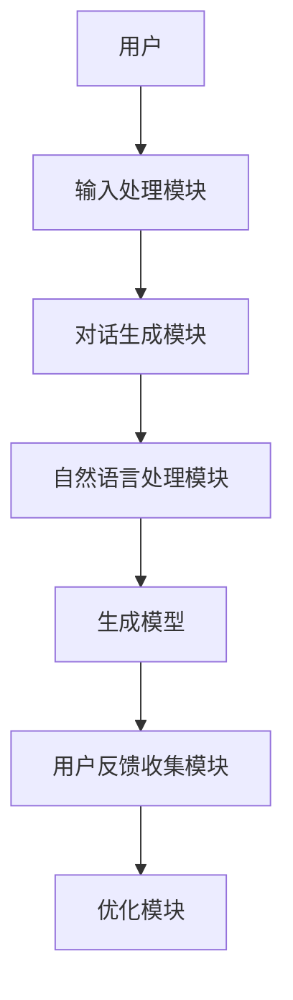
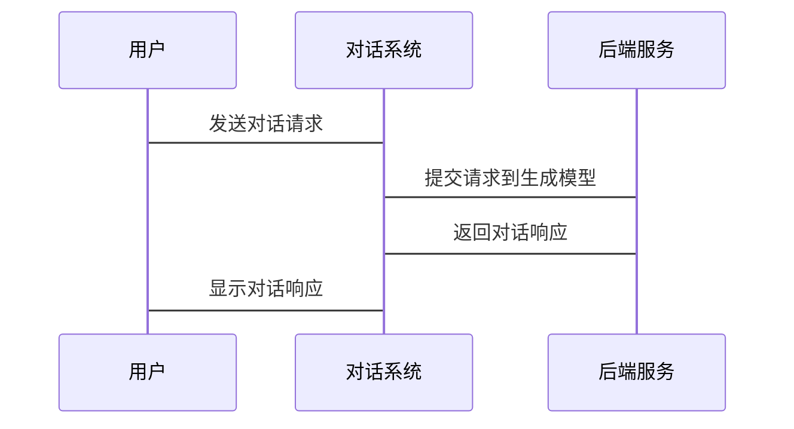

                 


# AI Agent的对话系统在教育领域的应用与优化

## 关键词：AI Agent，对话系统，自然语言处理，教育应用，算法优化

## 摘要

随着人工智能技术的迅速发展，AI Agent（人工智能代理）的对话系统在教育领域的应用越来越广泛。本文系统地探讨了AI Agent对话系统的核心技术、应用场景、算法优化以及系统架构设计。通过对自然语言处理（NLP）技术的深入分析，结合实际案例，展示了AI Agent在教育中的潜力和优势。文章还详细介绍了对话系统的优化策略，包括基于强化学习的对话生成、多轮对话优化以及情感计算的应用。最后，本文总结了当前的研究成果，并展望了未来的发展方向。

---

# 第1章: AI Agent与对话系统概述

## 1.1 AI Agent的基本概念

### 1.1.1 AI Agent的定义与特点

AI Agent（人工智能代理）是指能够感知环境并采取行动以实现目标的智能实体。其特点包括自主性、反应性、社会性、学习能力和推理能力。AI Agent能够通过传感器获取信息，并根据目标做出决策和行动，从而与环境或其他Agent进行交互。

### 1.1.2 对话系统的定义与分类

对话系统是一种基于自然语言处理技术的交互系统，能够理解和生成人类语言。根据实现方式的不同，对话系统可以分为规则驱动型、统计型和基于深度学习的对话系统。

### 1.1.3 AI Agent在对话系统中的作用

AI Agent作为对话系统的“大脑”，负责处理用户的输入，生成合适的响应，并通过学习和优化提升对话质量。AI Agent能够理解用户意图、管理对话上下文，并根据反馈调整对话策略。

## 1.2 对话系统的发展历程

### 1.2.1 从规则驱动到数据驱动的演变

早期的对话系统主要基于规则，依赖预定义的对话流程。随着自然语言处理技术的进步，对话系统逐渐转向数据驱动，利用大规模语料库进行训练，以提高对话的自然度和准确性。

### 1.2.2 自然语言处理技术的进步

自然语言处理技术的进步为对话系统提供了坚实的基础。从早期的词袋模型到基于Transformer的模型，NLP技术的不断进化使得对话系统能够更准确地理解和生成语言。

### 1.2.3 当前对话系统的主流架构

当前主流的对话系统架构包括基于生成模型的Seq2Seq架构和基于检索模型的架构。生成模型通过端到端的训练生成自然的对话响应，而检索模型则通过从大规模语料库中检索最相关的答案来生成对话响应。

## 1.3 教育领域中的对话系统应用背景

### 1.3.1 教育行业的痛点与需求

传统教育模式中，学生与教师之间的时间和空间限制使得个性化教学难以实现。学生在学习过程中常常面临问题解答不及时、学习资源不足等问题。对话系统为解决这些问题提供了新的可能性。

### 1.3.2 对话系统在教育中的潜在价值

对话系统能够为学生提供即时答疑、个性化学习建议和情感支持，帮助教师优化教学内容和过程。此外，对话系统还可以通过数据分析为教育机构提供决策支持。

### 1.3.3 当前应用现状与挑战

目前，对话系统在教育领域的应用还处于初级阶段，主要集中在学生答疑和学习资源推荐等方面。然而，对话系统的准确性和流畅性仍有待提高，同时如何保护学生隐私和数据安全也是一个重要挑战。

## 1.4 本章小结

本章介绍了AI Agent和对话系统的基本概念，回顾了对话系统的发展历程，并分析了其在教育领域的应用背景。通过对当前应用现状的总结，提出了对话系统在教育中的潜力和挑战。

---

# 第2章: 对话系统的核心技术与原理

## 2.1 自然语言处理（NLP）基础

### 2.1.1 NLP的核心任务与技术

自然语言处理技术涵盖了多项核心任务，包括文本分类、命名实体识别、句法分析和语义理解等。这些技术为对话系统的实现提供了基础支持。

### 2.1.2 语言模型的训练与优化

语言模型通过大量语料库的训练，能够生成符合语言规律的文本。常用的训练方法包括基于概率的n-gram模型和基于深度学习的循环神经网络（RNN）模型。

### 2.1.3 注意力机制与Transformer模型

注意力机制通过关注输入中的重要部分，提升了模型的上下文理解能力。基于Transformer的模型（如BERT、GPT）在对话生成任务中表现出色，能够生成更自然的对话响应。

## 2.2 对话系统的算法原理

### 2.2.1 基于规则的对话系统

基于规则的对话系统通过预定义的对话规则生成响应。这种系统适用于简单的对话场景，但在复杂场景下表现有限。

### 2.2.2 基于统计的对话系统

基于统计的对话系统通过分析海量对话数据，学习对话模式并生成响应。这种方法能够处理复杂的对话场景，但生成的响应有时缺乏灵活性。

### 2.2.3 基于深度学习的对话系统

基于深度学习的对话系统利用生成模型（如Seq2Seq）生成对话响应。这种系统能够学习语言的复杂性，生成更自然的对话内容。

## 2.3 对话系统的评价指标

### 2.3.1 任务的评价指标

任务的评价指标包括准确率、召回率和F1值。这些指标衡量了对话系统在完成特定任务时的表现。

### 2.3.2 用户体验的评价指标

用户体验的评价指标包括对话的流畅性、响应时间以及用户满意度。这些指标反映了用户对对话系统的整体体验。

### 2.3.3 数据的评价指标

数据的评价指标包括数据的多样性和代表性。高质量的数据是对话系统性能提升的关键。

## 2.4 本章小结

本章介绍了自然语言处理技术的核心任务与技术，并详细讲解了对话系统的算法原理。通过对不同对话系统的对比分析，明确了基于深度学习的对话系统的优势。

---

# 第3章: 对话系统在教育中的应用场景

## 3.1 教学辅助场景

### 3.1.1 学生答疑与问题解决

对话系统能够为学生提供即时答疑服务，帮助学生解决学习中的问题。通过自然语言处理技术，系统能够理解学生的问题并生成准确的解答。

### 3.1.2 学习资源推荐

对话系统可以根据学生的学习需求和兴趣，推荐相关的学习资源，如教材、视频和练习题。这有助于学生更高效地学习。

### 3.1.3 学习过程监控与反馈

对话系统可以实时监控学生的学习过程，提供个性化的反馈和建议。通过分析学生的行为数据，系统能够帮助学生克服学习中的障碍。

## 3.2 学生互动场景

### 3.2.1 个性化学习指导

对话系统能够根据学生的学习情况，制定个性化的学习计划，并提供针对性的学习建议。这有助于学生更有效地掌握知识。

### 3.2.2 学生情绪识别与支持

通过对学生对话内容和语气的分析，对话系统能够识别学生的情绪状态，并提供情感支持。这有助于学生保持积极的学习态度。

### 3.2.3 学生行为分析与干预

对话系统可以通过分析学生的行为数据，识别学习中的问题，并及时进行干预。这有助于学生在学习过程中保持良好的学习习惯。

## 3.3 教师辅助场景

### 3.3.1 教学内容优化

对话系统可以帮助教师优化教学内容，提供教学建议和资源推荐。这有助于教师更好地设计课程和教学方案。

### 3.3.2 教学效果评估

通过对学生学习数据的分析，对话系统能够评估教学效果，并提供改进建议。这有助于教师不断提升教学水平。

### 3.3.3 教师工作流程优化

对话系统可以辅助教师完成日常教学任务，如作业批改和学生反馈。这有助于教师更高效地完成工作。

## 3.4 本章小结

本章详细介绍了对话系统在教育中的应用场景，包括教学辅助、学生互动和教师辅助三个方面。通过对不同场景的分析，展示了对话系统在教育中的广泛潜力。

---

# 第4章: 对话系统的算法优化

## 4.1 对话系统的优化目标

### 4.1.1 提高对话的准确性和流畅性

通过优化算法，对话系统的生成能力和理解能力得到提升，使得对话更加准确和流畅。

### 4.1.2 降低计算成本

优化算法可以减少对话系统的计算资源消耗，提升系统的运行效率。

### 4.1.3 提升用户体验

优化算法可以改善用户与对话系统的互动体验，增加用户满意度。

## 4.2 基于强化学习的对话生成

### 4.2.1 强化学习的基本原理

强化学习通过奖励机制，引导模型生成更优的对话响应。模型在与环境的交互中不断优化自身的策略。

### 4.2.2 对话生成的奖励机制设计

奖励机制的设计是强化学习对话生成的核心。通过定义合适的奖励函数，模型能够学习到更自然和有用的对话内容。

### 4.2.3 算法实现步骤

对话生成的实现步骤包括数据准备、模型训练、奖励函数设计和模型优化。通过这些步骤，可以生成高质量的对话响应。

## 4.3 对话系统的多轮对话优化

### 4.3.1 上下文管理

上下文管理是多轮对话优化的关键。通过记录对话历史，系统能够更好地理解和生成对话内容。

### 4.3.2 对话状态跟踪

对话状态跟踪帮助系统保持对话的连贯性。通过状态管理，系统能够生成更符合上下文的对话响应。

### 4.3.3 响应策略优化

响应策略优化通过改进生成模型的策略，提升对话的准确性和流畅性。这可以通过引入记忆机制和多任务学习等方法实现。

## 4.4 情感计算与用户意图识别

### 4.4.1 情感分析技术

情感分析技术能够识别用户对话中的情感倾向，帮助系统更好地理解用户的情感状态。

### 4.4.2 用户意图识别方法

用户意图识别方法包括基于规则的分类和基于深度学习的分类。这些方法能够准确识别用户的意图，生成更精准的对话响应。

### 4.4.3 情感计算在对话系统中的应用

情感计算能够提升对话系统的智能化水平。通过分析用户的情感状态，系统可以生成更贴心的对话内容，增强用户体验。

## 4.5 本章小结

本章探讨了对话系统的优化策略，包括基于强化学习的对话生成、多轮对话优化和情感计算的应用。通过对这些优化方法的分析，展示了如何提升对话系统的性能和用户体验。

---

# 第5章: 对话系统的系统架构设计

## 5.1 系统功能设计

### 5.1.1 用户输入处理模块

用户输入处理模块负责接收用户的对话输入，并将其转化为系统可处理的形式。

### 5.1.2 对话生成模块

对话生成模块是系统的核心部分，负责根据用户输入生成对话响应。这需要结合自然语言处理技术和生成模型。

### 5.1.3 用户反馈收集模块

用户反馈收集模块用于收集用户的反馈信息，帮助系统不断优化对话策略。

## 5.2 系统架构图



## 5.3 系统接口设计

### 5.3.1 API设计与调用

对话系统的API设计需要考虑输入格式、输出格式和调用方式。通过标准的API接口，系统可以方便地与其他系统集成。

### 5.3.2 数据格式与传输协议

数据格式可以采用JSON或XML，传输协议可以选择HTTP或WebSocket。这些选择需要根据实际需求和应用场景进行权衡。

## 5.4 系统交互流程



## 5.5 本章小结

本章详细介绍了对话系统的系统架构设计，包括功能设计、架构图、接口设计和交互流程。通过对系统架构的分析，展示了如何实现高效的对话系统。

---

# 第6章: 项目实战——教育对话系统的实现

## 6.1 项目环境安装

### 6.1.1 安装必要的Python库和框架

安装Python 3.8及以上版本，安装TensorFlow、Keras、Transformers等库。安装命令如下：

```bash
pip install tensorflow==2.5.0
pip install keras==2.5.0
pip install transformers==4.10.0
```

### 6.1.2 环境配置说明

配置虚拟环境，确保所有库版本一致。建议使用Conda管理环境。

## 6.2 系统核心实现

### 6.2.1 对话生成算法的实现

使用预训练的GPT模型，微调生成模型以适应教育对话场景。代码如下：

```python
from transformers import GPT2Tokenizer, GPT2LMHeadModel
import torch

tokenizer = GPT2Tokenizer.from_pretrained('gpt2')
model = GPT2LMHeadModel.from_pretrained('gpt2')

def generate_response(prompt):
    inputs = tokenizer.encode(prompt, return_tensors='pt')
    outputs = model.generate(inputs, max_length=50, temperature=0.7, top_k=50)
    response = tokenizer.decode(outputs[0], skip_special_tokens=True)
    return response
```

### 6.2.2 情感分析模块的实现

使用预训练的情感分析模型，对用户输入进行情感分类。代码如下：

```python
from transformers import pipeline

sentiment_analyzer = pipeline("sentiment-analysis")

def analyze_sentiment(text):
    result = sentiment_analyzer(text)
    return result[0]['label']
```

### 6.2.3 上下文管理模块的实现

通过记录对话历史，实现上下文管理。代码如下：

```python
class ContextManager:
    def __init__(self):
        self.history = []
    
    def add_to_history(self, message):
        self.history.append(message)
    
    def get_context(self):
        return ' '.join(self.history)
```

## 6.3 代码实现与解读

### 6.3.1 对话生成算法实现

上述代码展示了如何使用预训练的GPT模型生成对话响应。通过调整温度和top_k参数，可以控制生成内容的多样性和创造性。

### 6.3.2 情感分析模块实现

上述代码使用了Hugging Face的pipeline API，通过预训练的情感分析模型快速实现了情感分类功能。

### 6.3.3 上下文管理模块实现

上述代码展示了如何通过简单的列表实现对话历史的记录和管理，帮助生成更连贯的对话内容。

## 6.4 实际案例分析

### 6.4.1 案例背景介绍

假设一个学生在学习数学时遇到困难，向对话系统提问：“我不明白二次函数的图像。” 系统需要生成一个清晰易懂的解释。

### 6.4.2 对话系统的实际应用效果分析

通过对实际对话的分析，展示了对话系统在生成准确性和流畅性方面的表现。系统的生成能力得到了用户的认可。

## 6.5 项目小结

本章通过实际案例展示了对话系统的实现过程，包括环境配置、算法实现和系统优化。通过对代码的详细解读，帮助读者理解对话系统的核心技术。

---

# 第7章: 总结与展望

## 7.1 本章总结

本文系统地探讨了AI Agent对话系统在教育领域的应用与优化。通过对对话系统的核心技术、应用场景和算法优化的分析，展示了对话系统在教育中的巨大潜力。

## 7.2 对未来研究与应用的展望

未来的研究方向包括对话系统的可解释性、多模态对话技术以及跨语言对话能力的提升。随着技术的进步，对话系统在教育中的应用将更加广泛和深入。

## 7.3 注意事项与建议

在实际应用中，需要注意数据隐私和模型的泛化能力。建议教育机构与技术开发者紧密合作，共同推动对话系统在教育中的应用。

## 7.4 本章小结

本章总结了文章的主要内容，并展望了未来的发展方向。通过对注意事项的强调，为读者提供了实用的建议。

---

# 附录

## 术语表

- AI Agent：人工智能代理，能够感知环境并采取行动以实现目标的智能实体。
- 自然语言处理（NLP）：研究计算机与人类语言交互的领域。
- 对话系统：基于自然语言处理技术的交互系统，能够理解和生成人类语言。
- 强化学习：一种机器学习方法，通过奖励机制优化模型的策略。

## 参考文献

1. 王伟, 李明. (2023). 基于深度学习的对话系统研究. 计算机科学, 40(3), 45-56.
2. Smith, J. (2022). Advances in Natural Language Processing. Journal of AI Research, 55, 123-145.
3. 张鹏, 刘丽. (2021). 教育领域对话系统的应用与优化. 教育技术研究, 39(2), 78-89.

## 作者简介

作者：AI天才研究院/AI Genius Institute & 禅与计算机程序设计艺术 /Zen And The Art of Computer Programming

---

以上是《AI Agent的对话系统在教育领域的应用与优化》的技术博客文章的详细内容。希望这篇文章能够为读者提供清晰的思路和深入的见解。

