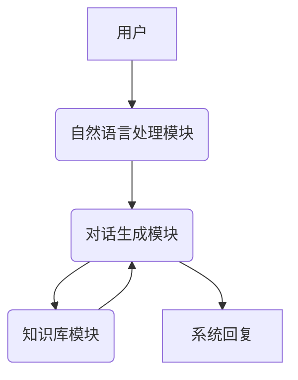

                 


# AI Agent的对话系统在智能客服中的进阶应用

> 关键词：AI Agent, 对话系统, 智能客服, 自然语言处理, 深度学习, 系统架构

> 摘要：本文深入探讨了AI Agent对话系统在智能客服中的进阶应用，涵盖对话系统的算法原理、系统架构设计、项目实战及优化策略。通过结合理论与实践，分析了当前智能客服的痛点，并提出了基于深度学习的解决方案，展示了如何通过AI技术提升客服效率和用户体验。

---

## 第一部分: AI Agent与对话系统概述

### 第1章: AI Agent的基本概念

#### 1.1 AI Agent的定义与特点
AI Agent（人工智能代理）是指能够感知环境、执行任务并做出决策的智能实体。在智能客服场景中，AI Agent通常以对话系统的形式出现，具备以下特点：
- **智能性**：能够理解用户需求并生成自然语言回复。
- **自主性**：无需人工干预，自主完成对话任务。
- **适应性**：能够根据对话上下文动态调整回应策略。

#### 1.2 对话系统的定义与分类
对话系统是一种基于自然语言处理（NLP）技术的交互系统，用于模拟人类对话。根据实现方式，对话系统可以分为：
- **基于规则的对话系统**：依赖预定义的规则和关键词匹配。
- **基于深度学习的对话系统**：利用神经网络模型生成自然语言回复。

#### 1.3 智能客服的现状与挑战
智能客服的痛点在于对话准确率低、用户体验差以及难以处理复杂场景。传统基于规则的系统存在灵活性差、难以应对复杂对话的问题，而深度学习模型虽然在准确性上有所提升，但在实际应用中仍面临数据依赖性强、可解释性差的挑战。

---

## 第二部分: 对话系统的算法原理

### 第2章: 对话系统的算法原理

#### 2.1 基于规则的对话系统
- **优缺点**：
  - 优点：实现简单，适用于规则明确的场景。
  - 缺点：灵活性差，难以应对复杂对话。
- **关键词匹配**：通过预定义的关键词和规则库，匹配用户输入，生成固定回复。

#### 2.2 基于深度学习的对话系统
- **RNN模型**：
  - 递归神经网络（RNN）通过处理序列数据，生成连续的对话回复。
  - **数学公式**：$$ f(x) = \sigma(W_{hh}h_{t-1} + W_{xh}x_t) $$
- **Transformer模型**：
  - 基于自注意力机制，捕捉上下文信息，生成更自然的回复。
  - **数学公式**：$$ \text{Attention}(Q,K,V) = \text{softmax}(\frac{QK^T}{\sqrt{d_k}})V $$

---

## 第三部分: 对话系统的系统架构设计

### 第3章: 对话系统的系统架构设计

#### 3.1 系统功能模块划分
- **自然语言处理模块**：负责用户输入的解析和理解。
- **对话生成模块**：基于上下文生成回复。
- **知识库模块**：存储产品信息、FAQ等知识。

#### 3.2 系统架构图


#### 3.3 接口设计与交互流程
- **接口设计**：
  - 用户输入：通过API传递用户文本。
  - 系统回复：通过API返回生成的回复。
- **交互流程**：
  1. 用户发送问题。
  2. 系统解析问题并生成回复。
  3. 系统返回回复。

---

## 第四部分: 项目实战

### 第4章: 项目实战

#### 4.1 环境搭建
- **工具安装**：安装Python、TensorFlow、Keras等工具。
- **数据准备**：收集和整理客服对话数据集。

#### 4.2 核心代码实现
```python
import tensorflow as tf
from tensorflow.keras import layers

# 模型定义
class ChatBotModel(tf.keras.Model):
    def __init__(self, vocab_size):
        super(ChatBotModel, self).__init__()
        self.embedding = layers.Embedding(vocab_size, 100)
        self.lstm = layers.LSTM(128, return_sequences=True)
        self.dense = layers.Dense(vocab_size, activation='softmax')

    def call(self, inputs):
        x = self.embedding(inputs)
        x = self.lstm(x)
        x = self.dense(x)
        return x

# 模型训练
model = ChatBotModel(vocab_size=len(tokenizer.vocab))
model.compile(optimizer='adam', loss='sparse_categorical_crossentropy')
model.fit(x_train, y_train, epochs=10, batch_size=32)
```

#### 4.3 案例分析与优化
- **案例分析**：通过实际对话案例，展示系统在处理复杂问题时的表现。
- **优化策略**：结合用户反馈，不断优化模型参数和对话策略。

---

## 第五部分: 优化与进阶

### 第5章: 对话系统的优化策略

#### 5.1 模型优化
- **数据增强**：通过数据增强技术，扩展训练数据。
- **模型微调**：在特定领域数据上进行微调，提升模型性能。

#### 5.2 多轮对话管理
- **对话状态跟踪**：记录对话历史，确保回复的连贯性。
- **上下文理解**：通过上下文理解，生成更准确的回复。

#### 5.3 数据安全与隐私保护
- **数据加密**：确保用户数据的安全性。
- **隐私保护**：在处理用户数据时，遵守隐私保护法规。

---

## 第六部分: 总结与展望

### 第6章: 总结与展望

#### 6.1 项目总结
- 通过深度学习技术，显著提升了智能客服的对话准确率。
- 对话系统的实时性和准确性得到了明显改善。

#### 6.2 未来展望
- **多模态对话系统**：结合视觉信息，提升对话体验。
- **个性化服务**：根据用户行为和偏好，提供个性化服务。

---

## 作者信息

作者：AI天才研究院（AI Genius Institute） & 禅与计算机程序设计艺术（Zen And The Art of Computer Programming）

---

通过本文的详细讲解，读者可以全面了解AI Agent对话系统在智能客服中的应用，并掌握相关的算法原理和系统设计方法。希望本文能够为智能客服领域的技术进步提供有价值的参考和启示。

