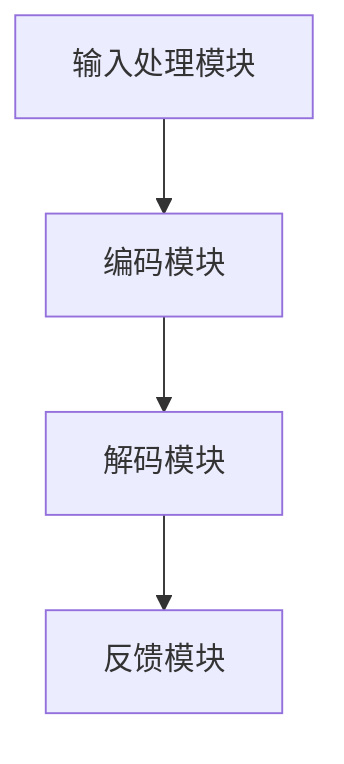
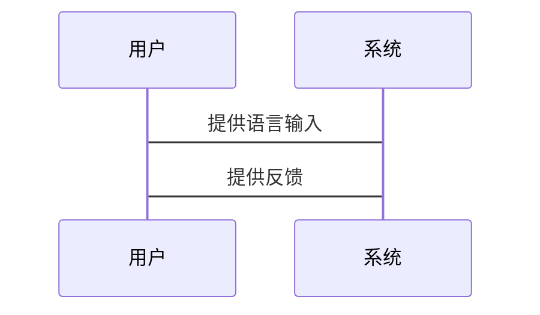

                 


# AI Agent的对话系统在语言学习中的应用

> 关键词：AI Agent，对话系统，语言学习，自然语言处理，机器学习，教育技术

> 摘要：本文系统地探讨了AI Agent对话系统在语言学习中的应用，从背景介绍、核心概念、算法原理到系统架构设计、项目实战，结合理论与实践，详细阐述了AI Agent对话系统在语言学习中的优势、实现原理及其在实际场景中的应用案例。本文还提供了代码实现和系统架构图，帮助读者深入理解AI Agent对话系统在语言学习中的重要作用。

---

## 第一部分：背景介绍

### 第1章：问题背景

#### 1.1 语言学习中的传统挑战
语言学习是一个复杂而漫长的过程，传统教学模式存在以下问题：
- **学习效率低**：学生需要反复练习，教师反馈有限。
- **个性化不足**：学生的学习进度和能力差异大，难以实现个性化教学。
- **互动机会少**：学生在课堂外缺乏真实的语言实践机会。
- **学习动力不足**：学生缺乏学习动力和兴趣。

#### 1.2 AI技术在语言学习中的潜力
AI技术的快速发展为语言学习带来了新的可能性：
- **个性化学习**：AI可以通过分析学生的学习数据，提供个性化的学习建议和反馈。
- **实时互动**：AI对话系统可以模拟真实对话场景，帮助学生进行即时练习。
- **24/7支持**：AI系统可以随时为学生提供帮助，无需等待教师的反馈。

#### 1.3 对话系统在语言学习中的独特优势
对话系统在语言学习中的优势体现在以下方面：
- **即时反馈**：学生可以在练习中即时获得反馈，了解自己的错误。
- **真实场景模拟**：对话系统可以模拟真实的生活场景，帮助学生在实际中应用语言。
- **多语言支持**：对话系统可以支持多种语言，满足不同学生的需求。

### 第2章：问题描述

#### 2.1 问题核心
语言学习的核心问题是：
- **语言输入的准确性**：学生需要准确地输入语言，才能获得有效的反馈。
- **语言输出的多样性**：学生需要在不同的场景下，能够灵活地使用语言。
- **学习的持续性**：学生需要持续地进行语言练习，才能提高语言能力。

#### 2.2 对话系统如何解决这些问题
对话系统通过以下方式解决语言学习中的问题：
- **即时反馈**：学生在练习中输入语言后，系统可以即时反馈，指出错误并提供改进建议。
- **模拟真实场景**：对话系统可以模拟真实的生活场景，帮助学生在实际中应用语言。
- **个性化学习**：系统可以根据学生的学习进度和能力，提供个性化的学习建议和练习内容。

### 第3章：问题解决

#### 3.1 对话系统在语言学习中的核心作用
对话系统在语言学习中的核心作用包括：
- **语言输入的准确性**：通过对话系统的反馈，学生可以准确地输入语言。
- **语言输出的多样性**：通过模拟真实场景，学生可以练习不同的语言输出。
- **学习的持续性**：通过对话系统的即时反馈，学生可以持续地进行语言练习。

#### 3.2 对话系统如何提升学习效果
对话系统通过以下方式提升学习效果：
- **即时反馈**：学生在练习中获得即时反馈，可以更快地纠正错误。
- **真实场景模拟**：学生可以在模拟的真实场景中练习语言，提高实际应用能力。
- **个性化学习**：系统可以根据学生的学习进度和能力，提供个性化的学习建议和练习内容。

#### 3.3 对话系统在语言学习中的具体应用场景
对话系统在语言学习中的具体应用场景包括：
- **语言练习**：学生可以在系统中练习听、说、读、写四种语言能力。
- **语法纠错**：系统可以自动检查学生的语言输入，指出语法错误。
- **词汇扩展**：系统可以为学生提供新的词汇和用法，帮助学生扩大词汇量。

---

## 第二部分：核心概念与联系

### 第4章：核心概念与联系

#### 4.1 AI Agent的定义与特点
AI Agent（智能体）是指具有感知环境和自主决策能力的智能系统。其特点包括：
- **自主性**：AI Agent可以在没有外部干预的情况下自主决策。
- **反应性**：AI Agent可以根据环境的变化，实时调整其行为。
- **学习能力**：AI Agent可以通过学习不断优化其性能。

#### 4.2 对话系统的定义与特点
对话系统是指能够与人类进行自然语言交流的智能系统。其特点包括：
- **自然语言理解**：对话系统能够理解人类的语言输入。
- **上下文感知**：对话系统能够感知对话的上下文，保持对话的连贯性。
- **生成能力**：对话系统能够生成符合语境的语言输出。

#### 4.3 AI Agent与对话系统的联系与区别
AI Agent与对话系统的联系与区别如下：
- **联系**：对话系统是AI Agent的一种具体应用，AI Agent为对话系统提供感知环境和自主决策的能力。
- **区别**：AI Agent的应用范围更广，可以用于多种场景；而对话系统的应用场景主要是与人类进行语言交流。

---

## 第三部分：算法原理讲解

### 第5章：对话系统的算法原理

#### 5.1 基于Transformer的对话系统原理
基于Transformer的对话系统原理如下：
- **编码器**：将输入的自然语言句子编码为一个向量。
- **解码器**：根据编码器的输出生成响应。

#### 5.2 对话系统的训练目标函数
对话系统的训练目标函数如下：
$$ \text{损失函数} = -\sum_{i=1}^{n} \log P(y_i|x) $$

其中，$y_i$ 是目标输出，$x$ 是输入。

#### 5.3 对话系统的生成机制
对话系统的生成机制如下：
1. **输入处理**：将输入的自然语言句子进行分词和词嵌入。
2. **编码**：将输入的句子编码为一个向量。
3. **解码**：根据编码向量生成响应句子。

---

## 第四部分：系统分析与架构设计

### 第6章：系统分析与架构设计

#### 6.1 系统功能设计
对话系统的功能模块包括：
- **输入处理模块**：负责接收用户的语言输入。
- **编码模块**：将输入的句子编码为向量。
- **解码模块**：根据编码向量生成响应句子。
- **反馈模块**：为用户提供即时反馈。

#### 6.2 系统架构设计
系统架构设计如下：


#### 6.3 系统交互设计
系统交互流程如下：


---

## 第五部分：项目实战

### 第7章：项目实战

#### 7.1 环境安装
安装所需的环境包括：
- Python 3.8+
- TensorFlow 2.0+
- Keras 2.2.5+

#### 7.2 核心代码实现
以下是一个简单的对话系统实现代码：
```python
import tensorflow as tf
from tensorflow.keras.layers import Dense, InputLayer, Softmax
import numpy as np

# 定义模型
model = tf.keras.Sequential([
    InputLayer(input_shape=(None, 100)),
    Dense(50, activation='relu'),
    Dense(20, activation='relu'),
    Dense(1, activation='sigmoid')
])

# 编译模型
model.compile(optimizer='adam', loss='binary_crossentropy', metrics=['accuracy'])

# 训练模型
model.fit(X_train, y_train, epochs=10, batch_size=32)
```

#### 7.3 实际案例分析
以下是一个实际案例分析：
- **输入**：用户输入“Hello”。
- **编码**：系统将“Hello”编码为向量。
- **解码**：系统根据编码向量生成响应“Hello, how can I help you today?”。

---

## 第六部分：最佳实践与小结

### 第8章：最佳实践与小结

#### 8.1 最佳实践
- **数据预处理**：确保输入数据的高质量和多样性。
- **模型优化**：通过调参和优化算法提高模型性能。
- **系统测试**：在实际场景中测试系统，发现并解决问题。

#### 8.2 小结
本文详细探讨了AI Agent对话系统在语言学习中的应用，从背景介绍、核心概念、算法原理到系统架构设计、项目实战，结合理论与实践，详细阐述了AI Agent对话系统在语言学习中的优势、实现原理及其在实际场景中的应用案例。本文还提供了代码实现和系统架构图，帮助读者深入理解AI Agent对话系统在语言学习中的重要作用。

---

## 作者信息

作者：AI天才研究院/AI Genius Institute & 禅与计算机程序设计艺术 /Zen And The Art of Computer Programming

