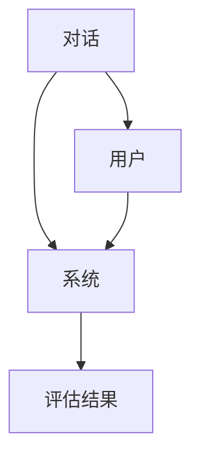
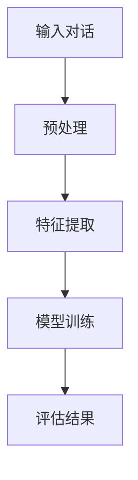
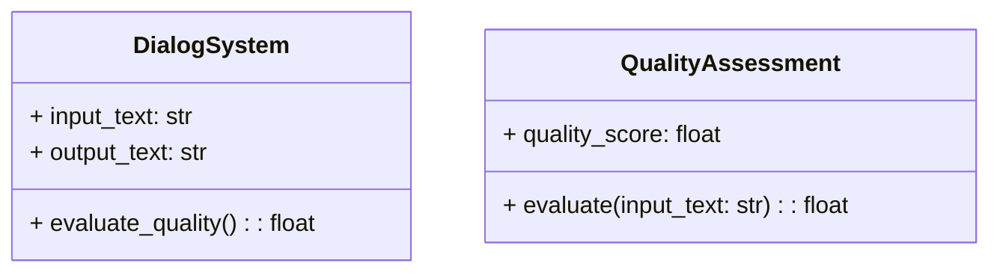
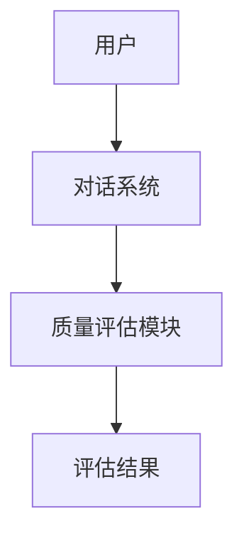
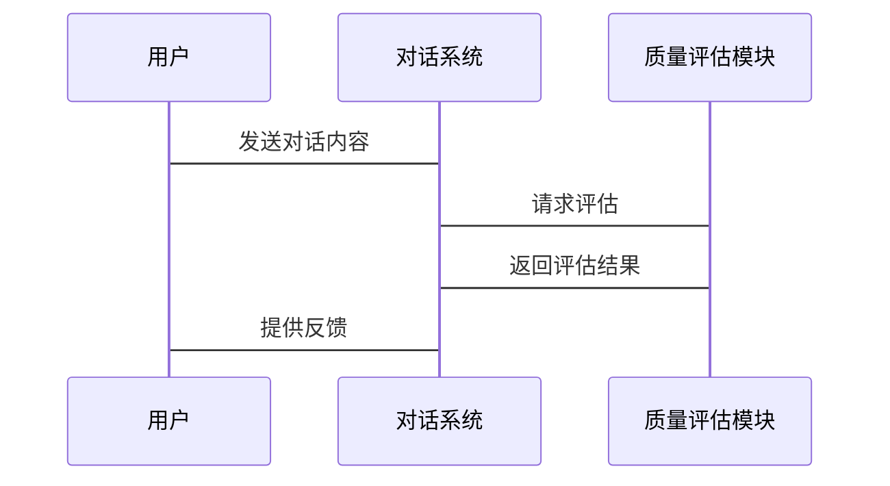

                 


# 目录大纲：《AI Agent的对话质量评估体系设计》

## 第一部分：背景介绍

### 第1章：对话质量评估体系的背景与问题

#### 1.1 问题背景
- 1.1.1 AI Agent在对话系统中的应用现状
- 1.1.2 当前对话质量评估的主要挑战
- 1.1.3 对话质量评估体系的重要性

#### 1.2 问题描述
- 1.2.1 对话质量评估的核心问题
- 1.2.2 评估体系的边界与外延
- 1.2.3 对话质量评估的关键要素

## 第二部分：核心概念与联系

### 第2章：对话质量评估的核心概念

#### 2.1 对话质量评估的原理
- 2.1.1 基于自然语言处理的对话分析
- 2.1.2 对话质量评估的指标体系
- 2.1.3 多模态评估方法的探讨

#### 2.2 核心概念属性对比
- 2.2.1 对话质量评估指标的特征对比表
- 2.2.2 不同评估方法的优劣势分析

#### 2.3 实体关系图


## 第三部分：算法原理讲解

### 第3章：对话质量评估的算法原理

#### 3.1 算法原理概述
- 3.1.1 基于深度学习的对话分析
- 3.1.2 多任务学习在评估中的应用
- 3.1.3 算法流程图


#### 3.2 算法实现代码
```python
import torch
class DialogQualityModel(torch.nn.Module):
    def __init__(self):
        super().__init__()
        self.embedding = torch.nn.Embedding(...)
        self.lstm = torch.nn.LSTM(...)
        self.fc = torch.nn.Linear(...)
    
    def forward(self, input):
        embed = self.embedding(input)
        out, _ = self.lstm(embed)
        out = self.fc(out)
        return out
```

#### 3.3 数学模型与公式
- 对话质量得分计算公式：
  $$ Q = \sum_{i=1}^{n} w_i x_i $$
  其中，$w_i$是权重，$x_i$是评估指标的得分。

## 第四部分：系统分析与架构设计方案

### 第4章：系统架构设计

#### 4.1 问题场景介绍
- 4.1.1 对话系统的基本功能
- 4.1.2 对话质量评估的具体需求

#### 4.2 系统功能设计
- 4.2.1 领域模型设计


#### 4.3 系统架构设计


#### 4.4 系统接口设计
- 输入接口：接收用户输入
- 输出接口：返回评估结果
- 交互流程：


## 第五部分：项目实战

### 第5章：项目实战与案例分析

#### 5.1 环境安装
- 5.1.1 安装Python
- 5.1.2 安装必要的库（如TensorFlow、PyTorch等）

#### 5.2 系统核心实现
```python
def evaluate_dialogue(system_response, user_request):
    # 实现对话质量评估的具体逻辑
    pass
```

#### 5.3 代码应用解读与分析
- 代码功能介绍
- 代码结构分析
- 代码运行结果解读

#### 5.4 实际案例分析
- 案例背景介绍
- 数据输入与处理
- 评估过程分析
- 结果解读与优化建议

#### 5.5 项目小结
- 项目总结
- 经验教训
- 改进方向

## 第六部分：最佳实践

### 第6章：最佳实践与小结

#### 6.1 小结
- 本章内容总结
- 对话质量评估的核心要点

#### 6.2 注意事项
- 开发中的常见问题
- 优化建议
- 注意事项

#### 6.3 拓展阅读
- 推荐阅读的书籍和资源
- 相关领域的发展趋势
- 进一步学习的方向

## 结语

通过对AI Agent对话质量评估体系的全面分析与设计，我们详细探讨了从理论到实践的各个环节，为构建高效、准确的对话评估系统提供了指导。

## 作者

作者：AI天才研究院/AI Genius Institute & 禅与计算机程序设计艺术 /Zen And The Art of Computer Programming

---

以上是《AI Agent的对话质量评估体系设计》的详细目录大纲，涵盖了从背景介绍到项目实战的各个方面，确保内容的完整性和逻辑性，为读者提供全面的指导和深入的分析。

