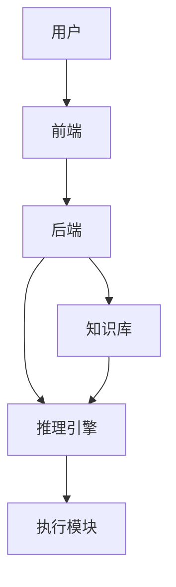

                 


# AI Agent的应用场景：从客服到创意助手

> 关键词：AI Agent，人工智能代理，智能客服，创意助手，人工智能应用

> 摘要：本文将深入探讨AI Agent的核心概念、技术原理及其在不同领域的应用场景，从智能客服到创意助手，逐步分析AI Agent如何改变我们的工作和生活方式。通过详细的算法讲解、系统架构设计和实际案例分析，帮助读者全面理解AI Agent的潜力与实现方式。

---

# 第一部分: AI Agent的背景与核心概念

# 第1章: AI Agent的基本概念与应用场景

## 1.1 AI Agent的定义与特点
### 1.1.1 什么是AI Agent
AI Agent（人工智能代理）是一种能够感知环境、自主决策并执行任务的智能实体。它通过与用户或系统的交互，利用数据和算法来完成特定目标。

### 1.1.2 AI Agent的核心特点
- **自主性**：能够自主决策和执行任务。
- **反应性**：能够实时感知环境并做出反应。
- **学习能力**：通过数据和反馈不断优化自身。
- **交互能力**：能够与用户或其他系统进行自然交互。

## 1.2 AI Agent的应用场景
### 1.2.1 智能客服
AI Agent可以替代传统客服，提供24/7的在线支持，快速响应用户需求，解决常见问题。

### 1.2.2 创意助手
AI Agent可以帮助创意工作者生成灵感、优化设计方案，甚至协助撰写文案或音乐创作。

### 1.2.3 个性化推荐
AI Agent可以根据用户的偏好，推荐个性化的内容、产品或服务。

### 1.2.4 智能助手
AI Agent可以作为个人或团队的智能助手，帮助管理日程、协调任务和优化资源分配。

## 1.3 本章小结
通过本章的介绍，我们了解了AI Agent的基本概念、核心特点及其在多个领域的应用场景。接下来，我们将深入探讨AI Agent的核心技术原理。

---

# 第2章: AI Agent的核心技术与实现原理

## 2.1 AI Agent的任务分解
### 2.1.1 什么是任务分解
任务分解是将复杂任务拆解为多个简单子任务，确保每个子任务都能被AI Agent独立执行。

### 2.1.2 任务分解的步骤
1. **目标识别**：明确任务的目标和约束条件。
2. **子任务划分**：将任务拆解为多个子任务。
3. **优先级排序**：根据子任务的重要性进行排序。

## 2.2 AI Agent的决策推理
### 2.2.1 什么是决策推理
决策推理是AI Agent根据环境信息和知识库，做出最优决策的过程。

### 2.2.2 决策推理的算法
- **基于规则的推理**：通过预定义的规则进行决策。
- **基于模型的推理**：利用概率模型或图模型进行推理。

## 2.3 AI Agent的自然语言处理
### 2.3.1 NLP的核心技术
- **分词**：将文本分割成有意义的词语。
- **句法分析**：分析句子的语法结构。
- **情感分析**：识别文本中的情感倾向。

### 2.3.2 NLP在AI Agent中的应用
- **语义理解**：理解用户意图。
- **对话生成**：生成自然的对话回复。

## 2.4 本章小结
通过本章的讲解，我们了解了AI Agent在任务分解、决策推理和自然语言处理等方面的核心技术。接下来，我们将通过实际案例来展示AI Agent的应用。

---

# 第3章: AI Agent的系统架构设计

## 3.1 系统功能设计
### 3.1.1 用户交互界面
- **图形界面**：用户可以通过图形界面与AI Agent交互。
- **命令行界面**：用户可以通过命令行与AI Agent交互。

### 3.1.2 知识库管理
- **数据存储**：存储用户信息、任务历史等数据。
- **知识更新**：定期更新知识库，保持信息的准确性。

## 3.2 系统架构图


## 3.3 系统接口设计
### 3.3.1 输入接口
- **文本输入**：用户输入的文字。
- **语音输入**：用户输入的语音。

### 3.3.2 输出接口
- **文本输出**：AI Agent生成的文本回复。
- **语音输出**：AI Agent生成的语音回复。

## 3.4 本章小结
通过本章的讲解，我们了解了AI Agent系统的功能设计、架构图和接口设计。接下来，我们将通过一个实际案例来展示AI Agent的应用。

---

# 第4章: AI Agent的项目实战——智能客服系统

## 4.1 项目背景与目标
### 4.1.1 项目背景
智能客服系统通过AI Agent替代传统客服，提高效率并降低成本。

### 4.1.2 项目目标
- 提供24/7的在线客服支持。
- 快速响应用户需求，解决常见问题。

## 4.2 项目实现
### 4.2.1 环境安装
```bash
pip install python
pip install transformers
pip install numpy
```

### 4.2.2 核心代码实现
```python
class AIAssistant:
    def __init__(self, knowledge_base):
        self.knowledge_base = knowledge_base
        self.nlp_pipeline = load_pipeline('question-answering')

    def process_query(self, query):
        response = self.nlp_pipeline(self.knowledge_base, query)
        return response['answer']
```

### 4.2.3 案例分析
- **用户输入**：我如何重置我的密码？
- **系统处理**：AI Agent通过知识库查找相关步骤。
- **系统输出**：提供密码重置的详细步骤。

## 4.3 本章小结
通过本章的实战，我们了解了AI Agent在智能客服系统中的应用。接下来，我们将总结AI Agent的最佳实践和注意事项。

---

# 第5章: AI Agent的最佳实践与注意事项

## 5.1 最佳实践
### 5.1.1 数据质量
确保知识库的数据质量和完整性。

### 5.1.2 模型优化
定期优化AI Agent的算法和模型，提高准确率。

## 5.2 注意事项
### 5.2.1 数据隐私
保护用户数据的隐私和安全。

### 5.2.2 系统稳定性
确保AI Agent系统的稳定性和可靠性。

## 5.3 拓展阅读
- 《人工智能：一种现代的方法》
- 《机器学习实战》
- 《自然语言处理入门》

---

# 作者：AI天才研究院 & 禅与计算机程序设计艺术

