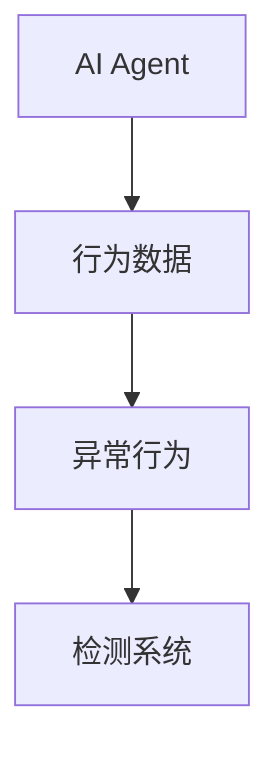
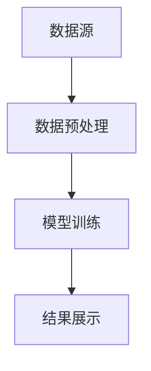
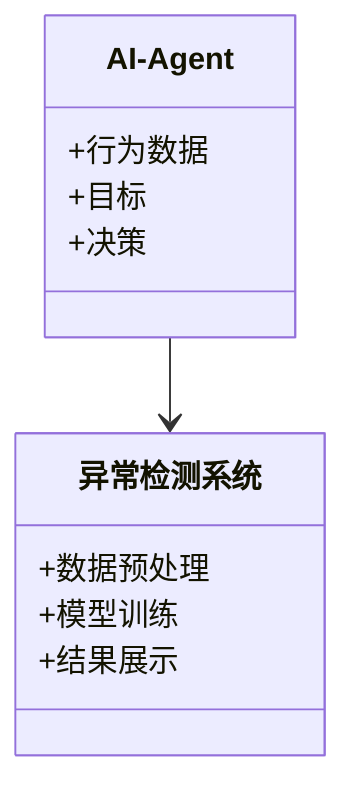
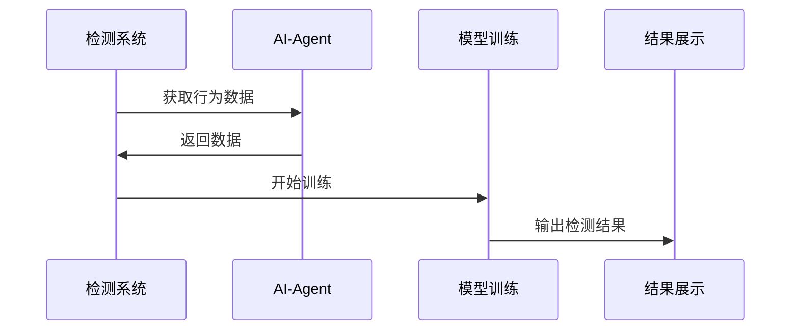

                 


# AI Agent的异常检测：识别非正常模式

> 关键词：AI Agent，异常检测，模式识别，算法原理，系统架构，项目实战

> 摘要：本文详细探讨了AI Agent的异常检测技术，从背景介绍、核心概念、算法原理到系统架构和项目实战，全面解析了如何识别和处理AI Agent运行中的非正常模式。通过具体的算法实现和案例分析，帮助读者理解异常检测的重要性及其在AI Agent中的实际应用。

---

# 第一部分: AI Agent的异常检测背景与核心概念

## 第1章: AI Agent的基本概念与异常检测的定义

### 1.1 AI Agent的定义与特点

#### 1.1.1 AI Agent的基本定义

AI Agent（人工智能代理）是一种能够感知环境、自主决策并执行任务的智能实体。它能够根据接收到的信息做出决策，并采取行动以实现特定目标。AI Agent的核心在于其智能化和自主性，它能够处理复杂的问题并适应环境的变化。

#### 1.1.2 AI Agent的核心特点

- **自主性**：AI Agent能够在没有外部干预的情况下自主运行。
- **反应性**：能够实时感知环境并做出反应。
- **目标导向性**：所有行为都围绕实现特定目标展开。
- **学习能力**：能够通过经验改进自身的决策和行为。

#### 1.1.3 AI Agent与传统程序的区别

AI Agent与传统程序的主要区别在于其智能化和自主性。传统程序通常需要明确的输入和指令，而AI Agent能够自主决策并适应环境的变化。此外，AI Agent具备学习能力，能够通过数据优化自身的性能。

### 1.2 异常检测的基本概念

#### 1.2.1 异常检测的定义

异常检测是指识别数据中与预期模式或行为显著不同的模式或事件。在AI Agent的背景下，异常检测的目标是识别其行为或数据中偏离正常模式的部分。

#### 1.2.2 异常检测的分类

- **基于统计的方法**：通过统计分析识别异常，如均值、标准差等。
- **基于机器学习的方法**：利用监督或无监督学习模型识别异常。
- **基于深度学习的方法**：使用神经网络等深度学习模型检测异常。

#### 1.2.3 异常检测的应用场景

- **网络安全**：检测网络流量中的异常行为。
- **系统监控**：监控系统运行状态，及时发现异常。
- **医疗健康**：检测患者生理数据中的异常。

### 1.3 AI Agent异常检测的背景与问题背景

#### 1.3.1 AI Agent运行中的潜在问题

- 数据偏差：AI Agent在训练数据中可能存在的偏差会影响其决策。
- 算法漏洞：算法本身可能存在漏洞，导致异常行为。
- 环境变化：环境的变化可能导致AI Agent无法适应新的情况。

#### 1.3.2 异常检测在AI Agent中的重要性

异常检测是保障AI Agent安全、稳定运行的关键技术。通过及时识别和处理异常，可以避免系统崩溃或决策失误。

#### 1.3.3 异常检测的边界与外延

异常检测的边界在于如何定义“正常”与“异常”。外延则涉及如何处理边界情况和动态变化的环境。

### 1.4 异常检测的核心要素与概念结构

#### 1.4.1 异常检测的关键要素

- 数据来源：输入数据的特征和质量。
- 检测模型：使用的算法或模型类型。
- 检测目标：明确的检测目标和标准。
- 结果分析：如何解释和处理检测结果。

#### 1.4.2 异常检测的概念结构

异常检测的概念结构包括数据输入、模型处理、结果输出和反馈优化四个部分。

#### 1.4.3 异常检测的核心属性对比表

| 属性       | 正常模式       | 异常模式       |
|------------|---------------|---------------|
| 数据特征    | 符合预期分布   | 远离预期分布   |
| 行为表现    | 符合预期目标   | 偏离预期目标   |
| 检测难度    | 易检测         | 难检测         |
| 处理方式    | 继续运行       | 需要干预       |

---

## 第2章: 异常检测的基本原理与方法

### 2.1 异常检测的基本原理

#### 2.1.1 异常检测的原理概述

异常检测的核心在于发现数据中的异常点或异常行为。这需要通过数学模型或算法来识别数据中的偏离模式。

#### 2.1.2 异常检测的核心算法

- **基于统计的方法**：如LOF（局部 outlier factor）算法。
- **基于机器学习的方法**：如Isolation Forest算法。
- **基于深度学习的方法**：如变种的神经网络模型。

#### 2.1.3 异常检测的数学模型

异常检测的数学模型通常涉及概率分布、距离度量或相似性度量等。

### 2.2 异常检测的核心概念与联系

#### 2.2.1 异常检测的实体关系图



#### 2.2.2 异常检测的系统架构图



### 2.3 异常检测的算法对比

#### 2.3.1 基于统计的异常检测方法

基于统计的方法通常依赖于数据的分布特性，如均值和方差。例如，使用3σ原则来判断异常点。

#### 2.3.2 基于机器学习的异常检测方法

基于机器学习的异常检测方法通常使用无监督学习算法，如聚类和降维技术。

#### 2.3.3 基于深度学习的异常检测方法

基于深度学习的方法通常使用神经网络模型，如自动编码器和变分自编码器。

---

## 第3章: 异常检测的数学模型与算法原理

### 3.1 异常检测的数学模型

#### 3.1.1 基于统计的

$$P(X) = \frac{1}{(2\pi)^{n/2}|\Sigma|^{1/2}}} e^{-\frac{1}{2}(X-\mu)^T \Sigma^{-1} (X-\mu)}$$

其中，$$P(X)$$是数据点$$X$$的概率密度函数，$$\mu$$是均值向量，$$\Sigma$$是协方差矩阵。

#### 3.1.2 基于机器学习的

异常检测的机器学习模型通常使用距离度量或相似性度量。例如，使用k-近邻算法（k-NN）计算数据点的局部密度。

---

## 第4章: 系统分析与架构设计方案

### 4.1 问题场景介绍

AI Agent在运行过程中可能会遇到各种异常情况，如数据输入异常、算法漏洞等。

### 4.2 项目介绍

本项目旨在设计一个能够实时检测AI Agent异常行为的系统。

### 4.3 系统功能设计

#### 4.3.1 领域模型



#### 4.3.2 系统架构设计


#### 4.3.3 系统接口设计

系统接口包括数据输入接口、模型调用接口和结果输出接口。

#### 4.3.4 系统交互流程



---

## 第5章: 项目实战

### 5.1 环境安装

安装Python、机器学习库（如scikit-learn）和数据处理库（如Pandas）。

### 5.2 系统核心实现

#### 5.2.1 数据加载

```python
import pandas as pd

data = pd.read_csv('behavior_data.csv')
```

#### 5.2.2 数据预处理

```python
from sklearn.preprocessing import StandardScaler

scaler = StandardScaler()
data_scaled = scaler.fit_transform(data)
```

#### 5.2.3 模型训练

```python
from sklearn.neighbors import LocalOutlierFactor

clf = LocalOutlierFactor(n_neighbors=20)
outliers = clf.fit_predict(data_scaled)
```

#### 5.2.4 结果展示

```python
outliers[outliers == -1] = 1
print(outliers)
```

### 5.3 代码实现与解读

详细解读每一步代码的功能和作用。

### 5.4 实际案例分析

通过一个具体案例，展示异常检测的实际效果。

### 5.5 项目小结

总结项目实现的关键点和经验教训。

---

## 第6章: 总结与展望

### 6.1 异常检测的关键点

异常检测的关键在于如何定义“正常”与“异常”，以及如何选择合适的算法。

### 6.2 未来展望

未来的研究方向包括提高算法的鲁棒性、优化模型的可解释性以及探索更高效的计算方法。

### 6.3 最佳实践 tips

- 确保数据质量，避免偏差。
- 选择合适的算法，根据数据特点进行调整。
- 定期更新模型，适应环境变化。

---

作者：AI天才研究院/AI Genius Institute & 禅与计算机程序设计艺术 /Zen And The Art of Computer Programming

