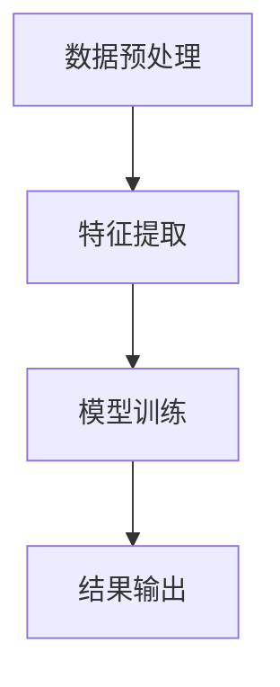

                 


# AI Agent的强化学习在推荐系统中的应用

## 关键词：AI Agent，强化学习，推荐系统，深度强化学习，强化学习算法，推荐系统优化

## 摘要：本文深入探讨了AI Agent结合强化学习在推荐系统中的应用，分析了强化学习的核心算法及其在推荐系统中的具体实现，详细讲解了基于强化学习的推荐系统的系统架构与设计，并通过实际案例展示了如何利用强化学习优化推荐系统，提升用户体验。文章内容涵盖背景介绍、核心概念、算法原理、系统架构和项目实战，旨在为读者提供全面的技术指导。

---

## 第1章：AI Agent与强化学习概述

### 1.1 AI Agent的基本概念

#### 1.1.1 AI Agent的定义与特点
AI Agent（智能体）是指在计算机系统中，能够感知环境并采取行动以实现目标的实体。AI Agent可以是软件程序、机器人或其他智能系统，其核心特征包括自主性、反应性、目标导向和社交能力。

- 自主性：AI Agent能够独立决策，无需外部干预。
- 反应性：AI Agent能够感知环境并实时调整行为。
- 目标导向：AI Agent的行为旨在实现特定目标。
- 社交能力：AI Agent能够与其他智能体或人类进行交互。

#### 1.1.2 AI Agent的类型与应用场景
AI Agent可以分为简单反射型、基于模型的反射型、目标驱动型和效用驱动型。在推荐系统中，AI Agent通常用于动态调整推荐策略，以适应用户行为的变化。

- 简单反射型：基于当前输入直接生成输出，适用于规则-based推荐系统。
- 基于模型的反射型：利用内部模型进行复杂推理，适用于协同过滤推荐系统。
- 目标驱动型：通过优化目标函数来调整推荐策略，适用于基于强化学习的推荐系统。
- 效用驱动型：通过最大化效用函数来实现推荐目标，适用于基于强化学习的推荐系统。

#### 1.1.3 AI Agent与强化学习的关系
强化学习是一种机器学习范式，通过智能体与环境的交互，学习最优策略以最大化累计奖励。AI Agent在强化学习中扮演核心角色，负责感知环境、采取行动并接收奖励。强化学习为AI Agent提供了动态调整推荐策略的能力，使其能够适应用户行为和偏好的变化。

---

### 1.2 强化学习的基本原理

#### 1.2.1 强化学习的定义与特点
强化学习（Reinforcement Learning，RL）是一种机器学习方法，通过智能体与环境的交互，学习最优策略以最大化累计奖励。强化学习的核心特征包括：

- 环境交互：智能体通过与环境交互获得状态和奖励。
- 动作选择：智能体根据当前状态选择动作，并获得奖励。
- 策略优化：智能体通过经验改进策略，以最大化累计奖励。

#### 1.2.2 强化学习的核心要素：状态、动作、奖励
- **状态（State）**：环境在某一时刻的观察结果，反映环境的状态信息。
- **动作（Action）**：智能体在给定状态下采取的行为。
- **奖励（Reward）**：智能体采取动作后，环境给予的反馈，用于指导智能体的学习。

#### 1.2.3 强化学习的算法框架
强化学习的算法框架通常包括以下几个步骤：

1. **初始化**：设置初始状态、策略和参数。
2. **环境交互**：智能体根据当前状态选择动作，与环境交互。
3. **接收反馈**：智能体获得环境返回的状态和奖励。
4. **更新策略**：根据反馈更新策略，优化动作选择。
5. **重复步骤**：重复环境交互和策略更新，直到达到目标或满足终止条件。

---

### 1.3 推荐系统的基本原理

#### 1.3.1 推荐系统的定义与类型
推荐系统是一种信息过滤技术，旨在通过分析用户行为和偏好，向用户推荐相关的内容或产品。推荐系统可以分为协同过滤、基于内容的推荐、混合推荐等多种类型。

- **协同过滤**：基于用户相似性或物品相似性，推荐用户可能感兴趣的内容。
- **基于内容的推荐**：基于物品的属性或内容特征，推荐用户可能感兴趣的内容。
- **混合推荐**：结合协同过滤和基于内容的推荐，利用多种方法生成推荐结果。

#### 1.3.2 基于协同过滤的推荐系统
基于协同过滤的推荐系统通过分析用户行为数据，寻找相似的用户或物品，从而生成推荐结果。协同过滤可以分为基于用户的协同过滤和基于物品的协同过滤。

- **基于用户的协同过滤**：通过计算用户之间的相似性，向用户推荐与其他用户相似的物品。
- **基于物品的协同过滤**：通过计算物品之间的相似性，向用户推荐与用户已感兴趣物品相似的其他物品。

#### 1.3.3 基于内容的推荐系统
基于内容的推荐系统通过分析物品的内容特征，向用户推荐与用户兴趣相符的物品。这种方法通常利用文本挖掘、图像处理等技术提取物品的特征信息。

#### 1.3.4 混合推荐系统
混合推荐系统结合了协同过滤和基于内容的推荐方法，利用多种推荐策略生成最终的推荐结果。混合推荐系统可以通过投票融合、加权融合等方法将不同推荐策略的结果结合起来。

---

## 第2章：强化学习的核心概念与数学模型

### 2.1 强化学习的数学模型

#### 2.1.1 状态空间与动作空间
- **状态空间（State Space）**：所有可能状态的集合，通常用S表示。
- **动作空间（Action Space）**：所有可能动作的集合，通常用A表示。

#### 2.1.2 奖励函数与价值函数
- **奖励函数（Reward Function）**：定义智能体在某个状态下采取某个动作后获得的奖励，通常用r(s, a)表示。
- **价值函数（Value Function）**：定义智能体在某个状态下采取某个动作后获得的累计奖励，通常用V(s)或Q(s, a)表示。

#### 2.1.3 Q-learning算法的数学模型
Q-learning是一种经典的强化学习算法，通过更新Q值表来学习最优策略。Q值表的更新公式为：

$$ Q(s, a) = Q(s, a) + \alpha (r + \gamma \max_{a'} Q(s', a') - Q(s, a)) $$

其中，α是学习率，γ是折扣因子，r是奖励，s是当前状态，a是当前动作，s'是下一个状态，a'是下一个动作。

#### 2.1.4 Deep Q-Networks (DQN) 的数学模型
Deep Q-Networks是一种结合深度神经网络的强化学习算法，通过神经网络近似Q函数。DQN的数学模型通常包括两个神经网络：主网络和目标网络。

主网络的输出表示Q值，目标网络的输出表示目标Q值。目标Q值的更新公式为：

$$ Q_{\text{target}}(s', a') = \gamma Q_{\text{target}}(s', a') + r $$

---

### 2.2 强化学习的核心算法

#### 2.2.1 Q-learning算法
Q-learning算法通过更新Q值表来学习最优策略。该算法适用于离散状态和动作空间，且环境是马尔可夫决策过程。

#### 2.2.2 Deep Q-Networks (DQN) 算法
DQN算法通过深度神经网络近似Q函数，适用于连续状态和动作空间。DQN算法的核心思想是利用两个神经网络：主网络和目标网络，通过经验回放和目标网络更新来稳定学习过程。

#### 2.2.3 策略梯度算法
策略梯度算法通过优化策略直接最大化奖励，适用于参数化策略。策略梯度算法通常使用梯度上升方法，通过计算策略梯度来更新参数。

---

## 第3章：AI Agent在推荐系统中的应用

### 3.1 基于强化学习的推荐系统

#### 3.1.1 基于Q-learning的推荐系统
基于Q-learning的推荐系统通过维护Q值表，记录用户在不同状态下的推荐行为，从而优化推荐策略。该方法适用于离散状态和动作空间，且环境是马尔可夫决策过程。

#### 3.1.2 基于DQN的推荐系统
基于DQN的推荐系统通过深度神经网络近似Q函数，适用于连续状态和动作空间。DQN推荐系统通过经验回放和目标网络更新来稳定学习过程，优化推荐策略。

#### 3.1.3 基于多智能体的推荐系统
基于多智能体的推荐系统通过多个智能体协作，共同优化推荐策略。每个智能体负责不同的推荐任务，通过协同工作实现全局最优。

---

### 3.2 强化学习在推荐系统中的优势

#### 3.2.1 动态环境下的推荐优化
强化学习通过动态调整策略，能够适应用户行为和偏好的变化，实现动态优化推荐。

#### 3.2.2 长期用户偏好的预测
强化学习通过累积奖励，能够预测用户的长期偏好，从而提供更精准的推荐。

#### 3.2.3 高维状态空间的处理
强化学习通过深度神经网络，能够有效处理高维状态空间，实现复杂推荐任务。

---

## 第4章：系统架构与设计

### 4.1 系统架构设计

#### 4.1.1 系统架构图
推荐系统的整体架构通常包括以下几个模块：

1. **数据预处理模块**：对原始数据进行清洗、归一化等预处理操作。
2. **特征提取模块**：提取用户特征、物品特征和环境特征。
3. **模型训练模块**：训练强化学习模型，更新策略。
4. **结果输出模块**：生成推荐结果并输出。

系统架构图如下：



#### 4.1.2 系统功能设计
推荐系统的功能设计包括用户建模、物品建模、环境建模和推荐生成。

- **用户建模**：基于用户行为数据，构建用户特征向量。
- **物品建模**：基于物品属性数据，构建物品特征向量。
- **环境建模**：构建推荐系统的环境模型，模拟用户与推荐系统之间的交互。
- **推荐生成**：根据强化学习模型生成推荐结果。

---

## 第5章：项目实战

### 5.1 环境安装与配置

#### 5.1.1 环境要求
- Python 3.7+
- TensorFlow或PyTorch
- Scikit-learn
- Mermaid

#### 5.1.2 安装依赖
```bash
pip install tensorflow numpy scikit-learn
```

---

### 5.2 系统核心实现

#### 5.2.1 强化学习模型实现
基于DQN的强化学习模型实现：

```python
import numpy as np
import tensorflow as tf

class DQN:
    def __init__(self, state_size, action_size):
        self.state_size = state_size
        self.action_size = action_size
        self.gamma = 0.99
        self.epsilon = 0.1
        self.epsilon_min = 0.01
        self.epsilon_decay = 0.995
        self.model = self.build_model()
        self.target_model = self.build_model()

    def build_model(self):
        model = tf.keras.Sequential()
        model.add(tf.keras.layers.Dense(32, activation='relu', input_dim=self.state_size))
        model.add(tf.keras.layers.Dense(32, activation='relu'))
        model.add(tf.keras.layers.Dense(self.action_size, activation='linear'))
        model.compile(optimizer=tf.keras.optimizers.Adam(lr=0.001), loss='mean_squared_error')
        return model

    def act(self, state):
        if np.random.random() < self.epsilon:
            return np.random.randint(0, self.action_size)
        state = np.array([state])
        q = self.model.predict(state)[0]
        return np.argmax(q)

    def remember(self, state, action, reward, next_state):
        self.memory.append((state, action, reward, next_state))

    def replay(self, batch_size):
        if len(self.memory) < batch_size:
            return
        minibatch = random.sample(self.memory, batch_size)
        states = np.array([t[0] for t in minibatch])
        actions = np.array([t[1] for t in minibatch])
        rewards = np.array([t[2] for t in minibatch])
        next_states = np.array([t[3] for t in minibatch])
        targets = self.model.predict(states)
        next_q = self.target_model.predict(next_states)
        targets[range(batch_size), actions] = rewards + self.gamma * np.max(next_q, axis=1)
        self.model.fit(states, targets, epochs=1, verbose=0)
        if self.epsilon > self.epsilon_min:
            self.epsilon *= self.epsilon_decay
```

#### 5.2.2 推荐系统实现
基于DQN的推荐系统实现：

```python
class RecommenderSystem:
    def __init__(self, user_count, item_count):
        self.user_count = user_count
        self.item_count = item_count
        self.dqn = DQN(state_size=2, action_size=item_count)

    def get_recommendations(self, user_id, state):
        return self.dqn.act(state)
```

---

### 5.3 实际案例分析

#### 5.3.1 数据集准备
使用MovieLens数据集进行推荐系统实验。

#### 5.3.2 模型训练与评估
通过训练DQN模型，生成推荐结果，并评估推荐系统的性能指标，如准确率、召回率和F1值。

---

## 第6章：总结与展望

### 6.1 总结
本文深入探讨了AI Agent结合强化学习在推荐系统中的应用，分析了强化学习的核心算法及其在推荐系统中的具体实现。通过实际案例展示了如何利用强化学习优化推荐系统，提升用户体验。

### 6.2 未来展望
未来的研究方向包括：

- 更复杂的强化学习算法，如多智能体强化学习和深度强化学习。
- 更高效的推荐系统架构，如基于图神经网络的推荐系统。
- 更智能的推荐策略，如基于用户情感分析和上下文感知的推荐。

---

## 作者：AI天才研究院/AI Genius Institute & 禅与计算机程序设计艺术 /Zen And The Art of Computer Programming

---

通过本文的详细讲解，读者可以全面了解AI Agent在推荐系统中的应用，并掌握强化学习的核心原理和实际实现方法。希望本文能为读者提供有价值的技术指导，帮助他们在实际项目中应用这些技术。

