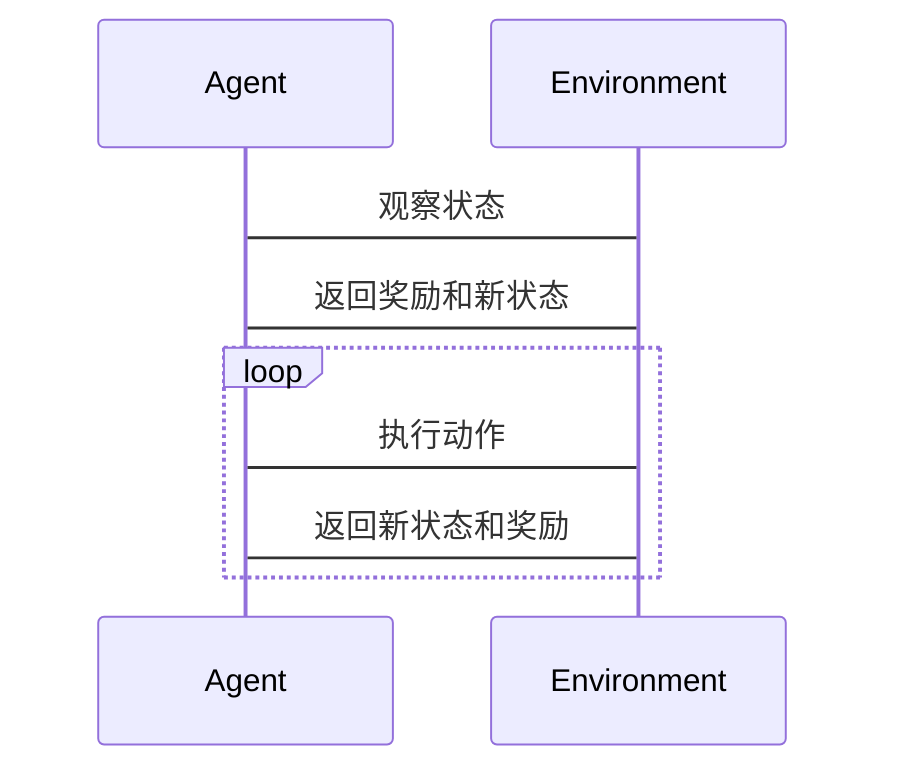
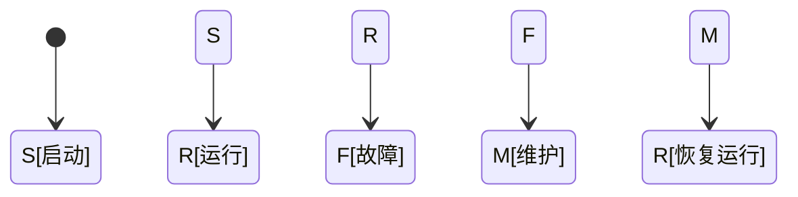

                 


```markdown
# AI Agent的强化学习在智能制造中的应用

## 关键词
- AI Agent
- 强化学习
- 智能制造
- 生产调度优化
- 质量控制
- 设备维护
- 算法实现

## 摘要
本文深入探讨了AI Agent在智能制造中的应用，重点分析了强化学习在生产调度优化、质量控制和设备维护中的作用。通过详细讲解强化学习的基本原理、算法实现以及系统架构设计，本文为读者提供了从理论到实践的全面指导。同时，结合实际案例，展示了如何利用强化学习提升智能制造系统的效率和性能。

## 第一部分: 强化学习基础

### 第1章: 强化学习的基本概念

#### 1.1 强化学习的核心要素
- **状态空间**：系统的当前状态，例如机器的运行状态。
- **动作空间**：系统可以执行的动作，例如启动或停止机器。
- **奖励函数**：对动作的反馈，用于指导学习过程。
- **策略**：决定动作选择的规则，例如贪心策略或随机策略。

#### 1.2 AI Agent的基本概念
- **定义**：AI Agent是一个能够感知环境并采取行动以实现目标的实体。
- **类型**：包括简单反射型、基于模型的、基于目标的和基于效用的Agent。
- **决策过程**：通过感知环境、选择动作并执行动作来实现目标。

#### 1.3 强化学习在AI Agent中的应用
- **驱动AI Agent**：通过强化学习，AI Agent能够自主学习和优化决策。
- **框架设计**：构建强化学习框架，明确状态、动作、奖励和策略的关系。

### 第2章: 强化学习的数学模型与算法

#### 2.1 马尔可夫决策过程
- **定义**：描述强化学习环境的数学模型，包括状态、动作、转移概率和奖励函数。
- **模型表示**：
  ```
  S = {s₁, s₂, ..., sₙ}：状态空间
  A = {a₁, a₂, ..., aₘ}：动作空间
  P(s'|s,a)：从状态s执行动作a后转移到状态s'的概率
  R(s,a)：执行动作a在状态s时的奖励
  ```

#### 2.2 Q-learning算法
- **基本原理**：通过更新Q值表来学习最优策略。
- **更新公式**：
  $$ Q(s,a) = Q(s,a) + α [r + γ \max Q(s',a') - Q(s,a)] $$
  其中，α是学习率，γ是折扣因子。

#### 2.3 策略梯度方法
- **基本思想**：通过优化策略的参数来最大化期望奖励。
- **实现方法**：使用梯度上升算法更新策略参数θ。
- **优势**：适用于高维状态空间和动作空间的情况。

### 第3章: AI Agent的强化学习框架

#### 3.1 感知与决策
- **状态感知**：通过传感器获取环境信息。
- **动作选择**：基于当前状态选择最优动作。
- **奖励机制**：根据动作结果给予奖励或惩罚。

#### 3.2 训练流程
- **环境建模**：构建模拟环境，定义状态、动作和奖励。
- **策略优化**：通过强化学习算法更新策略。
- **模型训练**：在模拟环境中反复训练，优化Q值表或策略参数。

#### 3.3 框架设计
- **框架组成**：包括状态感知模块、决策模块和奖励模块。
- **实现步骤**：环境建模、算法实现、训练与测试。
- **优化方法**：使用经验回放和目标网络来提高训练效率。

## 第二部分: 智能制造中的应用

### 第4章: 智能制造的背景与挑战

#### 4.1 智能制造的基本概念
- **定义**：利用人工智能、大数据和物联网等技术实现智能化生产。
- **核心技术**：包括工业物联网、大数据分析、机器学习和自动化控制。
- **发展趋势**：向个性化生产、实时优化和绿色制造方向发展。

#### 4.2 应用场景
- **生产调度优化**：优化生产计划，减少资源浪费。
- **质量控制**：实时监控生产过程，提高产品质量。
- **设备维护**：预测设备故障，减少停机时间。

### 第5章: 系统设计与实现

#### 5.1 系统架构设计
- **功能模块**：
  - 状态感知模块：采集设备状态和生产数据。
  - 决策模块：基于强化学习算法做出决策。
  - 执行模块：根据决策执行相应动作。
- **架构图**：
  ```mermaid
  graph TD
    A[状态感知] --> B[决策模块]
    B --> C[执行模块]
    C --> D[环境]
    A --> D
  ```

#### 5.2 项目实战

##### 5.2.1 生产调度优化

###### 5.2.1.1 环境配置
```python
class Environment:
    def __init__(self):
        self.state = 0  # 当前状态
        self.done = False  # 是否完成
        self.reward = 0  # 奖励值
```

###### 5.2.1.2 算法实现
```python
class Agent:
    def __init__(self, state_space, action_space):
        self.state_space = state_space
        self.action_space = action_space
        self.q_table = np.zeros((state_space, action_space))

    def take_action(self, state):
        if np.random.random() < 0.9:  # 探索与利用
            return np.argmax(self.q_table[state])
        else:
            return np.random.randint(self.action_space)

    def update_q_table(self, state, action, reward, next_state):
        self.q_table[state, action] += 0.1 * (reward + 0.95 * max(self.q_table[next_state]) - self.q_table[state, action])
```

###### 5.2.1.3 案例分析
```python
env = Environment()
agent = Agent(state_space=5, action_space=3)
for episode in range(1000):
    state = env.state
    action = agent.take_action(state)
    next_state, reward, done = env.step(action)
    agent.update_q_table(state, action, reward, next_state)
    if done:
        break
```

##### 5.2.2 质量控制

###### 5.2.2.1 系统交互


##### 5.2.3 设备维护

###### 5.2.3.1 状态转移


### 第6章: 总结与展望

#### 6.1 最佳实践
- **数据收集**：确保环境数据的准确性和全面性。
- **算法选择**：根据具体问题选择合适的强化学习算法。
- **系统优化**：通过经验回放和目标网络提高训练效率。

#### 6.2 小结
本文详细探讨了AI Agent的强化学习在智能制造中的应用，通过理论分析和实际案例，展示了如何利用强化学习优化生产调度、质量控制和设备维护。

#### 6.3 注意事项
- **环境复杂性**：复杂的环境可能需要更复杂的算法和更高的计算资源。
- **实时性要求**：实时应用需要高效的算法和快速的决策过程。
- **安全性考虑**：确保AI Agent的决策不会对生产安全造成威胁。

#### 6.4 拓展阅读
- 《Reinforcement Learning: Theory and Algorithms》
- 《Deep Reinforcement Learning for Industrial Applications》

## 作者
作者：AI天才研究院 & 禅与计算机程序设计艺术
```

