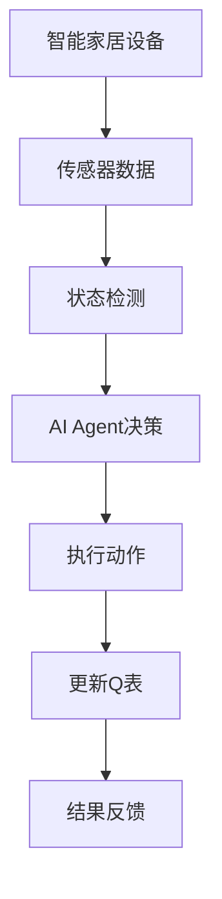

                 


# AI Agent的强化学习在智能家居控制中的应用

## 关键词
AI Agent, 强化学习, 智能家居, 系统建模, 算法实现

## 摘要
本文深入探讨了AI Agent在智能家居控制中的应用，重点分析了强化学习算法在智能家居环境建模、系统设计和优化中的应用。通过详细讲解强化学习的数学模型、算法原理、系统架构和项目实战，本文为读者提供了从理论到实践的全面指导。同时，本文还探讨了智能家居控制中的挑战与解决方案，并展望了未来的发展方向。

## 目录

### 第一章: AI Agent与强化学习概述
1.1 AI Agent的基本概念
1.2 强化学习的基本原理
1.3 智能家居控制中的强化学习应用

### 第二章: 强化学习的数学模型与算法原理
2.1 马尔可夫决策过程（MDP）
2.2 Q-learning算法
2.3 算法原理的数学模型
2.4 强化学习算法的优缺点对比

### 第三章: 智能家居环境建模
3.1 智能家居设备的建模
3.2 智能家居传感器数据建模
3.3 状态空间与动作空间设计

### 第四章: AI Agent的设计与实现
4.1 AI Agent的设计原则
4.2 状态空间与动作空间的实现
4.3 奖励函数的设计与实现
4.4 探索与利用策略的实现

### 第五章: 系统集成与优化
5.1 系统集成的实现
5.2 系统优化策略
5.3 多目标优化算法的实现

### 第六章: 项目实战
6.1 项目背景与目标
6.2 项目环境搭建
6.3 系统核心实现
6.4 项目案例分析

### 第七章: 总结与展望
7.1 总结
7.2 未来发展方向

## 正文

### 第二章: 强化学习的数学模型与算法原理

#### 2.1 马尔可夫决策过程（MDP）

马尔可夫决策过程（MDP）是强化学习中的核心模型，用于描述智能体在环境中的决策过程。一个完整的MDP由以下几个要素组成：

- **状态空间（State Space）**：智能体所处的环境状态。
- **动作空间（Action Space）**：智能体可以执行的动作。
- **状态转移概率（Transition Probability）**：从当前状态执行某个动作后转移到下一个状态的概率。
- **奖励函数（Reward Function）**：智能体执行某个动作后所获得的奖励。

#### 2.2 Q-learning算法

Q-learning是一种基于值函数的强化学习算法，适用于离线学习和在线学习。其核心思想是通过不断地更新Q值来逼近最优策略。

##### Q-learning算法步骤
1. 初始化Q表，所有状态-动作对的初始值为0。
2. 进入初始状态s。
3. 选择动作a（可以是随机选择或基于当前Q表选择）。
4. 执行动作a，观察下一个状态s'，并获得奖励r。
5. 更新Q表：Q(s, a) = Q(s, a) + α[r + γ * max(Q(s', a')) - Q(s, a)]
6. 重复步骤2-5，直到满足终止条件。

##### Q-learning算法流程图
```mermaid
graph TD
    A[初始化Q表] --> B[进入初始状态s]
    B --> C[选择动作a]
    C --> D[执行动作a，获得s'和r]
    D --> E[更新Q(s, a)]
    E --> F[是否满足终止条件？]
    F -->|否| C
    F -->|是| 结束
```

##### Q-learning算法实现代码
```python
import numpy as np

class QLearning:
    def __init__(self, state_space_size, action_space_size, gamma=0.99, alpha=0.1):
        self.gamma = gamma
        self.alpha = alpha
        self.q_table = np.zeros((state_space_size, action_space_size))

    def choose_action(self, state):
        return np.random.argmax(self.q_table[state])

    def update_q(self, state, action, reward, next_state):
        self.q_table[state, action] = self.q_table[state, action] + self.alpha * (reward + self.gamma * np.max(self.q_table[next_state]) - self.q_table[state, action])
```

#### 2.3 算法原理的数学模型

##### MDP的数学表达式
$$MDP = (S, A, P, R, \gamma)$$
- S：状态空间
- A：动作空间
- P：状态转移概率
- R：奖励函数
- γ：折扣因子

##### Q-learning的更新公式
$$Q(s, a) \leftarrow Q(s, a) + \alpha [r + \gamma \max Q(s', a') - Q(s, a)]$$

#### 2.4 强化学习算法的优缺点对比

| 算法名称       | 优点                           | 缺点                             |
|----------------|--------------------------------|----------------------------------|
| Q-learning     | 简单易实现，适用于离线学习     | 需要完整的状态转移模型           |
| DQN            | 能处理高维状态，鲁棒性强        | 训练时间较长，需要神经网络结构     |

### 第三章: 智能家居环境建模

#### 3.1 智能家居设备的建模

智能家居设备可以分为以下几类：
- 调制设备（灯光、空调、电视等）
- 传感器设备（温度、湿度、光照传感器等）
- 控制设备（智能插座、智能开关等）

##### 设备状态的表示方法
设备状态可以用二进制或数值型表示。例如：
- 灯光状态：0（关）/ 1（开）
- 温度传感器：0-100（摄氏度）

##### 设备动作的定义
设备动作通常包括开关操作。例如：
- 灯光：开/关
- 空调：制冷/制热/关

#### 3.2 智能家居传感器数据建模

##### 传感器数据的预处理
- 数据清洗：去除异常值
- 数据归一化：将数据映射到0-1范围
- 数据融合：结合多个传感器的数据

##### 传感器数据的特征提取
- 时间序列特征：最大值、最小值、平均值、方差等
- 统计特征：出现频率、趋势等

#### 3.3 状态空间与动作空间设计

##### 状态空间设计
智能家居的状态空间可以包括以下内容：
- 室内温度
- 室内湿度
- 光照强度
- 是否有人在家

##### 动作空间设计
智能家居的动作空间可以包括以下内容：
- 调节室内温度
- 调节室内湿度
- 开关灯光
- 开关窗帘

### 第四章: AI Agent的设计与实现

#### 4.1 AI Agent的设计原则

AI Agent的设计需要遵循以下原则：
- 明确的目标
- 简洁有效的状态表示
- 合理的动作空间设计
- 适当的奖励机制

#### 4.2 状态空间与动作空间的实现

##### 状态空间实现
状态空间可以通过数组或字典表示。例如：
```python
state = {
    'temperature': 25,
    'humidity': 50,
    'light': 0
}
```

##### 动作空间实现
动作空间可以通过枚举或函数实现。例如：
```python
actions = ['increase_temp', 'decrease_temp', 'turn_on_light', 'turn_off_light']
```

#### 4.3 奖励函数的设计与实现

奖励函数需要根据具体场景设计。例如：
```python
def reward_function(current_state, action, next_state):
    if action == 'increase_temp' and next_state['temperature'] > current_state['temperature']:
        return 1
    elif action == 'decrease_temp' and next_state['temperature'] < current_state['temperature']:
        return 1
    else:
        return 0
```

#### 4.4 探索与利用策略的实现

##### 探索与利用策略
```python
epsilon = 0.1

def choose_action(q_learning, state):
    if np.random.random() < epsilon:
        return np.random.choice(q_learning.action_space_size)
    else:
        return q_learning.choose_action(state)
```

### 第五章: 系统集成与优化

#### 5.1 系统集成的实现

##### 系统架构图


#### 5.2 系统优化策略

##### 多目标优化
在智能家居控制中，通常需要考虑多个目标，如舒适度、能耗等。可以通过加权的方式实现多目标优化。

##### 能耗优化
通过预测能源价格，合理安排设备的使用时间，实现能耗的最小化。

### 第六章: 项目实战

#### 6.1 项目背景与目标

##### 项目背景
智能家居的普及需要高效的控制方法，强化学习可以提供一种数据驱动的解决方案。

##### 项目目标
实现一个基于强化学习的智能家居控制系统，能够在不同场景下优化设备的控制策略。

#### 6.2 项目环境搭建

##### 环境搭建步骤
1. 安装Python和必要的库（如numpy、scikit-learn）
2. 安装智能家居设备的API
3. 配置传感器数据源

#### 6.3 系统核心实现

##### 核心代码实现
```python
import numpy as np

class SmartHomeAgent:
    def __init__(self, state_space_size, action_space_size, gamma=0.99, alpha=0.1):
        self.gamma = gamma
        self.alpha = alpha
        self.q_table = np.zeros((state_space_size, action_space_size))

    def choose_action(self, state):
        return np.random.argmax(self.q_table[state])

    def update_q(self, state, action, reward, next_state):
        self.q_table[state, action] = self.q_table[state, action] + self.alpha * (reward + self.gamma * np.max(self.q_table[next_state]) - self.q_table[state, action])

    def get_reward(self, current_state, action, next_state):
        # 根据具体场景设计奖励函数
        pass
```

#### 6.4 项目案例分析

##### 案例分析
假设一个智能家居系统，包括温度调节和灯光控制。通过Q-learning算法，系统能够在不同环境下优化设备的控制策略。

### 第七章: 总结与展望

#### 7.1 总结

本文详细介绍了AI Agent在智能家居控制中的应用，重点分析了强化学习算法在环境建模、系统设计和优化中的应用。通过理论分析和项目实战，本文为读者提供了从理论到实践的全面指导。

#### 7.2 未来发展方向

未来，随着人工智能和物联网技术的不断发展，智能家居控制将更加智能化和个性化。强化学习算法也将更加复杂和高效，如深度强化学习、多智能体强化学习等。

## 附录

### 附录A: 参考文献

1. Sutton, R. S., & Barto, A. G. (1998). Introduction to reinforcement learning. MIT press.
2. Mnih, V., et al. (2015). Human-level control through deep reinforcement learning. Nature.

### 附录B: 工具与资源

- Python编程语言
- numpy库
- scikit-learn库
-强化学习框架（如OpenAI Gym）

## 作者

作者：AI天才研究院/AI Genius Institute & 禅与计算机程序设计艺术 /Zen And The Art of Computer Programming

---

**注意：以上内容为完整的技术博客文章框架，具体内容需要根据实际场景和需求进行补充和扩展。**

