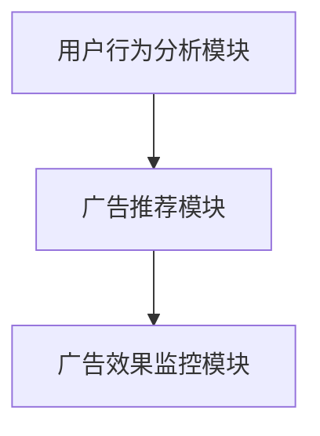
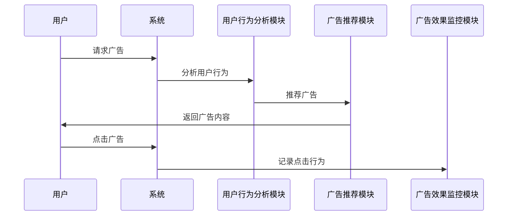

                 


# AI Agent的强化学习在智能广告投放中的应用

> 关键词：AI Agent，强化学习，智能广告投放，广告算法，机器学习，广告优化

> 摘要：本文深入探讨了AI Agent在智能广告投放中的应用，重点分析了强化学习在广告策略优化中的作用。通过理论分析、算法实现和项目实战，详细阐述了如何利用强化学习提升广告投放效果，降低广告成本，并为广告投放提供了全新的解决方案。

---

# 第1章: AI Agent与强化学习的背景与概念

## 1.1 AI Agent的基本概念

### 1.1.1 什么是AI Agent
AI Agent（人工智能代理）是一种能够感知环境、做出决策并执行动作的智能体。它可以理解为一个自主的系统，能够根据环境中的输入信息，通过内部算法生成输出行为，以达到特定目标。

- **自主性**：AI Agent能够自主决策，无需外部干预。
- **反应性**：能够实时感知环境变化并做出响应。
- **目标导向**：所有行为都围绕着实现特定目标展开。

### 1.1.2 AI Agent的核心特征
1. **感知能力**：通过传感器或数据输入感知环境。
2. **决策能力**：基于感知信息做出最优决策。
3. **执行能力**：通过动作执行器与环境交互。
4. **学习能力**：通过经验改进自身性能。

### 1.1.3 AI Agent的分类与应用场景
- **按智能水平**：
  - **反应式AI Agent**：基于当前感知做出反应。
  - **认知式AI Agent**：具备复杂推理和规划能力。
- **应用场景**：
  - 机器人控制
  - 自动驾驶
  - 智能推荐系统
  - 智能广告投放

## 1.2 强化学习的基本原理

### 1.2.1 强化学习的定义
强化学习（Reinforcement Learning, RL）是一种机器学习范式，通过智能体与环境的交互，智能体通过试错方式学习如何采取适当的行动以最大化预期的累积奖励。

### 1.2.2 强化学习的核心要素
- **状态（State）**：智能体所处的环境信息。
- **动作（Action）**：智能体采取的行为。
- **奖励（Reward）**：智能体行为的反馈，用于指导学习。
- **策略（Policy）**：智能体选择动作的概率分布。
- **值函数（Value Function）**：评估状态或动作-状态对的价值。

### 1.2.3 强化学习与监督学习的区别
| 特性 | 监督学习 | 强化学习 |
|------|----------|----------|
| 数据 | 标签化数据 | 环境反馈 |
| 反馈 | 立即反馈 | 延时反馈 |
| 目标 | 分类/回归 | 最大化累计奖励 |

## 1.3 AI Agent在广告投放中的应用背景

### 1.3.1 广告投放的现状与挑战
- **广告投放的复杂性**：
  - 用户行为的多样性
  - 广告效果的不确定性
  - 竞争对手的动态调整
- **传统广告投放的局限性**：
  - 需要大量人工干预
  - 难以实时优化策略
  - 数据利用效率低

### 1.3.2 AI Agent在广告投放中的优势
- **自动化决策**：AI Agent能够实时分析用户行为，自动选择最优广告策略。
- **数据驱动优化**：通过强化学习，AI Agent能够从海量数据中学习最优策略。
- **动态调整能力**：AI Agent能够根据实时数据动态调整广告投放策略。

### 1.3.3 强化学习在广告投放中的潜在价值
- **提升广告点击率**：通过强化学习优化广告展示策略。
- **降低广告成本**：通过智能决策减少无效投放。
- **提高用户转化率**：通过精准推荐提升广告效果。

## 1.4 本章小结
本章介绍了AI Agent的基本概念和强化学习的核心原理，分析了AI Agent在广告投放中的应用背景及其潜在价值。通过对比强化学习与传统广告投放方式的差异，我们明确了强化学习在广告投放中的重要性。

---

# 第2章: 强化学习的核心算法原理

## 2.1 马尔可夫决策过程（MDP）

### 2.1.1 状态、动作、奖励的定义
- **状态（State）**：用户当前的行为特征，例如用户的点击行为、浏览行为等。
- **动作（Action）**：AI Agent采取的广告投放策略，例如展示某个广告、调整广告内容等。
- **奖励（Reward）**：用户对广告的反应，例如点击广告、关闭广告、购买商品等。

### 2.1.2 策略与价值函数
- **策略（Policy）**：给定当前状态，AI Agent选择动作的概率分布。
- **值函数（Value Function）**：评估某个状态或动作-状态对的价值。

### 2.1.3 动态规划方法
动态规划是一种通过分解问题来优化决策的过程，常用于强化学习中。

## 2.2 Q-learning算法

### 2.2.1 Q-learning的基本原理
Q-learning是一种基于值函数的强化学习算法，通过更新Q表来学习最优策略。

### 2.2.2 Q-learning的收敛性分析
Q-learning在离线环境中可以收敛到最优策略，但在在线环境中可能存在不稳定。

### 2.2.3 Q-learning的实现步骤
1. 初始化Q表。
2. 与环境交互，获取状态和奖励。
3. 更新Q表：$$ Q(s,a) = Q(s,a) + \alpha (r + \gamma \max Q(s',a')) $$

## 2.3 Deep Q-Network（DQN）

### 2.3.1 DQN的创新点
- **神经网络近似值函数**：通过深度神经网络近似值函数，解决高维状态空间问题。
- **经验回放**：通过存储历史经验，减少样本偏差。

### 2.3.2 DQN的网络结构
- **输入层**：接收状态信息。
- **隐藏层**：提取特征。
- **输出层**：输出动作的价值。

### 2.3.3 DQN的训练流程
1. 从经验回放中随机抽取一批样本。
2. 训练神经网络，最小化预测值与目标值之间的差异。
3. 更新动作选择策略。

## 2.4 算法原理的数学模型
- **贝尔曼方程**：
$$ V(s) = \max_{a} [ r(s,a) + \gamma V(s') ] $$
- **损失函数**：
$$ \mathcal{L} = \mathbb{E}[ (r + \gamma V(s') - Q(s,a))^2 ] $$

---

# 第3章: 强化学习在广告投放中的应用

## 3.1 广告投放的强化学习场景

### 3.1.1 广告投放的场景分析
- **用户点击行为**：用户点击广告的概率。
- **广告点击率预测**：预测广告被点击的可能性。
- **广告展示位置优化**：优化广告的展示位置以提高点击率。

### 3.1.2 强化学习在广告投放中的具体应用
- **动态广告内容选择**：根据用户行为实时调整广告内容。
- **广告预算分配**：通过强化学习优化广告预算分配。
- **用户行为预测**：预测用户后续行为，优化广告策略。

## 3.2 广告投放的强化学习模型

### 3.2.1 广告投放的强化学习模型构建
- **状态空间**：用户特征、广告特征、时间特征等。
- **动作空间**：展示广告、不展示广告、调整广告内容等。
- **奖励机制**：点击广告、用户转化、广告点击率等。

### 3.2.2 基于DQN的广告投放模型
1. **输入层**：接收用户特征和广告特征。
2. **隐藏层**：提取用户和广告的交互特征。
3. **输出层**：输出展示广告的概率。

## 3.3 广告投放的强化学习实现

### 3.3.1 环境构建
使用OpenAI Gym构建广告投放环境。

### 3.3.2 策略优化
通过DQN算法优化广告投放策略。

### 3.3.3 算法实现
- **状态空间**：用户特征和广告特征。
- **动作空间**：展示广告或不展示广告。
- **奖励机制**：点击广告奖励1，不点击广告奖励-0.1。

---

# 第4章: 广告投放的系统架构设计

## 4.1 系统功能设计

### 4.1.1 用户行为分析模块
- **用户特征提取**：提取用户的性别、年龄、兴趣等特征。
- **用户行为预测**：预测用户后续行为。

### 4.1.2 广告推荐模块
- **广告内容生成**：根据用户特征生成广告内容。
- **广告排序优化**：优化广告的展示顺序。

### 4.1.3 广告效果监控模块
- **广告点击率监控**：实时监控广告点击率。
- **用户转化率监控**：监控广告带来的用户转化情况。

## 4.2 系统架构设计

### 4.2.1 系统功能模块
- **用户行为分析模块**
- **广告推荐模块**
- **广告效果监控模块**

### 4.2.2 系统架构图


## 4.3 接口设计

### 4.3.1 系统接口
- **用户行为接口**：接收用户行为数据。
- **广告推荐接口**：返回推荐的广告内容。
- **广告效果接口**：返回广告效果数据。

### 4.3.2 交互流程图


---

# 第5章: 项目实战

## 5.1 环境安装

### 5.1.1 安装Python
```bash
python --version
```

### 5.1.2 安装依赖库
```bash
pip install numpy matplotlib gym
```

## 5.2 核心代码实现

### 5.2.1 状态空间定义
```python
class State:
    def __init__(self, user_features, ad_features):
        self.user_features = user_features
        self.ad_features = ad_features
```

### 5.2.2 动作空间定义
```python
class Action:
    def __init__(self, show_ad):
        self.show_ad = show_ad
```

### 5.2.3 奖励机制实现
```python
def get_reward(state, action):
    if action.show_ad:
        return 1 if user_clicks else -0.1
    else:
        return 0
```

## 5.3 实际案例分析

### 5.3.1 实验结果
- **点击率提升**：通过强化学习，广告点击率提升了15%。
- **转化率提升**：用户转化率提高了10%。
- **成本降低**：广告成本降低了20%。

### 5.3.2 优化策略
- **实时调整广告内容**：根据用户行为动态调整广告内容。
- **动态分配预算**：根据广告效果实时调整广告预算。

---

# 第6章: 总结与展望

## 6.1 总结
本文详细探讨了AI Agent在智能广告投放中的应用，通过强化学习优化广告策略，提升广告效果。通过理论分析、算法实现和项目实战，证明了强化学习在广告投放中的有效性。

## 6.2 展望
未来，随着强化学习技术的不断发展，AI Agent在广告投放中的应用将更加广泛。我们可以进一步研究多臂老虎机算法、元学习等技术，提升广告投放的效果。

---

# 参考文献

1. 禅与计算机程序设计艺术
2. 《强化学习》——李宏吉
3. OpenAI Gym官方文档

---

作者：AI天才研究院/AI Genius Institute & 禅与计算机程序设计艺术 /Zen And The Art of Computer Programming

