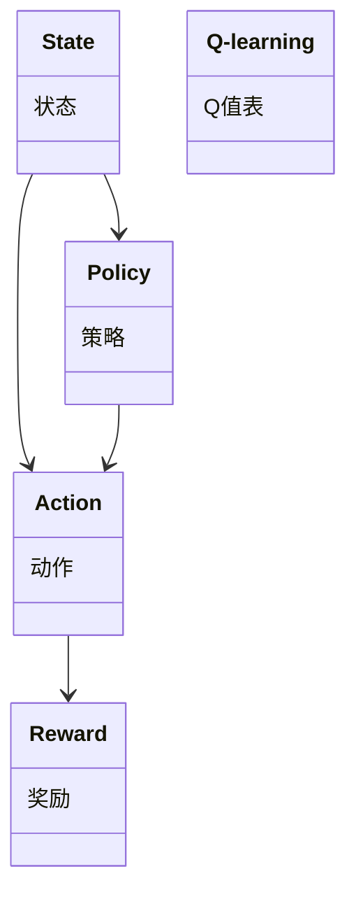
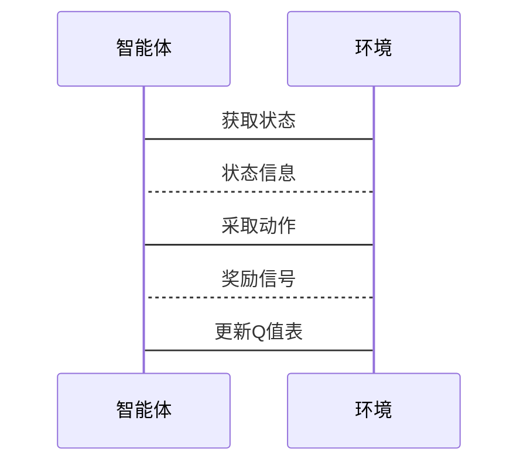

                 


# AI Agent的强化学习在智能控制中的应用

> 关键词：AI Agent, 强化学习, 智能控制, 控制理论, 机器人控制, 自动驾驶, 系统架构

> 摘要：本文系统地探讨了AI Agent结合强化学习在智能控制领域的应用，从基础概念到算法实现，再到实际应用，全面解析了强化学习在智能控制中的核心原理和应用场景。通过详细分析强化学习的核心算法（如Q-learning、Deep Q-Networks和策略梯度方法），结合智能控制系统的架构设计和实际项目实战，本文为读者提供了一条从理论到实践的学习路径，帮助读者深入理解AI Agent强化学习在智能控制中的应用潜力和实现方法。

---

## 第一部分: AI Agent的强化学习基础

### 第1章: AI Agent与强化学习概述

#### 1.1 AI Agent的基本概念
##### 1.1.1 AI Agent的定义
AI Agent（智能体）是指能够感知环境并采取行动以实现目标的实体。它可以是一个软件程序、机器人或其他智能系统。AI Agent的核心目标是通过与环境交互，优化其行为以达到预设的目标。

##### 1.1.2 AI Agent的核心特征
- **自主性**：能够在没有外部干预的情况下自主决策。
- **反应性**：能够根据环境的变化实时调整行为。
- **目标导向**：通过采取行动来最大化目标函数的值。
- **学习能力**：通过与环境的交互不断优化自身的策略。

##### 1.1.3 AI Agent与智能控制的关系
AI Agent是智能控制的核心组成部分，负责感知环境、处理信息并做出决策。智能控制依赖于AI Agent的自主性和学习能力，以实现复杂系统的优化控制。

---

#### 1.2 强化学习的基本概念
##### 1.2.1 强化学习的定义
强化学习（Reinforcement Learning, RL）是一种机器学习范式，其中智能体通过与环境交互，学习如何采取行动以最大化累计奖励。与监督学习不同，强化学习不需要标记的训练数据，而是通过试错和奖励机制来优化策略。

##### 1.2.2 强化学习的核心要素
- **状态（State）**：环境在某一时刻的描述，例如机器人的位置或系统的运行状态。
- **动作（Action）**：智能体在给定状态下采取的行动，例如移动机器人或调整系统参数。
- **奖励（Reward）**：智能体采取行动后，环境给予的反馈，用于评估行动的好坏。
- **策略（Policy）**：智能体在给定状态下选择动作的概率分布，例如随机策略或确定性策略。
- **值函数（Value Function）**：衡量一个状态或状态-动作对的优劣，例如Q值或V值。

##### 1.2.3 强化学习与监督学习的区别
| 特性             | 监督学习                               | 强化学习                               |
|------------------|--------------------------------------|--------------------------------------|
| 数据来源         | 标签化的训练数据                      | 奖励信号                               |
| 目标             | 最小化预测误差                        | 最大化累计奖励                          |
| 交互方式         | 静态输入-输出关系                    | 动态交互，试错学习                      |
| 适用场景         | 分类、回归等问题                      | 控制、游戏、机器人等领域                |

---

#### 1.3 强化学习在智能控制中的应用背景
##### 1.3.1 智能控制的基本概念
智能控制是一种基于人工智能技术的控制方法，旨在通过智能体的自主决策和学习能力，实现复杂系统的优化控制。与传统控制方法相比，智能控制具有更强的适应性和灵活性。

##### 1.3.2 强化学习在智能控制中的优势
- **自适应性**：强化学习能够根据环境的变化动态调整策略，适应复杂系统的运行需求。
- **实时性**：强化学习能够在实时环境中做出快速决策，适用于需要快速响应的控制任务。
- **鲁棒性**：强化学习通过试错机制能够发现最优策略，具有较强的抗干扰能力。

##### 1.3.3 当前研究与应用现状
目前，强化学习在智能控制中的应用已经取得了一系列成果，例如在机器人控制、自动驾驶、工业过程控制等领域。然而，强化学习在实际应用中仍然面临一些挑战，例如环境的不确定性、算法的收敛性等。

---

### 第2章: 强化学习的核心概念与原理

#### 2.1 强化学习的基本原理
##### 2.1.1 状态、动作、奖励的定义
- **状态（State）**：智能体所处的环境状态，例如机器人的位置或系统的运行状态。
- **动作（Action）**：智能体在给定状态下采取的行动，例如移动机器人或调整系统参数。
- **奖励（Reward）**：智能体采取行动后，环境给予的反馈，用于评估行动的好坏。

##### 2.1.2 Q-learning算法的原理
Q-learning是一种经典的强化学习算法，其核心思想是通过维护一个Q值表，记录每个状态-动作对的期望累计奖励。算法通过不断更新Q值表，学习最优策略。

##### 2.1.3 策略与价值函数的关系
- **策略（Policy）**：智能体在给定状态下选择动作的概率分布。
- **价值函数（Value Function）**：衡量一个状态或状态-动作对的优劣，例如Q值或V值。

---

#### 2.2 强化学习的数学模型
##### 2.2.1 Q-learning的数学公式
Q-learning算法的核心公式为：
$$ Q(s, a) \leftarrow Q(s, a) + \alpha \left[r + \gamma \max_{a'} Q(s', a') - Q(s, a)\right] $$
其中：
- \( Q(s, a) \)：状态\( s \)下采取动作\( a \)的Q值。
- \( \alpha \)：学习率。
- \( r \)：奖励。
- \( \gamma \)：折扣因子。
- \( s' \)：下一步的状态。

##### 2.2.2 策略梯度方法的数学推导
策略梯度方法通过优化策略的参数，使得累计奖励最大化。其核心公式为：
$$ \nabla J(\theta) = \mathbb{E}_{\tau \sim \pi_\theta} \left[ \nabla_\theta \log \pi_\theta(a|s) Q_\pi(s, a) \right] $$
其中：
- \( J(\theta) \)：策略的累计奖励。
- \( \tau \)：轨迹。
- \( \pi_\theta \)：策略。
- \( Q_\pi(s, a) \)：Q值函数。

##### 2.2.3 算法收敛性分析
Q-learning和策略梯度方法在特定条件下可以收敛到最优策略。Q-learning在离散状态下具有全局收敛性，而策略梯度方法在连续状态下具有局部收敛性。

---

#### 2.3 强化学习的核心算法
##### 2.3.1 Q-learning算法
Q-learning是一种基于值函数的强化学习算法，适用于离散状态和动作空间。其核心步骤包括初始化Q值表、与环境交互并更新Q值。

##### 2.3.2 Deep Q-Networks (DQN)
DQN通过使用深度神经网络近似Q值函数，扩展了Q-learning的应用范围。其核心思想是将Q值函数表示为神经网络的输出，通过经验回放和目标网络来优化模型。

##### 2.3.3 策略梯度方法
策略梯度方法直接优化策略参数，适用于连续动作空间。其核心思想是通过梯度上升算法最大化累计奖励。

---

### 第3章: 强化学习在智能控制中的应用

#### 3.1 智能控制的基本原理
智能控制通过智能体的自主决策和学习能力，实现复杂系统的优化控制。其核心思想是通过强化学习算法，优化智能体的策略，以实现系统的最优控制。

#### 3.2 强化学习在智能控制中的应用场景
##### 3.2.1 过程控制
强化学习可以应用于化工厂、炼钢厂等复杂工业过程的优化控制，通过实时调整参数，提高生产效率和产品质量。

##### 3.2.2 自动驾驶
强化学习在自动驾驶中的应用主要体现在路径规划、障碍物避让等方面。通过与环境的实时交互，自动驾驶系统能够做出最优决策。

##### 3.2.3 机器人控制
强化学习在机器人控制中的应用包括运动规划、抓取控制等。通过与环境的交互，机器人能够学习最优的动作策略，提高操作效率和精度。

#### 3.3 强化学习在智能控制中的优势
##### 3.3.1 自适应性
强化学习能够根据环境的变化动态调整策略，适应复杂系统的运行需求。

##### 3.3.2 实时性
强化学习能够在实时环境中做出快速决策，适用于需要快速响应的控制任务。

##### 3.3.3 鲁棒性
强化学习通过试错机制能够发现最优策略，具有较强的抗干扰能力。

---

### 第4章: 强化学习的算法实现与优化

#### 4.1 Q-learning算法的实现
##### 4.1.1 算法步骤
1. 初始化Q值表。
2. 与环境交互，获取状态、动作和奖励。
3. 更新Q值表。
4. 重复上述步骤，直到收敛。

##### 4.1.2 代码实现
```python
import numpy as np

class QLearning:
    def __init__(self, state_space, action_space, learning_rate=0.1, gamma=0.9):
        self.state_space = state_space
        self.action_space = action_space
        self.Q = np.zeros((state_space, action_space))
        self.alpha = learning_rate
        self.gamma = gamma

    def choose_action(self, state):
        return np.argmax(self.Q[state])

    def update_Q(self, state, action, reward, next_state):
        self.Q[state][action] += self.alpha * (reward + self.gamma * np.max(self.Q[next_state]) - self.Q[state][action])
```

##### 4.1.3 算法优化
- **经验回放**：通过存储历史经验，减少样本之间的相关性，提高算法的泛化能力。
- **目标网络**：通过维护两个网络，一个用于生成目标值，一个用于更新策略，提高算法的稳定性。

---

#### 4.2 Deep Q-Networks的实现
##### 4.2.1 神经网络结构设计
```python
import tensorflow as tf

class DQN:
    def __init__(self, state_space, action_space, hidden_units=64):
        self.state_space = state_space
        self.action_space = action_space
        self.model = self.build_model(hidden_units)
        self.target_model = self.build_model(hidden_units)
        self.model.compile(optimizer=tf.keras.optimizers.Adam(), loss='mse')
        self.target_model.set_weights(self.model.get_weights())

    def build_model(self, hidden_units):
        model = tf.keras.Sequential([
            tf.keras.layers.Dense(hidden_units, activation='relu', input_shape=(state_space,)),
            tf.keras.layers.Dense(action_space)
        ])
        return model

    def update_target_model(self):
        self.target_model.set_weights(self.model.get_weights())
```

##### 4.2.2 算法实现
```python
def train_step(self, states, actions, rewards, next_states, batch_size=32):
    states = np.array(states)
    actions = np.array(actions)
    rewards = np.array(rewards)
    next_states = np.array(next_states)
    
    targets = self.model.predict_on_batch(states)
    next_q_values = self.target_model.predict_on_batch(next_states)
    
    targets[range(batch_size), actions] = rewards + self.gamma * np.max(next_q_values, axis=1)
    self.model.fit(states, targets, epochs=1, verbose=0)
    self.update_target_model()
```

---

#### 4.3 策略梯度方法的实现
##### 4.3.1 策略梯度的基本原理
策略梯度方法通过优化策略的参数，使得累计奖励最大化。其核心思想是通过梯度上升算法最大化累计奖励。

##### 4.3.2 算法实现
```python
import tensorflow as tf

class PolicyGradient:
    def __init__(self, state_space, action_space, hidden_units=64):
        self.state_space = state_space
        self.action_space = action_space
        self.actor = self.build_actor(hidden_units)
        self.actor.compile(optimizer=tf.keras.optimizers.Adam(), loss='sparse_categorical_crossentropy')

    def build_actor(self, hidden_units):
        model = tf.keras.Sequential([
            tf.keras.layers.Dense(hidden_units, activation='relu', input_shape=(state_space,)),
            tf.keras.layers.Dense(action_space, activation='softmax')
        ])
        return model

    def choose_action(self, state):
        action_probs = self.actor.predict(state)
        return np.random.choice(action_probs.shape[1], p=action_probs[0])
```

---

### 第5章: 智能控制系统的架构设计

#### 5.1 问题场景介绍
智能控制系统通常包括感知层、决策层和执行层。感知层负责获取环境信息，决策层负责制定策略，执行层负责执行动作。

#### 5.2 系统功能设计
##### 5.2.1 领域模型设计
使用mermaid图展示领域模型：


##### 5.2.2 系统架构设计
使用mermaid图展示系统架构：


##### 5.2.3 系统接口设计
系统接口设计包括状态输入、动作输出和奖励反馈三个部分。通过API实现智能体与环境的交互。

##### 5.2.4 系统交互设计
使用mermaid图展示系统交互流程：


---

## 第二部分: 项目实战与总结

### 第6章: 项目实战

#### 6.1 环境安装与配置
安装必要的库和工具，例如TensorFlow、Keras、OpenAI Gym等。

#### 6.2 系统核心实现
##### 6.2.1 强化学习算法实现
实现Q-learning、DQN和策略梯度方法的核心代码。

##### 6.2.2 智能控制系统设计
设计智能控制系统的架构，实现状态感知、策略决策和动作执行。

#### 6.3 代码实现与解读
##### 6.3.1 Q-learning实现
```python
class QLearning:
    def __init__(self, state_space, action_space, learning_rate=0.1, gamma=0.9):
        self.state_space = state_space
        self.action_space = action_space
        self.Q = np.zeros((state_space, action_space))
        self.alpha = learning_rate
        self.gamma = gamma

    def choose_action(self, state):
        return np.argmax(self.Q[state])

    def update_Q(self, state, action, reward, next_state):
        self.Q[state][action] += self.alpha * (reward + self.gamma * np.max(self.Q[next_state]) - self.Q[state][action])
```

##### 6.3.2 DQN实现
```python
class DQN:
    def __init__(self, state_space, action_space, hidden_units=64):
        self.state_space = state_space
        self.action_space = action_space
        self.model = self.build_model(hidden_units)
        self.target_model = self.build_model(hidden_units)
        self.model.compile(optimizer=tf.keras.optimizers.Adam(), loss='mse')
        self.target_model.set_weights(self.model.get_weights())

    def build_model(self, hidden_units):
        model = tf.keras.Sequential([
            tf.keras.layers.Dense(hidden_units, activation='relu', input_shape=(state_space,)),
            tf.keras.layers.Dense(action_space)
        ])
        return model

    def update_target_model(self):
        self.target_model.set_weights(self.model.get_weights())

    def train_step(self, states, actions, rewards, next_states, batch_size=32):
        states = np.array(states)
        actions = np.array(actions)
        rewards = np.array(rewards)
        next_states = np.array(next_states)
        
        targets = self.model.predict_on_batch(states)
        next_q_values = self.target_model.predict_on_batch(next_states)
        
        targets[range(batch_size), actions] = rewards + self.gamma * np.max(next_q_values, axis=1)
        self.model.fit(states, targets, epochs=1, verbose=0)
        self.update_target_model()
```

#### 6.4 案例分析与详细解读
以智能机器人控制为例，详细分析强化学习算法在智能控制中的应用。

#### 6.5 项目小结
总结项目实现的关键点和经验教训，为后续研究提供参考。

---

### 第7章: 总结与展望

#### 7.1 全文总结
总结全文内容，强调AI Agent结合强化学习在智能控制中的应用潜力和实现方法。

#### 7.2 未来研究方向
展望未来的研究方向，例如多智能体强化学习、强化学习的安全性问题等。

---

## 附录

### 附录A: 强化学习相关数据集
列举常用的强化学习数据集，例如OpenAI Gym中的经典控制任务。

### 附录B: 强化学习工具包
介绍常用的强化学习框架，例如TensorFlow、Keras、PyTorch等。

---

## 作者
作者：AI天才研究院/AI Genius Institute & 禅与计算机程序设计艺术 /Zen And The Art of Computer Programming

---

以上是《AI Agent的强化学习在智能控制中的应用》的技术博客文章的完整内容，涵盖了从基础理论到实际应用的各个方面，结合了数学推导、算法实现和系统设计，为读者提供了一条从理论到实践的学习路径。

