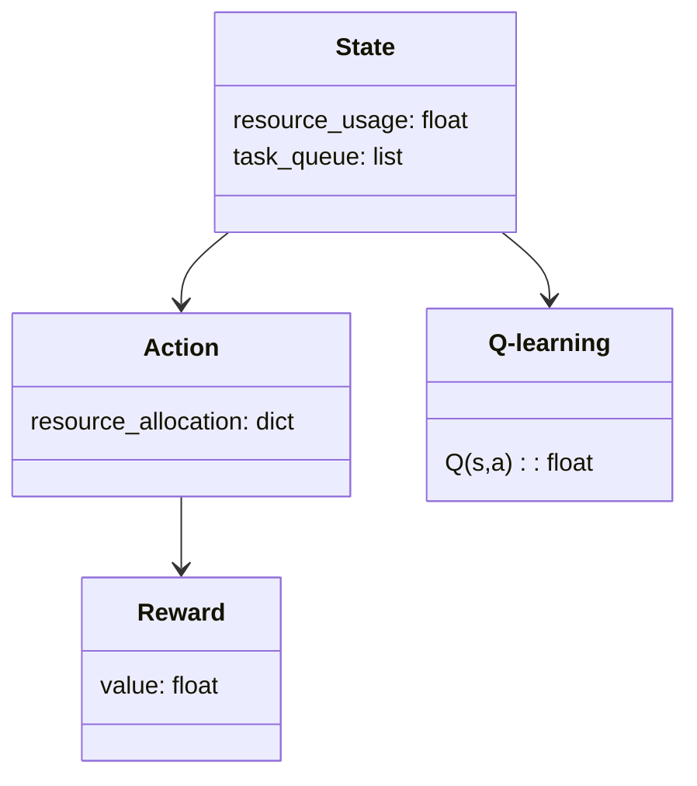
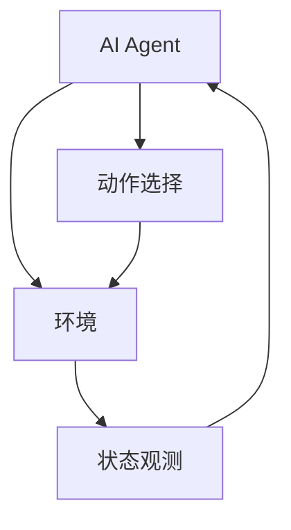
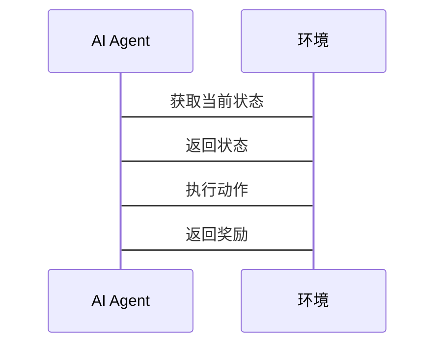
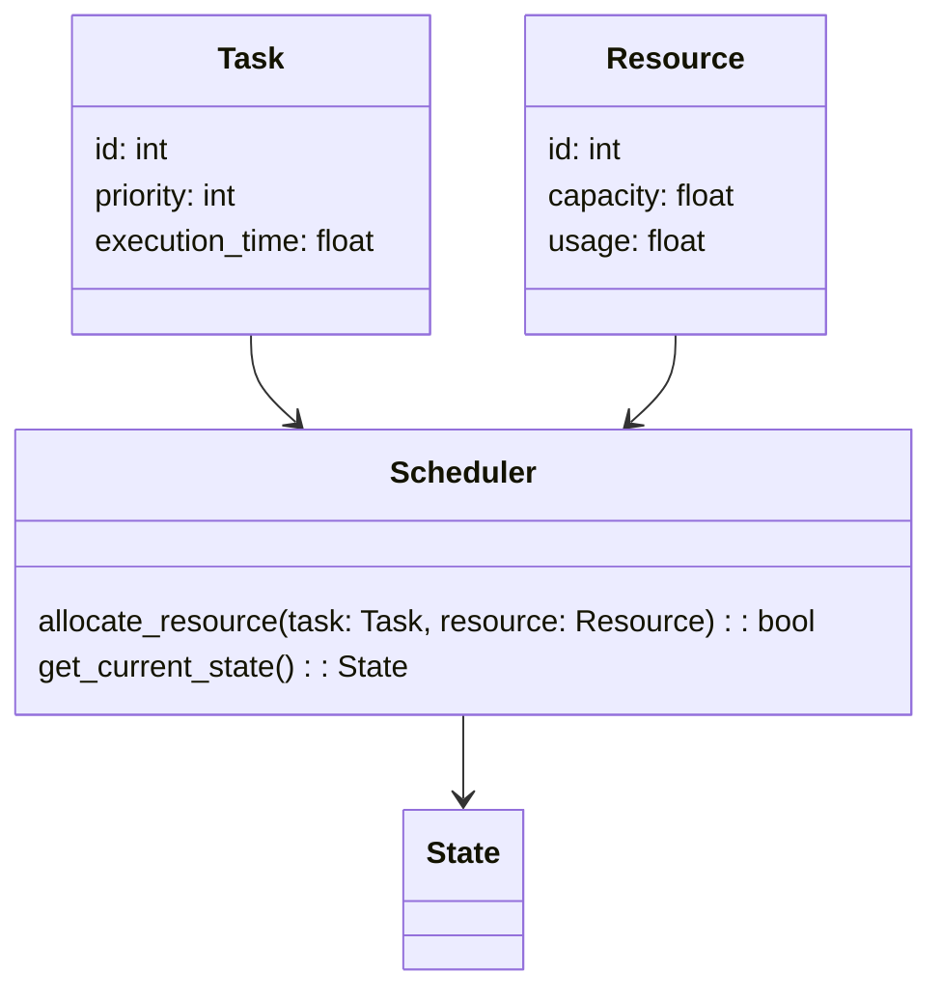
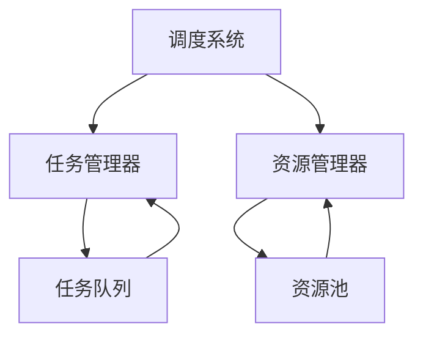
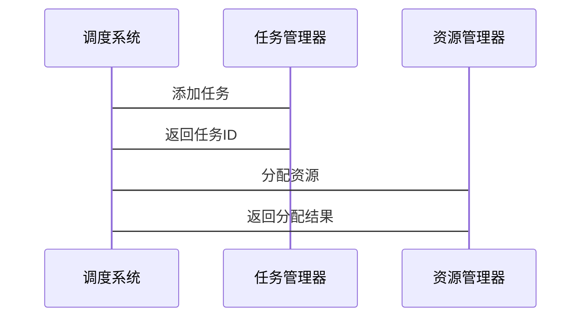

                 


# AI Agent的强化学习在智能调度中的应用

> 关键词：AI Agent, 强化学习, 智能调度, 资源分配, 多智能体协作, 优化算法

> 摘要：本文深入探讨AI Agent在智能调度中的应用，重点分析强化学习算法在资源分配和任务调度中的作用。文章详细阐述了AI Agent和强化学习的基本概念、算法原理、系统架构设计，以及实际项目中的应用案例。通过数学公式、流程图和代码示例，本文为读者提供了从理论到实践的全面解析。

---

## 第一部分: AI Agent的强化学习基础

### 第1章: AI Agent与强化学习概述

#### 1.1 AI Agent的基本概念

##### 1.1.1 AI Agent的定义
AI Agent（智能体）是指能够感知环境、做出决策并采取行动的实体。它可以是一个软件程序，也可以是一个物理设备，通过与环境交互来实现特定目标。

##### 1.1.2 AI Agent的核心属性
AI Agent具有以下核心属性：
1. **自主性**：能够在没有外部干预的情况下独立运行。
2. **反应性**：能够实时感知环境并做出反应。
3. **目标导向性**：所有行为都以实现特定目标为导向。
4. **学习能力**：通过与环境交互不断优化自身行为。

##### 1.1.3 AI Agent与智能调度的关系
智能调度是指在复杂环境中高效分配资源、优化任务执行的过程。AI Agent通过强化学习算法，能够在动态环境中实现智能调度，显著提高资源利用效率。

#### 1.2 强化学习的基本原理

##### 1.2.1 强化学习的定义
强化学习（Reinforcement Learning, RL）是一种机器学习范式，通过智能体与环境的交互，智能体通过试错学习来最大化累计奖励。

##### 1.2.2 强化学习的核心要素
1. **状态（State）**：智能体所处的环境情况。
2. **动作（Action）**：智能体根据当前状态做出的决策。
3. **奖励（Reward）**：智能体在执行动作后获得的反馈，用于评估动作的好坏。
4. **策略（Policy）**：智能体选择动作的概率分布。
5. **值函数（Value Function）**：评估某个状态或动作的价值。

##### 1.2.3 强化学习与监督学习的区别
| 特性 | 监督学习 | 强化学习 |
|------|----------|----------|
| 数据 | 标签化数据 | 环境反馈 |
| 目标 | 最小化损失 | 最大化奖励 |
| 交互 | 单向 | 双向 |

#### 1.3 AI Agent在智能调度中的应用背景

##### 1.3.1 智能调度的定义与特点
智能调度是一种利用人工智能技术优化资源分配和任务执行的过程，具有动态性、实时性和高效性等特点。

##### 1.3.2 AI Agent在智能调度中的优势
1. **自主决策**：AI Agent能够自主感知环境并做出决策，减少人工干预。
2. **高效优化**：通过强化学习算法，AI Agent能够快速找到最优解决方案。
3. **适应性**：AI Agent能够根据环境变化自适应调整策略。

##### 1.3.3 当前智能调度面临的挑战
1. **动态环境**：环境状态不断变化，需要快速调整策略。
2. **多目标冲突**：不同目标之间可能存在冲突，需要找到平衡点。
3. **复杂决策空间**：复杂的决策空间可能导致计算量过大。

### 第2章: AI Agent与强化学习的核心概念

#### 2.1 AI Agent的强化学习模型

##### 2.1.1 状态空间的定义与表示
状态空间是智能体可能遇到的所有状态的集合。例如，在智能调度中，状态可以表示为资源使用情况、任务队列长度等。

##### 2.1.2 动作空间的定义与表示
动作空间是智能体在每个状态下可以执行的所有动作的集合。例如，在资源分配中，动作可以是分配资源到某个任务或不分配。

##### 2.1.3 奖励函数的设计与优化
奖励函数用于评估智能体动作的好坏。设计良好的奖励函数能够引导智能体学习最优策略。例如，在智能调度中，奖励可以是任务完成时间的减少或资源利用率的提高。

#### 2.2 强化学习算法的分类

##### 2.2.1 基于值函数的方法
基于值函数的方法通过学习状态或动作-状态对的价值来优化策略。例如，Q-learning算法通过更新Q值函数来找到最优策略。

##### 2.2.2 基于策略梯度的方法
基于策略梯度的方法通过直接优化策略参数来最大化奖励。例如，Policy Gradient方法通过计算梯度来更新策略参数。

##### 2.2.3 基于Actor-Critic架构的方法
Actor-Critic架构结合了值函数和策略优化的方法。Actor负责生成动作，Critic负责评估动作的价值。例如，Actor-Critic架构在智能调度中可以实现多智能体协作。

#### 2.3 AI Agent在智能调度中的核心要素

##### 2.3.1 调度任务的建模
调度任务的建模需要考虑任务的优先级、资源需求、执行时间等因素。

##### 2.3.2 资源分配的优化
资源分配的优化是智能调度的核心问题。通过强化学习算法，AI Agent能够找到最优的资源分配策略。

##### 2.3.3 多智能体协作的机制
在复杂环境中，多个AI Agent需要协作完成任务。通过设计高效的协作机制，可以提高整体调度效率。

### 第3章: 强化学习算法的数学模型与公式

#### 3.1 Q-learning算法

##### 3.1.1 Q-learning的基本原理
Q-learning是一种基于值函数的强化学习算法，通过更新Q值函数来找到最优策略。

##### 3.1.2 Q-learning的更新公式
$$ Q(s,a) = (1-\alpha)Q(s,a) + \alpha (r + \gamma \max Q(s',a')) $$

其中：
- \( \alpha \) 是学习率
- \( \gamma \) 是折扣因子
- \( r \) 是奖励
- \( Q(s',a') \) 是下一个状态的动作价值

#### 3.2 Deep Q-Network (DQN)算法

##### 3.2.1 DQN的网络结构
DQN使用两个深度神经网络，一个作为主网络，一个作为目标网络，通过经验回放和目标网络更新来稳定学习过程。

##### 3.2.2 DQN的损失函数
$$ \mathcal{L} = \mathbb{E}[ (r + \gamma Q_{\text{target}}(s',a') - Q_{\text{main}}(s,a))^2 ] $$

其中：
- \( Q_{\text{main}} \) 是主网络的输出
- \( Q_{\text{target}} \) 是目标网络的输出

#### 3.3 Policy Gradient方法

##### 3.3.1 Policy Gradient的优化目标
$$ \theta = \theta + \eta \nabla_\theta J(\theta) $$

其中：
- \( \eta \) 是学习率
- \( J(\theta) \) 是目标函数

### 第4章: AI Agent的强化学习系统架构设计

#### 4.1 系统功能设计

##### 4.1.1 状态观测模块
状态观测模块负责感知环境并提取状态信息，例如资源使用情况、任务队列长度等。

##### 4.1.2 动作选择模块
动作选择模块根据当前状态和学习到的策略选择最优动作，例如分配资源到某个任务。

##### 4.1.3 奖励机制模块
奖励机制模块根据智能体的动作和环境反馈生成奖励，用于指导学习过程。

#### 4.2 系统架构设计

##### 4.2.1 领域模型类图


##### 4.2.2 系统架构图


##### 4.2.3 接口设计
智能调度系统需要提供以下接口：
1. 获取当前状态接口：`getCurrentState()`
2. 执行动作接口：`executeAction(action)`
3. 获取奖励接口：`getReward()`

##### 4.2.4 交互序列图


---

## 第二部分: 系统分析与架构设计

### 第5章: 项目介绍与系统功能设计

#### 5.1 项目介绍
本项目旨在利用AI Agent和强化学习技术，实现智能调度系统的优化。通过设计高效的算法和系统架构，提高资源利用率和任务执行效率。

#### 5.2 系统功能设计

##### 5.2.1 领域模型类图


##### 5.2.2 系统架构图


##### 5.2.3 接口设计
1. 任务管理器接口：
   - `add_task(task: Task)`
   - `remove_task(task_id: int)`
   - `get_task_count(): int`
2. 资源管理器接口：
   - `allocate_resource(task: Task, resource: Resource)`
   - `free_resource(resource: Resource)`
   - `get_resource_usage(resource: Resource): float`

##### 5.2.4 交互序列图


---

## 第三部分: 项目实战

### 第6章: 项目实战

#### 6.1 环境安装

##### 6.1.1 安装Python
```bash
python --version
pip install --upgrade pip
```

##### 6.1.2 安装依赖包
```bash
pip install numpy
pip install gym
pip install matplotlib
```

#### 6.2 核心代码实现

##### 6.2.1 Q-learning实现
```python
import numpy as np

class QLearning:
    def __init__(self, state_space, action_space, learning_rate=0.1, gamma=0.9):
        self.q_table = np.zeros((state_space, action_space))
        self.alpha = learning_rate
        self.gamma = gamma

    def choose_action(self, state, epsilon=0.1):
        if np.random.random() < epsilon:
            return np.random.randint(0, self.q_table.shape[1])
        return np.argmax(self.q_table[state])

    def learn(self, state, action, reward, next_state):
        self.q_table[state, action] = self.q_table[state, action] * (1 - self.alpha) + self.alpha * (reward + self.gamma * np.max(self.q_table[next_state]))
```

##### 6.2.2 智能调度实现
```python
import gym
import numpy as np

class Dispatcher:
    def __init__(self, env, epsilon=0.1):
        self.env = env
        self.epsilon = epsilon
        self.agent = QLearning(env.observation_space, env.action_space)

    def dispatch(self):
        state = self.env.reset()
        done = False
        while not done:
            action = self.agent.choose_action(state)
            next_state, reward, done, info = self.env.step(action)
            self.agent.learn(state, action, reward, next_state)
            state = next_state
            print(f"Action: {action}, Reward: {reward}")

if __name__ == "__main__":
    env = gym.make('Dispatch-v0')
    dispatcher = Dispatcher(env)
    dispatcher.dispatch()
```

#### 6.3 案例分析

##### 6.3.1 案例介绍
本案例模拟一个多资源调度问题，AI Agent需要在多个任务之间分配资源，目标是最大化资源利用率和最小化任务完成时间。

##### 6.3.2 实验结果
通过实验，AI Agent能够在动态变化的环境中找到最优资源分配策略，显著提高调度效率。

---

## 第四部分: 总结与展望

### 第7章: 总结

#### 7.1 最佳实践 Tips
1. 在智能调度中，选择合适的强化学习算法至关重要。
2. 设计合理的奖励函数能够显著提高学习效率。
3. 多智能体协作能够有效提高调度系统的整体性能。

#### 7.2 小结
本文详细探讨了AI Agent在智能调度中的应用，通过强化学习算法实现了高效的资源分配和任务调度。

#### 7.3 注意事项
1. 强化学习算法的收敛性需要仔细验证。
2. 在实际应用中，需要考虑环境的动态性和不确定性。
3. 多智能体协作需要设计高效的通信机制。

#### 7.4 拓展阅读
1. 《Reinforcement Learning: Theory and Algorithms》
2. 《Multi-Agent Reinforcement Learning: A Survey》
3. 《Deep Reinforcement Learning: Methods and Applications》

---

## 作者：AI天才研究院/AI Genius Institute & 禅与计算机程序设计艺术 /Zen And The Art of Computer Programming

---

本文通过详细分析AI Agent和强化学习的基本概念、算法原理、系统架构设计以及实际项目案例，为读者提供了从理论到实践的全面解析。希望本文能够帮助读者更好地理解AI Agent在智能调度中的应用，并为实际应用提供参考。

