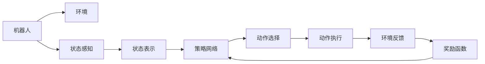

                 


# AI Agent的强化学习在机器人控制中的应用

> **关键词**：强化学习、AI Agent、机器人控制、状态空间、动作空间、奖励函数、策略网络

> **摘要**：本文详细探讨了AI Agent结合强化学习技术在机器人控制中的应用。通过分析强化学习的核心概念、AI Agent的原理及其在机器人控制中的系统架构设计，本文为读者提供了一种实现智能机器人控制的解决方案。文章从理论基础到实际应用，结合代码示例和系统架构图，深入剖析了强化学习算法在机器人控制中的实现细节，为相关领域的研究者和工程师提供了有价值的参考。

---

## 第一部分: 强化学习与AI Agent基础

### 第1章: 强化学习与AI Agent概述

#### 1.1 强化学习的基本概念

- **1.1.1 强化学习的定义与特点**
  - 强化学习（Reinforcement Learning, RL）是一种通过试错机制来学习最优策略的机器学习方法。
  - 特点：基于环境反馈（奖励或惩罚）调整行为，无需监督数据，适合动态和不确定环境。

- **1.1.2 强化学习的核心要素**
  - **状态（State）**：环境的当前情况，如机器人所在位置、目标位置。
  - **动作（Action）**：AI Agent采取的行为，如移动、旋转。
  - **奖励（Reward）**：环境对动作的反馈，用于指导AI Agent的行为选择。

- **1.1.3 强化学习与监督学习的区别**
  - 监督学习：基于标记数据，学习函数或分类。
  - 强化学习：基于奖励机制，学习策略。

#### 1.2 AI Agent的定义与特点

- **1.2.1 AI Agent的定义**
  - AI Agent：能够感知环境、自主决策并采取行动的智能体。
  - 特点：自主性、反应性、目标导向、社交能力。

- **1.2.2 AI Agent的核心特征**
  - 状态感知：通过传感器获取环境信息。
  - 决策逻辑：基于强化学习算法做出决策。
  - 行为执行：通过执行机构采取动作。

- **1.2.3 AI Agent与传统自动控制系统的区别**
  - 传统控制系统：基于预定义规则，被动响应。
  - AI Agent：主动学习，动态优化行为。

#### 1.3 强化学习在AI Agent中的应用背景

- **1.3.1 机器人控制的复杂性**
  - 机器人需要应对动态环境和不确定性。
  - 需要实时决策和行为调整。

- **1.3.2 强化学习在机器人控制中的优势**
  - 能够处理复杂非结构化环境。
  - 通过试错优化行为，无需大量标记数据。

- **1.3.3 AI Agent与强化学习的结合**
  - 强化学习为AI Agent提供决策策略。
  - AI Agent为强化学习提供状态感知和行为执行。

---

## 第2章: 强化学习的核心概念与数学模型

### 2.1 强化学习的基本原理

#### 2.1.1 状态空间与动作空间

- **状态空间（State Space）**：所有可能的状态的集合。
- **动作空间（Action Space）**：所有可能的动作的集合。

#### 2.1.2 奖励函数的设计

- 奖励函数（Reward Function）：定义在状态和动作上的函数，指导AI Agent的行为选择。
  - 示例：$r(s, a) = 1$ 如果动作$a$帮助达到目标，否则$-1$。

#### 2.1.3 策略与价值函数

- **策略（Policy）**：AI Agent在给定状态下选择动作的概率分布。
  - 策略网络：$ \pi_\theta(a|s) = \text{softmax}(Q_\theta(s,a)) $。
- **价值函数（Value Function）**：评估状态或状态-动作对的价值。
  - Q-value：$ Q(s,a) = r + \gamma \max_{a'} Q(s',a') $。

### 2.2 Q-learning算法的数学模型

#### 2.2.1 Q-learning的更新公式

$$ Q(s,a) = (1-\alpha)Q(s,a) + \alpha(r + \gamma \max Q(s',a')) $$

- $\alpha$：学习率。
- $\gamma$：折扣因子，平衡当前奖励和未来奖励。

#### 2.2.2 Q-learning的收敛性分析

- 稳定性：在离散、有限状态空间中，Q-learning收敛到最优策略。
- 收敛速度：取决于环境的探索策略和学习率。

### 2.3 AI Agent中的策略网络

#### 2.3.1 策略梯度方法

- **策略梯度（Policy Gradient）**：直接优化策略，而非Q值。
  - 算法：REINFORCE、Actor-Critic。
  - 示例：梯度上升，最大化目标函数。

#### 2.3.2 策略网络的数学表达

$$ \pi_\theta(a|s) = \text{softmax}(Q_\theta(s,a)) $$

---

## 第3章: 强化学习与AI Agent的系统架构设计

### 3.1 系统功能设计

#### 3.1.1 状态感知模块

- **传感器输入**：获取环境信息。
  - 示例：激光雷达、摄像头、红外传感器。
- **状态转换**：将传感器数据转换为状态表示。

#### 3.1.2 动作执行模块

- **动作选择**：基于策略网络选择动作。
- **执行机构**：机器人执行动作，如移动、旋转。

#### 3.1.3 环境交互模块

- **环境接口**：与机器人周围环境进行交互。
- **反馈机制**：接收环境反馈，调整策略。

### 3.2 系统架构设计

#### 3.2.1 系统架构图



#### 3.2.2 系统功能流程

- 状态感知：传感器数据 → 状态表示。
- 动作选择：策略网络 → 动作。
- 环境交互：执行动作 → 环境反馈。
- 模型更新：奖励函数 → 更新策略网络。

---

## 第4章: 项目实战与应用分析

### 4.1 项目环境安装

- **工具安装**：安装Python、TensorFlow、Keras、Mermaid。
- **依赖管理**：使用虚拟环境管理依赖。

### 4.2 核心代码实现

#### 4.2.1 强化学习算法实现

```python
import numpy as np

class QLearning:
    def __init__(self, state_space, action_space, alpha=0.1, gamma=0.9):
        self.q_table = np.zeros((state_space, action_space))
        self.alpha = alpha
        self.gamma = gamma

    def choose_action(self, state, epsilon=0.1):
        if np.random.random() < epsilon:
            return np.random.randint(0, self.q_table.shape[1])
        else:
            return np.argmax(self.q_table[state])

    def update_q(self, state, action, reward, next_state):
        self.q_table[state, action] = self.q_table[state, action] * (1 - self.alpha) + self.alpha * (reward + self.gamma * np.max(self.q_table[next_state]))
```

#### 4.2.2 AI Agent实现

```python
from q_learning import QLearning

class AI-Agent:
    def __init__(self, state_space, action_space, alpha=0.1, gamma=0.9):
        self.qlearning = QLearning(state_space, action_space, alpha, gamma)

    def act(self, state):
        return self.qlearning.choose_action(state)

    def update(self, state, action, reward, next_state):
        self.qlearning.update_q(state, action, reward, next_state)
```

### 4.3 案例分析与应用解读

- **案例背景**：设计一个智能家居清洁机器人，目标是在复杂的家庭环境中高效清洁。
- **系统实现**：
  - 状态感知：基于摄像头和传感器识别障碍物。
  - 动作选择：根据Q-learning算法选择移动方向。
  - 环境交互：机器人移动并感知清洁效果。

### 4.4 项目小结

- **实现成果**：成功实现了一个基于强化学习的AI Agent，能够自主决策机器人动作。
- **优化方向**：引入深度强化学习（如DQN）提高复杂环境下的表现。

---

## 第5章: 最佳实践与总结

### 5.1 小结

- 强化学习与AI Agent的结合为机器人控制提供了新的解决方案。
- Q-learning和策略梯度方法是实现AI Agent的核心算法。

### 5.2 注意事项

- **环境设计**：确保测试环境的多样性，避免过拟合。
- **算法选择**：根据任务需求选择合适的算法。
- **参数调优**：合理设置学习率和折扣因子。

### 5.3 拓展阅读

- 《Deep Reinforcement Learning for Robotics》
- 《Reinforcement Learning: Theory and Algorithms》

---

## 作者

**作者：AI天才研究院/AI Genius Institute & 禅与计算机程序设计艺术 /Zen And The Art of Computer Programming**

---

本文通过系统地分析强化学习与AI Agent的结合，为机器人控制提供了一种智能化的解决方案。从理论到实践，结合代码示例和系统架构图，深入剖析了强化学习算法在机器人控制中的实现细节，为相关领域的研究者和工程师提供了有价值的参考。

