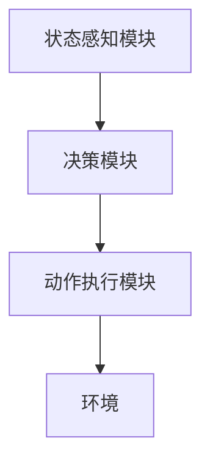

                 


# AI Agent的强化学习在游戏AI中的应用

## 关键词：
AI Agent，强化学习，游戏AI，深度强化学习，DQN，Q-learning

## 摘要：
本文系统地探讨了AI Agent在游戏AI中的应用，特别是强化学习技术的原理、算法和实现。通过详细分析强化学习的核心概念、算法原理、环境设计、系统架构和项目实战，本文为读者提供了从理论到实践的全面指南，帮助读者理解并掌握AI Agent在游戏AI中的应用。

---

# 第1章: AI Agent与强化学习概述

## 1.1 AI Agent的基本概念
### 1.1.1 什么是AI Agent
AI Agent（智能体）是指在环境中能够感知并自主行动以实现目标的实体。AI Agent可以是软件程序、机器人或其他智能系统，其核心目标是通过感知环境、做出决策并执行动作来实现特定任务。

### 1.1.2 AI Agent的分类
AI Agent可以根据智能水平分为：
1. **反应式Agent**：基于当前环境状态做出反应，不依赖历史信息。
2. **认知式Agent**：具备复杂推理和规划能力，能够处理长期目标。
3. **学习式Agent**：通过与环境互动学习，改进自身行为策略。

### 1.1.3 强化学习的基本概念
强化学习（Reinforcement Learning, RL）是一种机器学习范式，通过智能体在环境中采取行动，以最大化累计奖励。智能体通过试错方式优化策略，最终实现目标。

## 1.2 强化学习的核心原理
### 1.2.1 状态、动作、奖励的定义
- **状态（State）**：智能体对环境的感知，表示当前环境的情况。
- **动作（Action）**：智能体基于当前状态做出的决策。
- **奖励（Reward）**：智能体执行动作后，环境给予的反馈，指导智能体行为。

### 1.2.2 马尔可夫决策过程
马尔可夫决策过程（Markov Decision Process, MDP）是强化学习的核心模型，定义了智能体与环境的交互过程：
- **状态空间（State Space）**：所有可能的状态集合。
- **动作空间（Action Space）**：所有可能的动作集合。
- **转移概率（Transition Probability）**：从当前状态执行动作后转移到下一个状态的概率。
- **奖励函数（Reward Function）**：定义智能体执行动作后获得的奖励。

### 1.2.3 策略与价值函数
- **策略（Policy）**：智能体选择动作的概率分布。
- **价值函数（Value Function）**：评估状态或状态-动作对的长期收益。

## 1.3 游戏AI中的强化学习应用
### 1.3.1 游戏AI的基本需求
游戏AI需要具备以下能力：
1. **感知能力**：获取游戏环境信息。
2. **决策能力**：基于当前状态做出最优动作。
3. **学习能力**：通过与环境互动优化行为策略。

### 1.3.2 强化学习在游戏AI中的优势
- **自主学习**：无需大量人工标注数据。
- **适应性**：能够根据环境变化自适应调整策略。
- **最优性**：通过强化学习训练的AI Agent可以在复杂环境中实现接近最优的决策。

### 1.3.3 实际案例分析
- **经典案例1**：AI Agent在迷宫中的导航。
- **经典案例2**：AI Agent在棋类游戏中的应用。

---

# 第2章: 强化学习的核心算法

## 2.1 Q-learning算法
### 2.1.1 Q-learning的基本原理
Q-learning是一种基于值函数的强化学习算法，通过学习状态-动作对的Q值来优化决策。

#### Q-learning的数学模型
$$ Q(s, a) = Q(s, a) + \alpha [r + \gamma \max Q(s', a') - Q(s, a)] $$
其中：
- \( Q(s, a) \)：当前状态-动作对的Q值。
- \( \alpha \)：学习率。
- \( r \)：获得的奖励。
- \( \gamma \)：折扣因子。
- \( s' \)：下一个状态。

### 2.1.2 Q-learning在游戏AI中的应用
- **应用案例**：迷宫导航中的路径规划。
- **实现步骤**：
  1. 初始化Q表。
  2. 选择动作。
  3. 执行动作并获得奖励。
  4. 更新Q表。

## 2.2 Deep Q-Network (DQN)算法
### 2.2.1 DQN的基本原理
DQN是Q-learning的深度学习版本，通过神经网络近似Q值函数。

#### DQN的网络结构
- **输入层**：接收环境状态。
- **隐藏层**：提取特征。
- **输出层**：输出每个动作的Q值。

### 2.2.2 DQN的数学模型
$$ Q(s, a) = \theta \cdot \phi(s, a) $$
其中：
- \( \theta \)：神经网络参数。
- \( \phi(s, a) \)：特征函数。

### 2.2.3 DQN在游戏AI中的实现
- **训练流程**：
  1. 环境初始化。
  2. 选择动作。
  3. 执行动作并记录经验。
  4. 更新神经网络。

## 2.3 算法对比与选择
### 2.3.1 Q-learning与DQN的对比
| 特性         | Q-learning                | DQN                   |
|--------------|---------------------------|-----------------------|
| 表示能力     | 离散Q表                   | 神经网络近似           |
| 状态空间     | 离散                      | 离散或连续             |
| 动作空间     | 离散                      | 离散或连续             |

### 2.3.2 其他强化学习算法简介
- **策略梯度法（Policy Gradient）**：直接优化策略。
- **Actor-Critic方法**：结合策略和价值函数。

### 2.3.3 游戏AI中算法选择的考虑因素
- **环境复杂度**：复杂环境适合DQN。
- **计算资源**：深度算法需要更多资源。
- **任务目标**：路径规划适合Q-learning，复杂决策适合DQN。

---

# 第3章: 游戏AI的强化学习环境设计

## 3.1 游戏环境的定义
### 3.1.1 状态空间的设计
- **迷宫导航**：迷宫的网格状态。
- **游戏关卡**：关卡中的游戏状态。

### 3.1.2 动作空间的设计
- **迷宫导航**：上下左右移动。
- **游戏关卡**：攻击、移动、使用道具。

## 3.2 奖励机制的设计
### 3.2.1 奖励函数的定义
- **迷宫导航**：到达终点奖励+1，碰撞障碍物惩罚-1。
- **游戏关卡**：击败敌人奖励+1，失败惩罚-1。

### 3.2.2 奖励设计的原则
- **明确性**：奖励应明确指导智能体行为。
- **合理性**：奖励不应过于复杂或矛盾。
- **平衡性**：正向和负向奖励应平衡。

### 3.2.3 奖励机制对学习效果的影响
- **过度惩罚**：可能导致智能体不敢尝试新动作。
- **奖励稀疏**：可能需要更多探索。

---

# 第4章: 系统分析与架构设计

## 4.1 游戏AI的系统架构
### 4.1.1 系统功能设计
- **状态感知模块**：接收环境信息。
- **决策模块**：执行强化学习算法。
- **动作执行模块**：输出动作指令。

### 4.1.2 系统架构图


### 4.1.3 接口设计
- **输入接口**：接收环境状态。
- **输出接口**：发送动作指令。

---

# 第5章: 项目实战

## 5.1 项目介绍
### 5.1.1 项目目标
训练一个AI Agent在迷宫中导航，从起点到达终点。

## 5.2 环境配置
### 5.2.1 环境描述
迷宫由网格构成，起点为(0,0)，终点为(n-1,n-1)，障碍物随机分布。

### 5.2.2 环境实现
```python
import numpy as np

class MazeEnvironment:
    def __init__(self, size):
        self.size = size
        self.goal = (size-1, size-1)
        self.obstacles = self.generate_obstacles()
    
    def generate_obstacles(self):
        # 随机生成障碍物
        obstacles = []
        for _ in range(int(self.size/2)):
            x, y = np.random.randint(0, self.size, 2)
            obstacles.append((x, y))
        return obstacles

    # 其他方法省略
```

## 5.3 系统核心实现
### 5.3.1 DQN算法实现
```python
class DQN:
    def __init__(self, state_space, action_space):
        self.state_space = state_space
        self.action_space = action_space
        # 初始化神经网络

    def act(self, state):
        # 根据当前状态选择动作

    def remember(self, experience):
        # 存储经验

    def replay(self, batch_size):
        # 回放记忆并更新神经网络
```

### 5.3.2 训练循环
```python
def train(agent, environment, episodes=1000):
    for episode in range(episodes):
        state = environment.reset()
        while True:
            action = agent.act(state)
            next_state, reward, done = environment.step(action)
            agent.remember((state, action, reward, next_state, done))
            agent.replay(BATCH_SIZE)
            state = next_state
            if done:
                break
```

## 5.4 实际案例分析
### 5.4.1 训练过程
- 初始化DQN网络。
- 执行训练循环。
- 监控训练过程中的奖励和损失。

### 5.4.2 训练结果分析
- **收敛性**：训练曲线展示奖励随训练步数的变化。
- **策略评估**：评估智能体的导航成功率。

---

# 第6章: 总结与展望

## 6.1 总结
### 6.1.1 核心内容回顾
- AI Agent的基本概念。
- 强化学习的核心算法。
- 游戏AI的环境设计。
- 项目实战经验。

## 6.2 未来展望
### 6.2.1 多智能体协作
- 多智能体协同工作，提升任务效率。

### 6.2.2 更复杂的任务
- 应用强化学习解决更复杂的任务。

## 6.3 最佳实践 tips
- **算法选择**：根据任务需求选择合适的强化学习算法。
- **环境设计**：合理设计状态和动作空间，明确奖励机制。
- **训练优化**：优化超参数，使用经验回放等技术提升训练效率。

---

作者：AI天才研究院 & 禅与计算机程序设计艺术

---

以上是《AI Agent的强化学习在游戏AI中的应用》的详细目录和内容大纲，涵盖了从基础概念到实际应用的各个方面，适合技术读者深入学习和实践。

