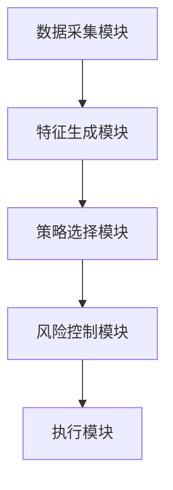
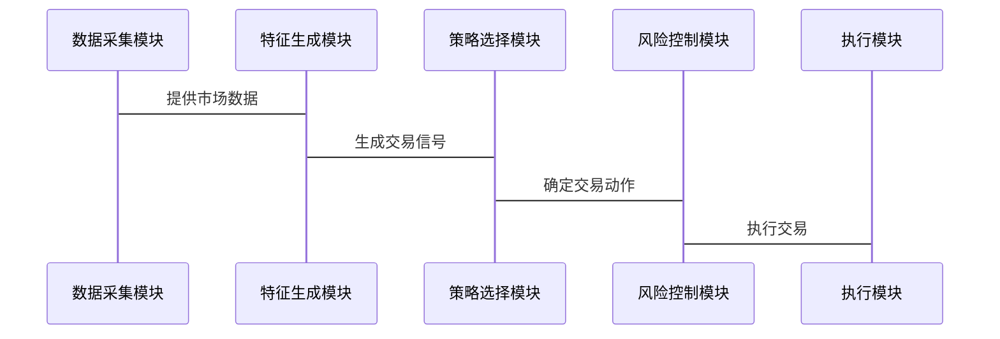
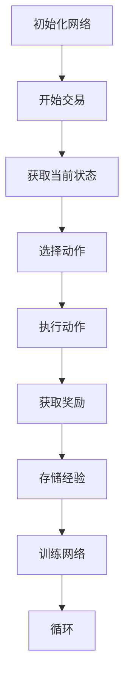

                 


# AI Agent的强化学习在自动化交易中的应用

> 关键词：AI Agent，强化学习，自动化交易，金融投资，机器学习，交易策略

> 摘要：本文深入探讨AI Agent如何通过强化学习技术实现金融市场的自动化交易。从强化学习的基本原理到AI Agent的结构设计，再到实际的系统架构和算法实现，系统性地分析了AI Agent在金融交易中的应用。通过具体案例分析和算法实现，展示了如何利用强化学习训练AI Agent进行智能交易策略的制定与优化，为自动化交易的研究和实践提供了有价值的参考。

---

# 第1章: AI Agent与强化学习概述

## 1.1 AI Agent的基本概念

### 1.1.1 AI Agent的定义与特点

AI Agent（人工智能代理）是一种能够感知环境、做出决策并执行动作的智能实体。在金融交易中，AI Agent可以是一个算法程序，它通过分析市场数据来制定交易策略并执行交易。与传统算法交易不同，AI Agent具备更强的自主决策能力，能够根据市场变化动态调整策略。

**特点：**
1. **自主性**：AI Agent能够在没有人工干预的情况下独立运行。
2. **反应性**：能够实时感知市场环境并做出反应。
3. **学习能力**：通过强化学习等技术不断优化自身的交易策略。
4. **可扩展性**：能够处理大规模的金融数据并快速做出决策。

### 1.1.2 强化学习的基本概念

强化学习（Reinforcement Learning，RL）是一种机器学习范式，其中智能体通过与环境互动来学习策略以最大化累积奖励。与监督学习不同，强化学习不需要明确的标签数据，而是通过与环境的交互获得奖励信号来指导学习过程。

**核心要素：**
1. **状态（State）**：环境当前的状况，例如市场的价格走势、交易量等。
2. **动作（Action）**：智能体在给定状态下采取的行动，例如买入、卖出或持有。
3. **奖励（Reward）**：智能体采取某个动作后获得的反馈，通常表现为收益或损失。

### 1.1.3 强化学习与监督学习的区别

| 对比项          | 监督学习                | 强化学习                |
|-----------------|-------------------------|-------------------------|
| 数据来源        | 标签数据                | 奖励信号                |
| 决策依据        | 标签是否正确             | 奖励值的大小             |
| 交互方式        | 非实时交互              | 实时交互                |
| 适用场景        | 分类、回归等             | 控制、游戏、交易等        |

### 1.1.4 强化学习在金融交易中的优势

1. **自适应性**：能够根据市场变化动态调整策略。
2. **高效性**：通过算法快速处理大量数据，提高交易效率。
3. **复杂决策**：能够处理多变量的复杂决策问题。

## 1.2 强化学习的核心概念

### 1.2.1 状态、动作与奖励

在金融交易中，状态可以表示为市场数据，例如股票价格、成交量等；动作可以是买入、卖出或持有；奖励可以是交易的收益或损失。

### 1.2.2 马尔可夫决策过程（MDP）

MDP是一种数学模型，描述了智能体在不确定环境中的决策过程。MDP由以下五个元素组成：

1. **状态空间（S）**：所有可能的状态集合。
2. **动作空间（A）**：所有可能的动作集合。
3. **转移概率（P(s'|s,a)）**：在状态s下执行动作a后转移到状态s'的概率。
4. **奖励函数（R(s,a)）**：在状态s下执行动作a后获得的奖励。
5. **折扣因子（γ）**：对未来奖励的折扣因子，通常在0到1之间。

### 1.2.3 策略与价值函数

- **策略（Policy）**：描述智能体在每个状态下选择动作的概率分布。
- **价值函数（Value Function）**：评估某个状态下采取某种策略的期望收益。

---

# 第2章: 强化学习的数学基础

## 2.1 马尔可夫决策过程（MDP）

### 2.1.1 状态空间与动作空间

在金融交易中，状态空间可以包括股票价格、成交量、技术指标等。动作空间则包括买入、卖出或持有。

### 2.1.2 转移概率与奖励函数

转移概率描述了在当前状态下采取某个动作后转移到下一个状态的概率。奖励函数则描述了在当前状态下采取某个动作后获得的奖励。

### 2.1.3 策略与价值函数的数学表达

策略π(a|s)表示在状态s下采取动作a的概率。价值函数V(s)表示在状态s下采取最优策略的期望奖励。

## 2.2 Q-learning算法

### 2.2.1 Q-learning的基本原理

Q-learning是一种基于值函数的强化学习算法，通过更新Q值表来学习最优策略。Q值表记录了每个状态-动作对的期望奖励。

### 2.2.2 Q值更新公式

$$ Q(s, a) = Q(s, a) + \alpha [r + \gamma \max Q(s', a') - Q(s, a)] $$

其中，α是学习率，γ是折扣因子。

### 2.2.3 探索与利用策略

为了平衡探索和利用，Q-learning通常采用ε-greedy策略。ε表示以ε的概率随机选择动作（探索），以1-ε的概率选择Q值最大的动作（利用）。

### 2.3 Deep Q-Networks（DQN）

### 2.3.1 DQN的网络结构

DQN使用两个深度神经网络，一个作为主网络，一个作为目标网络。主网络用于选择动作，目标网络用于计算目标Q值。

### 2.3.2 经验回放机制

经验回放通过存储之前的状态-动作-奖励-状态（SARSA）经验，随机抽取进行训练，以打破时间相关性并加速收敛。

### 2.3.3 DQN的训练过程

1. 从经验回放池中随机抽取一批经验。
2. 计算当前状态和目标状态的Q值。
3. 使用贝尔曼方程更新Q值。

## 2.4 策略梯度方法

### 2.4.1 策略梯度的基本原理

策略梯度方法直接优化策略，通过梯度 ascent 更新参数θ。

### 2.4.2 REINFORCE算法

REINFORCE算法通过采样策略πθ(a|s)来更新参数θ，公式如下：

$$ \nabla_{\theta} \mathbb{E}_{\pi_\theta} [R] = \mathbb{E}_{\pi_\theta} [\nabla_{\theta} \log \pi_\theta(a|s) \cdot Q(s,a)] $$

### 2.4.3 Actor-Critic架构

Actor-Critic结合了策略梯度和值函数的优势，通过Actor网络优化策略，Critic网络评估价值函数。

---

# 第3章: AI Agent在金融交易中的应用

## 3.1 金融市场的数据与特征

### 3.1.1 常用金融数据类型

- **时间序列数据**：股票价格、指数、成交量等。
- **技术指标**：RSI、MACD、布林带等。
- **市场情绪数据**：新闻、社交媒体情绪等。

### 3.1.2 特征工程与数据预处理

- **标准化**：将数据标准化到均值为0，方差为1。
- **归一化**：将数据归一化到0-1范围。
- **滑动窗口**：计算窗口内的均值、最大值等。

### 3.1.3 市场状态的表示方法

- **状态向量**：包括当前价格、技术指标等。
- **因子分解**：将市场状态分解为多个因子。

## 3.2 AI Agent的交易策略

### 3.2.1 基于强化学习的交易策略

- **买卖信号**：根据Q值或策略网络输出决定买卖。
- **风险管理**：通过调整仓位大小控制风险。

### 3.2.2 策略的评价指标

- **收益**：策略的净收益。
- **风险调整后收益**：夏普比率、卡玛比率等。
- **最大回撤**：策略的最大回撤幅度。

### 3.2.3 策略的风险控制

- **止损**：设定最大损失比例。
- **止盈**：设定最大收益比例。
- **仓位控制**：根据市场波动调整仓位。

## 3.3 环境设计与模拟

### 3.3.1 交易环境的构建

- **状态空间**：市场数据、技术指标等。
- **动作空间**：买入、卖出、持有。
- **奖励函数**：收益或损失。

### 3.3.2 环境模拟

- **回测**：在历史数据上模拟交易策略。
- **前瞻测试**：在模拟数据上测试策略。

### 3.3.3 环境的动态变化

- **市场波动**：价格的波动性变化。
- **市场情绪**：投资者情绪的变化。

---

# 第4章: 系统架构与算法实现

## 4.1 系统架构设计

### 4.1.1 系统功能模块

- **数据采集模块**：采集实时市场数据。
- **特征生成模块**：生成交易信号。
- **策略选择模块**：基于强化学习选择动作。
- **风险控制模块**：控制交易风险。
- **执行模块**：执行交易指令。

### 4.1.2 系统架构图



### 4.1.3 系统接口设计

- **数据接口**：与数据源的接口，如交易所API。
- **策略接口**：与其他策略或系统交互的接口。

### 4.1.4 系统交互流程



## 4.2 算法实现细节

### 4.2.1 DQN算法实现

```python
class DQNAgent:
    def __init__(self, state_space, action_space):
        self.state_space = state_space
        self.action_space = action_space
        # 初始化主网络和目标网络
        self.main_network = ...
        self.target_network = ...
        self.memory = ...
        self.batch_size = ...
        self.gamma = ...
        self.epsilon = ...

    def act(self, state):
        # 根据当前状态选择动作
        if random.random() < self.epsilon:
            return random.choice(self.action_space)
        else:
            return np.argmax(self.main_network.predict(state))

    def remember(self, state, action, reward, next_state):
        # 存储经验
        self.memory.append((state, action, reward, next_state))

    def replay(self):
        # 从经验池中随机抽取一批经验进行训练
        batch = random.sample(self.memory, self.batch_size)
        # 计算目标Q值
        next_states = np.array([x[3] for x in batch])
        q_next = self.target_network.predict(next_states)
        q_target = [x[2] + self.gamma * np.max(q_next[i]) for i, x in enumerate(batch)]
        # 训练主网络
        self.main_network.fit(..., ...)
```

### 4.2.2 策略网络实现

```python
class PolicyNetwork:
    def __init__(self, input_dim, output_dim):
        self.model = Sequential([
            Dense(64, activation='relu', input_dim=input_dim),
            Dense(64, activation='relu'),
            Dense(output_dim, activation='softmax')
        ])
        self.model.compile(optimizer='adam', loss='sparse_categorical_crossentropy')

    def predict(self, state):
        return self.model.predict(state)

    def train(self, states, actions, rewards):
        self.model.fit(states, actions, epochs=1, verbose=0)
```

### 4.2.3 算法流程图



---

# 第5章: 项目实战与案例分析

## 5.1 环境安装与配置

### 5.1.1 安装依赖

```bash
pip install numpy pandas keras tensorflow
```

### 5.1.2 数据获取

```python
import pandas as pd
data = pd.read_csv('stock_data.csv')
```

## 5.2 核心实现

### 5.2.1 数据预处理

```python
from sklearn.preprocessing import StandardScaler
scaler = StandardScaler()
scaled_data = scaler.fit_transform(data)
```

### 5.2.2 训练过程

```python
agent = DQNAgent(state_space, action_space)
for episode in range(num_episodes):
    state = get_current_state()
    action = agent.act(state)
    next_state = get_next_state(action)
    reward = calculate_reward(state, action, next_state)
    agent.remember(state, action, reward, next_state)
    agent.replay()
```

### 5.2.3 结果分析

```python
import matplotlib.pyplot as plt
plt.plot(rewards)
plt.xlabel('Episode')
plt.ylabel('Reward')
plt.show()
```

## 5.3 案例分析

### 5.3.1 数据集选择

选择一个股票数据集，例如苹果股票的历史数据。

### 5.3.2 训练与回测

训练AI Agent在历史数据上进行回测，计算策略的收益和风险指标。

### 5.3.3 结果优化

根据回测结果调整策略参数，优化收益和风险比。

---

# 第6章: 高级主题与未来展望

## 6.1 多智能体协作

在复杂的金融市场中，多个AI Agent可以协作完成不同的任务，例如市场监控、风险预警等。

## 6.2 在线学习与自适应

金融市场环境不断变化，AI Agent需要具备在线学习能力，能够实时适应市场变化。

## 6.3 模型解释性

强化学习模型通常是一个黑箱，如何提高模型的解释性是未来研究的重要方向。

## 6.4 未来研究方向

- **多智能体协作**：研究多个AI Agent在金融市场的协作机制。
- **可解释性**：提高强化学习模型的可解释性。
- **实时交易**：优化算法，提高交易速度和准确性。

---

# 作者：AI天才研究院 & 禅与计算机程序设计艺术

