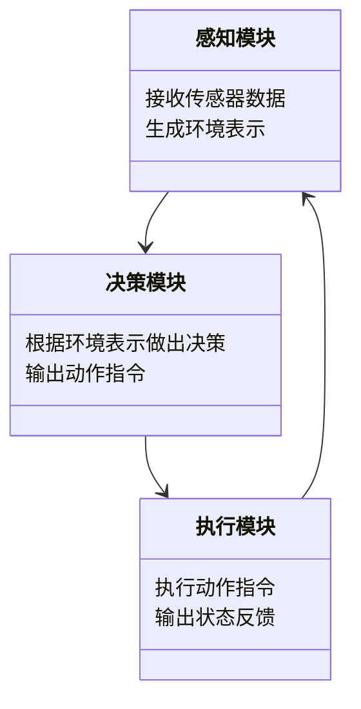
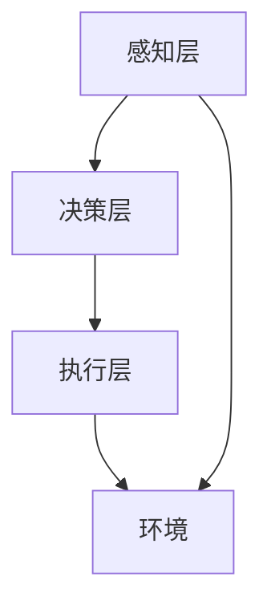

                 


# AI Agent的强化学习在自动驾驶中的应用

---

## 关键词：AI Agent、强化学习、自动驾驶、深度学习、Q-learning、马尔可夫决策过程

---

## 摘要：  
本文深入探讨了AI Agent在自动驾驶中的强化学习应用，从强化学习的基本概念到其在自动驾驶系统中的实际应用进行了全面分析。文章首先介绍了强化学习的核心原理，包括马尔可夫决策过程（MDP）、Q-learning算法和策略梯度方法。接着，详细阐述了自动驾驶的基本架构、感知技术与决策过程。随后，重点分析了AI Agent在自动驾驶中的角色与应用，包括状态感知、行为规划与多目标优化。文章还通过数学模型与系统架构图，详细解释了强化学习算法的实现与优化。最后，结合实际项目案例，展示了如何通过强化学习实现自动驾驶系统的优化与提升。本文旨在为读者提供一个全面而深入的视角，理解AI Agent的强化学习在自动驾驶技术中的重要性与应用前景。

---

## 第1章: 强化学习概述

### 1.1 强化学习的基本概念  
强化学习（Reinforcement Learning, RL）是一种机器学习范式，通过智能体与环境的交互，学习如何做出决策以最大化累计奖励。与监督学习和无监督学习不同，强化学习的核心在于通过试错和反馈机制来优化策略。

#### 1.1.1 什么是强化学习  
强化学习是一种基于试错的学习方法，智能体通过与环境交互，获得奖励或惩罚信号，从而调整自身行为以达到目标。  

**特点：**  
1. **目标导向性**：智能体的行为以最大化累计奖励为目标。  
2. **环境交互性**：智能体通过感知环境状态，做出动作，改变环境状态。  
3. **延迟回报**：奖励可能在多个动作之后才给出，需要智能体具备长期规划能力。  

#### 1.1.2 强化学习的核心要素  
强化学习系统由以下四个核心要素组成：  
1. **状态（State）**：环境在某一时刻的观测信息。  
2. **动作（Action）**：智能体在某一状态下选择的行为。  
3. **奖励（Reward）**：智能体做出动作后，环境给予的反馈，用于指导学习。  
4. **策略（Policy）**：智能体选择动作的规则，通常表示为状态到动作的映射。  

#### 1.1.3 强化学习与监督学习的区别  
| 特性 | 监督学习 | 强化学习 |
|------|----------|----------|
| 数据 | 标签化数据 | 状态和奖励 |
| 目标 | 最小化预测误差 | 最大化累计奖励 |
| 反馈 | 立即反馈 | 延迟反馈 |
| 应用 | 分类、回归 | 游戏、机器人控制 |

---

### 1.2 马尔可夫决策过程（MDP）  
马尔可夫决策过程是强化学习的基础模型，描述了智能体与环境的交互过程。

#### 1.2.1 状态、动作和奖励的定义  
- **状态（State）**：系统在某一时刻的状况，例如自动驾驶车辆的传感器数据。  
- **动作（Action）**：智能体在某一状态下做出的行为，例如转向或加速。  
- **奖励（Reward）**：环境对智能体动作的反馈，例如安全行驶给予正奖励，碰撞给予负奖励。  

#### 1.2.2 策略与价值函数  
- **策略（Policy）**：表示智能体在状态s下选择动作a的概率分布。  
- **价值函数（Value Function）**：衡量某个状态或动作的价值，帮助智能体做出决策。  

#### 1.2.3 探索与利用的平衡  
智能体需要在探索新动作和利用已知最优动作之间找到平衡。  

---

### 1.3 强化学习的算法分类  
强化学习算法主要分为基于值函数的方法和基于策略梯度的方法。

#### 1.3.1 Q-learning算法  
Q-learning是一种经典的强化学习算法，通过更新Q值表来学习最优策略。  

**公式：**  
$$ Q(s, a) = Q(s, a) + \alpha [r + \max_{a'} Q(s', a') - Q(s, a)] $$  

#### 1.3.2 策略梯度方法  
策略梯度方法直接优化策略，通过计算梯度更新参数。  

**公式：**  
$$ \theta = \theta + \alpha \nabla_\theta J(\theta) $$  

#### 1.3.3 近端与远端策略优化  
- **近端策略优化**：在策略附近进行优化，如TRPO和PPO。  
- **远端策略优化**：直接更新策略，如DQN和Actor-Critic方法。  

---

### 1.4 本章小结  
本章介绍了强化学习的基本概念、核心要素以及主要算法，为后续章节奠定了理论基础。

---

## 第2章: 自动驾驶概述  

### 2.1 自动驾驶的定义与技术架构  
自动驾驶（Autonomous Driving）是指车辆能够通过传感器和计算系统，实现自主行驶的技术。  

#### 2.1.1 自动驾驶的分级标准  
根据国际标准ISO 21448，自动驾驶分为L0到L5六个等级。  

| 等级 | 描述 |
|------|------|
| L0  | 完全依赖人类驾驶 |
| L1  | 辅助驾驶，如自适应巡航 |
| L2  | 部分自动驾驶，如车道保持和自适应巡航 |
| L3  | 有条件自动驾驶，系统在特定条件下接管 |
| L4  | 高度自动驾驶，系统在大多数条件下接管 |
| L5  | 完全自动驾驶，无需人类干预 |

---

### 2.2 自动驾驶中的感知与决策  
#### 2.2.1 感知技术  
- **视觉感知**：通过摄像头获取图像信息，进行目标检测与识别。  
- **激光雷达（LiDAR）**：通过激光扫描环境，获取三维点云数据。  
- **雷达**：通过无线电波检测周围物体的位置与速度。  

#### 2.2.2 决策系统  
- **路径规划**：计算车辆行驶路径，避开障碍物。  
- **行为决策**：根据环境情况做出驾驶决策，如变道、加速或减速。  

#### 2.2.3 多传感器融合  
通过融合多种传感器数据，提高感知的准确性和鲁棒性。  

---

### 2.3 自动驾驶中的挑战与解决方案  
#### 2.3.1 环境复杂性  
自动驾驶需要处理复杂的交通场景，如行人、其他车辆和突发情况。  

#### 2.3.2 安全性问题  
任何决策错误都可能引发严重后果，因此需要确保系统的高可靠性。  

#### 2.3.3 算法优化  
通过优化强化学习算法，提高决策效率和准确性。  

---

### 2.4 本章小结  
本章介绍了自动驾驶的基本概念、技术架构以及感知与决策系统，为后续章节的应用分析奠定了基础。

---

## 第3章: AI Agent在自动驾驶中的应用  

### 3.1 AI Agent的定义与特点  
AI Agent是一种智能体，能够感知环境、做出决策并执行动作。  

#### 3.1.1 什么是AI Agent  
AI Agent通过感知环境信息，学习并优化自身的决策策略，以实现目标。  

#### 3.1.2 AI Agent的核心特征  
1. **自主性**：能够自主决策。  
2. **反应性**：能够实时感知并响应环境变化。  
3. **目标导向性**：所有行为以实现目标为导向。  

---

### 3.2 AI Agent在自动驾驶中的角色  
#### 3.2.1 状态感知与决策  
AI Agent通过传感器数据感知环境状态，做出驾驶决策。  

#### 3.2.2 行为规划与执行  
AI Agent根据当前状态和目标，规划行为并执行动作。  

#### 3.2.3 多目标优化与权衡  
在复杂的交通环境中，AI Agent需要在多个目标之间进行权衡，如安全、效率和舒适性。  

---

### 3.3 AI Agent的强化学习应用  
#### 3.3.1 强化学习在自动驾驶中的优势  
1. **自主学习能力**：通过试错学习，无需大量标注数据。  
2. **适应性**：能够适应动态变化的环境。  

#### 3.3.2 基于强化学习的自动驾驶系统设计  
- **状态表示**：将传感器数据转换为状态表示。  
- **动作空间**：定义可能的动作，如转向和加速。  
- **奖励函数**：设计奖励机制，引导智能体学习最优策略。  

#### 3.3.3 强化学习在自动驾驶中的挑战  
1. **计算效率**：强化学习需要大量的计算资源。  
2. **安全问题**：决策错误可能导致严重后果。  

---

### 3.4 本章小结  
本章分析了AI Agent在自动驾驶中的角色与应用，重点探讨了强化学习的优势与挑战。

---

## 第4章: 强化学习算法的数学模型  

### 4.1 Q-learning算法的数学模型  
Q-learning通过更新Q值表，学习最优策略。  

**更新公式：**  
$$ Q(s, a) = Q(s, a) + \alpha [r + \max_{a'} Q(s', a') - Q(s, a)] $$  

---

### 4.2 策略梯度方法的数学模型  
策略梯度方法通过优化策略参数，直接更新策略。  

**更新公式：**  
$$ \theta = \theta + \alpha \nabla_\theta J(\theta) $$  

---

### 4.3 基于神经网络的强化学习模型  
#### 4.3.1 DQN网络结构  
DQN使用两个神经网络：一个作为主网络，一个作为目标网络。  

**损失函数：**  
$$ \mathcal{L} = \mathbb{E}[ (r + \gamma Q(s', a') - Q(s, a))^2 ] $$  

#### 4.3.2 网络的训练过程  
1. **环境交互**：智能体根据当前策略做出动作，获得奖励和新状态。  
2. **经验回放**：将经验存储在记忆库中，随机采样进行训练。  
3. **网络更新**：通过反向传播优化网络参数。  

---

### 4.4 本章小结  
本章详细介绍了强化学习算法的数学模型，为后续章节的系统设计与实现提供了理论支持。

---

## 第5章: 系统架构设计与实现  

### 5.1 系统功能设计  
自动驾驶系统主要包含感知、决策和执行三个模块。  

**领域模型：**  


---

### 5.2 系统架构设计  
自动驾驶系统的架构通常采用分层设计，包括感知层、决策层和执行层。  

**系统架构图：**  


---

### 5.3 系统接口设计  
系统接口主要包含传感器接口、执行器接口和通信接口。  

---

### 5.4 系统交互设计  
**交互流程：**  
1. **感知**：智能体接收传感器数据，生成环境表示。  
2. **决策**：根据当前状态和目标，做出决策。  
3. **执行**：将决策转化为动作，改变环境状态。  

---

### 5.5 本章小结  
本章详细设计了自动驾驶系统的架构与接口，为后续章节的项目实现提供了指导。

---

## 第6章: 项目实战与优化  

### 6.1 项目背景与目标  
本项目旨在通过强化学习实现自动驾驶车辆的路径规划与避障。  

---

### 6.2 环境配置  
- **工具**：使用Python和深度学习框架（如TensorFlow或PyTorch）。  
- **传感器模拟**：模拟激光雷达、摄像头等传感器数据。  

---

### 6.3 代码实现  
以下是基于强化学习的自动驾驶系统核心代码示例：  

```python
import numpy as np
import gym
from gym import spaces

class AutonomousVehicle:
    def __init__(self, env):
        self.env = env
        self.observation_space = env.observation_space
        self.action_space = env.action_space
        self.q_table = np.zeros(self.observation_space.shape + (self.action_space.n,))

    def perceive(self):
        return self.env.observation_space.sample()

    def decide(self, state):
        return np.argmax(self.q_table[state])

    def learn(self, state, action, reward, next_state):
        self.q_table[state][action] += 0.1 * (reward + np.max(self.q_table[next_state]) - self.q_table[state][action])

# 创建环境
env = gym.make('CustomAutonomousDrivingEnv')
agent = AutonomousVehicle(env)

# 训练过程
for episode in range(1000):
    state = env.reset()
    total_reward = 0
    while True:
        action = agent.decide(state)
        next_state, reward, done, _ = env.step(action)
        agent.learn(state, action, reward, next_state)
        total_reward += reward
        state = next_state
        if done:
            break
    print(f"Episode {episode}, Total Reward: {total_reward}")
```

---

### 6.4 实际案例分析  
通过模拟交通场景，验证强化学习算法在自动驾驶中的效果。  

---

### 6.5 本章小结  
本章通过项目实战，详细展示了如何基于强化学习实现自动驾驶系统的优化与提升。

---

## 第7章: 总结与展望  

### 7.1 总结  
本文全面探讨了AI Agent的强化学习在自动驾驶中的应用，从理论基础到系统设计，再到项目实现，为读者提供了系统的知识框架。  

---

### 7.2 展望  
未来，随着强化学习算法的不断优化和硬件性能的提升，自动驾驶技术将更加成熟，实现更广泛的应用。  

---

## 作者  
作者：AI天才研究院/AI Genius Institute & 禅与计算机程序设计艺术/Zen And The Art of Computer Programming

