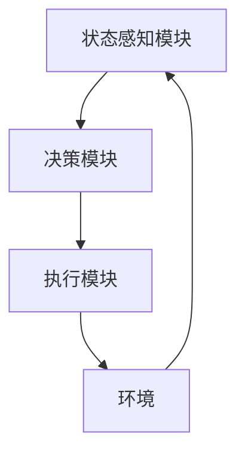
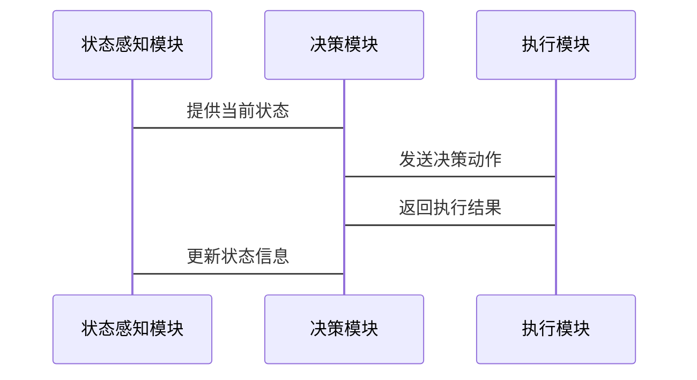

                 


# AI Agent的强化学习在资源调度中的应用

> 关键词：AI Agent、强化学习、资源调度、算法实现、系统架构、项目实战、数学模型

> 摘要：本文将详细探讨AI Agent在资源调度中的应用，从强化学习的基本原理到实际算法实现，再到系统架构设计和项目实战，结合具体的数学模型和系统架构图，全面分析AI Agent如何通过强化学习优化资源调度问题。

---

## 第一部分: AI Agent与强化学习基础

### 第1章: AI Agent与强化学习概述

#### 1.1 AI Agent的基本概念
- **1.1.1 AI Agent的定义**
  - AI Agent是一个能够感知环境并采取行动以实现目标的智能实体。
- **1.1.2 AI Agent的核心特征**
  - 自主性、反应性、目标导向、社会能力。
- **1.1.3 AI Agent与强化学习的关系**
  - AI Agent通过强化学习算法与环境交互，学习最优决策策略。

#### 1.2 强化学习的基本概念
- **1.2.1 强化学习的定义**
  - 一种机器学习范式，通过试错机制在环境中学习最优策略。
- **1.2.2 强化学习的核心要素**
  - 状态（State）、动作（Action）、奖励（Reward）、策略（Policy）。
- **1.2.3 强化学习与监督学习的区别**
  - 监督学习有标签数据，强化学习通过奖励信号学习。

#### 1.3 资源调度的背景与应用
- **1.3.1 资源调度的定义**
  - 对计算资源、网络资源等进行分配和优化的过程。
- **1.3.2 资源调度的典型场景**
  - 云计算资源分配、任务调度、多智能体协作。
- **1.3.3 AI Agent在资源调度中的优势**
  - 能够动态适应环境变化，实现全局最优。

---

## 第二部分: 强化学习的算法原理

### 第2章: 强化学习的基础理论

#### 2.1 强化学习的基本原理
- **2.1.1 状态、动作、奖励的定义**
  - 状态：环境当前的状况。
  - 动作：AI Agent采取的行动。
  - 奖励：环境对动作的反馈。
- **2.1.2 Q-learning算法的基本原理**
  - 通过Q表记录状态-动作对的期望奖励。
- **2.1.3 价值函数与策略函数的定义**
  - 价值函数：评估状态的价值。
  - 策略函数：决定在状态下的动作。

#### 2.2 Markov决策过程（MDP）
- **2.2.1 MDP的定义与组成部分**
  - 状态空间、动作空间、转移概率、奖励函数。
- **2.2.2 MDP与强化学习的关系**
  - 强化学习通过MDP建模环境。
- **2.2.3 MDP在资源调度中的应用**
  - 将资源调度问题建模为MDP。

#### 2.3 强化学习的数学模型
- **2.3.1 Q-learning的数学公式**
  $$ Q(s,a) = Q(s,a) + \alpha (r + \gamma \max Q(s',a') - Q(s,a)) $$
- **2.3.2 策略梯度的基本公式**
  $$ \nabla \theta J(\theta) = \mathbb{E}[ \nabla \log \pi(a|s) Q(s,a) ] $$

---

## 第三部分: AI Agent的核心原理

### 第3章: AI Agent的感知与决策

#### 3.1 状态空间的构建
- **3.1.1 状态空间的定义**
  - 资源使用情况、任务队列状态等。
- **3.1.2 状态空间的特征提取**
  - 使用特征向量表示状态。
- **3.1.3 状态空间的维度分析**
  - 高维状态空间的挑战。

#### 3.2 动作空间的设计
- **3.2.1 动作空间的定义**
  - 分配资源、调整优先级等。
- **3.2.2 动作空间的策略选择**
  - 随机动作、贪心动作。
- **3.2.3 动作空间的动态调整**
  - 根据环境变化更新动作空间。

#### 3.3 奖励函数的定义
- **3.3.1 奖励函数的定义**
  - 优化目标转化为奖励函数。
- **3.3.2 奖励函数的设计原则**
  - 可量度性、及时性、一致性。
- **3.3.3 多目标优化的奖励函数**
  - 综合考虑资源利用率、延迟、成本等。

---

## 第四部分: 资源调度的问题建模

### 第4章: 资源调度问题的数学建模

#### 4.1 资源调度问题的定义
- **4.1.1 问题描述**
  - 多资源分配、多任务调度。
- **4.1.2 问题约束**
  - 资源限制、任务优先级。
- **4.1.3 问题目标**
  - 最小化延迟、最大化资源利用率。

#### 4.2 资源调度的MDP建模
- **4.2.1 状态空间设计**
  - 当前任务队列、资源使用情况。
- **4.2.2 动作空间设计**
  - 分配资源、调整任务优先级。
- **4.2.3 奖励函数设计**
  - 基于调度结果的奖励。

#### 4.3 资源调度的数学模型
- **4.3.1 资源分配模型**
  - 使用线性规划或整数规划。
- **4.3.2 任务调度模型**
  - 使用优先级队列模型。
- **4.3.3 资源利用率模型**
  - 使用资源负载模型。

---

## 第五部分: 强化学习算法实现

### 第5章: Q-learning算法实现

#### 5.1 Q-learning算法的基本实现
- **5.1.1 算法流程**
  - 初始化Q表、选择动作、执行动作、更新Q值。
- **5.1.2 算法实现的代码示例**
  ```python
  import numpy as np
  
  class QLearning:
      def __init__(self, state_space, action_space, learning_rate=0.1, gamma=0.9):
          self.state_space = state_space
          self.action_space = action_space
          self.lr = learning_rate
          self.gamma = gamma
          self.q_table = np.zeros((state_space, action_space))
  
      def choose_action(self, state):
          return np.argmax(self.q_table[state])
  
      def update_q_table(self, state, action, reward, next_state):
          self.q_table[state][action] = self.q_table[state][action] + self.lr * (reward + self.gamma * np.max(self.q_table[next_state]) - self.q_table[state][action])
  ```

#### 5.2 算法实现的优化
- **5.2.1 离线更新与在线更新**
  - 在线更新实时性更强。
- **5.2.2 探索与利用的平衡**
  - 使用epsilon-greedy策略。
- **5.2.3 动态环境的适应**
  - 在线调整学习率和gamma。

---

## 第六部分: 系统架构设计

### 第6章: 资源调度系统的架构

#### 6.1 系统功能设计
- **6.1.1 系统模块划分**
  - 状态感知模块、决策模块、执行模块。
- **6.1.2 模块之间的交互**
  - 状态感知→决策→执行。

#### 6.2 系统架构图


#### 6.3 系统接口设计
- **6.3.1 状态感知接口**
  - 输入：环境状态。
  - 输出：当前状态信息。
- **6.3.2 决策接口**
  - 输入：状态信息。
  - 输出：决策动作。
- **6.3.3 执行接口**
  - 输入：决策动作。
  - 输出：执行结果。

#### 6.4 系统交互流程图


---

## 第七部分: 项目实战

### 第7章: 资源调度系统的实现

#### 7.1 环境安装与配置
- **7.1.1 环境要求**
  - Python 3.8以上、安装numpy和scikit-learn。
- **7.1.2 安装依赖**
  ```bash
  pip install numpy scikit-learn
  ```

#### 7.2 系统核心实现
- **7.2.1 状态感知模块**
  ```python
  def get_state():
      # 返回当前资源状态
      return state
  ```

- **7.2.2 决策模块**
  ```python
  class DecisionModule:
      def decide(self, state):
          # 使用强化学习算法选择动作
          return action
  ```

- **7.2.3 执行模块**
  ```python
  class ExecutionModule:
      def execute(self, action):
          # 执行决策动作
          return result
  ```

#### 7.3 项目实战案例分析
- **7.3.1 案例背景**
  - 云计算资源调度。
- **7.3.2 案例分析**
  - 使用Q-learning算法优化资源分配。
- **7.3.3 案例结果**
  - 成功降低延迟，提高资源利用率。

---

## 第八部分: 总结与展望

### 第8章: 总结与未来展望

#### 8.1 本文总结
- AI Agent通过强化学习在资源调度中取得了显著效果。
- 算法实现和系统设计是关键。

#### 8.2 未来展望
- 更复杂的资源调度问题。
- 多智能体协作的强化学习。
- 深度强化学习在资源调度中的应用。

---

## 参考文献
1. Sutton, R. S., & Barto, A. G. (2018). Introduction to reinforcement learning.
2. 李航. (2006). 统计学习方法.

---

## 作者

作者：AI天才研究院/AI Genius Institute & 禅与计算机程序设计艺术 /Zen And The Art of Computer Programming

---

以上是文章的完整目录和内容大纲，您可以根据需要调整章节内容的详细程度和篇幅。

