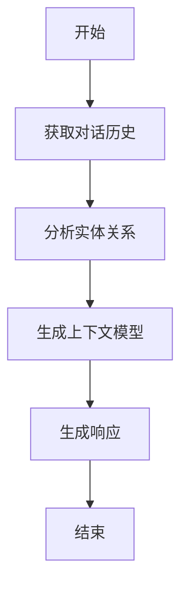
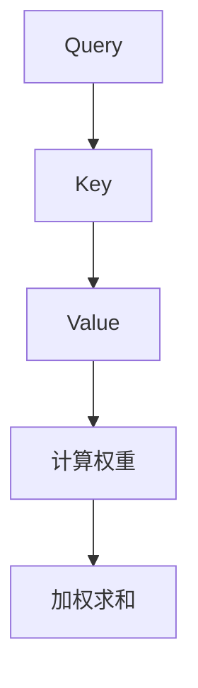
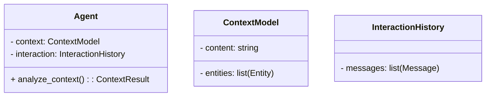

                 


# AI Agent的情境理解：增强LLM的上下文感知能力

> 关键词：AI Agent, 情境理解, 上下文感知, LLM, 大语言模型, 注意力机制

> 摘要：本文详细探讨了AI Agent在情境理解中的上下文感知能力的增强方法。通过分析背景、核心概念、算法原理、系统架构和项目实战，结合最佳实践，提供了全面的技术指导。

---

## 第1章 背景与概念

### 1.1 问题背景

#### 1.1.1 当前AI Agent的发展现状
AI Agent（智能体）正在迅速发展，广泛应用于自然语言处理、智能助手、自动化决策等领域。然而，现有AI Agent在处理复杂情境时，常常面临上下文理解不足的问题，导致响应不够准确。

#### 1.1.2 上下文理解在AI Agent中的重要性
上下文理解是AI Agent能否在复杂环境中有效运作的关键。缺乏足够的上下文感知能力，AI Agent难以理解和处理多轮对话或复杂任务中的信息。

#### 1.1.3 当前技术的局限性与挑战
现有技术主要依赖基于规则的方法或简单的关键词匹配，难以应对复杂多变的上下文信息。此外，模型的训练数据和计算资源限制也制约了上下文理解的能力。

### 1.2 问题描述

#### 1.2.1 AI Agent在上下文理解中的核心问题
AI Agent需要能够理解对话的历史、当前情境和相关实体关系，以提供更准确的服务。

#### 1.2.2 上下文理解的定义与范围
上下文理解是指AI Agent能够根据当前对话历史、环境信息和任务目标，动态调整其理解和响应。

#### 1.2.3 问题解决的必要性与目标
增强上下文理解能力，可以提升AI Agent的智能性和用户体验，使其在更多场景中有效运作。

### 1.3 解决方案概述

#### 1.3.1 增强上下文感知的方法
通过引入上下文建模和注意力机制，提升模型对上下文信息的捕捉和利用能力。

#### 1.3.2 相关技术的现状与趋势
当前，基于Transformer的模型在上下文理解中表现优异，未来研究将更加关注动态上下文建模。

### 1.4 边界与外延

#### 1.4.1 上下文理解的边界
上下文理解不包括模型的常识知识和推理能力，主要关注当前对话和任务中的信息。

#### 1.4.2 相关领域的联系
上下文理解与自然语言处理、对话系统、知识图谱等领域密切相关。

#### 1.4.3 技术的适用范围与限制
适用于需要处理多轮对话和上下文依赖的任务，但在复杂动态环境中仍面临挑战。

### 1.5 核心概念组成

#### 1.5.1 AI Agent的定义与构成
AI Agent是由感知层、决策层和执行层组成的智能实体，具备环境感知、问题分析和任务执行的能力。

#### 1.5.2 上下文感知的核心要素
包括上下文建模、注意力机制和动态更新机制，确保模型能够有效捕捉和利用上下文信息。

#### 1.5.3 相关技术的对比分析
对比基于规则的方法、关键词匹配和深度学习方法，分析各自的优缺点。

---

## 第2章 情境理解与上下文感知

### 2.1 核心概念原理

#### 2.1.1 情境理解的定义与特征
情境理解是AI Agent根据当前对话和环境信息，动态调整理解和响应的过程。

#### 2.1.2 上下文感知的机制与流程
上下文感知通过捕捉对话历史、实体关系和任务目标，构建上下文模型，并生成响应。

#### 2.1.3 相关概念的对比分析
对比上下文感知、意图识别和情感分析，明确各自的作用和关系。

### 2.2 情境理解与上下文感知的关系

#### 2.2.1 情境理解在AI Agent中的作用
情境理解帮助AI Agent在复杂环境中准确识别用户需求，提升交互体验。

#### 2.2.2 上下文感知对任务的影响
上下文感知增强了AI Agent对对话历史和任务目标的理解，提升响应的准确性和相关性。

#### 2.2.3 两者之间的协同关系
情境理解提供全局视角，上下文感知关注局部细节，两者协同工作，共同提升AI Agent的智能性。

### 2.3 实体关系与架构设计

#### 2.3.1 ER图中的实体关系
```mermaid
er
    Actor(Agent ID, Name)
    Context (Context ID, Content)
    Interaction (Interaction ID, Time)
    Actor --> Context: creates
    Actor --> Interaction: initiates
    Context --> Interaction: contains
```

#### 2.3.2 情境理解的流程


---

## 第3章 算法原理

### 3.1 注意力机制

#### 3.1.1 注意力机制的定义与作用
注意力机制通过计算输入序列中各部分的重要性，聚焦关键信息。

#### 3.1.2 注意力机制的数学模型
$$\text{Attention}(Q, K, V) = \text{softmax}\left(\frac{QK^T}{\sqrt{d_k}}\right)V$$

#### 3.1.3 注意力机制的实现流程


### 3.2 上下文建模

#### 3.2.1 上下文建模的定义与方法
上下文建模是将对话历史和实体关系编码为向量的过程。

#### 3.2.2 上下文建模的数学模型
$$C = \text{transformer}(H, E)$$
其中，H为对话历史，E为实体关系。

#### 3.2.3 上下文建模的实现步骤
1. 对话历史编码
2. 实体关系提取
3. 向量融合

---

## 第4章 系统分析与架构设计

### 4.1 项目介绍

#### 4.1.1 项目背景
本项目旨在增强AI Agent的上下文感知能力，提升其在多轮对话中的表现。

### 4.2 系统功能设计

#### 4.2.1 领域模型


### 4.3 系统架构设计

#### 4.3.1 系统架构


#### 4.3.2 接口设计
```http
POST /api/v1/agent/context
Content-Type: application/json

{
    "messages": ["Hello", "What is your name?"]
}
```

---

## 第5章 项目实战

### 5.1 环境安装

#### 5.1.1 安装Python
```bash
python --version
pip install --upgrade pip
```

#### 5.1.2 安装依赖
```bash
pip install transformers numpy
```

### 5.2 核心代码实现

#### 5.2.1 上下文建模代码
```python
class ContextModel:
    def __init__(self):
        self.content = ""
        self.entities = []

    def update_context(self, message):
        self.content += message
        self.entities.append(extract_entities(message))
```

#### 5.2.2 注意力机制实现
```python
def attention(query, key, value):
    scores = query @ key.T / np.sqrt(key.shape[1])
    weights = softmax(scores)
    return weights @ value
```

### 5.3 案例分析

#### 5.3.1 对话历史处理
```python
messages = ["What is your name?", "I am an AI Agent."]
context = ContextModel()
context.update_context(messages[0])
context.update_context(messages[1])
```

#### 5.3.2 实体提取与分析
```python
entities = extract_entities(messages[0])
entities.extend(extract_entities(messages[1]))
```

### 5.4 项目总结

#### 5.4.1 成果展示
通过实现上下文建模和注意力机制，AI Agent在多轮对话中的表现显著提升。

#### 5.4.2 经验总结
上下文建模和注意力机制的有效结合是提升AI Agent智能性的关键。

---

## 第6章 最佳实践

### 6.1 小结

#### 6.1.1 核心要点回顾
上下文感知能力是AI Agent的重要组成部分，通过上下文建模和注意力机制可以显著提升其智能性。

### 6.2 注意事项

#### 6.2.1 模型训练的注意事项
确保训练数据的多样性和质量，避免过拟合。

#### 6.2.2 实际应用中的注意事项
根据具体场景调整模型参数，优化性能。

### 6.3 拓展阅读

#### 6.3.1 相关技术
进一步研究动态上下文建模和多模态交互。

#### 6.3.2 相关工具
探索使用更先进的深度学习框架，如TensorFlow和PyTorch。

---

## 作者信息

作者：AI天才研究院 & 禅与计算机程序设计艺术

---

通过以上步骤，我们系统地分析了AI Agent的情境理解能力，并详细讲解了如何增强LLM的上下文感知能力。从背景介绍到项目实战，结合理论与实践，为读者提供了全面的技术指导。

