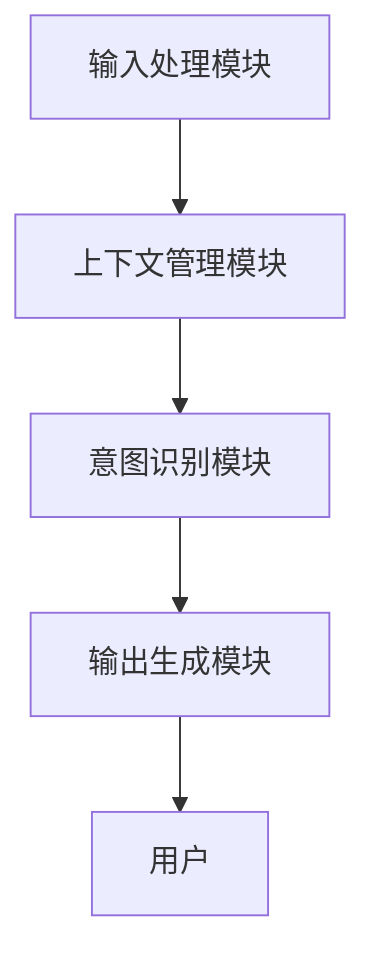

                 


# AI Agent的情境理解：超越单一对话的上下文把握

## 关键词：AI Agent、情境理解、上下文管理、意图识别、算法原理、系统架构、项目实战

## 摘要：本文深入探讨AI Agent的情境理解能力，超越传统的单一对话上下文，分析其在复杂场景中的应用。通过核心概念、算法原理、系统架构设计和项目实战，揭示如何构建高效的AI Agent情境理解系统。

---

## 第1章：AI Agent的定义与背景

### 1.1 AI Agent的基本概念

#### 1.1.1 AI Agent的定义

AI Agent（人工智能代理）是一种能够感知环境、执行任务并做出决策的智能实体。它通过与用户的交互，利用上下文信息提供更智能、更自然的服务。AI Agent可以是虚拟助手、聊天机器人或推荐系统等。

#### 1.1.2 情境理解的重要性

情境理解使AI Agent能够理解当前对话的背景、用户的需求和情感，从而提供更精准的服务。例如，在客服系统中，AI Agent需要理解用户的意图和情绪，以提供有效的帮助。

#### 1.1.3 AI Agent与传统对话系统的区别

传统对话系统仅依赖于当前输入进行响应，而AI Agent能够结合历史上下文和环境信息，提供更连贯和智能的交互。

### 1.2 情境理解的背景与挑战

#### 1.2.1 当前对话系统的问题

传统对话系统存在上下文理解不充分、意图识别不准确等问题，导致用户体验差。

#### 1.2.2 情境理解的必要性

随着用户需求的复杂化，仅依赖单次对话无法满足需求，情境理解成为提升AI Agent性能的关键。

#### 1.2.3 情境理解的技术挑战

数据稀疏性、动态上下文管理、多模态信息融合等技术难题需要克服。

---

## 第2章：情境理解的定义与特点

### 2.1 情境理解的定义

情境理解是指AI Agent能够感知和分析当前对话的背景、用户需求和情感，从而提供更精准的服务。

### 2.2 上下文管理机制

#### 2.2.1 上下文的存储与更新

上下文信息包括用户的历史输入、系统响应和环境数据，需实时存储和更新。

#### 2.2.2 上下文的同步与共享

确保上下文在多个模块间同步，避免信息孤岛。

---

## 第3章：上下文表示方法

### 3.1 上下文表示的定义

上下文表示是将对话历史、用户信息和环境数据转化为可处理的形式。

### 3.2 意图识别模型

#### 3.2.1 意图识别的定义

意图识别是通过自然语言处理技术确定用户的意图。

#### 3.2.2 意图识别的算法流程

1. 文本预处理：分词、去停用词。
2. 特征提取：使用词袋模型或TF-IDF。
3. 模型训练：基于机器学习或深度学习模型。
4. 意图预测：输入文本，输出意图。

---

## 第4章：AI Agent的系统架构

### 4.1 系统功能设计

#### 4.1.1 系统模块划分

- 输入处理模块：接收用户输入。
- 上下文管理模块：存储和管理上下文信息。
- 意图识别模块：分析用户意图。
- 输出生成模块：生成系统响应。

#### 4.1.2 系统功能流程

1. 用户输入：用户发送查询或命令。
2. 输入处理：解析输入内容。
3. 上下文管理：更新上下文信息。
4. 意图识别：确定用户意图。
5. 输出生成：生成响应内容。

### 4.2 系统架构图



---

## 第5章：项目实战

### 5.1 环境安装与配置

#### 5.1.1 开发环境的选择

建议使用Python和相关框架（如Flask或Django）。

#### 5.1.2 必要库的安装

安装自然语言处理库（如spaCy）和深度学习框架（如TensorFlow）。

### 5.2 上下文管理模块的实现

#### 5.2.1 代码实现

```python
class ContextManager:
    def __init__(self):
        self.context = {}

    def update_context(self, key, value):
        self.context[key] = value

    def get_context(self, key):
        return self.context.get(key, None)

    def clear_context(self):
        self.context = {}
```

#### 5.2.2 代码应用解读

上述代码实现了一个简单的上下文管理模块，用于存储和管理上下文信息。

### 5.3 实际案例分析

#### 5.3.1 案例背景

以客服系统为例，用户询问订单状态，系统需要结合订单号查询数据库。

#### 5.3.2 案例分析

1. 用户输入：查询订单号12345的状态。
2. 输入处理：提取订单号。
3. 上下文管理：存储订单号。
4. 意图识别：识别意图是查询订单状态。
5. 输出生成：生成查询请求并返回结果。

---

## 第6章：小结与展望

### 6.1 小结

AI Agent的情境理解技术通过上下文管理和意图识别，提升了交互的智能化和准确性。

### 6.2 注意事项

- 数据质量和多样性影响上下文管理的效果。
- 上下文同步机制需及时更新，避免信息延迟。
- 算法选择需根据具体场景进行调整。

### 6.3 拓展阅读

建议阅读《深度学习》和《自然语言处理实战》等书籍，深入了解相关技术。

---

## 作者：AI天才研究院 & 禅与计算机程序设计艺术

---

以上是《AI Agent的情境理解：超越单一对话的上下文把握》的完整文章内容，涵盖了从基础概念到系统设计再到项目实战的各个方面，帮助读者全面理解AI Agent的情境理解技术。

