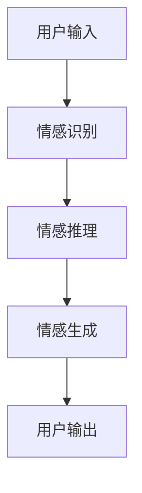

                 


# AI Agent的情感共情：提升LLM的人文关怀能力

关键词：AI Agent、情感共情、LLM、人文关怀、AI交互、情感计算

摘要：随着人工智能技术的快速发展，AI Agent在各个领域的应用越来越广泛。然而，现有的AI Agent在情感共情方面的能力仍然有限，这使得它们在与人类交互时显得缺乏人情味。本文将深入探讨如何通过情感共情技术提升大型语言模型（LLM）的人文关怀能力，从而使AI Agent能够更好地理解和回应人类的情感需求。文章将从情感共情的核心概念、算法原理、系统架构到实际应用案例进行全面分析，为AI Agent的情感共情能力提供系统的解决方案。

---

## 第1章: AI Agent与情感共情的概述

### 1.1 AI Agent的基本概念

#### 1.1.1 AI Agent的定义与特点
AI Agent（人工智能代理）是指能够感知环境并采取行动以实现目标的智能实体。与传统程序不同，AI Agent具备自主性、反应性、目标导向性和社会性等特点。AI Agent能够通过传感器获取信息，通过推理和决策做出反应，从而实现与环境的动态交互。

#### 1.1.2 情感共情在AI Agent中的作用
情感共情是指AI Agent能够理解并共享人类的情感体验，从而在交互中表现出更自然、更人性化的反应。情感共情能力的加入，使得AI Agent不仅能够完成任务，还能够关注用户的情感需求，提升用户体验。

#### 1.1.3 AI Agent与人类情感互动的背景
随着AI技术的普及，AI Agent的应用场景越来越广泛，例如智能音箱、客服机器人、虚拟助手等。然而，这些AI Agent在情感交互方面的能力仍然有限，往往显得冷漠或机械。为了使AI Agent更加贴近人类，提升其情感共情能力成为必然趋势。

### 1.2 情感共情的定义与特征

#### 1.2.1 情感共情的定义
情感共情是指个体能够感知、理解和分享他人情感状态的能力。在AI Agent中，情感共情意味着系统能够识别用户的情感状态，并在交互中做出相应的回应，例如通过语气、措辞或行为来表达理解和关心。

#### 1.2.2 情感共情的核心特征
情感共情的核心特征包括情感识别、情感理解和情感表达。情感识别是指准确识别用户的情感状态；情感理解是指基于情感识别结果，理解用户的情感需求；情感表达是指通过语言或行为回应用户的情感状态，从而实现情感共鸣。

#### 1.2.3 情感共情与传统AI的区别
传统AI主要关注任务执行和数据处理，而情感共情AI则注重情感交互和用户体验。情感共情AI不仅能够完成任务，还能够理解用户的情感需求，从而提供更贴心的服务。

---

## 第2章: 提升LLM人文关怀能力的必要性

### 2.1 当前LLM的局限性

#### 2.1.1 LLM在情感处理中的不足
大型语言模型（LLM）虽然在文本生成、信息检索等方面表现出色，但在情感处理方面仍存在不足。例如，LLM难以准确识别用户的情感状态，也无法根据情感状态调整回应的语气和内容。

#### 2.1.2 LLM在人文关怀中的挑战
LLM的训练数据主要基于大量文本，缺乏情感标注和情感理解的训练。这使得LLM在处理情感相关任务时显得生硬，缺乏人性化。

#### 2.1.3 情感共情对LLM的提升作用
通过引入情感共情技术，LLM能够更好地理解用户的情感需求，从而在交互中提供更贴心、更人性化的服务。例如，在医疗咨询中，LLM可以识别用户的情绪，提供更具同理心的建议。

---

## 第3章: 情感共情的核心概念

### 3.1 情感共情的原理

#### 3.1.1 情感识别的原理
情感识别是情感共情的基础。通过自然语言处理（NLP）技术，AI Agent可以识别文本中的情感词汇、语气和语境，从而推断出用户的情感状态。

#### 3.1.2 情感推理的原理
情感推理是在情感识别的基础上，进一步分析用户的情感需求和潜在意图。例如，用户表达“我感到沮丧”，AI Agent不仅需要识别出“沮丧”这一情感，还需要推理出用户可能需要安慰或建议。

#### 3.1.3 情感共情的生成机制
情感共情的生成机制包括情感匹配和情感表达。情感匹配是指根据用户的情感状态，选择合适的回应策略；情感表达是指通过语言或行为，将情感匹配的结果传达给用户。

### 3.2 情感共情与LLM的关系

#### 3.2.1 情感共情对LLM性能的提升
通过引入情感共情技术，LLM能够更好地理解用户的情感需求，从而在文本生成和交互中表现出更强的适应性和人性化。

#### 3.2.2 LLM在情感共情中的角色
LLM作为情感共情的核心技术，负责处理情感识别、情感推理和情感生成等任务。通过与情感共情算法的结合，LLM能够实现更智能、更自然的交互。

---

## 第4章: 情感共情的核心要素

### 4.1 情感识别的关键要素

#### 4.1.1 情感词汇的识别
情感词汇是情感识别的基础。通过关键词匹配和情感词典，AI Agent可以识别文本中的情感词汇，从而推断出用户的情感状态。

#### 4.1.2 情感语境的分析
情感语境是指文本的上下文和语境。通过分析情感语境，AI Agent可以更准确地识别用户的情感状态。例如，在“我今天很累”中，AI Agent可以根据上下文判断用户可能感到疲惫。

#### 4.1.3 情感意图的解析
情感意图是指用户通过情感表达所传递的潜在意图。例如，用户表达“我感到生气”，AI Agent需要解析出用户可能需要情绪疏解或问题解决。

### 4.2 情感共情的实现要素

#### 4.2.1 情感数据的收集与处理
情感数据的收集与处理是情感共情实现的基础。通过收集用户的情感数据，AI Agent可以训练情感识别模型，从而提高情感识别的准确率。

#### 4.2.2 情感模型的构建
情感模型是情感共情的核心。通过机器学习和深度学习技术，AI Agent可以构建情感分类模型、情感推理模型和情感生成模型，从而实现情感共情。

---

## 第5章: 情感共情的算法原理

### 5.1 情感计算的算法

#### 5.1.1 基于规则的情感计算
基于规则的情感计算是一种简单的情感识别方法。通过预定义的情感规则，AI Agent可以匹配文本中的情感关键词，从而推断出用户的情感状态。

#### 5.1.2 基于机器学习的情感计算
基于机器学习的情感计算是一种更高级的情感识别方法。通过训练情感分类模型，AI Agent可以自动学习情感特征，从而实现更准确的情感识别。

### 5.2 情感共情生成的算法

#### 5.2.1 基于规则的情感共情生成
基于规则的情感共情生成是一种简单的情感回应方法。通过预定义的情感回应规则，AI Agent可以根据用户的情感状态生成相应的回应。

#### 5.2.2 基于深度学习的情感共情生成
基于深度学习的情感共情生成是一种更高级的情感回应方法。通过训练生成式模型，AI Agent可以生成更自然、更个性化的情感回应。

---

## 第6章: 情感共情的系统架构设计

### 6.1 系统架构设计

#### 6.1.1 系统功能模块
情感共情系统的功能模块包括情感数据采集模块、情感识别模块、情感推理模块和情感生成模块。

#### 6.1.2 系统交互流程
系统交互流程包括用户输入、情感识别、情感推理和情感生成四个步骤。通过这些步骤，AI Agent可以实现与用户的情感互动。

#### 6.1.3 系统架构图
以下是情感共情系统的架构图：



---

## 第7章: 情感共情的项目实战

### 7.1 项目背景

#### 7.1.1 项目目标
本项目旨在开发一个具备情感共情能力的AI Agent，能够在与用户的交互中识别用户的情感状态，并生成相应的回应。

#### 7.1.2 项目需求
项目需求包括情感识别、情感推理和情感生成三个部分。

### 7.2 核心代码实现

#### 7.2.1 情感识别代码
以下是情感识别的Python代码示例：

```python
import nltk
from nltk.sentiment import SentimentIntensityAnalyzer

sia = SentimentIntensityAnalyzer()
text = "I am so happy!"
sentiment = sia.polarity_scores(text)
print(sentiment)
```

#### 7.2.2 情感推理代码
以下是情感推理的Python代码示例：

```python
def infer_emotion(text):
    # 简单的情感推理逻辑
    if "happy" in text.lower():
        return "happy"
    elif "sad" in text.lower():
        return "sad"
    else:
        return "neutral"
```

#### 7.2.3 情感生成代码
以下是情感生成的Python代码示例：

```python
def generate_response(emotion):
    if emotion == "happy":
        return "That's great to hear! Is there anything else I can help you with?"
    elif emotion == "sad":
        return "I'm sorry to hear that you're feeling this way. Is there anything I can do to help?"
    else:
        return "Thank you for sharing your thoughts with me."
```

### 7.3 代码解读与分析

#### 7.3.1 情感识别代码解读
上述情感识别代码使用了NLTK库中的SentimentIntensityAnalyzer，能够对文本进行情感极性分析。通过调用polarity_scores方法，可以获取文本的情感得分。

#### 7.3.2 情感推理代码解读
上述情感推理代码通过简单的关键词匹配，判断文本中的情感状态。虽然逻辑简单，但可以满足基本的情感推理需求。

#### 7.3.3 情感生成代码解读
上述情感生成代码根据输入的情感状态，生成相应的回应文本。通过条件判断，可以实现不同情感状态下的个性化回应。

### 7.4 实际案例分析

#### 7.4.1 案例背景
假设用户输入：“我今天感觉很累。”

#### 7.4.2 情感识别
情感识别模块识别出用户的情感状态为“sad”。

#### 7.4.3 情感推理
情感推理模块判断用户的情感需求为情绪疏解。

#### 7.4.4 情感生成
情感生成模块生成回应文本：“我明白你现在感觉很累，或许你可以试着放松一下自己，或者和朋友聊聊天。你愿意多说说吗？”

---

## 第8章: 情感共情的最佳实践

### 8.1 实践总结

#### 8.1.1 情感共情的核心要点
情感共情的核心要点包括情感识别的准确性、情感推理的合理性以及情感生成的自然性。

#### 8.1.2 情感共情的优化方向
情感共情的优化方向包括引入更复杂的情感计算模型、增加情感语境的分析能力以及提升情感生成的创造性。

### 8.2 小结

#### 8.2.1 情感共情的重要性
情感共情是提升AI Agent人文关怀能力的关键。通过情感共情技术，AI Agent能够更好地理解用户的情感需求，从而提供更贴心的服务。

#### 8.2.2 情感共情的未来发展方向
情感共情的未来发展方向包括更精准的情感识别、更智能的情感推理以及更自然的情感生成。通过技术的不断进步，情感共情能力将更加接近人类的水平。

### 8.3 注意事项

#### 8.3.1 数据隐私问题
在情感共情技术的实现过程中，需要注意用户数据的隐私保护。情感数据可能包含敏感信息，因此需要采取适当的数据加密和匿名化处理。

#### 8.3.2 情感偏见问题
情感共情算法可能会受到训练数据的影响，导致情感识别和生成中出现偏见。因此，在算法设计和训练数据的选择中，需要特别注意避免偏见的引入。

### 8.4 拓展阅读

#### 8.4.1 情感计算领域的经典论文
- "A Computational Model of Emotion" by James A. Russell
- "Lexicon-Based Methods for Sentiment Analysis" by Saif M. Mohammad

#### 8.4.2 情感共情技术的应用案例
- 情感共情在智能客服中的应用
- 情感共情在心理健康支持中的应用
- 情感共情在教育辅助中的应用

---

## 作者：AI天才研究院/AI Genius Institute & 禅与计算机程序设计艺术 /Zen And The Art of Computer Programming

