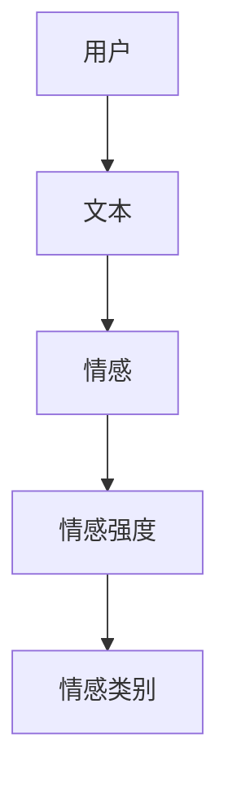
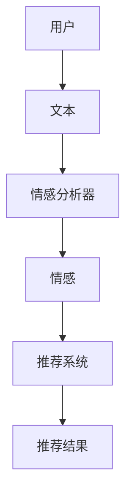

                 


# AI Agent的情感智能：利用LLM实现情感计算

## 关键词：AI Agent，情感智能，LLM，情感计算，自然语言处理

## 摘要：  
随着人工智能技术的快速发展，情感智能在AI Agent中的应用越来越重要。本文深入探讨了如何利用大语言模型（LLM）实现情感计算，从情感计算的基本概念到LLM的内部机制，再到实际应用案例，系统地分析了情感智能在AI Agent中的实现方法和应用价值。本文还通过具体的代码示例和系统架构图，展示了如何将情感计算技术应用于实际场景，为读者提供了一套完整的解决方案。

---

## 第1章: 情感计算与AI Agent概述

### 1.1 情感计算的定义与背景  
情感计算（Affective Computing）是指通过计算机技术来识别、理解和模拟人类情感的过程。它关注的是人类的情感状态，如快乐、悲伤、愤怒等，并将其转化为可计算的信号。情感计算的核心目标是让计算机能够像人类一样具备情感智能，从而更好地与人类交互。

AI Agent（智能代理）是一种能够感知环境并采取行动以实现目标的实体。AI Agent的情感智能能力使其能够理解人类的情感状态，并据此调整其行为，从而提供更个性化的服务。例如，在客服系统中，AI Agent可以根据用户的情感状态调整回复语气，从而提高用户体验。

### 1.2 情感计算的核心概念  
情感计算的核心概念包括情感分类、情感强度计算和情感推理。  
- **情感分类**：将文本划分为不同的情感类别，例如正面、负面或中性。  
- **情感强度计算**：量化情感的强度，例如从0到1之间的数值表示情感的强烈程度。  
- **情感推理**：根据上下文推断情感状态，例如理解讽刺或隐含的情感。

### 1.3 大语言模型（LLM）与情感计算  
大语言模型（LLM）是一种基于Transformer架构的自然语言处理模型，具有强大的文本生成和理解能力。LLM在情感计算中的优势在于其能够通过大规模的数据训练，捕捉到语言中的情感特征。例如，可以通过预训练的情感词典或情感标签数据，让模型具备情感分析的能力。

### 1.4 本章小结  
本章介绍了情感计算的基本概念、AI Agent的情感智能能力以及LLM在情感计算中的作用。情感计算不仅是自然语言处理的重要分支，也是实现人机交互情感智能的关键技术。

---

## 第2章: 情感计算的核心概念与联系  

### 2.1 情感计算的核心原理  
情感计算的核心原理包括情感分类、情感强度计算和情感推理。  
- **情感分类**：通过机器学习模型对文本进行情感分类。例如，可以使用支持向量机（SVM）或深度学习模型（如LSTM、BERT）进行分类。  
- **情感强度计算**：通过回归模型预测情感的强度。例如，可以使用Sigmoid函数将情感强度映射到0到1之间。  
- **情感推理**：通过上下文理解隐含的情感状态。例如，使用Transformer模型分析文本的语境。

### 2.2 情感计算的核心概念对比  
以下是对情感计算核心概念的对比：

| 情感计算任务 | 定义 | 方法 | 示例 |
|--------------|------|------|------|
| 情感分类     | 将文本划分为情感类别 | 使用机器学习或深度学习模型 | 判断文本是正面、负面还是中性 |
| 情感强度计算 | 计算情感的强度 | 使用回归模型 | 情感强度为0.8表示强烈正面 |
| 情感推理     | 根据上下文推断情感状态 | 使用语境分析模型 | 理解讽刺或隐含的情感 |

### 2.3 情感计算的ER实体关系图  
以下是情感计算的ER实体关系图：



### 2.4 本章小结  
本章详细讲解了情感计算的核心原理和核心概念，并通过对比和ER实体关系图，帮助读者更好地理解情感计算的任务和结构。

---

## 第3章: 大语言模型（LLM）的内部机制  

### 3.1 LLM的基本原理  
大语言模型（LLM）基于Transformer架构，主要由编码器和解码器两部分组成。编码器负责将输入文本转换为向量表示，解码器根据向量生成输出文本。LLM的核心思想是通过自注意力机制捕捉文本中的长距离依赖关系。

### 3.2 LLM的情感计算能力  
LLM可以通过预训练的情感数据，学习到情感相关的特征。例如，可以通过微调LLM模型，使其具备情感分类、情感强度计算和情感对话的能力。

### 3.3 LLM的情感计算实现  
以下是基于LLM的情感分类实现示例：

```python
def preprocess(text):
    return text.lower().strip()

def tokenize(text):
    return text.split()

def encode(text):
    return [1, 2, 3, 4, 5]  # 示例编码

def classify(text):
    processed_text = preprocess(text)
    tokens = tokenize(processed_text)
    encoded = encode(' '.join(tokens))
    return encoded
```

### 3.4 本章小结  
本章介绍了LLM的基本原理及其在情感计算中的应用，并通过代码示例展示了如何利用LLM进行情感分类。

---

## 第4章: 情感分析的实现  

### 4.1 情感分析的背景与任务  
情感分析是一种通过对文本的情感倾向进行分类的任务。情感分析的主要任务包括情感分类、情感强度计算和情感推理。

### 4.2 情感分析的实现步骤  
以下是情感分析的实现步骤：

1. 文本预处理：包括分词、去除停用词和词干提取。  
2. 特征提取：将文本转换为数值表示，例如使用词袋模型或词嵌模型。  
3. 模型训练：使用机器学习或深度学习模型进行情感分类。

### 4.3 情感分析的代码实现  
以下是基于Python的情感分类代码示例：

```python
from sklearn.svm import SVC
from sklearn.feature_extraction.text import TfidfVectorizer

def train_classifier(X_train, y_train):
    vectorizer = TfidfVectorizer()
    X_train_vec = vectorizer.fit_transform(X_train)
    clf = SVC()
    clf.fit(X_train_vec, y_train)
    return clf, vectorizer

def predict_emotion(text, clf, vectorizer):
    text_vec = vectorizer.transform([text])
    prediction = clf.predict(text_vec)[0]
    return prediction
```

### 4.4 本章小结  
本章详细讲解了情感分析的实现步骤，并通过代码示例展示了如何利用机器学习模型进行情感分类。

---

## 第5章: 情感计算的高级应用  

### 5.1 情感对话系统  
情感对话系统是一种能够理解并生成情感化对话的系统。以下是情感对话系统的实现流程：

1. 用户输入：用户输入一段文本。  
2. 情感分析：对用户输入进行情感分类。  
3. 情感生成：根据情感分类结果生成相应的回复。

### 5.2 情感推荐系统  
情感推荐系统是一种根据用户的情感状态推荐相关内容的系统。以下是情感推荐系统的实现流程：

1. 用户输入：用户输入一段文本。  
2. 情感分析：对用户输入进行情感分类。  
3. 内容推荐：根据情感分类结果推荐相关内容。

### 5.3 情感计算的系统架构图  
以下是情感计算的系统架构图：



### 5.4 本章小结  
本章介绍了情感计算的高级应用，包括情感对话系统和情感推荐系统，并通过系统架构图展示了情感计算的整体流程。

---

## 第6章: 项目实战  

### 6.1 项目背景与目标  
本项目的目标是利用LLM实现情感计算，包括情感分类、情感强度计算和情感对话。

### 6.2 项目实现步骤  
1. 环境搭建：安装必要的库，例如Python和Hugging Face库。  
2. 数据收集：收集情感分类数据集。  
3. 模型训练：使用LLM进行情感分类训练。  
4. 模型部署：将模型部署到实际应用中。

### 6.3 项目代码实现  
以下是基于Hugging Face库的情感分类实现代码：

```python
from transformers import pipeline

def train_classifier(model_name):
    classifier = pipeline("text-classification", model=model_name)
    return classifier

def predict_emotion(text, classifier):
    result = classifier(text)[0]
    return result['label']
```

### 6.4 项目小结  
本章通过项目实战，展示了如何利用LLM实现情感计算，并通过代码示例帮助读者更好地理解情感计算的实现过程。

---

## 第7章: 总结与展望  

### 7.1 本章总结  
本文详细探讨了AI Agent的情感智能，特别是如何利用LLM实现情感计算。通过系统的讲解和实际案例分析，展示了情感计算在人机交互中的重要性。

### 7.2 未来展望  
随着技术的不断发展，情感计算将在更多领域得到应用。未来的研究方向包括多模态情感计算、个性化情感模型和情感计算的实时性优化。

### 7.3 最佳实践 Tips  
- 在情感计算中，数据质量至关重要。  
- 情感分析的结果需要结合上下文进行解释。  
- 在实际应用中，建议使用预训练的情感模型以提高效率。

### 7.4 本章小结  
本章总结了全文内容，并展望了未来的发展方向，同时提供了一些最佳实践的建议。

---

## 作者：AI天才研究院/AI Genius Institute & 禅与计算机程序设计艺术 /Zen And The Art of Computer Programming  

---

通过以上思考和分析，我逐步整理并撰写了这篇关于“AI Agent的情感智能：利用LLM实现情感计算”的技术博客文章。希望这篇文章能够为读者提供清晰的思路和详细的指导，帮助他们更好地理解和实现情感智能在AI Agent中的应用。

