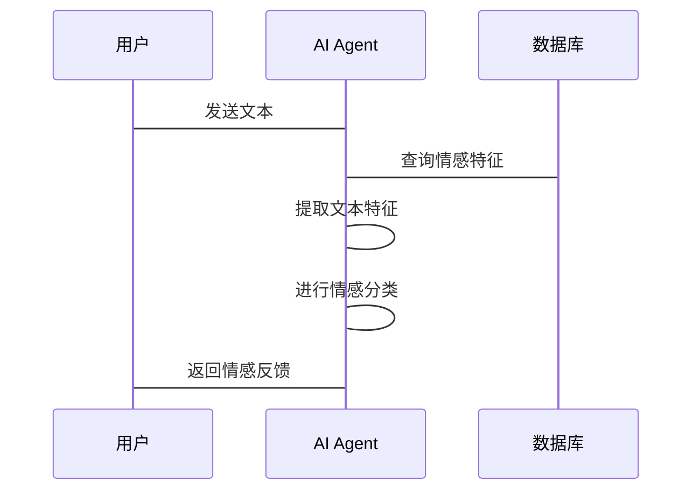

                 


# AI Agent的情感计算在客户服务中的应用

> 关键词：AI Agent，情感计算，客户服务，文本挖掘，自然语言处理，情感分类，数学模型

> 摘要：本文探讨了AI Agent在客户服务中的情感计算应用，从情感计算的基本概念、算法原理、系统架构设计到实际项目案例，详细分析了情感计算在提升客户体验和满意度中的作用。通过系统化的分析和具体的实现案例，展示了如何利用AI技术优化客户服务流程。

---

# 第一部分: AI Agent与情感计算的背景与概念

## 第1章: AI Agent与情感计算的概述

### 1.1 AI Agent的基本概念
#### 1.1.1 AI Agent的定义与分类
AI Agent（人工智能代理）是指能够感知环境、自主决策并执行任务的智能实体。它可以分为以下几类：
- **简单反射型代理**：基于预定义规则执行任务。
- **基于模型的反射型代理**：通过内部模型理解和响应环境。
- **目标驱动型代理**：以特定目标为导向进行决策。

#### 1.1.2 情感计算的基本概念
情感计算（Affective Computing）是通过计算手段识别、理解和响应人类情感的过程。它包括以下关键要素：
- **情感识别**：从语言、语音、面部表情中提取情感信息。
- **情感分析**：对情感信息进行分类和评估。
- **情感响应**：根据情感状态生成相应的反馈。

#### 1.1.3 AI Agent在客户服务中的应用背景
在客户服务中，AI Agent通过情感计算技术，能够实时分析客户的情感状态，从而提供个性化的服务。这种技术可以显著提升客户满意度和忠诚度，同时降低服务成本。

### 1.2 情感计算在客户服务中的应用现状
#### 1.2.1 客户服务的痛点与挑战
传统客户服务存在以下问题：
- **效率低下**：人工客服响应慢，无法满足大规模客户需求。
- **情绪管理不足**：无法准确识别客户情绪，导致服务质量参差不齐。
- **成本高昂**：人工客服的招聘和培训成本较高。

#### 1.2.2 情感计算如何解决这些问题
情感计算通过自动化识别和分析客户情感，帮助AI Agent做出更智能的决策，从而解决上述问题。例如：
- **实时情感分析**：快速识别客户情绪，提供即时反馈。
- **个性化服务推荐**：根据客户情感状态推荐合适的产品或解决方案。

---

# 第二部分: 情感计算的核心概念与联系

## 第3章: 情感计算的原理与实现

### 3.1 情感计算的原理
#### 3.1.1 情感识别的流程
情感识别的流程通常包括以下步骤：
1. **数据采集**：获取客户的文本、语音或面部表情数据。
2. **特征提取**：从数据中提取情感相关的特征。
3. **情感分类**：利用机器学习模型对情感进行分类。
4. **情感强度计算**：量化情感的强度或置信度。

#### 3.1.2 情感计算的算法
常用的情感计算算法包括：
- **文本挖掘**：从文本中提取情感关键词。
- **自然语言处理**：通过NLP技术分析文本的情感倾向。
- **深度学习模型**：如LSTM和Transformer用于情感分类。

#### 3.1.3 情感计算的数学模型
情感分类的数学模型可以基于概率论或机器学习算法。例如，使用逻辑回归进行二分类：
$$ P(y=1|x) = \frac{1}{1 + e^{-\beta x}} $$
其中，$x$ 是输入特征，$\beta$ 是模型参数。

### 3.2 情感计算的核心要素
#### 3.2.1 文本特征提取
文本特征提取是情感计算的关键步骤。常用方法包括：
- **TF-IDF**：计算文本中关键词的重要性。
- **Word Embedding**：将词语转化为向量表示。

#### 3.2.2 情感分类
情感分类是将文本分为积极、消极或中性情感的过程。常用算法包括：
- **SVM**：支持向量机。
- **随机森林**：基于决策树的集成方法。

#### 3.2.3 情感强度计算
情感强度计算是对情感程度的量化，例如：
- **情感得分**：从-1（消极）到+1（积极）。
- **情感置信度**：概率值表示情感分类的置信程度。

### 3.3 情感计算的ER实体关系图
```mermaid
er
actor: 用户
agent: AI Agent
interaction: 交互记录
emotion: 情感特征
feature: 文本特征
```

---

# 第三部分: 情感计算的系统设计与实现

## 第4章: 情感计算的系统架构设计

### 4.1 系统功能设计
系统功能模块包括：
- **数据采集模块**：收集客户与AI Agent的交互数据。
- **特征提取模块**：提取情感相关特征。
- **情感分类模块**：对情感进行分类和强度计算。
- **反馈生成模块**：根据情感状态生成相应的反馈。

### 4.2 系统架构设计
系统架构采用分层设计：
- **数据层**：存储交互数据和情感特征。
- **计算层**：处理特征提取和情感分类。
- **应用层**：展示结果并生成反馈。

### 4.3 系统接口设计
系统接口包括：
- **数据接口**：与数据库交互。
- **API接口**：供其他系统调用情感计算服务。

### 4.4 系统交互流程


---

# 第四部分: 情感计算的项目实战

## 第5章: 项目实战

### 5.1 项目背景与目标
项目目标是开发一个基于情感计算的客户服务系统，实现以下功能：
- 实时情感分析。
- 情感分类与强度计算。
- 根据情感反馈生成个性化响应。

### 5.2 系统实现
#### 5.2.1 环境安装
需要安装以下工具和库：
- Python 3.8+
- Jupyter Notebook
- NLTK
- Scikit-learn
- Transformers

#### 5.2.2 核心代码实现
以下是情感分类的Python代码示例：
```python
from sklearn.feature_extraction.text import TfidfVectorizer
from sklearn.svm import SVC
from sklearn.metrics import accuracy_score

# 数据预处理
text_data = [...]  # 客户文本数据
labels = [...]      # 情感标签（0：消极，1：积极）

# 特征提取
vectorizer = TfidfVectorizer()
X = vectorizer.fit_transform(text_data)

# 模型训练
model = SVC()
model.fit(X, labels)

# 模型预测
test_texts = ["我非常喜欢这个产品"]
test_X = vectorizer.transform(test_texts)
predicted = model.predict(test_X)
print(predicted)  # 输出：[1]
```

#### 5.2.3 实际案例分析
以电商客服为例，分析客户评论的情感倾向：
- 输入文本：客户对产品的负面评价。
- 情感分类：消极。
- 反馈生成：AI Agent 提供解决方案或转接人工客服。

---

# 第五部分: 情感计算的优化与展望

## 第6章: 优化建议与未来方向

### 6.1 优化建议
- **模型优化**：引入更复杂的深度学习模型（如BERT）提高情感分类的准确性。
- **多模态情感计算**：结合文本、语音和面部表情等多种模态信息。
- **实时性优化**：优化算法和硬件配置，提高实时响应速度。

### 6.2 未来发展方向
- **情感记忆**：记录客户的长期情感状态，提供更个性化的服务。
- **情感推理**：理解客户的情感需求，生成更具针对性的反馈。
- **跨语言情感计算**：支持多语言情感分析，扩大应用范围。

---

# 总结

AI Agent的情感计算在客户服务中的应用正在改变传统的服务模式。通过实时情感分析和个性化反馈生成，AI Agent能够显著提升客户体验和满意度。未来，随着技术的不断进步，情感计算将在更多领域发挥重要作用。

---

作者：AI天才研究院 & 禅与计算机程序设计艺术

