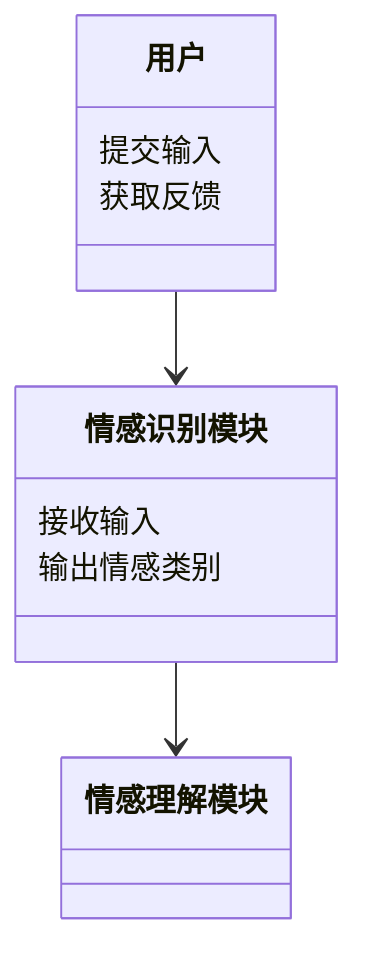
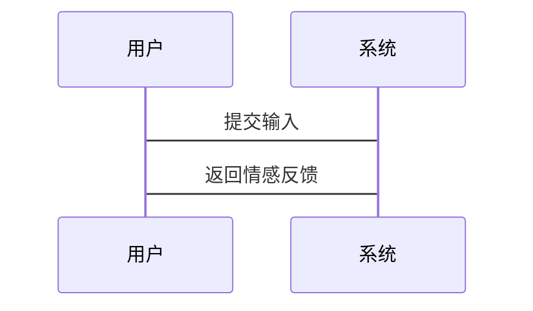

                 


```markdown
# AI Agent的情感计算：识别、理解和生成情感反应

> 关键词：AI Agent，情感计算，情感识别，情感理解，情感生成，人机交互，深度学习

> 摘要：本文深入探讨了AI Agent在情感计算中的应用，从情感识别、情感理解到情感生成的原理和实现，结合实际案例分析，展示了如何通过技术手段实现人机之间的情感互动。

---

## 第1章: 情感计算与AI Agent概述

### 1.1 情感计算的定义与背景

#### 1.1.1 情感计算的定义
情感计算（Affective Computing）是一种通过计算机技术来识别、理解和处理人类情感的科学。它研究如何将人类的情感信息转化为计算机可处理的数据，并通过反馈机制来模拟人类的情感反应。

#### 1.1.2 情感计算的发展历程
- 20世纪90年代：情感计算的概念首次提出，主要集中在面部表情识别。
- 2010年以后：随着深度学习的发展，情感计算在自然语言处理、语音识别等领域取得突破。

#### 1.1.3 AI Agent在情感计算中的角色
AI Agent（智能代理）作为情感计算的核心，负责接收输入、处理情感信息并生成反馈。它能够理解用户的情感状态，并根据此调整交互策略。

### 1.2 情感计算的核心概念

#### 1.2.1 情感识别
- **定义**：通过输入（如文本、语音、图像）识别出情感类别（如快乐、悲伤）。
- **方法**：基于特征的分类（如词袋模型）和深度学习模型（如CNN、RNN）。

#### 1.2.2 情感理解
- **定义**：分析情感的语境、强度和复杂性，理解其背后的意义。
- **方法**：情感推理网络和注意力机制。

#### 1.2.3 情感生成
- **定义**：生成符合情感的文本或行为反馈。
- **方法**：基于规则的生成和生成对抗网络（GAN）。

### 1.3 情感计算的应用领域

#### 1.3.1 人机交互
- 提高用户体验，如智能音箱的情感反馈。

#### 1.3.2 情感支持系统
- 为孤独症儿童提供情感陪伴。

#### 1.3.3 智能助手
- 根据用户情绪调整服务策略。

---

## 第2章: 情感计算的核心概念与联系

### 2.1 情感计算的核心原理

#### 2.1.1 情感识别的原理
- 输入数据经过预处理后，提取特征，通过分类器识别情感类别。

#### 2.1.2 情感理解的机制
- 利用上下文信息，结合情感推理模型，理解情感的复杂性。

#### 2.1.3 情感生成的模型
- 通过生成模型模拟人类的情感表达，生成文本或行为反馈。

### 2.2 情感计算的核心要素对比

| 核心要素 | 定义 | 方法 |
|----------|------|------|
| 情感识别 | 识别情感类别 | 基于特征分类、深度学习模型 |
| 情感理解 | 理解情感语境 | 情感推理、注意力机制 |
| 情感生成 | 生成情感反馈 | 基于规则、生成对抗网络 |

### 2.3 情感计算的实体关系图


---

## 第3章: 情感计算的算法原理

### 3.1 情感识别算法

#### 3.1.1 基于特征的分类算法
- **方法**：提取文本中的情感特征，如词频、TF-IDF。
- **代码示例**：
  ```python
  from sklearn.feature_extraction.text import TfidfVectorizer
  vectorizer = TfidfVectorizer()
  X = vectorizer.fit_transform(texts)
  ```

#### 3.1.2 基于深度学习的情感识别模型
- **方法**：使用CNN或RNN提取文本特征。
- **数学模型**：
  $$P(y|x) = \frac{P(x|y)P(y)}{P(x)}$$

#### 3.1.3 情感识别的数学模型
- **公式**：
  $$P(y|x) = \frac{P(x|y)P(y)}{P(x)}$$
  其中，P(y|x)表示在给定输入x的情况下，输出y的概率。

### 3.2 情感理解算法

#### 3.2.1 基于规则的情感理解
- **方法**：利用情感词典和规则进行情感分析。

#### 3.2.2 基于深度学习的情感理解
- **方法**：使用情感推理网络分析情感的复杂性。

### 3.3 情感生成算法

#### 3.3.1 基于规则的生成
- **方法**：预定义情感表达的规则，生成反馈文本。

#### 3.3.2 基于生成对抗网络的生成
- **方法**：使用GAN生成多样化的反馈。

---

## 第4章: 情感计算的系统分析与架构设计

### 4.1 系统功能设计

#### 4.1.1 领域模型


#### 4.1.2 系统架构设计


### 4.2 系统接口设计

#### 4.2.1 输入接口
- 文本输入、语音输入。

#### 4.2.2 输出接口
- 文本输出、语音输出。

### 4.3 系统交互流程


---

## 第5章: 情感计算的项目实战

### 5.1 环境安装

```bash
pip install numpy scikit-learn tensorflow
```

### 5.2 核心实现

#### 5.2.1 情感识别实现
```python
import tensorflow as tf
model = tf.keras.Sequential([
    tf.keras.layers.Dense(16, activation='relu'),
    tf.keras.layers.Dense(2, activation='sigmoid')
])
model.compile(optimizer='adam', loss='binary_crossentropy', metrics=['accuracy'])
model.fit(X_train, y_train, epochs=10, batch_size=32)
```

#### 5.2.2 情感理解实现
```python
from transformers import pipeline
classifier = pipeline("text-classification", model="nlptown/bert-base-tf2")
```

#### 5.2.3 情感生成实现
```python
import numpy as np
def generate_response(emotion):
    # 简单的基于规则生成
    if emotion == 'happy':
        return '听起来你很快乐，有什么可以分享的吗？'
    elif emotion == 'sad':
        return '听起来你有些难过，我能帮到你吗？'
```

### 5.3 案例分析
以一个简单的文本分类器为例，使用`scikit-learn`进行情感识别：

```python
from sklearn.model_selection import train_test_split
X_train, X_test, y_train, y_test = train_test_split(X, y, test_size=0.2)
```

---

## 第6章: 情感计算的最佳实践与小结

### 6.1 最佳实践
- 数据质量：确保数据多样性和代表性。
- 模型选择：根据任务选择合适的算法。
- 交互设计：注重用户体验，设计自然的情感反馈。

### 6.2 小结
情感计算通过AI Agent实现了情感识别、理解和生成，为人机交互提供了更深层次的支持。

### 6.3 注意事项
- 数据隐私：注意保护用户情感数据。
- 情感误判：处理模型的不确定性。

### 6.4 拓展阅读
- 《Deep Learning》
- 《Affective Computing》

---

作者：AI天才研究院/AI Genius Institute & 禅与计算机程序设计艺术 /Zen And The Art of Computer Programming
```

