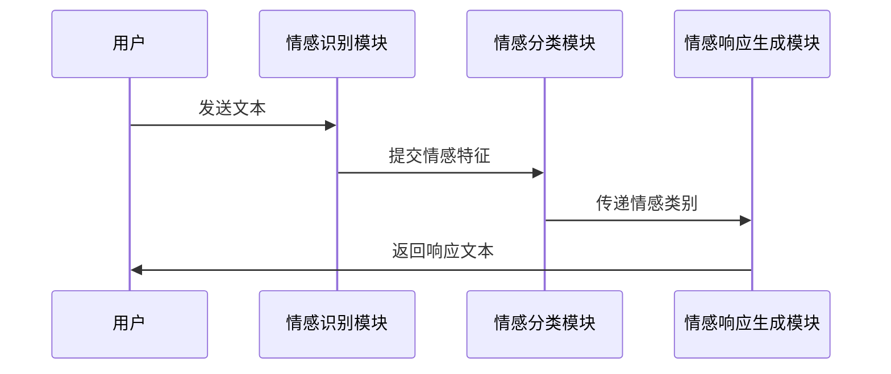

                 


# AI Agent的情感调节：利用LLM实现情绪智能交互

> 关键词：AI Agent, 情感调节, 大语言模型, 情感计算, 人机交互, 情感智能

> 摘要：本文探讨了AI Agent如何通过大语言模型（LLM）实现情感调节，介绍情感计算的核心概念、算法原理、系统架构，以及基于LLM的情感调节实现方法，结合实际案例分析，提供详细的实现方案和代码示例。

---

# 目录

1. [AI Agent情感调节的背景与核心概念](#ai-agent情感调节的背景与核心概念)
   1.1 [AI Agent与情感调节的结合](#ai-agent与情感调节的结合)
   1.2 [情感计算的核心概念](#情感计算的核心概念)
   1.3 [LLM在情感调节中的应用](#llm在情感调节中的应用)
   1.4 [情感调节的实现目标与边界](#情感调节的实现目标与边界)

2. [情感计算的核心概念与原理](#情感计算的核心概念与原理)
   2.1 [情感计算的基本原理](#情感计算的基本原理)
   2.2 [情感计算的主要方法](#情感计算的主要方法)
   2.3 [情感计算与LLM的结合](#情感计算与llm的结合)
   2.4 [情感计算的特征对比](#情感计算的特征对比)
   2.5 [情感计算的ER实体关系图](#情感计算的er实体关系图)

3. [情感计算的算法原理与实现](#情感计算的算法原理与实现)
   3.1 [情感计算的算法流程](#情感计算的算法流程)
   3.2 [情感计算的数学模型](#情感计算的数学模型)
   3.3 [情感计算的实现步骤](#情感计算的实现步骤)
   3.4 [情感计算的Python代码实现](#情感计算的python代码实现)

4. [系统分析与架构设计](#系统分析与架构设计)
   4.1 [问题场景与项目介绍](#问题场景与项目介绍)
   4.2 [系统功能设计](#系统功能设计)
   4.3 [系统架构设计](#系统架构设计)
   4.4 [系统接口设计](#系统接口设计)
   4.5 [系统交互流程图](#系统交互流程图)

5. [项目实战：基于LLM的情感调节实现](#项目实战基于llm的情感调节实现)
   5.1 [环境安装与配置](#环境安装与配置)
   5.2 [系统核心代码实现](#系统核心代码实现)
   5.3 [代码功能解读与分析](#代码功能解读与分析)
   5.4 [实际案例分析](#实际案例分析)
   5.5 [项目小结](#项目小结)

6. [最佳实践与未来展望](#最佳实践与未来展望)
   6.1 [小结](#小结)
   6.2 [注意事项](#注意事项)
   6.3 [未来趋势](#未来趋势)
   6.4 [拓展阅读](#拓展阅读)

---

## 第一部分: AI Agent情感调节的背景与核心概念

### 第1章: AI Agent情感调节的背景与问题描述

#### 1.1 AI Agent与情感调节的结合
##### 1.1.1 情感计算的定义与应用领域
情感计算（Affective Computing）是通过计算机技术来识别、理解和模拟人类情感的过程。它广泛应用于人机交互、教育技术、心理健康支持等领域，帮助机器更好地理解和响应用户的情感需求。

##### 1.1.2 AI Agent在人机交互中的情感需求
AI Agent（智能体）需要与用户进行自然交互，理解用户的意图和情感状态，从而提供更个性化的服务。情感调节是实现这一目标的关键技术。

##### 1.1.3 当前情感计算在AI Agent中的挑战
传统的情感计算方法依赖于预定义规则或简单的特征提取，难以处理复杂的情感表达和语境理解。而大语言模型（LLM）的引入，为情感计算带来了新的可能性。

#### 1.2 LLM在情感调节中的作用
##### 1.2.1 LLM的基本概念与技术特点
大语言模型（LLM）是一种基于深度学习的自然语言处理模型，能够理解和生成人类语言。其特点包括强大的上下文理解和生成能力，适用于复杂的情感分析任务。

##### 1.2.2 LLM在情感分析中的优势
相比传统方法，LLM能够处理更复杂的语义信息，提供更准确的情感分类和情感强度分析。

##### 1.2.3 情感调节的核心问题与解决方案
情感调节的核心问题在于如何根据用户的情感状态，动态调整AI Agent的响应策略。通过LLM，AI Agent可以生成更符合用户情感需求的回复，实现情感调节。

#### 1.3 情感调节的实现目标与边界
##### 1.3.1 情感调节的目标层次
情感调节的目标包括基本的情感识别、情感分类，以及基于情感反馈的智能响应。

##### 1.3.2 情感调节的实现边界
情感调节的实现边界包括用户情感状态的识别、情感分类的准确性，以及系统对情感反馈的响应策略。

##### 1.3.3 相关概念的扩展与外延
情感调节不仅涉及情感识别，还包括情感记忆和情感预测，以实现更智能的交互。

#### 1.4 情感调节的核心要素与概念结构
##### 1.4.1 情感调节的核心要素
包括情感识别、情感分类、情感记忆和情感响应。

##### 1.4.2 情感调节的实现机制
通过LLM进行情感识别和分类，结合情感记忆模块，生成情感响应。

##### 1.4.3 情感调节的概念结构图


### 第2章: 情感计算的核心概念与原理

#### 2.1 情感计算的原理与方法
##### 2.1.1 情感计算的基本原理
情感计算通过分析文本、语音和视觉信息，识别用户的情感状态，从而指导系统的响应策略。

##### 2.1.2 情感计算的主要方法
包括基于规则的方法、基于机器学习的方法和基于深度学习的方法。

##### 2.1.3 情感计算与LLM的结合
LLM通过预训练的情感知识，能够自动分析文本中的情感信息，提供更准确的情感分类。

#### 2.2 情感计算的核心算法
##### 2.2.1 基于规则的情感计算
通过预定义的情感词汇表和规则，识别文本中的情感倾向。

##### 2.2.2 基于机器学习的情感计算
使用特征工程和机器学习模型（如SVM、随机森林）进行情感分类。

##### 2.2.3 深度学习在情感计算中的应用
利用神经网络（如RNN、CNN）进行情感分析，捕捉文本的语义信息。

#### 2.3 情感计算的特征对比
##### 2.3.1 不同情感计算方法的特征对比
| 方法       | 特点                   |
|------------|------------------------|
| 基于规则   | 实现简单，但灵活性差    |
| 机器学习    | 高准确性，依赖特征工程  |
| 深度学习    | 强大学习能力，需要大量数据|

##### 2.3.2 基于LLM的情感计算特征
基于LLM的情感计算具有高准确性、强语义理解和易于部署的特点。

##### 2.3.3 情感计算的性能指标
包括准确率、召回率、F1分数等。

#### 2.4 情感计算的ER实体关系图


### 第3章: 情感计算的算法原理与实现

#### 3.1 情感计算的算法流程
##### 3.1.1 情感计算的基本流程
1. 文本预处理：分词、去除停用词。
2. 特征提取：提取情感相关特征。
3. 情感分类：使用模型进行分类。
4. 情感调节：根据分类结果生成响应。

##### 3.1.2 基于LLM的情感计算流程
1. 输入文本到LLM进行情感分析。
2. LLM输出情感类别和强度。
3. 根据情感信息生成响应。

##### 3.1.3 情感计算的优化方法
包括数据增强、模型调优和交叉验证。

#### 3.2 情感计算的数学模型
##### 3.2.1 情感计算的基本数学模型
$$ P(y|x) = \frac{P(x|y)P(y)}{P(x)} $$

##### 3.2.2 基于概率的分类模型
使用朴素贝叶斯分类器进行情感分类，公式如下：
$$ P(y|x) = \prod_{i=1}^{n} P(x_i|y) P(y) $$

##### 3.2.3 基于深度学习的模型
使用预训练的LLM模型，如GPT-3，进行情感分析。

#### 3.3 情感计算的Python代码实现
```python
import torch
import torch.nn as nn
import torch.optim as optim

class SentimentClassifier(nn.Module):
    def __init__(self, vocab_size, embedding_dim, hidden_dim, output_dim):
        super(SentimentClassifier, self).__init__()
        self.embedding = nn.Embedding(vocab_size, embedding_dim)
        self.lstm = nn.LSTM(embedding_dim, hidden_dim, batch_first=True)
        self.fc = nn.Linear(hidden_dim, output_dim)
        
    def forward(self, x):
        embeds = self.embedding(x)
        out, _ = self.lstm(embeds, None)
        out = self.fc(out[:, -1, :])
        return out

# 示例训练代码
vocab_size = 10000
embedding_dim = 100
hidden_dim = 128
output_dim = 1

model = SentimentClassifier(vocab_size, embedding_dim, hidden_dim, output_dim)
criterion = nn.BCEWithLogitsLoss()
optimizer = optim.Adam(model.parameters(), lr=0.001)
```

#### 3.4 情感计算的实现步骤
1. 数据准备：收集和标注情感数据。
2. 模型训练：使用训练数据训练情感分类器。
3. 模型评估：在测试集上评估模型性能。
4. 情感调节：根据模型输出生成相应的情感响应。

### 第4章: 系统分析与架构设计

#### 4.1 问题场景与项目介绍
项目目标是开发一个基于LLM的AI Agent情感调节系统，实现情感识别、分类和响应生成。

#### 4.2 系统功能设计
##### 4.2.1 系统功能模块
包括情感识别模块、情感分类模块和情感响应生成模块。

##### 4.2.2 系统功能流程
用户输入文本，系统进行情感识别，分类后生成响应。

#### 4.3 系统架构设计
##### 4.3.1 系统架构图


##### 4.3.2 模块间交互关系
用户输入经过情感识别模块处理后，传递给情感分类模块，分类结果用于生成情感响应。

#### 4.4 系统接口设计
##### 4.4.1 API接口
定义RESTful API，提供情感分析和响应生成接口。

##### 4.4.2 接口交互流程
用户通过API发送文本，系统返回情感类别和响应文本。

#### 4.5 系统交互流程图


### 第5章: 项目实战：基于LLM的情感调节实现

#### 5.1 环境安装与配置
安装Python、必要的库（如Hugging Face库）和框架（如PyTorch）。

#### 5.2 系统核心代码实现
使用预训练的LLM模型，如Hugging Face的GPT-2，进行情感分析和响应生成。

#### 5.3 代码功能解读与分析
代码实现包括数据加载、模型初始化、训练和预测部分，详细解释每部分的功能和实现细节。

#### 5.4 实际案例分析
通过实际案例展示系统如何处理不同情感文本，生成相应的情感响应。

#### 5.5 项目小结
总结项目实现的关键点、遇到的问题及解决方案，展望未来改进方向。

### 第6章: 最佳实践与未来展望

#### 6.1 小结
回顾本文的主要内容，强调情感调节在AI Agent中的重要性。

#### 6.2 注意事项
在实际应用中，注意数据隐私、模型训练数据的质量和系统的实时性。

#### 6.3 未来趋势
情感计算将更加智能化，结合多模态数据和实时反馈，提升情感调节的准确性和响应速度。

#### 6.4 拓展阅读
推荐相关领域的书籍和论文，供读者深入学习。

---

# 作者：AI天才研究院 & 禅与计算机程序设计艺术

