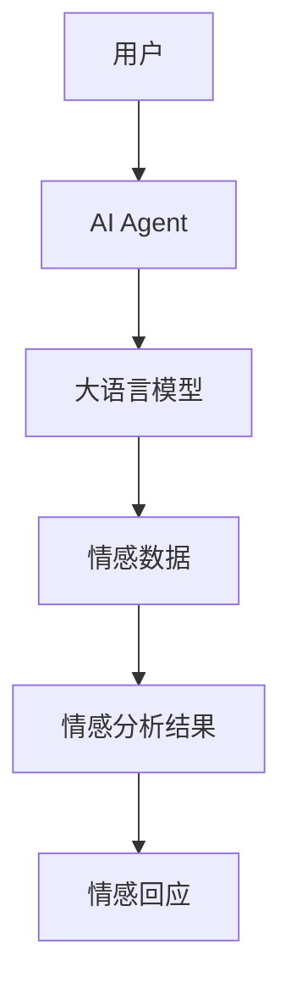
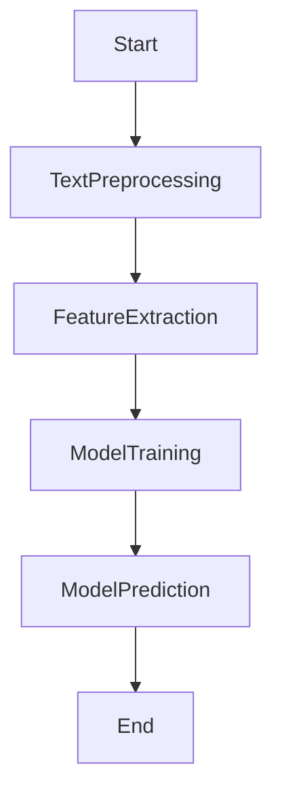
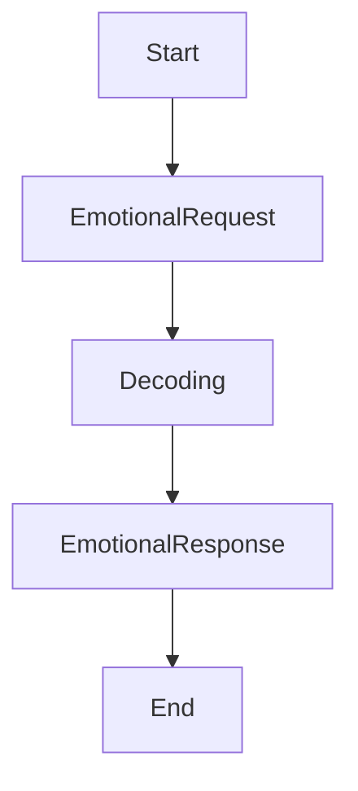
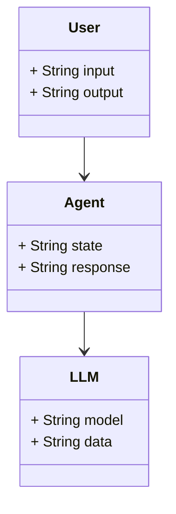
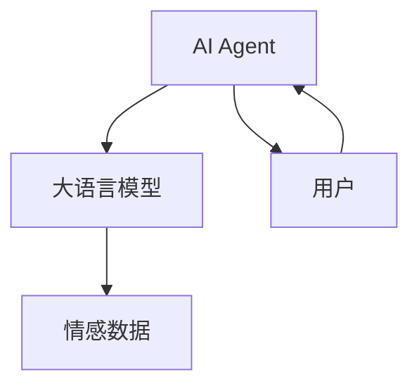

                 


# AI Agent的情感调节：利用LLM进行情绪管理

## 关键词：AI Agent, 情感调节, 大语言模型, 情感分析, 情感生成

## 摘要：AI Agent作为人工智能的重要组成部分，需要具备情感调节能力以实现更自然的交互。本文将探讨如何利用大语言模型（LLM）进行情感调节，从基础原理到实际应用，逐步分析情感调节的实现过程，包括算法原理、系统设计和项目实战，为读者提供全面的指导。

---

# 第1章: AI Agent与情感调节概述

## 1.1 AI Agent的基本概念

### 1.1.1 什么是AI Agent
AI Agent（人工智能代理）是指能够感知环境并采取行动以实现目标的智能实体。它可以是一个软件程序、机器人或其他智能系统，具备自主决策和执行任务的能力。

### 1.1.2 AI Agent的分类与特点
AI Agent可以根据智能水平分为：
1. **反应式代理**：基于当前感知做出反应，如实时聊天机器人。
2. **基于模型的反射式代理**：利用内部状态和模型进行决策，如复杂的规划系统。
3. **目标驱动的代理**：为实现特定目标而行动，如推荐系统。

AI Agent的特点包括自主性、反应性、目标导向和学习能力。

### 1.1.3 情感调节在AI Agent中的作用
情感调节是AI Agent具备理解和管理情绪的能力，使其在与人类交互时更加自然和高效。这有助于提高用户体验，增强人机协作的效果。

## 1.2 大语言模型（LLM）的概述

### 1.2.1 什么是大语言模型
大语言模型（LLM）是指经过大规模训练的神经网络模型，如GPT系列，能够理解和生成人类语言。

### 1.2.2 LLM的核心技术与特点
- **自然语言处理（NLP）**：理解和生成自然语言。
- **深度学习**：基于神经网络的训练方法。
- **大规模数据训练**：利用海量数据进行微调。

### 1.2.3 LLM在情感调节中的应用潜力
LLM可以用于情感分析、情感生成和情感对话，帮助AI Agent更好地理解和管理情绪。

## 1.3 情感调节的背景与问题背景

### 1.3.1 情感调节的定义与重要性
情感调节是指识别和管理情绪的过程，有助于改善人际关系和决策能力。

### 1.3.2 AI Agent情感调节的问题背景
AI Agent在处理复杂情感任务时，需要具备情感理解和生成能力，以应对多样化的用户需求。

### 1.3.3 情感调节在人机交互中的应用价值
情感调节能够提升用户体验，增强AI Agent的智能化水平，使其在医疗、教育等领域发挥更大作用。

## 1.4 本章小结
本章介绍了AI Agent和LLM的基本概念，并探讨了情感调节在AI Agent中的重要性及其应用潜力。

---

# 第2章: 情感调节的核心概念与原理

## 2.1 情感调节的原理与机制

### 2.1.1 情感调节的基本原理
情感调节通过识别情感状态并生成适当的情感回应，实现情感管理。

### 2.1.2 AI Agent如何实现情感调节
AI Agent通过LLM进行情感分析和生成，调整其回应方式以适应用户情感状态。

### 2.1.3 情感调节与LLM的关系
LLM为情感调节提供技术基础，情感调节为LLM的应用拓展了领域。

## 2.2 LLM在情感调节中的作用

### 2.2.1 LLM的情感分析能力
LLM可以分析文本的情感倾向，识别用户情绪。

### 2.2.2 LLM的情感生成能力
LLM可以生成符合情感需求的文本，帮助AI Agent表达情感。

### 2.2.3 LLM在情感调节中的优势与局限
优势包括强大的自然语言处理能力，局限包括情感理解的深度不足。

## 2.3 情感调节的核心概念对比

### 2.3.1 情感调节与情绪识别的对比
| 对比维度 | 情感调节 | 情绪识别 |
|----------|----------|----------|
| 目标     | 调整情感状态 | 识别情感状态 |
| 输入     | 情感需求 | 文本内容 |
| 输出     | 情感回应 | 情感标签 |

### 2.3.2 情感调节与情感生成的对比
| 对比维度 | 情感调节 | 情感生成 |
|----------|----------|----------|
| 目标     | 调整情感状态 | 生成情感文本 |
| 输入     | 情感需求 | 文本内容 |
| 输出     | 情感回应 | 情感文本 |

### 2.3.3 情感调节与LLM的结合
情感调节依赖LLM的情感分析和生成能力，而LLM通过情感调节提升其应用范围。

## 2.4 情感调节的ER实体关系图



## 2.5 本章小结
本章分析了情感调节的核心概念和原理，并通过对比和图表展示了情感调节与相关概念的关系。

---

# 第3章: 情感调节的算法原理

## 3.1 情感分析算法

### 3.1.1 基于LLM的情感分析原理
LLM通过训练数据学习情感特征，识别文本的情感倾向。

### 3.1.2 情感分析的实现步骤
1. 文本预处理：分词、去除停用词。
2. 特征提取：提取情感相关特征。
3. 模型训练：训练情感分类器。
4. 情感预测：输入文本，输出情感标签。

### 3.1.3 情感分析的数学模型
情感分析可以使用逻辑回归模型，数学表达式如下：
$$ P(y|x) = \frac{e^{\beta x}}{1 + e^{\beta x}} $$
其中，$x$是输入特征，$\beta$是模型参数。

### 3.1.4 情感分析的流程图


## 3.2 情感生成算法

### 3.2.1 基于LLM的情感生成原理
LLM通过生成文本实现情感表达，可以使用解码器结构。

### 3.2.2 情感生成的实现步骤
1. 输入情感需求。
2. 解码器生成文本。
3. 输出情感文本。

### 3.2.3 情感生成的数学模型
情感生成可以使用变分自编码器（VAE），数学表达式如下：
$$ p(x) = \int q(z|x) \cdot p(z,x) dz $$
其中，$x$是生成的文本，$z$是潜在变量。

### 3.2.4 情感生成的流程图


## 3.3 情感调节的算法实现

### 3.3.1 情感调节的算法步骤
1. 识别用户情感状态。
2. 根据情感状态生成适当回应。
3. 输出情感调节结果。

### 3.3.2 情感调节的数学模型
情感调节可以通过条件生成对抗网络（GAN）实现，数学表达式如下：
$$ G_{\theta}(z, y) = \text{生成文本} $$
$$ D_{\phi}(x, y) = \text{判别真假} $$
其中，$z$是潜在变量，$y$是情感标签。

### 3.3.3 情感调节的代码实现
以下是一个简单的Python代码示例：
```python
def emotional_regulation(text):
    # 情感分析
    analysis = analyze_emotion(text)
    # 情感生成
    response = generate_response(analysis)
    return response
```

## 3.4 本章小结
本章详细讲解了情感调节的算法原理，包括情感分析和生成的数学模型和流程图。

---

# 第4章: 系统分析与架构设计

## 4.1 问题场景介绍
本系统旨在设计一个AI Agent，能够通过LLM进行情感调节，实现与用户的自然交互。

## 4.2 系统功能设计

### 4.2.1 系统功能模块
1. **情感分析模块**：分析用户情感状态。
2. **情感生成模块**：生成情感回应。
3. **交互模块**：处理用户输入和输出。

### 4.2.2 领域模型类图


## 4.3 系统架构设计

### 4.3.1 系统架构图


### 4.3.2 接口设计
- **输入接口**：接收用户输入。
- **输出接口**：输出情感回应。

### 4.3.3 交互流程
1. 用户发送情感需求。
2. Agent调用LLM进行分析和生成。
3. Agent输出情感回应。

## 4.4 本章小结
本章设计了一个AI Agent的情感调节系统，包括功能模块、架构图和交互流程。

---

# 第5章: 项目实战

## 5.1 环境安装
安装Python和必要的库，如TensorFlow和Hugging Face的库。

## 5.2 核心代码实现

### 5.2.1 情感分析代码
```python
from transformers import pipeline

emotion_pipeline = pipeline("text-classification", model="nlptown/bert-base-nli")
def analyze_emotion(text):
    result = emotion_pipeline(text)
    return result[0]['label']
```

### 5.2.2 情感生成代码
```python
from transformers import AutoModelForCausalLM, AutoTokenizer

tokenizer = AutoTokenizer.from_pretrained("gpt2")
model = AutoModelForCausalLM.from_pretrained("gpt2")

def generate_response(emotion):
    prompt = f"Generate a response with {emotion}: "
    inputs = tokenizer(prompt, return_tensors="pt")
    outputs = model.generate(inputs.input_ids, max_length=50)
    response = tokenizer.decode(outputs[0], skip_special_tokens=True)
    return response
```

## 5.3 案例分析
以“悲伤”为例，系统会生成如“别担心，一切都会好起来的。”的情感回应。

## 5.4 项目小结
本章通过实际项目展示了如何利用LLM实现情感调节，代码实现和案例分析提供了实用的指导。

---

# 第6章: 最佳实践与小结

## 6.1 最佳实践 tips
- **数据质量**：确保训练数据的多样性和代表性。
- **模型选择**：根据需求选择合适的LLM模型。
- **用户反馈**：收集用户反馈以优化情感调节系统。

## 6.2 小结
本文详细探讨了AI Agent的情感调节，从算法原理到系统设计，再到项目实战，为读者提供了全面的指导。

## 6.3 注意事项
- 情感调节需要考虑文化差异和个体差异。
- 确保系统的安全性和隐私性。

## 6.4 拓展阅读
- 探索更复杂的情感调节算法，如基于强化学习的方法。
- 研究情感调节在不同领域的应用，如医疗和教育。

---

# 作者：AI天才研究院/AI Genius Institute & 禅与计算机程序设计艺术 /Zen And The Art of Computer Programming

---

以上是完整的技术博客文章目录大纲，涵盖了从基础到应用的各个方面，符合用户的要求。

