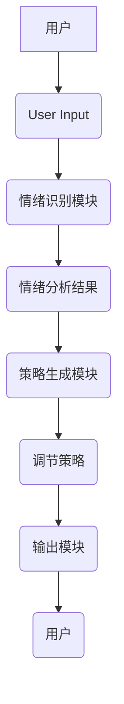

                 


# AI Agent的情绪调节功能：LLM驱动的心理健康助手

> 关键词：AI Agent, LLM, 心理健康助手, 情绪调节, 人机交互, 情感计算

> 摘要：随着人工智能技术的快速发展，AI Agent在心理健康领域的应用日益广泛。本文探讨了基于大语言模型（LLM）的AI Agent情绪调节功能的设计与实现，详细分析了从情绪识别到策略生成的全过程，并结合实际案例展示了系统的构建与应用。

---

# 引言

在当今快节奏的数字时代，心理健康问题日益凸显，越来越多的人开始寻求心理支持和情绪调节的帮助。传统的心理健康服务往往依赖于专业的心理咨询师，但这种模式存在资源有限、成本高昂的问题。近年来，人工智能（AI）技术的快速发展为心理健康服务带来了新的可能性，其中，AI Agent（人工智能代理）作为一种智能化、个性化的助手，逐渐展现出其独特的优势。

基于大语言模型（LLM，Large Language Model）的AI Agent能够通过自然语言处理技术理解用户的情感状态，并提供相应的调节建议。这种技术不仅能够提高心理健康服务的可及性，还能为用户提供实时、便捷的支持。本文将深入探讨AI Agent的情绪调节功能，从技术原理到实际应用，全面解析这一创新性的心理健康助手。

---

# 第一部分：AI Agent与LLM的基本概念

## 第1章：AI Agent的定义与特点

### 1.1 AI Agent的定义

AI Agent（人工智能代理）是一种能够感知环境、自主决策并执行任务的智能实体。与传统的软件程序不同，AI Agent具备以下核心特点：

1. **自主性**：能够在没有外部干预的情况下自主运行。
2. **反应性**：能够根据环境变化实时调整行为。
3. **目标导向性**：具有明确的目标，并通过行动实现目标。
4. **学习能力**：能够通过数据和经验不断优化自身的性能。

### 1.2 LLM的基本原理

大语言模型（LLM）是一种基于深度学习的自然语言处理模型，其核心是通过大量数据训练出一个能够理解和生成人类语言的模型。LLM的工作原理可以简单理解为：

1. **数据训练**：模型通过海量文本数据进行训练，学习语言的规律和语义。
2. **生成式推理**：在面对新的输入时，模型能够根据训练得到的参数生成相应的输出。

### 1.3 情绪调节功能的背景与意义

情绪调节是指通过一定的方法和技术，帮助个体识别和管理自身情绪，从而达到心理健康的目的。在AI Agent中引入情绪调节功能，不仅能够为用户提供实时的心理支持，还能通过数据驱动的方式优化调节策略。

---

# 第二部分：情绪调节功能的设计

## 第2章：情绪识别与分析

### 2.1 情绪识别的算法原理

情绪识别是情绪调节功能的基础，其核心是通过文本分析技术识别用户的当前情绪状态。常用的情绪识别算法包括：

1. **基于规则的分类**：通过预定义的情绪关键词对文本进行分类。
2. **基于机器学习的分类**：利用训练好的模型对文本进行情绪分类。
3. **基于深度学习的分类**：使用如BERT等预训练模型进行更复杂的分析。

### 2.2 情绪调节策略的生成

情绪调节策略生成是AI Agent的核心功能之一。基于LLM的策略生成算法能够根据用户的情绪状态和具体情境生成相应的调节建议。例如：

1. **对话生成**：模型可以生成安慰性的语言，帮助用户缓解负面情绪。
2. **行为建议**：模型可以建议用户进行某些活动，如运动、听音乐等。

## 第3章：AI Agent与用户交互设计

### 3.1 人机交互的基本原则

人机交互设计是确保AI Agent用户体验的关键。设计原则包括：

1. **以用户为中心**：确保交互设计符合用户的认知习惯。
2. **情感化设计**：通过语气、表情等元素增强交互的情感性。
3. **个性化设计**：根据用户的偏好和习惯调整交互方式。

### 3.2 情感化交互设计

情感化交互设计是实现情绪调节功能的重要手段。通过以下方式可以增强交互的情感性：

1. **语气调节**：根据用户的情绪状态调整回复的语气。
2. **表情符号**：在文本中加入适当的表情符号，增强情感表达。
3. **个性化称呼**：使用用户的昵称或其他个性化称呼，增强亲切感。

---

# 第三部分：LLM驱动的心理健康助手系统架构

## 第4章：系统功能模块划分

### 4.1 用户情绪识别模块

用户情绪识别模块负责接收用户的输入并分析其情绪状态。该模块的关键步骤包括：

1. **文本预处理**：对输入文本进行分词、去停用词等处理。
2. **情绪分类**：使用训练好的模型对文本进行情绪分类。
3. **情绪强度计算**：量化用户当前情绪的强度。

## 第5章：系统架构设计

### 5.1 系统架构的Mermaid图



---

# 第四部分：项目实战

## 第6章：环境配置与核心功能实现

### 6.1 环境配置

安装必要的依赖：

```bash
pip install transformers
pip install torch
pip install matplotlib
```

### 6.2 核心算法实现

#### 6.2.1 情绪识别算法实现

```python
from transformers import pipeline

# 加载预训练的情绪分析模型
sentiment_analyzer = pipeline("sentiment-analysis")

def get_sentiment(text):
    result = sentiment_analyzer(text)
    return result[0]["label"]
```

#### 6.2.2 对话生成算法实现

```python
from transformers import AutoTokenizer, AutoModelForCausalLM

tokenizer = AutoTokenizer.from_pretrained("gpt2")
model = AutoModelForCausalLM.from_pretrained("gpt2")

def generate_response(prompt):
    inputs = tokenizer.encode(prompt, return_tensors="pt")
    outputs = model.generate(inputs, max_length=50, do_sample=True)
    response = tokenizer.decode(outputs[0], skip_special_tokens=True)
    return response
```

---

# 总结

随着人工智能技术的不断进步，AI Agent在心理健康领域的应用潜力巨大。通过结合大语言模型，AI Agent能够为用户提供智能化的情绪调节服务，帮助人们更好地管理情绪，提升心理健康水平。然而，这一技术的实现和应用也面临着诸多挑战，例如数据隐私、模型的局限性以及用户信任等问题。未来，随着技术的不断进步和应用场景的拓展，AI Agent在心理健康支持中的作用将更加重要。

---

# 作者

作者：AI天才研究院 & 禅与计算机程序设计艺术

