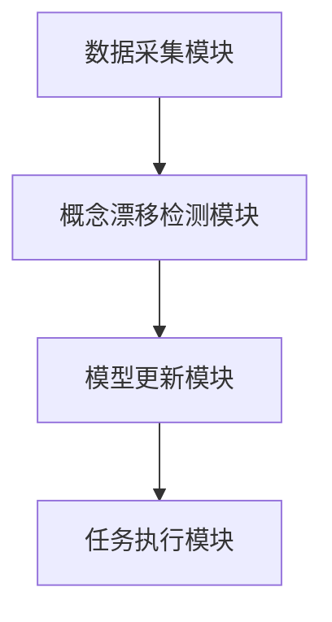

                 


# AI Agent的持续学习与概念漂移适应策略

> 关键词：AI Agent，持续学习，概念漂移，机器学习，自适应系统

> 摘要：本文深入探讨了AI Agent在动态环境中的持续学习能力，重点分析了概念漂移对AI Agent的影响及适应策略。通过系统化的分析，结合算法原理、系统架构设计和实际案例，本文为AI Agent的持续学习与概念漂移适应提供了全面的解决方案。

---

# 第一部分: AI Agent的持续学习与概念漂移适应策略基础

## 第1章: AI Agent的基本概念与持续学习的必要性

### 1.1 AI Agent的定义与特点

#### 1.1.1 AI Agent的基本定义
AI Agent（人工智能代理）是指能够感知环境、自主决策并执行任务的智能实体。它能够通过与环境交互，主动采取行动以实现特定目标。与传统程序不同，AI Agent具备以下特点：

- **自主性**：能够在没有外部干预的情况下独立运作。
- **反应性**：能够实时感知环境并做出反应。
- **目标导向**：所有行为都以实现特定目标为导向。
- **学习能力**：通过经验改进性能，具备持续学习的能力。

#### 1.1.2 AI Agent的核心特点
AI Agent的核心特点包括：
- **模块化设计**：通常由感知模块、决策模块、执行模块和学习模块组成。
- **动态适应性**：能够在动态环境中调整行为以应对变化。
- **可扩展性**：能够根据需求扩展功能或处理更复杂的任务。

#### 1.1.3 AI Agent与传统AI的区别
与传统AI相比，AI Agent具有以下区别：
- **自主性**：AI Agent能够自主决策，而传统AI通常依赖外部指令。
- **环境交互**：AI Agent能够与环境交互，而传统AI主要依赖于预设数据。
- **持续性**：AI Agent具备持续学习能力，能够不断优化性能，而传统AI通常在训练阶段完成，难以适应动态变化。

### 1.2 持续学习的定义与背景

#### 1.2.1 持续学习的定义
持续学习（Continuous Learning）是指AI Agent在任务执行过程中，能够不断学习新的知识和技能，以适应环境的变化。与传统的批量学习不同，持续学习强调在线学习和模型更新，能够在动态环境中保持高性能。

#### 1.2.2 持续学习的必要性
在动态环境中，数据分布和任务目标可能会发生改变，这要求AI Agent具备持续学习的能力，以应对以下挑战：
- **数据变化**：环境中的数据分布可能发生改变，需要模型能够实时更新。
- **任务变化**：任务目标可能发生变化，需要模型具备灵活性以适应新任务。
- **知识扩展**：新知识的引入要求模型能够不断扩展其知识库。

#### 1.2.3 持续学习与在线学习的区别
虽然持续学习和在线学习都强调实时更新，但两者有显著区别：
- **数据处理方式**：持续学习通常处理的是流式数据，而在线学习可以处理批量数据。
- **学习目标**：持续学习注重长期性能优化，而在线学习注重实时响应。
- **应用场景**：持续学习适用于动态环境中的任务，而在线学习适用于需要实时反馈的任务。

## 第2章: 概念漂移的定义与挑战

### 2.1 概念漂移的定义
概念漂移（Concept Drift）是指数据分布或任务目标在时间上的变化，导致模型性能下降的现象。概念漂移可以分为以下几种类型：
- **渐进式漂移**：数据分布逐渐发生变化，模型性能缓慢下降。
- **突然式漂移**：数据分布突然发生重大变化，模型性能急剧下降。
- **随机漂移**：数据分布随机变化，模型性能波动较大。

### 2.2 概念漂移的挑战
概念漂移对AI Agent提出了以下挑战：
- **数据变化的不可预测性**：数据分布的变化可能不可预测，增加了模型更新的难度。
- **模型更新的复杂性**：概念漂移要求模型不断更新，但模型更新可能需要重新训练，耗时且资源消耗大。
- **计算资源的限制**：在线更新模型可能受到计算资源的限制，尤其是在资源受限的环境中。

### 2.3 AI Agent在概念漂移环境中的适应性需求
为了应对概念漂移，AI Agent需要具备以下能力：
- **实时检测**：能够实时检测概念漂移的发生。
- **自适应学习**：能够在检测到概念漂移后，快速调整模型以适应新环境。
- **高效更新**：能够在有限的计算资源下，高效地更新模型。

## 第3章: AI Agent在概念漂移环境中的适应性需求

### 3.1 概念漂移对AI Agent的影响
概念漂移对AI Agent的影响包括：
- **模型性能下降**：概念漂移会导致模型性能下降，影响任务执行效果。
- **任务目标变化**：概念漂移可能导致任务目标发生变化，需要模型重新调整策略。
- **知识库更新**：概念漂移要求模型不断更新知识库，以适应新环境。

### 3.2 持续学习在AI Agent中的作用
持续学习在AI Agent中的作用包括：
- **应对概念漂移**：通过持续学习，AI Agent能够不断更新模型，适应环境变化。
- **提升性能**：持续学习能够通过实时更新模型，提升任务执行效果。
- **扩展知识库**：持续学习能够帮助AI Agent不断扩展知识库，应对新任务。

---

# 第二部分: 持续学习与概念漂移的核心概念

## 第4章: 持续学习的核心原理

### 4.1 持续学习的模型更新机制

#### 4.1.1 增量学习的基本原理
增量学习（Incremental Learning）是指在新数据流的情况下，逐步更新模型参数的过程。其基本原理包括：
- **在线更新**：模型参数在新数据到达时实时更新。
- **增量优化**：通过优化算法逐步调整模型参数，以适应新数据。

#### 4.1.2 知识蒸馏的概念与应用
知识蒸馏（Knowledge Distillation）是一种将知识从复杂模型转移到简单模型的技术。其核心思想是：
- **教师模型**：复杂的模型作为教师，指导简单模型的学习。
- **学生模型**：简单的模型作为学生，通过模仿教师模型学习知识。
- **蒸馏过程**：通过软目标和硬目标的结合，实现知识的传递。

#### 4.1.3 参数调整与权重更新
在持续学习中，模型参数需要不断调整和更新。参数调整的关键在于：
- **优化算法**：使用合适的优化算法（如Adam、SGD）调整参数。
- **学习率**：合理设置学习率，避免参数更新过快或过慢。
- **正则化**：通过正则化技术防止过拟合，保持模型的泛化能力。

### 4.2 持续学习中的遗忘与记忆机制

#### 4.2.1 遗忘曲线的理论基础
遗忘曲线（Forgetting Curve）描述了人类记忆的衰减规律。在持续学习中，模型也会面临“遗忘”的问题，需要通过遗忘曲线理论来指导模型更新。

#### 4.2.2 基于记忆网络的持续学习
记忆网络（Memory Network）是一种用于存储和检索知识的模型。通过记忆网络，AI Agent可以存储过去的经验，并在需要时快速检索，以辅助当前任务的决策。

#### 4.2.3 增量遗忘的策略
增量遗忘（Incremental Forgetting）是一种通过遗忘旧知识来为新知识腾出空间的技术。其策略包括：
- **随机遗忘**：随机选择部分旧知识进行遗忘。
- **主动遗忘**：选择性遗忘对当前任务影响较小的旧知识。
- **渐进式遗忘**：逐步遗忘旧知识，保持知识的连续性。

## 第5章: 概念漂移的检测与建模

### 5.1 概念漂移检测的方法

#### 5.1.1 基于统计的方法
基于统计的方法通过分析数据分布的变化来检测概念漂移。常用的方法包括：
- **均值漂移检测**：通过计算数据分布的均值变化来判断概念漂移。
- **方差检测**：通过分析数据分布的方差变化来检测概念漂移。

#### 5.1.2 基于模型的方法
基于模型的方法通过构建模型并监控模型性能的变化来检测概念漂移。常用的方法包括：
- **性能监控**：通过模型在测试集上的性能变化来判断概念漂移。
- **模型更新时间窗口**：通过设置模型更新的时间窗口，监控模型性能的变化。

#### 5.1.3 基于性能监控的方法
基于性能监控的方法通过实时监控模型性能的变化来检测概念漂移。常用的方法包括：
- **性能阈值**：设定性能阈值，当性能低于阈值时触发概念漂移检测。
- **性能变化率**：通过性能变化率来判断概念漂移的发生。

### 5.2 概念漂移的建模与分类

#### 5.2.1 概念漂移的类型分析
概念漂移可以分为以下几种类型：
- **渐进式漂移**：数据分布逐渐变化，模型性能缓慢下降。
- **突然式漂移**：数据分布突然变化，模型性能急剧下降。
- **随机漂移**：数据分布随机变化，模型性能波动较大。

#### 5.2.2 概念漂移的时间序列建模
时间序列建模是检测概念漂移的一种有效方法。常用的时间序列建模方法包括：
- **ARIMA模型**：自回归积分滑动平均模型，适用于线性时间序列分析。
- **LSTM模型**：长短期记忆网络，适用于非线性时间序列分析。

#### 5.2.3 概念漂移的潜在因素分析
概念漂移的潜在因素包括：
- **数据源的变化**：数据源的变化可能导致数据分布的变化。
- **任务目标的变化**：任务目标的变化可能导致模型需要重新调整。
- **环境变化**：环境的变化可能导致数据分布的变化。

---

# 第三部分: 持续学习与概念漂移的算法原理

## 第6章: 持续学习算法的数学模型

### 6.1 持续学习的数学基础

#### 6.1.1 线性回归模型
线性回归模型是最简单的持续学习模型之一。其数学表达式为：
$$ y = \theta x + b $$
其中，θ是模型参数，x是输入，b是截距。

#### 6.1.2 支持向量机模型
支持向量机（SVM）是一种常用的分类模型。其数学表达式为：
$$ \text{min} \frac{1}{2}||\theta||^2 + C \sum_{i=1}^n \xi_i $$
其中，θ是模型参数，C是惩罚系数，ξ是松弛变量。

#### 6.1.3 神经网络模型
神经网络模型是一种复杂的持续学习模型。其数学表达式为：
$$ y = f(x, \theta) $$
其中，f是神经网络函数，θ是模型参数。

### 6.2 持续学习中的模型更新

#### 6.2.1 增量学习的数学模型
增量学习的数学模型可以表示为：
$$ \theta_{t+1} = \theta_t + \alpha \nabla L $$
其中，θ_t是当前模型参数，α是学习率，L是损失函数。

#### 6.2.2 知识蒸馏的数学模型
知识蒸馏的数学模型可以表示为：
$$ L_{\text{distill}} = \alpha L_{\text{student}} + (1-\alpha) L_{\text{teacher}} $$
其中，α是蒸馏系数，L_student是学生模型的损失，L_teacher是教师模型的损失。

#### 6.2.3 参数调整的数学模型
参数调整的数学模型可以表示为：
$$ \theta_{t+1} = \theta_t + \eta \nabla L $$
其中，η是学习率，L是损失函数。

## 第7章: 概念漂移的检测与建模

### 7.1 概念漂移检测的数学模型

#### 7.1.1 基于统计的检测模型
基于统计的检测模型可以表示为：
$$ p(x) = \frac{1}{Z} \exp(-E(x)) $$
其中，p(x)是数据分布的概率密度函数，E(x)是能量函数，Z是归一化常数。

#### 7.1.2 基于模型的检测模型
基于模型的检测模型可以表示为：
$$ y = f(x, \theta) $$
其中，f是检测模型，θ是模型参数。

#### 7.1.3 基于性能的检测模型
基于性能的检测模型可以表示为：
$$ P = \frac{1}{N} \sum_{i=1}^N \text{accuracy}(x_i, y_i) $$
其中，P是模型性能，N是测试样本数量，accuracy是准确率。

### 7.2 概念漂移的建模与分类

#### 7.2.1 时间序列建模
时间序列建模可以表示为：
$$ y_t = \phi y_{t-1} + \epsilon $$
其中，y_t是当前值，φ是自回归系数，ε是随机噪声。

#### 7.2.2 概念漂移分类模型
概念漂移分类模型可以表示为：
$$ y = \text{argmax}_{k} P(y=k|x) $$
其中，P(y=k|x)是条件概率。

#### 7.2.3 概念漂移的潜在因素分析
概念漂移的潜在因素分析可以表示为：
$$ \text{drift} = \sum_{i=1}^n \lambda_i x_i $$
其中，λ_i是因素权重，x_i是潜在因素。

---

# 第四部分: 持续学习与概念漂移的系统架构设计

## 第8章: 系统架构设计

### 8.1 系统功能设计

#### 8.1.1 系统模块划分
系统模块包括：
- **数据采集模块**：负责采集实时数据。
- **概念漂移检测模块**：负责检测概念漂移。
- **模型更新模块**：负责更新模型参数。
- **任务执行模块**：负责执行具体任务。

#### 8.1.2 系统功能流程
系统功能流程如下：
1. 数据采集模块采集实时数据。
2. 概念漂移检测模块检测数据分布的变化。
3. 如果检测到概念漂移，模型更新模块更新模型参数。
4. 任务执行模块根据更新后的模型执行任务。

### 8.2 系统架构设计

#### 8.2.1 系统架构图


#### 8.2.2 系统接口设计
系统接口包括：
- 数据接口：负责数据的输入输出。
- 模型接口：负责模型的加载和更新。
- 任务接口：负责任务的执行和结果输出。

#### 8.2.3 系统交互流程
系统交互流程如下：
1. 数据采集模块通过数据接口接收实时数据。
2. 概念漂移检测模块通过模型接口加载当前模型。
3. 概念漂移检测模块检测数据分布的变化。
4. 如果检测到概念漂移，模型更新模块通过模型接口更新模型参数。
5. 任务执行模块通过任务接口执行具体任务，并返回结果。

---

# 第五部分: 持续学习与概念漂移的项目实战

## 第9章: 项目实战

### 9.1 环境安装

#### 9.1.1 系统要求
系统要求包括：
- 操作系统：Windows 10或更高版本，或Linux系统。
- Python版本：Python 3.6或更高版本。
- 硬件要求：建议使用4核及以上处理器，8GB及以上内存。

#### 9.1.2 依赖安装
依赖安装包括：
- Python库：numpy、pandas、scikit-learn、tensorflow、pymermaid。
- 其他工具：Jupyter Notebook、IDE（如PyCharm）。

### 9.2 系统核心实现

#### 9.2.1 概念漂移检测模块实现
```python
import numpy as np
from sklearn.metrics import accuracy_score

def detect_drift(X_train, y_train, X_test, y_test):
    # 训练模型
    model = ...  # 具体模型实现
    model.fit(X_train, y_train)
    # 预测测试样本
    y_pred = model.predict(X_test)
    # 计算准确率
    acc = accuracy_score(y_test, y_pred)
    # 设置阈值
    threshold = 0.95
    if acc < threshold:
        return True  # 检测到概念漂移
    else:
        return False  # 未检测到概念漂移
```

#### 9.2.2 模型更新模块实现
```python
def update_model(X_train, y_train, model):
    # 更新模型
    model.fit(X_train, y_train)
    return model
```

#### 9.2.3 任务执行模块实现
```python
def execute_task(model, X_task):
    # 执行任务
    y_pred = model.predict(X_task)
    return y_pred
```

### 9.3 案例分析

#### 9.3.1 数据集准备
数据集包括：
- 训练数据：X_train, y_train
- 测试数据：X_test, y_test
- 任务数据：X_task

#### 9.3.2 概念漂移检测
```python
# 检测概念漂移
drift = detect_drift(X_train, y_train, X_test, y_test)
if drift:
    # 更新模型
    model = update_model(X_train, y_train, model)
else:
    # 不更新模型
    pass
```

#### 9.3.3 模型更新与任务执行
```python
# 执行任务
y_pred = execute_task(model, X_task)
```

### 9.4 项目小结
通过本项目的实战，我们掌握了AI Agent的持续学习与概念漂移适应策略的实现方法。通过概念漂移检测模块、模型更新模块和任务执行模块的协同工作，能够有效地应对动态环境中的概念漂移问题。

---

# 第六部分: 持续学习与概念漂移的最佳实践

## 第10章: 最佳实践与总结

### 10.1 最佳实践

#### 10.1.1 模型选择
- 选择适合持续学习的模型，如线性回归、支持向量机、神经网络等。
- 根据任务需求选择合适的模型。

#### 10.1.2 模型更新策略
- 采用增量学习方法，实时更新模型参数。
- 使用知识蒸馏技术，提升模型的泛化能力。
- 设置合适的学习率和正则化参数，防止过拟合。

#### 10.1.3 概念漂移检测
- 采用多种检测方法的组合，提高检测的准确性。
- 设置合理的性能阈值，避免误报和漏报。

### 10.2 小结
通过本文的系统阐述和实战案例，我们深入理解了AI Agent的持续学习与概念漂移适应策略。通过合理的设计和优化，AI Agent能够在动态环境中保持高性能，应对各种概念漂移带来的挑战。

### 10.3 注意事项

#### 10.3.1 计算资源限制
- 在资源受限的环境中，需要选择高效的模型更新方法。
- 优化模型参数，减少计算消耗。

#### 10.3.2 模型复杂度
- 避免选择过于复杂的模型，防止计算资源消耗过大。
- 通过正则化技术控制模型复杂度。

#### 10.3.3 概念漂移的不确定性
- 在概念漂移的检测和建模中，需要考虑数据的不确定性。
- 采用鲁棒的检测方法，提高检测的可靠性。

### 10.4 拓展阅读

#### 10.4.1 经典文献
-《Incremental Learning: A Survey》
-《Concept Drift Detection and Adaptation: A Review》

#### 10.4.2 最新研究
-《Continual Learning in Neural Networks: A Comprehensive Survey》
-《Adaptive Neural Networks for Concept Drift: A Review》

---

# 作者

作者：AI天才研究院/AI Genius Institute & 禅与计算机程序设计艺术 /Zen And The Art of Computer Programming

