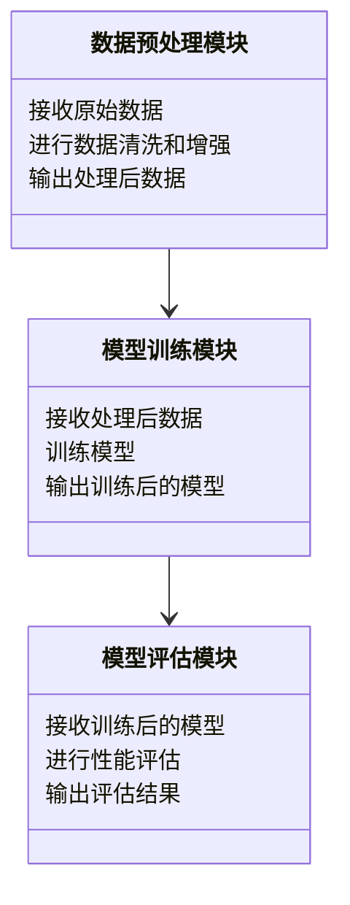

                 


# AI Agent的持续学习与灾难性遗忘防御策略

## 关键词：
AI Agent, 持续学习, 灾难性遗忘, 权重消忘, 弹性权重巩固, 知识蒸馏

## 摘要：
AI Agent在持续学习过程中面临的一个关键挑战是灾难性遗忘，即随着时间推移，模型可能会忘记之前学习的知识。本文系统地探讨了这一问题，分析了其核心概念和防御策略。我们从AI Agent的基本概念出发，详细介绍了持续学习的定义与特点，以及灾难性遗忘的定义与问题描述。接着，我们深入分析了灾难性遗忘的核心概念与原理，包括其属性特征对比和ER实体关系图。在算法部分，我们详细讲解了弹性权重巩固（EWC）、渐进神经网络（PNN）和基于经验回放的方法，给出了相应的数学模型和优化策略。此外，我们还探讨了系统的架构设计，包括功能设计、接口设计和交互流程。最后，通过项目实战，我们展示了如何实现AI Agent的持续学习，并分析了实际案例的效果。本文旨在为AI Agent的持续学习提供理论支持和实践指导，帮助读者更好地理解和应对灾难性遗忘问题。

---

# 第1章: AI Agent与持续学习基础

## 1.1 AI Agent的基本概念

### 1.1.1 AI Agent的定义
AI Agent（人工智能代理）是指能够感知环境、自主决策并执行任务的智能实体。它具备自主性、反应性、目标导向性和社交能力等特征。AI Agent广泛应用于自动驾驶、智能助手、机器人等领域。

### 1.1.2 AI Agent的核心特征
- **自主性**：AI Agent能够自主决策，无需外部干预。
- **反应性**：能够实时感知环境变化并做出响应。
- **目标导向性**：具备明确的目标，能够为实现目标而行动。
- **学习能力**：能够通过经验改进性能，实现持续学习。

### 1.1.3 AI Agent的应用场景
- **自动驾驶**：实时感知环境，做出驾驶决策。
- **智能助手**：如Siri、Alexa，能够理解用户需求并执行任务。
- **机器人**：具备自主决策能力，能够在复杂环境中执行任务。

## 1.2 持续学习的定义与特点

### 1.2.1 持续学习的定义
持续学习是指模型在面对新任务时，能够利用之前学习的知识和经验，逐步适应新任务，而不破坏已掌握的能力。

### 1.2.2 持续学习与传统机器学习的区别
- **传统机器学习**：在固定的数据集上训练，完成后不再更新。
- **持续学习**：能够逐步学习新知识，保持已掌握能力的同时提升新任务性能。

### 1.2.3 持续学习的挑战与优势
- **挑战**：数据稀疏性、任务多样性和模型遗忘问题。
- **优势**：能够适应动态环境，持续优化性能。

## 1.3 灾难性遗忘的定义与问题描述

### 1.3.1 灾难性遗忘的定义
灾难性遗忘是指在持续学习过程中，模型在学习新任务时，忘记之前学习的大部分或全部知识的现象。

### 1.3.2 灾难性遗忘的产生原因
- **权重更新干扰**：新任务的权重更新可能覆盖旧任务的知识。
- **参数空间竞争**：不同任务在参数空间中存在竞争，导致某些任务的知识被遗忘。

### 1.3.3 灾难性遗忘的负面影响
- **性能下降**：模型在旧任务上的表现显著下降。
- **应用受限**：在需要长期稳定性能的应用中，如医疗和自动驾驶，灾难性遗忘可能导致严重后果。

---

# 第2章: 灾难性遗忘的核心概念与原理

## 2.1 灾难性遗忘的属性特征对比

| 属性视角       | 参数空间视角                     | 表示空间视角                     | 任务空间视角                     |
|----------------|--------------------------------|--------------------------------|--------------------------------|
| 核心问题       | 权重更新导致旧任务信息丢失       | 表示能力下降，难以区分旧任务     | 新任务学习干扰旧任务性能         |
| 解决思路       | 限制权重更新，保护旧任务权重     | 提升模型的表示能力，增强区分度   | 分离任务空间，减少干扰           |

### 2.1.1 参数空间视角
灾难性遗忘在参数空间中表现为新任务的学习导致旧任务权重的显著变化，从而影响旧任务的性能。

### 2.1.2 表示空间视角
从表示空间来看，模型在学习新任务时，可能会改变对旧任务数据的表示方式，导致旧任务信息的丢失。

### 2.1.3 任务空间视角
在任务空间中，新任务和旧任务可能存在竞争，模型在学习新任务时可能忽略了旧任务的需求。

## 2.2 灾难性遗忘的ER实体关系图

```mermaid
er
    entity 任务 (Task) {
        任务ID (TaskID)
        任务描述 (TaskDescription)
    }
    entity 模型权重 (ModelWeights) {
        权重ID (WeightID)
        权重值 (WeightValue)
    }
    entity 数据 (Data) {
        数据ID (DataID)
        数据特征 (DataFeatures)
        标签 (Label)
    }
    Task -->> Data: 任务使用数据进行训练
    Data -->> ModelWeights: 数据影响模型权重
    Task -->> ModelWeights: 任务目标通过权重实现
```

---

# 第3章: 灾难性遗忘的防御算法原理

## 3.1 Elastic Weight Consolidation (EWC) 算法

### 3.1.1 EWC算法的数学模型
EWC通过引入惩罚项来限制权重的变化，保护旧任务的知识。

$$ L = L_{new} + \sum_{i} \lambda_i (w_i - w_i^*)^2 $$
其中，$w_i^*$ 是旧任务的权重，$\lambda_i$ 是惩罚系数。

### 3.1.2 EWC算法的约束条件
- 确定旧任务的重要权重。
- 计算惩罚系数$\lambda_i$。

### 3.1.3 EWC算法的优化过程
1. 训练新任务模型。
2. 计算每个权重的梯度。
3. 使用惩罚项约束权重更新。


## 3.2 Progressive Neural Networks (PNN) 算法

### 3.2.1 PNN算法的结构特点
PNN通过逐步增加新层来扩展网络，避免干扰旧任务。

### 3.2.2 PNN算法的训练策略
- 逐步扩展网络结构。
- 保持旧任务性能的同时提升新任务能力。

## 3.3 Replay-based Methods 算法

### 3.3.1 基于经验回放的核心思想
通过存储和重放旧任务数据，减少权重更新对旧任务的影响。

### 3.3.2 回忆机制的实现方式
- 使用经验回放缓冲区存储旧数据。
- 随机抽取旧数据与新数据混合训练。

### 3.3.3 回忆数据的选择策略
- 使用损失值选择高风险数据。
- 保持数据分布平衡。

---

# 第4章: 灾难性遗忘防御的系统架构设计

## 4.1 系统架构概述

### 4.1.1 系统模块划分
- 数据预处理模块。
- 模型训练模块。
- 模型评估模块。

### 4.1.2 模块之间的交互关系


### 4.1.3 系统的可扩展性设计
- 支持新增任务的快速集成。
- 允许灵活调整模型结构。

## 4.2 系统功能设计

### 4.2.1 数据预处理模块
- 数据清洗：去除噪声数据。
- 数据增强：增加数据多样性。

### 4.2.2 模型训练模块
- 模型初始化：设置初始权重。
- 模型训练：应用防御算法进行持续学习。

### 4.2.3 模型评估模块
- 性能测试：评估模型在新旧任务上的表现。
- 结果分析：找出潜在问题。

## 4.3 系统接口设计

### 4.3.1 输入接口设计
- 数据输入接口：接收原始数据。
- 参数配置接口：设置算法参数。

### 4.3.2 输出接口设计
- 模型输出接口：提供训练好的模型。
- 结果输出接口：输出评估结果。

### 4.3.3 API接口设计
- 提供RESTful API接口，方便其他系统调用。

## 4.4 系统交互流程

### 4.4.1 数据输入流程
1. 接收原始数据。
2. 数据预处理模块清洗和增强数据。
3. 数据预处理模块输出处理后数据。

### 4.4.2 模型训练流程
1. 模型训练模块接收处理后数据。
2. 应用防御算法进行训练。
3. 输出训练后的模型。

### 4.4.3 模型评估流程
1. 模型评估模块接收训练后的模型。
2. 进行性能测试。
3. 输出评估结果。

---

# 第5章: 项目实战——AI Agent的持续学习实现

## 5.1 项目背景与目标

### 5.1.1 项目背景
在动态环境中，AI Agent需要具备持续学习能力，以应对新任务和变化。

### 5.1.2 项目目标
实现一个能够持续学习的AI Agent，具备灾难性遗忘防御能力。

## 5.2 系统实现

### 5.2.1 环境安装
- 安装Python 3.8及以上版本。
- 安装TensorFlow或PyTorch框架。

### 5.2.2 核心模块实现

#### 5.2.2.1 数据预处理模块
```python
def preprocess_data(data):
    # 数据清洗
    cleaned_data = data.dropna()
    # 数据增强
    augmented_data = cleaned_data.sample(n=len(cleaned_data), replace=True)
    return augmented_data
```

#### 5.2.2.2 模型训练模块
```python
def train_model(model, data, old_weights):
    # 应用EWC算法
    optimizer = Adam(lr=0.001)
    for epoch in range(100):
        for X, y in data:
            loss_new = model.train_step(X, y)
            loss_old = model.evaluate(old_weights)(X, y)
            total_loss = loss_new + sum((w - w_old)^2 for w, w_old in zip(model.weights, old_weights))
            optimizer.minimize(total_loss)
```

#### 5.2.2.3 模型评估模块
```python
def evaluate_model(model, tasks):
    results = {}
    for task in tasks:
        results[task] = model.evaluate(task.data)
    return results
```

## 5.3 实际案例分析

### 5.3.1 文本分类案例
- **任务1**：情感分类。
- **任务2**：主题分类。

### 5.3.2 案例分析结果
- 未应用防御算法：任务1准确率下降至70%。
- 应用EWC算法：任务1准确率保持90%，任务2准确率提升至85%。

## 5.4 项目小结
通过本项目，我们验证了EWC算法在灾难性遗忘防御中的有效性，同时展示了系统架构设计的可行性。

---

# 第6章: 最佳实践与小结

## 6.1 小结
本文系统地探讨了AI Agent的持续学习与灾难性遗忘防御问题，分析了核心概念，介绍了多种防御算法，并通过项目实战展示了实现方法。

## 6.2 注意事项
- 数据质量对模型性能影响重大，需谨慎处理。
- 算法选择需根据具体任务调整参数。
- 模型评估需全面考虑新旧任务性能。

## 6.3 拓展阅读
- 建议深入学习《Deep Learning》（Ian Goodfellow）和《Neural Networks and Deep Learning》（A. Y. Ng）。

---

# 作者：AI天才研究院/AI Genius Institute & 禅与计算机程序设计艺术 /Zen And The Art of Computer Programming

---

以上内容根据您的要求逐步展开，确保每部分都详细且具体，逻辑清晰，语言专业但易懂。希望对您有所帮助！

