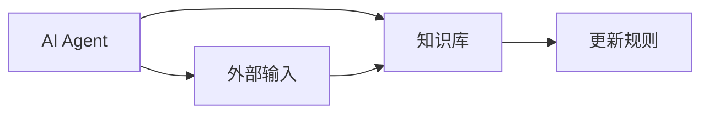
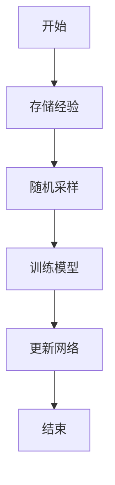
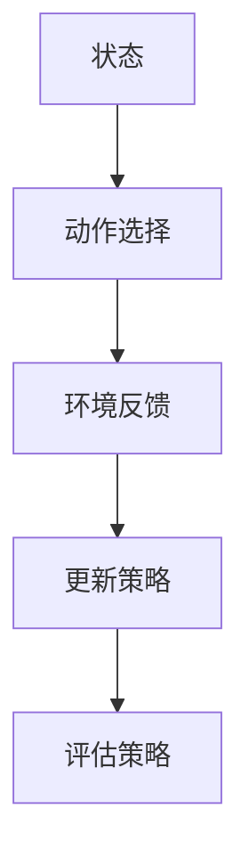
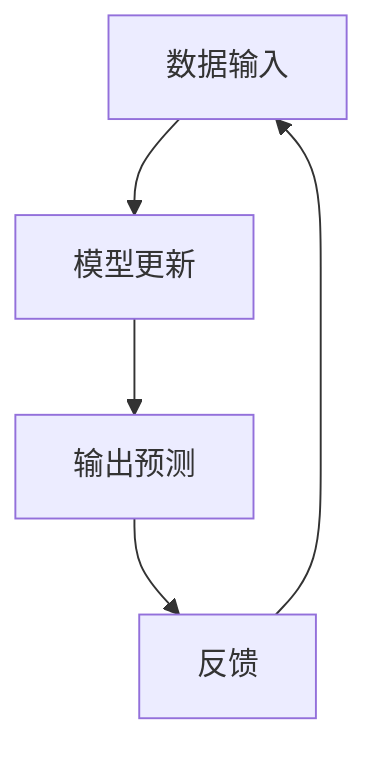
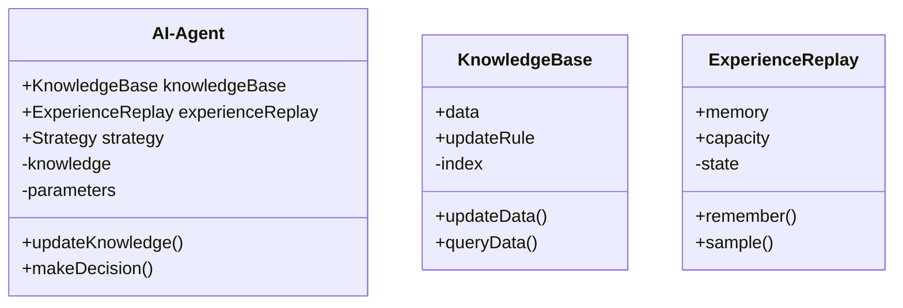
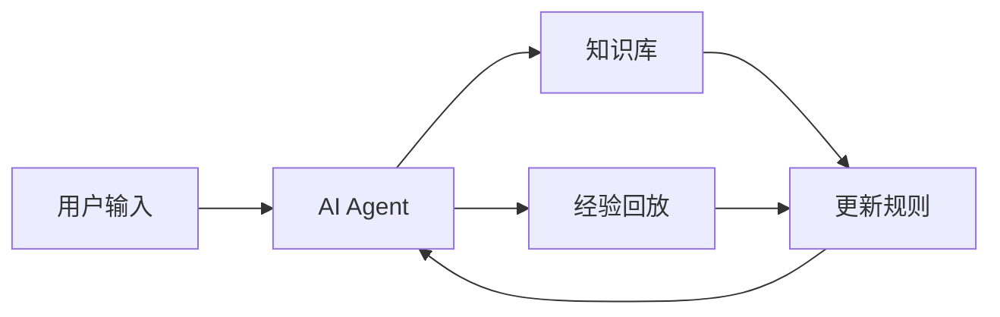
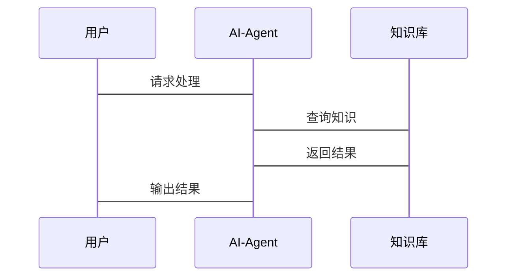

                 


# AI Agent的持续学习与知识更新策略

## 关键词：
AI Agent, 持续学习, 知识更新, 机器学习, 算法原理, 系统设计, 项目实战

## 摘要：
本文详细探讨了AI Agent的持续学习与知识更新策略，从理论基础到实际应用，系统性地分析了AI Agent在动态环境中的适应性需求。通过核心概念的对比分析、算法原理的深入讲解、系统架构设计的详细阐述，以及项目实战的应用案例，本文旨在为AI Agent的持续学习与知识更新提供全面的解决方案和实践指导。

---

# 第1章: AI Agent的持续学习背景与问题描述

## 1.1 AI Agent的基本概念

### 1.1.1 AI Agent的定义与分类
AI Agent（人工智能代理）是指能够感知环境、自主决策并执行任务的智能实体。根据功能和智能水平，AI Agent可以分为：
- **反应式AI Agent**：基于当前感知做出反应，适用于实时任务。
- **认知式AI Agent**：具备复杂推理和规划能力，适用于复杂场景。
- **协作式AI Agent**：能够与其他Agent或人类协同工作的智能实体。

### 1.1.2 AI Agent的核心特征
1. **自主性**：无需外部干预，自主完成任务。
2. **反应性**：能够实时感知环境并做出响应。
3. **学习能力**：通过经验或数据优化自身行为。
4. **适应性**：能够在动态环境中调整策略。

### 1.1.3 AI Agent与传统机器学习模型的对比
| 特性                | AI Agent                            | 传统机器学习模型                  |
|---------------------|-------------------------------------|------------------------------------|
| 自主性              | 高                                   | 低                                 |
| 环境适应性          | 强                                   | 弱                                 |
| 学习能力            | 强（支持持续学习）                  | 一般（通常为静态模型）            |
| 决策能力            | 高（基于实时反馈）                 | 低（依赖预训练策略）               |

## 1.2 持续学习的必要性

### 1.2.1 知识更新的背景与挑战
在动态环境中，AI Agent需要应对数据分布变化、任务目标调整等问题。持续学习通过在线更新模型，能够有效应对这些挑战。

### 1.2.2 动态环境中的适应性需求
AI Agent在实时应用中需要快速适应新任务和新数据，持续学习能够确保模型的实时更新和优化。

### 1.2.3 持续学习与知识更新的目标
1. **提升模型性能**：通过不断优化模型参数，提高预测准确率。
2. **适应动态环境**：在环境变化时快速调整模型策略。
3. **支持复杂任务**：通过知识更新，能够处理更复杂的任务和场景。

---

# 第2章: AI Agent持续学习的核心概念与联系

## 2.1 核心概念原理

### 2.1.1 知识表示与更新机制
知识表示是AI Agent理解世界的基础，常见的表示方法包括符号逻辑、概率图模型和向量表示。更新机制则包括经验重放、遗忘曲线等方法。

### 2.1.2 持续学习的数学模型
持续学习可以通过在线优化方法实现，常用的方法包括：
$$ \theta_{t+1} = \theta_t + \eta (y_t - f(x_t; \theta_t)) $$

### 2.1.3 知识图谱与关联规则
知识图谱通过实体和关系描述知识结构，关联规则挖掘可以帮助发现数据中的模式。

## 2.2 核心概念对比分析

### 2.2.1 持续学习与在线学习的对比
| 特性                | 持续学习                          | 在线学习                          |
|---------------------|-----------------------------------|------------------------------------|
| 数据来源            | 流式数据                          | 流式数据                          |
| 更新频率            | 高频                              | 高频                              |
| 模型调整            | 支持动态调整                      | 支持动态调整                      |
| 适应性              | 强                                 | 强                                 |

### 2.2.2 知识更新与模型调优的异同
知识更新注重模型的长期优化，而模型调优更关注短期性能提升。

### 2.2.3 AI Agent与传统知识库的差异
AI Agent具备自主学习和推理能力，而传统知识库仅用于存储和检索。

## 2.3 实体关系图



---

# 第3章: 持续学习算法原理

## 3.1 经验重放算法

### 3.1.1 算法流程


### 3.1.2 Python实现示例
```python
import random
class ExperienceReplay:
    def __init__(self, capacity):
        self.capacity = capacity
        self.memory = []
    
    def remember(self, state, action, reward, next_state):
        self.memory.append((state, action, reward, next_state))
    
    def sample(self, batch_size):
        return random.sample(self.memory, batch_size)
```

## 3.2 策略梯度方法

### 3.2.1 算法流程


## 3.3 在线学习算法

### 3.3.1 算法流程


---

# 第4章: 系统分析与架构设计

## 4.1 问题场景介绍
本章将介绍AI Agent在动态环境中的应用场景，包括实时推荐、智能客服等领域。

## 4.2 领域模型设计

### 4.2.1 类图设计


## 4.3 系统架构设计

### 4.3.1 架构图


## 4.4 接口设计与交互流程


---

# 第5章: 项目实战

## 5.1 环境安装
安装必要的依赖库，如TensorFlow、Keras、Scikit-learn等。

## 5.2 核心代码实现

### 5.2.1 经验重放实现
```python
class ExperienceReplay:
    def __init__(self, capacity):
        self.capacity = capacity
        self.memory = []
    
    def remember(self, state, action, reward, next_state):
        self.memory.append((state, action, reward, next_state))
    
    def sample(self, batch_size):
        if len(self.memory) < batch_size:
            return self.memory
        return random.sample(self.memory, batch_size)
```

### 5.2.2 策略梯度实现
```python
import tensorflow as tf

class PolicyGradient:
    def __init__(self, state_space, action_space):
        self.model = self.build_model(state_space, action_space)
        self.optimizer = tf.keras.optimizers.Adam(lr=0.001)
    
    def build_model(self, state_space, action_space):
        model = tf.keras.Sequential([
            tf.keras.layers.Dense(32, activation='relu', input_dim=state_space),
            tf.keras.layers.Dense(action_space, activation='softmax')
        ])
        return model
    
    def train(self, states, actions, rewards):
        with tf.GradientTape() as tape:
            probabilities = self.model(states)
            loss = tf.keras.losses.sparse_categorical_crossentropy(actions, probabilities)
            gradients = tape.gradient(loss, self.model.trainable_weights)
            self.optimizer.apply_gradients(zip(gradients, self.model.trainable_weights))
```

## 5.3 案例分析与代码解读
通过一个简单的游戏AI案例，展示AI Agent如何通过经验重放和策略梯度算法实现持续学习。

---

# 第6章: 最佳实践与小结

## 6.1 最佳实践
1. **选择合适的算法**：根据应用场景选择合适的学习方法。
2. **合理设计知识库**：确保知识表示和更新机制的有效性。
3. **优化系统架构**：确保系统的可扩展性和高效性。

## 6.2 小结
本文详细探讨了AI Agent的持续学习与知识更新策略，从理论到实践，为读者提供了全面的解决方案。

---

# 作者：AI天才研究院 & 禅与计算机程序设计艺术

---

以上是《AI Agent的持续学习与知识更新策略》的文章结构大纲，涵盖从背景到实践的各个方面，确保内容详实且结构清晰。

