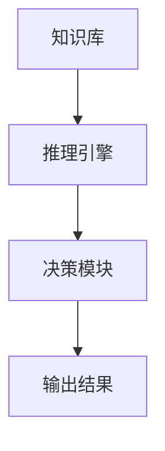
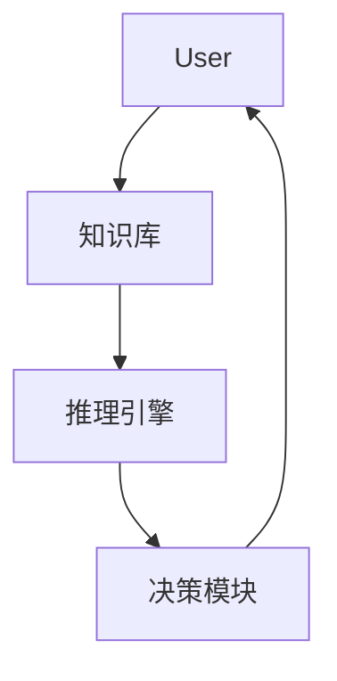

                 


# AI Agent的推理能力：增强LLM的逻辑分析与决策

> 关键词：AI Agent, 大语言模型, 逻辑推理, 决策模型, 知识图谱, 增量学习, 多目标优化

> 摘要：本文深入探讨了AI Agent的推理能力，重点分析了如何通过增强大语言模型（LLM）的逻辑分析与决策能力，构建更智能、更高效的AI系统。文章从AI Agent与LLM的基本概念入手，详细阐述了逻辑分析与决策模型的核心原理，探讨了多种增强LLM逻辑推理能力的技术方法，包括知识图谱构建、增量学习与迁移学习等。最后，本文通过系统架构设计与实现，展示了如何将这些技术应用于实际场景中，为AI Agent的推理能力提升提供了理论与实践的双重指导。

---

## 第1章: AI Agent与LLM的基本概念

### 1.1 AI Agent的基本概念

#### 1.1.1 AI Agent的定义

AI Agent（人工智能代理）是指能够感知环境、自主决策并执行任务的智能实体。它可以是一个软件程序，也可以是一个物理设备，通过传感器和执行器与环境交互。AI Agent的核心目标是通过感知和行动来实现特定的目标任务。

#### 1.1.2 AI Agent的核心特征

- **自主性**：AI Agent能够自主决策，无需外部干预。
- **反应性**：能够实时感知环境变化并做出反应。
- **目标导向**：基于目标驱动行为，优化决策过程。
- **社会能力**：能够与其他Agent或人类进行有效交互与协作。

#### 1.1.3 AI Agent的分类与应用场景

AI Agent可以分为以下几类：

- **简单反射型Agent**：基于当前输入做出反应，无内部状态。
- **基于模型的反射型Agent**：维护环境模型，基于模型做出决策。
- **目标驱动型Agent**：基于目标驱动行为，追求效用最大化。
- **效用驱动型Agent**：通过最大化效用来优化决策。

应用场景包括智能助手、自动驾驶、智能客服、机器人控制等。

### 1.2 LLM的基本原理

#### 1.2.1 大语言模型的定义与特点

大语言模型（LLM, Large Language Model）是指基于大规模数据训练的深度学习模型，能够理解和生成人类语言。其特点包括：

- **大规模训练数据**：通常使用 billions级别的文本数据进行训练。
- **深度学习架构**：常用Transformer架构，具备强大的上下文理解能力。
- **多任务通用性**：能够适应多种自然语言处理任务，如文本生成、问答系统、机器翻译等。

#### 1.2.2 LLM的工作原理与技术基础

大语言模型的核心技术包括：

- **Transformer架构**：由编码器和解码器组成，通过自注意力机制捕捉文本中的长程依赖关系。
- **自监督学习**：通过预测词任务（如Masked Language Model）进行预训练。
- **并行计算**：利用GPU的并行计算能力加速模型训练。

#### 1.2.3 LLM与AI Agent的关系

AI Agent可以利用大语言模型的自然语言处理能力，增强自身的理解和生成能力。通过集成LLM，AI Agent能够更自然地与人类交互，并在复杂的环境中做出更智能的决策。

### 1.3 本章小结

本章介绍了AI Agent和大语言模型的基本概念、核心特征和应用场景，并分析了LLM在AI Agent中的作用。通过理解这些基本概念，我们可以为后续的逻辑分析与决策能力的提升打下基础。

---

## 第2章: 逻辑分析与决策模型

### 2.1 逻辑分析的定义与方法

#### 2.1.1 逻辑推理的基本概念

逻辑推理是指从已知的前提推导出结论的过程。常见的逻辑推理方法包括：

- **归纳推理**：从具体实例中总结一般规律。
- **演绎推理**：从一般性前提推出特定结论。
- **类比推理**：通过比较不同事物的相似性进行推理。

#### 2.1.2 归纳推理与演绎推理的对比

| 对比维度 | 归纳推理 | 演绎推理 |
|----------|----------|----------|
| 推理方向 | 从具体到一般 | 从一般到具体 |
| 结论确定性 | 结论概率性 | 结论确定性 |
| 应用场景 | 数据挖掘、模式识别 | 法律推理、数学证明 |

#### 2.1.3 类比推理与反向推理的特征

- **类比推理**：通过比较不同事物的相似性，推导出新的结论。
- **反向推理**：从目标出发，逆向寻找实现目标的路径。

### 2.2 决策模型的构建与优化

#### 2.2.1 决策树的构建与应用

决策树是一种树状结构，用于表示可能的决策路径。其构建过程如下：

1. **选择根节点**：基于特征重要性选择根节点。
2. **划分数据集**：根据特征值划分子节点。
3. **递归构建子树**：重复上述过程，直到叶子节点。
4. **剪枝优化**：去除可能导致过拟合的分支。

决策树的优缺点：

- **优点**：直观易懂，适合分类问题。
- **缺点**：容易过拟合，处理复杂问题时效率较低。

#### 2.2.2 马尔可夫决策过程（MDP）的原理

MDP是一种用于描述决策过程的数学框架，主要包括：

- **状态空间**：系统可能处于的所有状态。
- **动作空间**：系统可以执行的所有动作。
- **转移概率**：从当前状态执行某个动作后转移到下一个状态的概率。
- **奖励函数**：系统执行某个动作后获得的奖励。

MDP的目标是通过最大化累积奖励来优化决策策略。

#### 2.2.3 Q-Learning算法的实现与优化

Q-Learning是一种基于价值的强化学习算法，其核心思想是通过学习状态-动作对的Q值来优化决策策略。算法流程如下：

1. 初始化Q表，所有状态-动作对的Q值初始化为0。
2. 在环境中选择一个动作，并执行该动作。
3. 计算新状态下的奖励，并更新Q表中的Q值：
   $$ Q(s, a) = Q(s, a) + \alpha (r + \gamma \max Q(s', a')) $$
   其中，$\alpha$是学习率，$\gamma$是折扣因子。
4. 重复上述过程，直到收敛。

Q-Learning的优点包括：

- **离线学习**：无需实时与环境交互。
- **灵活性**：适用于未知环境。

### 2.3 本章小结

本章详细介绍了逻辑分析的基本方法和决策模型的构建与优化。通过理解归纳推理、演绎推理、类比推理等逻辑推理方法，以及决策树、MDP和Q-Learning等决策模型的原理，我们可以为后续增强LLM的逻辑分析能力打下坚实的基础。

---

## 第3章: 增强LLM逻辑分析能力的方法

### 3.1 知识图谱的构建与应用

#### 3.1.1 知识图谱的定义与构建方法

知识图谱是一种以图结构形式表示知识的工具，通常包含实体和关系。构建知识图谱的步骤包括：

1. **数据采集**：从结构化数据（如数据库）和非结构化数据（如文本）中提取信息。
2. **实体识别**：识别文本中的实体并建立映射关系。
3. **关系抽取**：抽取实体之间的关系，并构建关系图。
4. **知识融合**：将多个来源的知识图谱进行合并，消除冲突。
5. **知识清洗**：去除冗余和错误信息，优化知识图谱的质量。

#### 3.1.2 知识图谱在逻辑推理中的应用

知识图谱可以为逻辑推理提供丰富的背景知识，帮助模型更好地理解上下文。例如，在问答系统中，知识图谱可以提供实体的定义、属性和关系，从而提高回答的准确性。

#### 3.1.3 知识图谱与LLM的结合方式

- **嵌入式结合**：将知识图谱中的实体和关系嵌入到LLM的词表中，增强模型对知识的理解。
- **外部知识库结合**：在LLM的基础上，接入外部知识图谱，提供额外的知识支持。

### 3.2 增量学习与迁移学习

#### 3.2.1 增量学习的定义与优势

增量学习是指在模型训练过程中，逐步引入新的数据样本，逐步优化模型参数。其优势包括：

- **在线学习**：适用于数据流场景。
- **模型更新**：能够快速适应新数据的变化。

#### 3.2.2 迁移学习的原理与应用

迁移学习是指将一个领域中学到的知识应用到另一个领域中。其原理包括：

- **领域适应**：通过调整模型参数，适应目标领域的数据分布。
- **特征提取**：利用源领域的特征提取能力，提升目标领域的性能。

#### 3.2.3 增量学习与迁移学习的对比分析

| 对比维度 | 增量学习 | 迁移学习 |
|----------|----------|----------|
| 数据获取方式 | 逐步获取新数据 | 先获取源领域数据，再获取目标领域数据 |
| 应用场景 | 在线推荐、实时分析 | 跨领域任务、小样本任务 |

### 3.3 本章小结

本章探讨了知识图谱、增量学习和迁移学习等增强LLM逻辑分析能力的方法。通过构建知识图谱，模型可以更好地理解上下文；通过增量学习和迁移学习，模型可以更高效地适应新任务和新数据。

---

## 第4章: 增强LLM决策能力的技术路径

### 4.1 基于逻辑推理的决策增强

#### 4.1.1 基于规则的决策系统

基于规则的决策系统通过预定义的规则来指导决策过程。其优点包括：

- **简单易懂**：规则清晰明确。
- **可解释性高**：决策过程易于解释。

缺点包括：

- **灵活性差**：难以应对复杂多变的环境。
- **规则维护成本高**：需要不断更新和维护规则库。

#### 4.1.2 基于概率的决策系统

基于概率的决策系统通过计算各个选项的概率，选择概率最大的选项作为决策。其优点包括：

- **适应性高**：能够处理不确定性问题。
- **灵活性好**：可以根据实时数据动态调整决策。

缺点包括：

- **计算复杂度高**：需要频繁计算概率。
- **依赖概率模型的准确性**：模型参数可能影响决策效果。

#### 4.1.3 基于案例的决策系统

基于案例的决策系统通过检索类似的历史案例，借鉴经验来制定决策。其优点包括：

- **可解释性强**：决策过程基于相似案例，易于理解。
- **适应性强**：能够处理复杂多样的问题。

缺点包括：

- **案例库构建成本高**：需要大量高质量的案例数据。
- **检索效率低**：在大规模数据中检索类似案例可能耗时较长。

### 4.2 基于多目标优化的决策增强

#### 4.2.1 多目标优化的定义与特点

多目标优化是指在多个目标之间进行权衡，寻找最优解的过程。其特点包括：

- **目标冲突**：不同目标之间可能存在冲突，难以同时优化。
- ** Pareto最优解**：存在一组无法在所有目标上同时优化的解。

#### 4.2.2 基于多目标优化的决策模型构建

多目标优化的决策模型构建过程包括：

1. **目标定义**：明确决策问题中的各个目标。
2. **权重分配**：根据目标的重要程度分配权重。
3. **优化算法选择**：选择适合的多目标优化算法，如NSGA-II。
4. **模型训练与调优**：通过优化算法寻找Pareto最优解。

#### 4.2.3 多目标优化在LLM中的应用

多目标优化可以用于LLM的文本生成任务，例如在生成摘要时，同时优化摘要的准确性和简洁性。通过多目标优化，可以生成更高质量的文本。

### 4.3 本章小结

本章探讨了基于逻辑推理和多目标优化的决策增强方法。通过分析不同决策系统的优缺点，以及多目标优化在决策中的应用，我们可以为后续增强LLM的决策能力提供参考。

---

## 第5章: AI Agent推理能力的系统架构与实现

### 5.1 系统架构设计

#### 5.1.1 系统模块划分

AI Agent的系统架构通常包括以下模块：

- **知识库模块**：存储和管理AI Agent所需的知识和数据。
- **推理引擎模块**：负责逻辑推理和决策计算。
- **决策模块**：根据推理结果生成最终决策。

#### 5.1.2 系统功能设计

系统功能设计包括：

- **知识库的构建与管理**：包括数据采集、实体识别、关系抽取等。
- **推理引擎的实现**：包括逻辑推理算法的实现和优化。
- **决策模块的优化**：包括决策模型的训练与调优。

#### 5.1.3 系统架构图

以下是一个AI Agent系统的架构图：



### 5.2 系统实现

#### 5.2.1 知识库的构建与管理

知识库的构建步骤：

1. 数据采集：从数据库、网页、文档等来源采集数据。
2. 数据清洗：去除冗余和错误信息，优化数据质量。
3. 实体识别：识别文本中的实体，并建立实体之间的映射关系。
4. 关系抽取：抽取实体之间的关系，并构建关系图。
5. 知识融合：将多个来源的知识图谱进行合并，消除冲突。

#### 5.2.2 推理引擎的实现

推理引擎的实现步骤：

1. 选择推理算法：根据具体任务选择合适的逻辑推理算法，如基于规则的推理、基于概率的推理等。
2. 算法实现：根据选择的推理算法，编写相应的代码实现。
3. 算法优化：通过参数调优和算法改进，提高推理效率和准确性。

#### 5.2.3 决策模块的优化

决策模块的优化步骤：

1. 选择决策模型：根据具体任务选择合适的决策模型，如决策树、马尔可夫决策过程（MDP）等。
2. 模型训练：通过训练数据训练决策模型，优化模型参数。
3. 模型评估：通过测试数据评估模型性能，调整模型参数。

### 5.3 系统接口设计

系统接口设计包括：

- **知识库接口**：提供对知识库的访问权限，支持查询和更新操作。
- **推理引擎接口**：提供推理算法的调用接口，支持逻辑推理和决策计算。
- **决策模块接口**：提供决策结果的输出接口，支持与外部系统的交互。

### 5.4 系统交互流程图

以下是一个AI Agent系统的交互流程图：



### 5.5 本章小结

本章详细描述了AI Agent的系统架构与实现过程，包括知识库的构建与管理、推理引擎的实现、决策模块的优化等内容。通过系统的实现，我们可以更好地理解AI Agent的推理能力是如何在实际中得到应用的。

---

## 第6章: 项目实战与案例分析

### 6.1 项目实战

#### 6.1.1 环境安装

为了实现AI Agent的推理能力，我们需要安装以下环境：

1. **Python**：3.8及以上版本。
2. **TensorFlow**：用于深度学习模型的训练与部署。
3. **PyTorch**：用于深度学习模型的训练与部署。
4. **NetworkX**：用于知识图谱的构建与分析。
5. **Transformers**：用于大语言模型的加载与使用。

安装命令如下：

```bash
pip install python>=3.8
pip install tensorflow
pip install torch
pip install networkx
pip install transformers
```

#### 6.1.2 核心代码实现

以下是实现AI Agent推理能力的核心代码：

```python
import torch
from transformers import AutoTokenizer, AutoModelForCausalLM
from networkx import Graph

# 加载大语言模型
tokenizer = AutoTokenizer.from_pretrained("gpt2")
model = AutoModelForCausalLM.from_pretrained("gpt2")

# 知识图谱构建
def build_knowledge_graph():
    graph = Graph()
    # 添加节点
    graph.add_node("A")
    graph.add_node("B")
    # 添加边
    graph.add_edge("A", "B")
    return graph

# 逻辑推理
def logical_reasoning(query, graph):
    # 在知识图谱中查找与查询相关的节点
    relevant_nodes = [node for node in graph.nodes() if query in node]
    # 返回相关节点
    return relevant_nodes

# 决策模块
def decision_making(query, graph):
    relevant_nodes = logical_reasoning(query, graph)
    # 假设每个相关节点代表一个可能的决策选项
    return relevant_nodes[0] if relevant_nodes else "无相关节点"
```

#### 6.1.3 代码应用解读与分析

上述代码实现了AI Agent的逻辑推理与决策功能。通过加载大语言模型，我们可以生成高质量的文本；通过构建知识图谱，我们可以增强模型的逻辑推理能力；通过决策模块，我们可以根据推理结果生成最终决策。

### 6.2 案例分析

#### 6.2.1 案例背景

假设我们有一个智能客服系统，需要回答用户的问题。用户提出：“我需要帮助处理订单问题。”系统需要根据知识图谱中的相关信息，推理出用户的具体需求，并生成相应的回答。

#### 6.2.2 系统交互流程

1. **用户输入**：用户输入问题：“我需要帮助处理订单问题。”
2. **知识库查询**：系统查询知识图谱，找到与订单相关的节点。
3. **逻辑推理**：系统根据知识图谱中的关系，推理出可能的解决方案。
4. **决策生成**：系统生成最终的决策，并返回给用户。

#### 6.2.3 案例分析小结

通过上述案例，我们可以看到AI Agent的推理能力在实际应用中的重要性。通过知识图谱和逻辑推理，系统能够更好地理解用户需求，并生成更准确的决策。

### 6.3 本章小结

本章通过项目实战和案例分析，展示了AI Agent推理能力的实际应用。通过环境安装、代码实现和案例分析，我们可以更好地理解AI Agent推理能力的实现过程和应用价值。

---

## 第7章: 最佳实践、小结与注意事项

### 7.1 最佳实践

- **知识图谱构建**：确保知识图谱的质量和准确性，避免冗余和错误信息。
- **增量学习与迁移学习**：在数据量较小的情况下，优先考虑增量学习和迁移学习，以提高模型的泛化能力。
- **多目标优化**：在处理复杂任务时，可以尝试使用多目标优化方法，以提高决策的全面性和优化性。

### 7.2 小结

本文系统地探讨了AI Agent的推理能力，重点分析了如何通过增强大语言模型的逻辑分析与决策能力，构建更智能、更高效的AI系统。通过知识图谱、增量学习、迁移学习等技术，我们可以显著提升AI Agent的推理能力，使其在实际应用中表现出色。

### 7.3 注意事项

- **数据隐私**：在构建知识图谱和训练模型时，需要注意数据隐私问题，确保数据的安全性和合规性。
- **模型可解释性**：在实际应用中，模型的可解释性非常重要，尤其是在需要向用户解释决策过程的场景中。
- **计算资源**：大语言模型的训练和推理需要大量的计算资源，需要确保硬件设备的性能和容量。

### 7.4 拓展阅读

- **《Deep Learning》 - Ian Goodfellow**
- **《Reinforcement Learning: Theory and Algorithms》 - Richard S. Sutton, et al.**
- **《Knowledge Graphs: Concepts, Methods and Applications》 - Rudi Schenkel, et al.**

---

## 作者信息

作者：AI天才研究院/AI Genius Institute & 禅与计算机程序设计艺术 /Zen And The Art of Computer Programming

---

**文章小结**：本文系统地探讨了AI Agent的推理能力，重点分析了如何通过增强大语言模型（LLM）的逻辑分析与决策能力，构建更智能、更高效的AI系统。文章从AI Agent与LLM的基本概念入手，详细阐述了逻辑分析与决策模型的核心原理，探讨了多种增强LLM逻辑推理能力的技术方法，包括知识图谱构建、增量学习与迁移学习等。最后，本文通过系统架构设计与实现，展示了如何将这些技术应用于实际场景中，为AI Agent的推理能力提升提供了理论与实践的双重指导。

