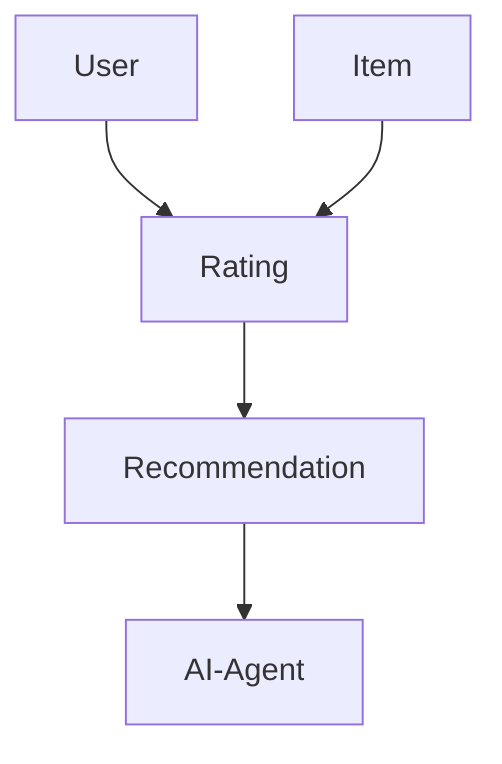
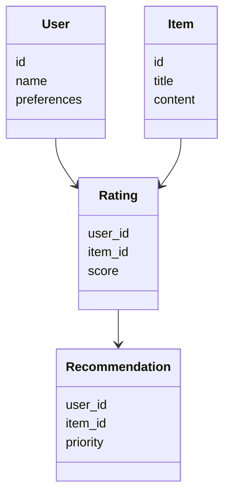
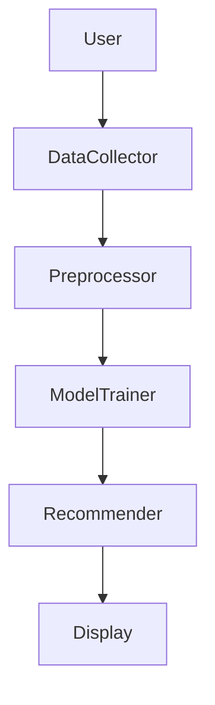
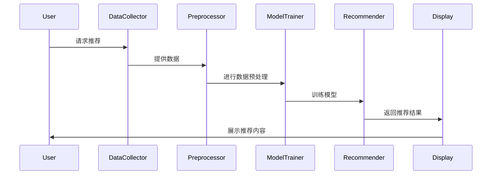

                 


# AI Agent的推荐系统：个性化内容推送

> 关键词：AI Agent，推荐系统，个性化内容推送，协同过滤，深度学习，实时推荐

> 摘要：本文深入探讨AI Agent在推荐系统中的应用，详细分析个性化内容推送的实现原理、算法选择、系统架构设计及实际案例。通过理论与实践结合，揭示AI Agent如何通过协同过滤、深度学习等技术提升推荐效果，满足用户个性化需求。

---

# 第1章: AI Agent推荐系统背景与核心概念

## 1.1 推荐系统的定义与作用

### 1.1.1 推荐系统的定义
推荐系统是一种通过分析用户行为、偏好和内容特征，为用户提供个性化内容或商品的技术系统。它是人工智能和数据挖掘领域的重要应用之一。

### 1.1.2 推荐系统的核心作用
- 提供个性化体验：根据用户需求和行为，推荐相关内容。
- 提高用户粘性：通过精准推荐增强用户对平台的依赖。
- 增加业务收益：通过提升推荐准确性，提高转化率和销售额。

### 1.1.3 推荐系统的主要应用场景
- 电商：推荐商品给用户。
- 视频平台：推荐视频内容。
- 新闻平台：推荐新闻文章。
- 音乐平台：推荐音乐作品。

## 1.2 AI Agent在推荐系统中的角色

### 1.2.1 AI Agent的定义
AI Agent（人工智能代理）是指能够感知环境、自主决策并执行任务的智能体。它通过数据处理、模型训练和实时反馈优化推荐效果。

### 1.2.2 AI Agent在推荐系统中的功能
- 数据采集：收集用户行为、偏好和内容特征。
- 用户建模：构建用户画像，分析用户需求。
- 内容表示：对推荐内容进行特征提取和表示。
- 实时推荐：根据用户实时行为调整推荐结果。

### 1.2.3 AI Agent的优势与挑战
- **优势**：
  - 高效性：通过机器学习算法快速处理海量数据。
  - 精准性：基于用户行为和内容特征提升推荐准确性。
  - 实时性：能够实时响应用户需求变化。
- **挑战**：
  - 数据隐私：如何保护用户数据不被滥用。
  - 模型复杂性：复杂算法可能导致计算成本过高。
  - 用户反馈延迟：用户行为数据的实时性问题。

---

# 第2章: 推荐系统的核心问题

## 2.1 个性化推荐的背景

### 2.1.1 用户需求的多样性
用户对内容的需求千差万别，同一内容可能对不同用户价值不同。

### 2.1.2 内容的丰富性
推荐系统需要处理海量内容数据，包括文本、图像、视频等多种形式。

### 2.1.3 推荐系统的必要性
通过推荐系统，帮助用户快速找到感兴趣的内容，缓解信息过载问题。

## 2.2 推荐系统的核心问题

### 2.2.1 如何理解用户需求
- 数据采集：获取用户的行为数据、偏好数据。
- 用户建模：构建用户画像，分析用户的兴趣和行为模式。

### 2.2.2 如何处理海量数据
- 数据清洗：处理缺失、噪声数据。
- 特征提取：从数据中提取有用的特征信息。
- 数据存储：选择合适的数据库存储结构。

### 2.2.3 如何保证推荐的实时性
- 实时数据处理：快速响应用户行为变化。
- 分布式计算：通过分布式系统提升计算效率。
- 模型优化：通过在线学习优化推荐算法。

## 2.3 推荐系统的边界与外延

### 2.3.1 推荐系统的边界
- 输入：用户行为数据、内容特征数据。
- 输出：个性化推荐列表。

### 2.3.2 推荐系统的外延
- 数据采集：通过日志、传感器等获取数据。
- 用户界面：通过网页、移动应用展示推荐结果。
- 业务系统：与电商、视频平台等业务系统集成。

### 2.3.3 推荐系统与其他技术的关系
- 与机器学习的关系：推荐系统是机器学习的重要应用。
- 与大数据技术的关系：推荐系统依赖大数据处理技术。
- 与自然语言处理的关系：推荐系统与NLP技术深度融合。

## 2.4 推荐系统的核心概念与联系

### 2.4.1 核心概念原理
- **协同过滤**：基于用户相似性或内容相似性进行推荐。
- **基于内容的推荐**：根据内容特征相似性进行推荐。
- **混合推荐**：结合协同过滤和基于内容的推荐方法。

### 2.4.2 核心概念属性对比表

| 概念 | 属性 | 描述 |
|------|------|------|
| 协同过滤 | 基于用户行为 | 基于用户相似性进行推荐 |
| 基于内容的推荐 | 基于内容特征 | 基于内容相似性进行推荐 |
| 混合推荐 | 综合方法 | 结合多种推荐方法进行推荐 |

### 2.4.3 ER实体关系图


---

# 第3章: 推荐系统算法原理

## 3.1 协同过滤算法

### 3.1.1 基于用户的协同过滤
- **原理**：找到与目标用户行为相似的用户群体，推荐这些用户喜欢的内容。
- **步骤**：
  1. 计算用户相似度。
  2. 根据相似用户的评分预测目标用户的评分。
  3. 推荐评分最高的内容。

### 3.1.2 基于物品的协同过滤
- **原理**：找到与目标用户已评分物品相似的物品，推荐这些物品给目标用户。
- **步骤**：
  1. 计算物品相似度。
  2. 根据目标用户的评分预测其他物品的评分。
  3. 推荐评分最高的物品。

### 3.1.3 混合协同过滤
- **原理**：结合基于用户和基于物品的协同过滤方法，综合两种方法的优缺点。
- **步骤**：
  1. 分别计算基于用户的协同过滤和基于物品的协同过滤结果。
  2. 根据一定的权重融合两种结果。
  3. 推荐融合后的评分最高的内容。

## 3.2 基于深度学习的推荐算法

### 3.2.1 基于神经网络的推荐
- **原理**：通过神经网络模型学习用户和物品的隐含特征，生成推荐结果。
- **常用模型**：
  - 多层感知机（MLP）。
  - 循环神经网络（RNN）。
  - 生成对抗网络（GAN）。

### 3.2.2 基于矩阵分解的推荐
- **原理**：将用户-物品评分矩阵分解为用户因子矩阵和物品因子矩阵，计算用户和物品的相似度。
- **常用算法**：
  - 奇异值分解（SVD）。
  - 非负矩阵分解（NMF）。

### 3.2.3 基于图的推荐
- **原理**：构建用户-物品交互图，通过图遍历算法推荐相似节点。
- **常用算法**：
  - 广度优先搜索（BFS）。
  - 深度优先搜索（DFS）。

### 3.2.4 算法流程图
```mermaid
graph TD
    Start --> Collect Data
    Collect Data --> Preprocess Data
    Preprocess Data --> Choose Algorithm
    Choose Algorithm --> Train Model
    Train Model --> Evaluate Model
    Evaluate Model --> Generate Recommendation
```

## 3.3 数学模型

### 3.3.1 协同过滤模型
$$\text{评分预测} = \mu + u_i + v_j$$

其中：
- $\mu$：全局平均评分。
- $u_i$：用户$i$的偏置。
- $v_j$：物品$j$的偏置。

### 3.3.2 矩阵分解模型
$$R = P \times Q^T$$

其中：
- $R$：用户-物品评分矩阵。
- $P$：用户因子矩阵。
- $Q$：物品因子矩阵。
- $T$：转置符号。

---

# 第4章: 系统架构设计

## 4.1 问题场景介绍

### 4.1.1 电商推荐系统
- **目标**：推荐商品给用户。
- **挑战**：海量商品数据，用户行为数据多样。

### 4.1.2 视频推荐系统
- **目标**：推荐视频内容给用户。
- **挑战**：视频数据量大，用户兴趣变化快。

## 4.2 系统功能设计

### 4.2.1 领域模型


### 4.2.2 系统架构图


### 4.2.3 系统接口设计
- **数据接口**：
  - `get_user_behavior(user_id)`：获取用户行为数据。
  - `get_item_features(item_id)`：获取物品特征数据。
- **推荐接口**：
  - `generate_recommendation(user_id)`：生成推荐列表。
  - `update_recommendation(user_id)`：更新推荐列表。

### 4.2.4 系统交互图


## 4.3 系统实现细节

### 4.3.1 数据采集模块
- **功能**：采集用户行为数据，如点击、收藏、购买。
- **技术**：使用日志采集工具，如Flume、Kafka。

### 4.3.2 数据预处理模块
- **功能**：清洗数据，提取特征。
- **技术**：使用数据处理框架，如Spark、Flink。

### 4.3.3 模型训练模块
- **功能**：训练推荐模型，优化模型参数。
- **技术**：使用机器学习框架，如TensorFlow、PyTorch。

### 4.3.4 推荐生成模块
- **功能**：根据模型预测结果生成推荐列表。
- **技术**：使用推荐算法库，如Surprise、LightFM。

---

# 第5章: 项目实战

## 5.1 环境安装

### 5.1.1 安装Python环境
- 安装Python 3.8及以上版本。
- 安装Jupyter Notebook用于实验。

### 5.1.2 安装推荐算法库
- `pip install surprise`
- `pip install lightfm`

## 5.2 核心实现

### 5.2.1 数据预处理
```python
import pandas as pd
from surprise import Dataset, Reader

# 加载数据
data = pd.read_csv('ratings.csv')
reader = Reader(ratings= data[['user_id', 'item_id', 'rating']])
data = Dataset.load_from_df(reader.raw_data, reader)
```

### 5.2.2 模型训练
```python
from surprise import SVD

# 初始化模型
model = SVD()
# 训练模型
model.fit(data.build_trainset())
```

### 5.2.3 推荐生成
```python
def get_recommendations(user_id, num_recommendations=5):
    recommendations = []
    for item_id in data.to_df()['item_id'].unique():
        if model.predict(user_id, item_id).est >= 4:
            recommendations.append((item_id, model.predict(user_id, item_id).est))
    recommendations.sort(key=lambda x: x[1], reverse=True)
    return recommendations[:num_recommendations]

# 获取推荐结果
recommendations = get_recommendations(1, 5)
```

## 5.3 实际案例分析

### 5.3.1 数据集选择
- 数据集：movielens数据集。
- 数据预处理：清洗数据，提取用户、物品和评分信息。

### 5.3.2 模型选择
- 模型：基于协同过滤的矩阵分解模型（SVD）。
- 超参数优化：调节隐含因子数量、正则化参数。

### 5.3.3 实验结果
- **准确率**：推荐列表中目标用户的实际评分与预测评分的匹配程度。
- **召回率**：推荐列表中包含目标用户感兴趣内容的比例。

## 5.4 项目小结
通过项目实战，我们验证了AI Agent在推荐系统中的应用效果。矩阵分解模型能够有效捕捉用户和物品的隐含特征，提升推荐准确性。

---

# 第6章: 最佳实践与注意事项

## 6.1 最佳实践

### 6.1.1 数据处理
- 确保数据质量，处理缺失值和异常值。
- 提取有用的特征，避免引入无关特征。

### 6.1.2 模型选择
- 根据数据规模和业务需求选择合适的算法。
- 对模型进行充分的调优和验证。

### 6.1.3 实时推荐
- 使用分布式系统提升计算效率。
- 引入在线学习方法，实时更新模型。

## 6.2 注意事项

### 6.2.1 数据隐私
- 遵守数据隐私法规，保护用户数据安全。
- 使用匿名化处理，避免泄露用户信息。

### 6.2.2 模型复杂度
- 选择适合计算资源的模型，避免模型过于复杂。
- 优化算法，降低计算成本。

### 6.2.3 用户反馈
- 及时收集用户反馈，调整推荐策略。
- 避免推荐疲劳，控制推荐频率。

## 6.3 拓展阅读
- 《推荐系统实战：基于Python的机器学习方法》
- 《深度学习中的推荐系统：算法与应用》
- 《AI Agent：智能推荐系统的原理与实现》

---

# 结语

AI Agent通过协同过滤、深度学习等技术，为推荐系统提供了新的思路和方法。个性化内容推送不仅提升了用户体验，也为业务带来了更高的收益。未来，随着技术的发展，AI Agent在推荐系统中的应用将更加广泛和深入。

---

# 作者

作者：AI天才研究院/AI Genius Institute  
& 禅与计算机程序设计艺术/Zen And The Art of Computer Programming

