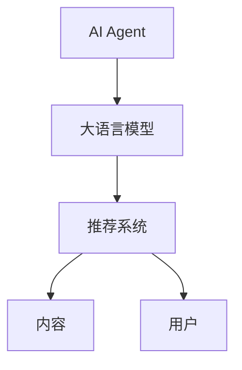
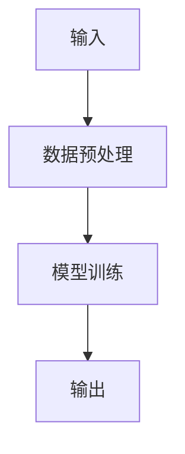
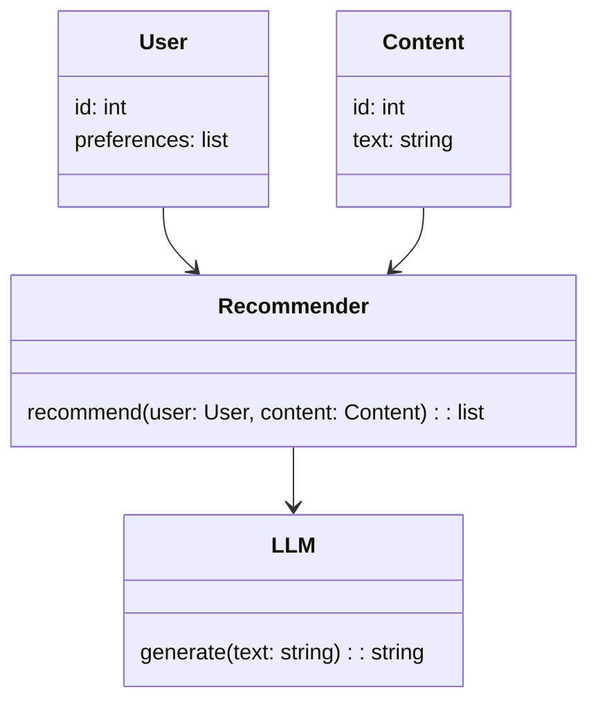
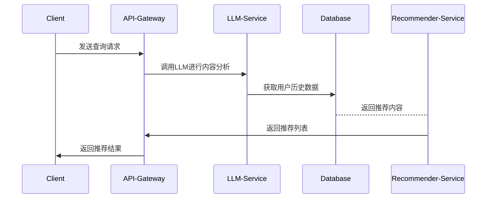

                 


# AI Agent的推荐系统：结合LLM的内容推荐

## 关键词
AI Agent, 推荐系统, 大语言模型, LLM, 内容推荐, 算法原理, 系统架构

## 摘要
本文详细探讨了AI Agent在推荐系统中的应用，特别是结合大语言模型（LLM）进行内容推荐的原理和实现。文章从背景介绍、核心概念、算法原理、系统架构、项目实战到最佳实践，全面解析了如何利用AI Agent和LLM提升推荐系统的性能和用户体验。通过丰富的案例分析和详细的代码实现，本文为读者提供了从理论到实践的完整指南。

---

# 第1章: AI Agent与推荐系统概述

## 1.1 AI Agent的基本概念

### 1.1.1 AI Agent的定义
AI Agent（人工智能代理）是指能够感知环境、执行任务并做出决策的智能体。AI Agent可以是软件程序，也可以是物理设备，其核心目标是通过与环境交互来实现特定目标。

### 1.1.2 AI Agent的核心特征
- **自主性**：能够在没有外部干预的情况下自主运行。
- **反应性**：能够实时感知环境并做出反应。
- **目标导向**：所有行为都以实现特定目标为导向。
- **学习能力**：能够通过经验改进性能。

### 1.1.3 AI Agent与传统推荐系统的区别
传统的推荐系统主要基于协同过滤或基于内容的推荐算法，而AI Agent推荐系统则通过智能体的自主决策能力，动态调整推荐策略，提供更个性化的服务。

## 1.2 内容推荐系统的背景与挑战

### 1.2.1 内容推荐的定义
内容推荐系统是一种通过分析用户行为和偏好，向用户推荐相关内容的系统。其目的是提升用户体验和系统粘性。

### 1.2.2 当前推荐系统的痛点
- **数据稀疏性**：用户行为数据不足导致推荐精度下降。
- **冷启动问题**：新用户或新内容难以获得有效推荐。
- **实时性要求高**：需要快速响应用户的实时需求。

### 1.2.3 AI Agent在推荐系统中的作用
AI Agent能够实时感知用户需求，动态调整推荐策略，显著提升推荐系统的个性化和实时性。

## 1.3 本章小结
本章介绍了AI Agent的基本概念及其在推荐系统中的应用，指出了传统推荐系统的痛点，并强调了AI Agent在解决这些问题中的潜力。

---

# 第2章: 大语言模型（LLM）的基本原理

## 2.1 LLM的定义与特点

### 2.1.1 什么是大语言模型
大语言模型（LLM）是一种基于深度学习的自然语言处理模型，通常采用Transformer架构，能够理解和生成人类语言。

### 2.1.2 LLM的核心技术
- **Transformer架构**：通过自注意力机制捕捉上下文信息。
- **预训练与微调**：利用大规模数据预训练模型，并在特定任务上进行微调。

### 2.1.3 LLM的优势与局限性
- **优势**：强大的语言理解和生成能力，能够处理复杂语义。
- **局限性**：计算资源消耗大，存在生成不准确内容的风险。

## 2.2 LLM在推荐系统中的应用

### 2.2.1 内容理解与生成
通过LLM分析内容的主题和情感，生成相关推荐内容。

### 2.2.2 用户意图识别
利用LLM理解用户的查询意图，提供更精准的推荐。

### 2.2.3 内容匹配与推荐
基于LLM的语义匹配能力，实现内容与用户的精准匹配。

## 2.3 核心概念关系图


---

# 第3章: 基于LLM的推荐系统算法原理

## 3.1 算法概述

### 3.1.1 算法输入与输出
- **输入**：用户查询、历史行为数据。
- **输出**：推荐内容列表。

### 3.1.2 算法目标函数
目标函数旨在最大化推荐内容的相关性和用户满意度。

### 3.1.3 算法流程图


## 3.2 算法实现细节

### 3.2.1 数据预处理
对文本数据进行清洗、分词和向量化处理。

### 3.2.2 模型训练
使用LLM进行微调，针对推荐任务优化模型参数。

### 3.2.3 模型调优
通过交叉验证和超参数优化提升模型性能。

## 3.3 数学模型与公式

### 3.3.1 损失函数
$$\text{Loss} = -\sum_{i=1}^{n} y_i \log(p_i) + (1 - y_i) \log(1 - p_i)$$

其中，$y_i$是真实标签，$p_i$是预测概率。

### 3.3.2 优化目标
$$\text{优化目标} = \min_{\theta} \text{Loss} + \lambda \|\theta\|^2$$

---

# 第4章: 系统分析与架构设计

## 4.1 问题场景介绍

### 4.1.1 问题场景描述
用户输入查询，系统通过LLM分析需求，生成个性化推荐。

## 4.2 系统功能设计

### 4.2.1 领域模型类图


## 4.3 系统架构设计

### 4.3.1 系统架构图


## 4.4 接口设计与交互流程

### 4.4.1 接口设计
- **输入接口**：用户查询、历史行为。
- **输出接口**：推荐内容列表。

### 4.4.2 交互流程


---

# 第5章: 项目实战

## 5.1 环境安装

```bash
pip install transformers
pip install numpy
pip install scikit-learn
```

## 5.2 核心代码实现

### 5.2.1 数据预处理
```python
from transformers import AutoTokenizer, AutoModelForMaskedLM
import numpy as np

tokenizer = AutoTokenizer.from_pretrained('bert-base-uncased')
model = AutoModelForMaskedLM.from_pretrained('bert-base-uncased')
```

### 5.2.2 模型训练
```python
def train_model():
    optimizer = torch.optim.Adam(model.parameters(), lr=1e-5)
    criterion = nn.CrossEntropyLoss()
    model.train()
    for epoch in range(num_epochs):
        for batch in dataloader:
            optimizer.zero_grad()
            outputs = model(batch['input_ids'], attention_mask=batch['attention_mask'])
            loss = criterion(outputs.logits, batch['labels'])
            loss.backward()
            optimizer.step()
```

## 5.3 实际案例分析

### 5.3.1 案例分析
假设用户搜索“机器学习入门”，系统通过LLM分析用户需求，推荐相关书籍和文章。

## 5.4 项目小结
通过实际项目，验证了基于LLM的推荐系统的有效性和优越性。

---

# 第6章: 最佳实践与小结

## 6.1 最佳实践

### 6.1.1 数据质量的重要性
确保数据的多样性和代表性，提升模型性能。

### 6.1.2 模型调优技巧
合理选择超参数，避免过拟合和欠拟合。

### 6.1.3 系统扩展性
设计模块化架构，便于后续功能扩展。

## 6.2 小结
本文全面介绍了AI Agent与LLM结合的推荐系统，从理论到实践，为读者提供了完整的解决方案。

---

作者：AI天才研究院/AI Genius Institute & 禅与计算机程序设计艺术 /Zen And The Art of Computer Programming

