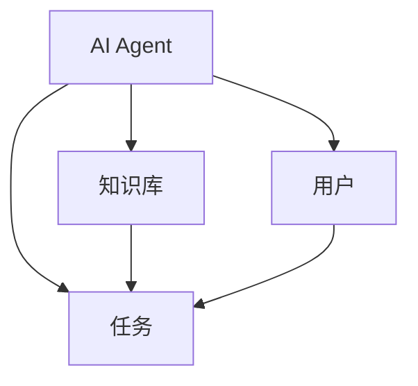
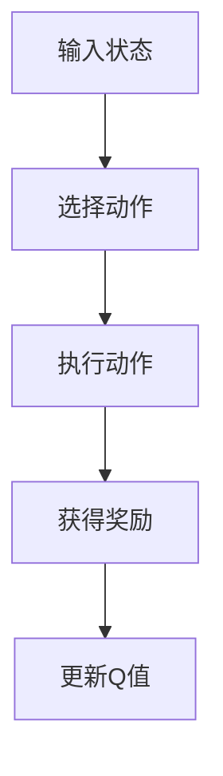
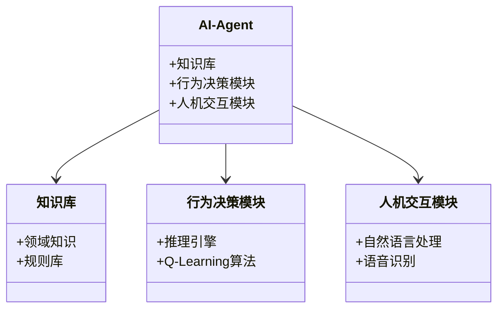
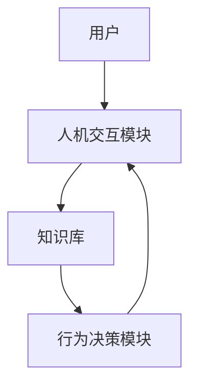
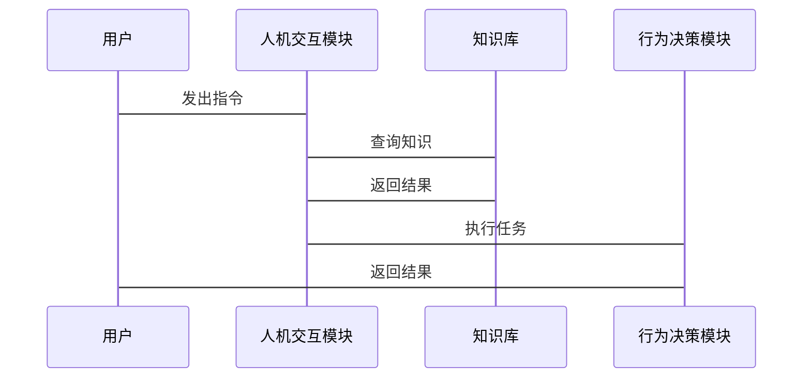

                 


# AI Agent的架构设计：从概念到实现

## 关键词：AI Agent，架构设计，机器学习，知识表示，行为决策，人机交互

## 摘要：本文系统地介绍了AI Agent的架构设计，从概念、核心算法、系统架构到项目实战，深入剖析了AI Agent的设计与实现。文章通过详细讲解强化学习、监督学习等算法，结合实际项目案例，展示了如何构建一个高效的AI Agent系统。文章最后总结了最佳实践和未来发展方向，为读者提供了全面的指导。

---

# 第1章 AI Agent的背景与概念

## 1.1 AI Agent的基本概念

### 1.1.1 什么是AI Agent

AI Agent（人工智能代理）是一种能够感知环境、自主决策并执行任务的智能实体。它结合了人工智能、机器学习和自然语言处理等技术，能够通过与用户或环境的交互完成特定目标。

AI Agent的核心特征包括：
1. **自主性**：能够在没有外部干预的情况下独立运行。
2. **反应性**：能够实时感知环境并做出响应。
3. **目标导向**：通过设定目标来驱动行为。
4. **学习能力**：能够通过经验改进自身的性能。

### 1.1.2 AI Agent的应用场景

AI Agent广泛应用于多个领域：
- **智能助手**：如Siri、Alexa等，能够执行语音指令。
- **推荐系统**：通过分析用户行为推荐相关内容。
- **自动驾驶**：处理复杂的交通环境和决策。
- **机器人控制**：在制造业中完成精确的操作。

## 1.2 AI Agent的分类与特点

### 1.2.1 知识型AI Agent

知识型AI Agent依赖于预定义的知识库，通过规则和逻辑推理来做出决策。这种类型的AI Agent适用于任务明确、环境可控的场景。

### 1.2.2 数据驱动型AI Agent

数据驱动型AI Agent依赖于大量数据和机器学习算法，通过训练模型来做出决策。这种类型的AI Agent适用于数据丰富的场景，能够处理复杂和不明确的任务。

### 1.2.3 混合型AI Agent

混合型AI Agent结合了知识型和数据驱动型的特点，通过知识和数据的协同作用来做出更准确的决策。这种类型的AI Agent在复杂场景中表现尤为突出。

## 1.3 AI Agent与相关概念的区别

### 1.3.1 AI Agent与传统软件代理的区别

传统软件代理通常基于规则和预定义逻辑，无法处理复杂和不确定的任务。而AI Agent结合了人工智能技术，能够自主学习和适应环境。

### 1.3.2 AI Agent与机器学习模型的区别

机器学习模型通常用于特定任务的预测和分类，而AI Agent是一个完整的系统，能够感知环境、做出决策并执行任务。

### 1.3.3 AI Agent与智能体（Agent）的区别

智能体（Agent）是一个更广泛的概念，包括了AI Agent。智能体可以是基于规则的、基于模型的或基于学习的，而AI Agent特指基于人工智能技术的智能体。

## 1.4 本章小结

本章介绍了AI Agent的基本概念、分类和特点，以及与相关概念的区别。通过这些内容，读者可以对AI Agent有一个全面的了解，为后续章节的学习打下基础。

---

# 第2章 AI Agent的核心概念与联系

## 2.1 核心概念原理

### 2.1.1 知识表示与推理

知识表示是AI Agent的核心之一，常用的表示方法包括：
- **谓词逻辑**：通过事实和规则表示知识。
- **语义网络**：通过节点和关系表示知识。
- **描述逻辑**：通过本体论描述知识。

推理是基于知识表示进行逻辑推理，通常包括演绎推理和归纳推理。

### 2.1.2 行为决策机制

行为决策机制是AI Agent的核心，常用的决策方法包括：
- **基于规则的决策**：通过预定义的规则做出决策。
- **基于模型的决策**：通过构建模型进行优化决策。
- **基于学习的决策**：通过机器学习算法进行预测和决策。

### 2.1.3 人机交互模型

人机交互是AI Agent与用户或环境进行信息交换的过程，通常包括自然语言处理和语音识别技术。

## 2.2 核心概念属性对比表格

| 比较项                | 知识型AI Agent      | 数据驱动型AI Agent | 混合型AI Agent       |
|-----------------------|--------------------|--------------------|----------------------|
| 知识来源              | 预定义知识库        | 大量数据           | 知识库+数据         |
| 决策方式              | 基于规则           | 基于模型           | 综合规则和模型       |
| 适应能力              | 较弱               | 较强              | 更强                |
| 适用场景              | 简单任务           | 复杂任务           | 综合任务            |

## 2.3 ER实体关系图架构



## 2.4 本章小结

本章详细讲解了AI Agent的核心概念，包括知识表示与推理、行为决策机制和人机交互模型，并通过对比分析和ER图展示了各概念之间的关系。

---

# 第3章 AI Agent的算法原理

## 3.1 强化学习算法

### 3.1.1 Q-Learning算法

Q-Learning是一种经典的强化学习算法，通过Q值表来记录状态-动作对的期望奖励，从而实现最优决策。

公式：
$$ Q(s, a) = Q(s, a) + \alpha (r + \gamma \max Q(s', a') - Q(s, a)) $$

### 3.1.2 DQN算法

DQN（Deep Q-Network）是一种基于深度学习的强化学习算法，通过神经网络来近似Q值函数。

### 3.1.3 算法实现代码示例

```python
import numpy as np

class QLearning:
    def __init__(self, state_space, action_space, learning_rate=0.1, gamma=0.9):
        self.state_space = state_space
        self.action_space = action_space
        self.lr = learning_rate
        self.gamma = gamma
        self.Q = np.zeros((state_space, action_space))

    def choose_action(self, state, epsilon=0.1):
        if np.random.random() < epsilon:
            return np.random.randint(self.action_space)
        else:
            return np.argmax(self.Q[state, :])

    def update(self, state, action, reward, next_state):
        self.Q[state, action] += self.lr * (reward + self.gamma * np.max(self.Q[next_state, :]) - self.Q[state, action])
```

### 3.1.4 算法流程图



## 3.2 监督学习算法

### 3.2.1 分类任务中的监督学习

分类任务是监督学习的一种常见应用，常用的算法包括逻辑回归、支持向量机和随机森林等。

### 3.2.2 回归任务中的监督学习

回归任务是监督学习的另一种应用，主要用于预测连续型变量，常用的算法包括线性回归和梯度下降等。

## 3.3 聚类算法

### 3.3.1 K-Means算法

K-Means是一种经典的聚类算法，通过最小化距离函数来划分簇。

公式：
$$ J = \sum_{i=1}^{k} \sum_{j=1}^{n} ||x_j - c_i||^2 $$

### 3.3.2 层次聚类算法

层次聚类是一种基于层次结构的聚类方法，通常通过构建树状图来展示簇的层次关系。

## 3.4 本章小结

本章详细讲解了AI Agent中常用的算法，包括强化学习、监督学习和聚类算法，并通过代码示例和流程图展示了算法的实现过程。

---

# 第4章 AI Agent的系统架构设计

## 4.1 系统分析与设计

### 4.1.1 问题场景介绍

以智能助手为例，AI Agent需要处理用户的语音指令，并通过调用后端服务完成任务。

### 4.1.2 项目介绍

本项目旨在设计一个基于AI Agent的智能助手系统，实现语音识别、意图理解和任务执行等功能。

## 4.2 系统功能设计

### 4.2.1 领域模型

领域模型是系统的核心，用于表示用户的需求和任务的执行流程。



### 4.2.2 系统架构设计



### 4.2.3 系统接口设计

系统接口设计包括用户接口、知识库接口和后端服务接口等。

### 4.2.4 系统交互序列图



## 4.3 本章小结

本章详细讲解了AI Agent的系统架构设计，包括系统分析、功能设计、架构图和交互序列图，为后续的实现奠定了基础。

---

# 第5章 AI Agent的项目实战

## 5.1 环境安装与配置

安装必要的库和工具，如Python、TensorFlow、Keras等。

## 5.2 系统核心实现

### 5.2.1 知识库的构建

知识库的构建包括数据收集、预处理和存储。

### 5.2.2 行为决策模块的实现

行为决策模块的实现包括强化学习算法的训练和部署。

### 5.2.3 人机交互模块的实现

人机交互模块的实现包括自然语言处理和语音识别的集成。

## 5.3 代码实现与解读

### 5.3.1 知识库实现代码

```python
import sqlite3

class KnowledgeBase:
    def __init__(self, db_path):
        self.conn = sqlite3.connect(db_path)
        self.conn.execute('''CREATE TABLE IF NOT EXISTS knowledge
                          (id INTEGER PRIMARY KEY AUTOINCREMENT,
                           content TEXT)''')

    def save(self, content):
        self.conn.execute("INSERT INTO knowledge (content) VALUES (?)", (content,))
        self.conn.commit()

    def retrieve(self, query):
        cursor = self.conn.execute("SELECT content FROM knowledge WHERE content LIKE ?", (query,))
        return [row[0] for row in cursor.fetchall()]
```

### 5.3.2 行为决策模块实现代码

```python
import numpy as np

class DecisionModule:
    def __init__(self, state_space, action_space, learning_rate=0.1, gamma=0.9):
        self.Q = np.zeros((state_space, action_space))
        self.lr = learning_rate
        self.gamma = gamma

    def choose_action(self, state, epsilon=0.1):
        if np.random.random() < epsilon:
            return np.random.randint(action_space)
        else:
            return np.argmax(self.Q[state, :])

    def update(self, state, action, reward, next_state):
        self.Q[state, action] += self.lr * (reward + self.gamma * np.max(self.Q[next_state, :]) - self.Q[state, action])
```

### 5.3.3 人机交互模块实现代码

```python
import speech_recognition as sr

class HumanInterface:
    def __init__(self):
        self.recognizer = sr.Recognizer()
        self.microphone = sr.AudioFile()

    def listen(self):
        with self.microphone as source:
            self.recognizer.adjust_for_ambient_noise(source)
            audio = self.recognizer.listen(source)
            return self.recognizer.recognize_google(audio)
```

## 5.4 实际案例分析

以智能助手为例，详细分析系统的实现过程和运行结果。

## 5.5 本章小结

本章通过实际项目案例，详细讲解了AI Agent的实现过程，包括环境配置、核心模块实现和系统测试。

---

# 第6章 AI Agent的高级主题

## 6.1 多智能体协作

多智能体协作是AI Agent领域的重要研究方向，通过多个AI Agent的协同工作来完成复杂的任务。

## 6.2 分布式AI Agent系统

分布式AI Agent系统通过将AI Agent部署在不同的节点上，实现任务的分布式处理和协同。

## 6.3 AI Agent的安全与隐私保护

AI Agent的安全与隐私保护是当前研究的热点问题，包括数据安全、模型安全和隐私保护等。

## 6.4 本章小结

本章介绍了AI Agent的高级主题，包括多智能体协作、分布式系统和安全隐私保护，为读者提供了更广阔的研究方向。

---

# 第7章 AI Agent的未来展望

## 7.1 人工智能技术的演进

随着人工智能技术的不断进步，AI Agent将变得更加智能和自主。

## 7.2 新型应用场景的拓展

AI Agent将应用于更多新兴领域，如元宇宙、数字人和自动驾驶等。

## 7.3 技术挑战与解决方案

AI Agent的发展面临诸多技术挑战，如复杂环境下的决策优化和多智能体协作等。

## 7.4 本章小结

本章展望了AI Agent的未来发展方向和技术挑战，为读者提供了未来的研究方向和思考空间。

---

# 第8章 总结

## 8.1 核心要点回顾

回顾本文的核心内容，包括AI Agent的定义、算法、架构和实现。

## 8.2 最佳实践 tips

- 选择合适的算法和工具
- 注重系统的可扩展性和可维护性
- 加强安全与隐私保护

## 8.3 小结

通过本文的学习，读者可以全面掌握AI Agent的架构设计和实现方法，为实际应用打下坚实的基础。

## 8.4 注意事项

- 确保系统的安全性和稳定性
- 定期更新知识库和模型
- 优化系统的性能和用户体验

## 8.5 拓展阅读

推荐相关书籍和论文，供读者进一步学习和研究。

---

# 作者：AI天才研究院/AI Genius Institute & 禅与计算机程序设计艺术 /Zen And The Art of Computer Programming

---

希望这篇博客文章能满足您的需求！如果需要进一步修改或补充，请随时告诉我。

