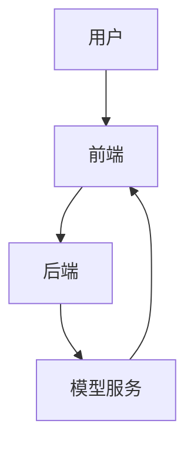
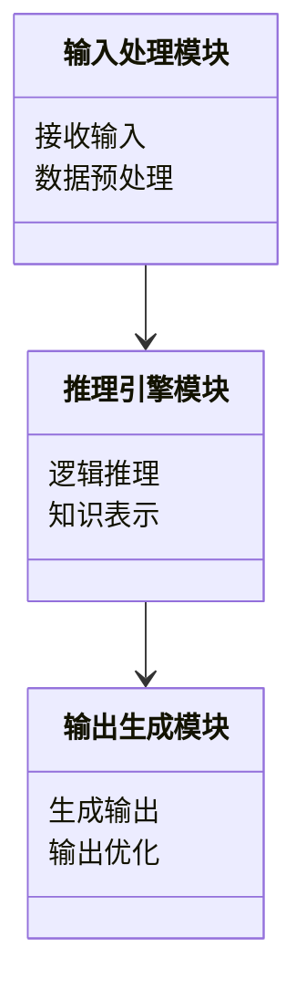
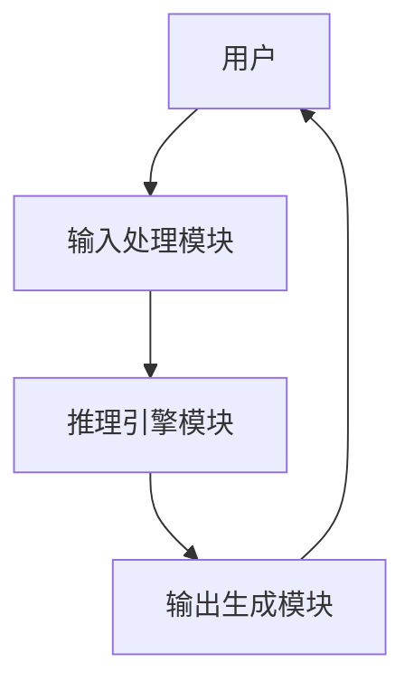

                 


# AI Agent的核心组件：输入处理、推理引擎和输出生成

## 关键词：AI Agent、输入处理、推理引擎、输出生成、自然语言处理、知识图谱、机器学习

## 摘要：AI Agent是由输入处理、推理引擎和输出生成三个核心组件构成的智能系统。本文将详细分析每个组件的功能、实现原理及其之间的关系，结合实际案例，深入探讨如何构建高效可靠的AI Agent系统。

---

# 第一部分: AI Agent的核心概念与背景

## 第1章: AI Agent的定义与核心组件

### 1.1 AI Agent的基本概念

#### 1.1.1 什么是AI Agent
AI Agent（人工智能代理）是一种能够感知环境、自主决策并执行任务的智能系统。它通过与用户或环境交互，完成特定目标，如信息检索、决策支持、自动化操作等。

#### 1.1.2 AI Agent的核心特点
- **自主性**：能够在没有外部干预的情况下独立运行。
- **反应性**：能够实时感知环境并做出响应。
- **目标导向性**：所有行为都围绕实现特定目标展开。
- **学习能力**：通过数据和经验不断优化自身性能。

#### 1.1.3 AI Agent与传统程序的区别
AI Agent具备以下特点，使其与传统程序不同：
- **智能性**：能够理解和处理复杂信息。
- **适应性**：能够根据环境变化调整行为。
- **自主性**：无需人工干预即可完成任务。

### 1.2 AI Agent的分类

#### 1.2.1 知识型AI Agent
知识型AI Agent依赖于预定义的知识库，通过规则和逻辑推理来完成任务。例如，基于知识图谱的问答系统。

#### 1.2.2 数据驱动型AI Agent
数据驱动型AI Agent通过大量数据训练模型，依赖机器学习算法进行推理和决策。例如，基于深度学习的自然语言处理模型。

#### 1.2.3 混合型AI Agent
混合型AI Agent结合了知识型和数据驱动型的特点，既利用知识库，又通过机器学习不断优化性能。例如，智能音箱结合预定义指令和自学习功能。

### 1.3 AI Agent的应用场景

#### 1.3.1 智能客服
AI Agent可以自动响应用户查询，处理常见问题，减少人工客服的工作量。

#### 1.3.2 智能推荐系统
AI Agent通过分析用户行为和偏好，提供个性化推荐。

#### 1.3.3 自动化决策系统
AI Agent可以用于金融投资、医疗诊断等领域，帮助做出高效、准确的决策。

### 1.4 AI Agent的现状与未来

#### 1.4.1 当前技术发展现状
AI Agent技术近年来迅速发展，尤其在自然语言处理和机器学习领域取得了显著进展。

#### 1.4.2 未来发展趋势
未来的AI Agent将更加智能化、个性化，具备更强的自适应能力和多模态交互能力。

### 1.5 本章小结

---

# 第二部分: AI Agent的核心组件

## 第2章: 输入处理

### 2.1 输入处理的定义

输入处理是AI Agent接收并解析用户输入的阶段，包括数据预处理和特征提取。

### 2.2 输入处理的关键技术

#### 2.2.1 数据预处理
数据预处理包括文本清洗、分词、去除停用词等步骤，目的是提高模型的训练效率和准确性。

#### 2.2.2 自然语言处理
NLP技术如词嵌入（Word2Vec）和BERT模型被广泛应用于文本处理，提取语义信息。

#### 2.2.3 多模态输入
AI Agent可以处理文本、语音、图像等多种输入形式，提升交互体验。

### 2.3 输入处理的实现流程

1. 接收输入：用户通过文本、语音或图像形式发送请求。
2. 数据清洗：去除噪声，提取关键信息。
3. 特征提取：将输入转换为模型可理解的特征向量。
4. 语义解析：理解输入的意图和需求。

### 2.4 本章小结

---

## 第3章: 推理引擎

### 3.1 推理引擎的定义

推理引擎是AI Agent的核心部分，负责根据输入进行逻辑推理，生成解决方案。

### 3.2 推理引擎的核心算法

#### 3.2.1 概率推理
基于概率论的推理方法，如贝叶斯网络，用于处理不确定性问题。

#### 3.2.2 知识图谱推理
通过构建知识图谱，利用图遍历算法（如DFS、BFS）进行推理。

#### 3.2.3 基于规则的推理
通过预定义的逻辑规则进行推理，适用于规则明确的场景。

### 3.3 推理引擎的实现流程

1. 输入解析：将输入转换为结构化数据。
2. 知识表示：将知识以某种形式表示（如向量、符号）。
3. 推理过程：根据推理算法生成结论。
4. 结果验证：验证推理结果的正确性。

### 3.4 本章小结

---

## 第4章: 输出生成

### 4.1 输出生成的定义

输出生成是AI Agent根据推理结果生成最终输出的过程，包括文本生成和结果优化。

### 4.2 输出生成的关键技术

#### 4.2.1 文本生成
使用生成式模型（如GPT）生成自然语言文本，确保输出的流畅性和准确性。

#### 4.2.2 多模态输出
生成多种形式的输出，如文本、语音、图像，以适应不同场景的需求。

#### 4.2.3 结果优化
通过优化算法提升生成结果的质量，如使用强化学习进行微调。

### 4.3 输出生成的实现流程

1. 接收推理结果：获取推理引擎生成的中间结果。
2. 生成输出：根据结果生成最终输出。
3. 输出优化：对生成的输出进行润色和调整。
4. 输出反馈：收集用户反馈，优化生成模型。

### 4.4 本章小结

---

# 第三部分: AI Agent的系统架构与实现

## 第5章: 算法原理

### 5.1 输入处理的数学模型

文本处理中常用的词嵌入模型如下：

$$
\text{Word2Vec} = \{w_1, w_2, ..., w_n\}
$$

### 5.2 推理引擎的算法流程

使用贝叶斯网络进行概率推理：

$$
P(A|B) = \frac{P(B|A)P(A)}{P(B)}
$$

### 5.3 输出生成的实现方法

基于Transformer模型的文本生成流程：

$$
\text{生成文本} = \argmax_{y} P(y|x)
$$

### 5.4 本章小结

---

## 第6章: 系统架构设计

### 6.1 系统整体架构

AI Agent的系统架构包括前端、后端和模型服务三部分：



### 6.2 模块化设计

系统模块包括输入处理模块、推理引擎模块和输出生成模块：



### 6.3 接口设计

系统接口包括输入接口、推理接口和输出接口：

```mermaid
sequenceDiagram
用户 ->+> 前端: 发送请求
前端 ->+> 后端: 处理请求
后端 ->+> 模型服务: 调用推理引擎
模型服务 ->+> 后端: 返回结果
后端 ->+> 前端: 返回响应
前端 ->+> 用户: 显示结果
```

### 6.4 系统交互流程

AI Agent的完整交互流程如下：



### 6.5 本章小结

---

## 第7章: 项目实战

### 7.1 环境安装

安装必要的库和工具，如Python、TensorFlow、Keras等。

### 7.2 核心代码实现

```python
# 输入处理代码示例
def preprocess(text):
    # 分词处理
    words = tokenize(text)
    # 去除停用词
    filtered = remove_stopwords(words)
    return filtered

# 推理引擎代码示例
class Reasoner:
    def __init__(self, knowledge_base):
        self.knowledge_base = knowledge_base

    def infer(self, input):
        # 基于知识库进行推理
        result = self.knowledge_base.infer(input)
        return result

# 输出生成代码示例
def generate_output(result):
    # 使用生成模型生成文本
    model = load_model()
    output = model.generate(result)
    return output
```

### 7.3 案例分析

以智能客服为例，详细讲解如何实现用户咨询的自动响应。

### 7.4 项目总结

总结项目实现的关键点和经验教训，展望未来改进方向。

### 7.5 本章小结

---

# 第四部分: 总结与展望

## 第8章: 总结与展望

### 8.1 核心概念回顾

回顾AI Agent的三个核心组件及其功能。

### 8.2 未来展望

探讨AI Agent技术的未来发展方向，如多模态交互、边缘计算等。

### 8.3 本章小结

---

# 第五部分: 最佳实践与注意事项

## 第9章: 最佳实践 tips

### 9.1 代码实现 tips
- 使用模块化设计，便于维护和扩展。
- 定期更新知识库，保持模型的准确性。

### 9.2 系统优化 tips
- 优化算法效率，提升推理速度。
- 增强模型的可解释性，便于调试和改进。

### 9.3 安全性注意事项
- 确保数据安全，防止信息泄露。
- 设计权限控制机制，防止未授权访问。

### 9.4 本章小结

---

## 第10章: 作者简介与联系方式

### 作者简介
作者：AI天才研究院/AI Genius Institute  
个人简介：专注于人工智能和计算机程序设计，致力于分享深度技术干货和实践经验。

### 联系方式
- **邮箱**：contact@aigenius.com  
- **GitHub**：https://github.com/aigenius

---

# 结语

AI Agent的核心组件：输入处理、推理引擎和输出生成，是构建智能系统的关键。通过本文的详细讲解，读者可以系统地掌握AI Agent的设计与实现方法，为实际项目提供参考。希望本文能为AI Agent的研究和应用贡献一份力量。

---

**作者：AI天才研究院/AI Genius Institute**  
**联系方式：contact@aigenius.com**  
**GitHub：https://github.com/aigenius**

