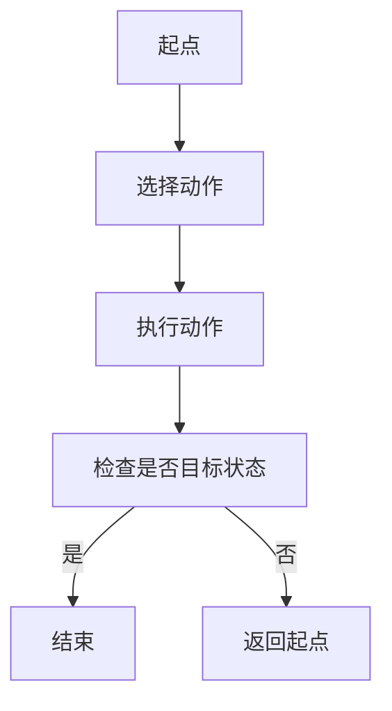
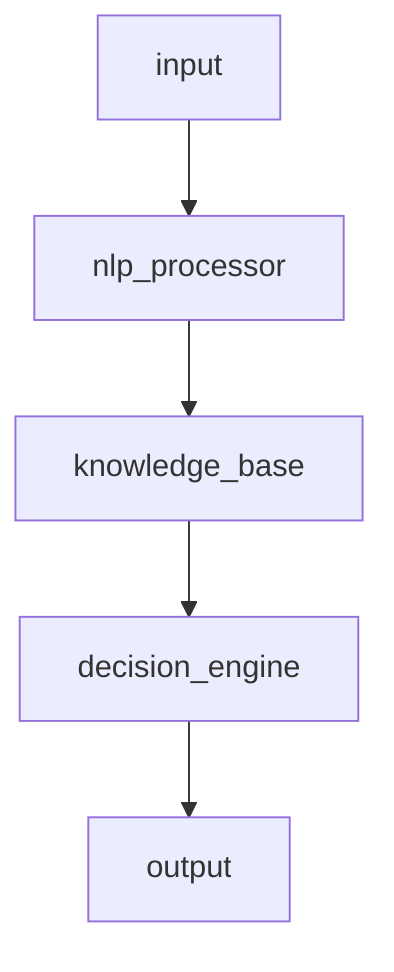

                 


# AI Agent的概念形成与抽象推理能力构建

> 关键词：人工智能、AI Agent、抽象推理、知识表示、逻辑推理、问题求解、自适应学习

> 摘要：本文系统地探讨了AI Agent的基本概念、核心原理及其抽象推理能力的构建方法。从AI Agent的起源与发展入手，分析了其感知、决策、行动的核心模块，重点阐述了代理的抽象推理能力的实现机制。通过具体算法、数学模型和系统架构的设计，深入剖析了AI Agent的构建过程，并通过实际案例展示了其在问题求解中的应用。本文旨在为读者提供一个全面的视角，帮助理解AI Agent的理论基础与实践应用。

---

# 第一部分: AI Agent的概念形成与核心原理

## 第1章: AI Agent的基本概念与背景

### 1.1 AI Agent的定义与特点
AI Agent（人工智能代理）是一种能够感知环境、自主决策并采取行动的智能实体。它通过与环境交互，实现特定目标，具有以下特点：
- **自主性**：能够在无外部干预的情况下运行。
- **反应性**：能够实时感知环境并做出响应。
- **目标导向**：所有行为均以实现特定目标为导向。
- **适应性**：能够根据环境变化调整自身行为。

### 1.2 AI Agent的核心问题背景
AI Agent的设计与实现涉及多个关键问题：
- **问题描述**：如何建模代理的感知、决策和行动模块？
- **环境建模**：如何描述代理所处的环境及其与代理的交互方式？
- **抽象推理**：如何实现代理的逻辑推理与知识表示？

### 1.3 AI Agent的概念结构与核心要素
AI Agent的核心要素包括：
- **感知模块**：负责从环境中获取信息。
- **决策模块**：基于感知信息进行推理并制定策略。
- **行动模块**：根据决策结果执行操作。

---

## 第2章: AI Agent的核心概念与联系

### 2.1 代理的感知与决策机制
- **知识表示**：通过符号逻辑或概率模型表示知识。
- **状态空间**：将环境状态化为可计算的形式。
- **逻辑推理**：基于知识库进行推理，得出结论。

### 2.2 代理的行动与反馈机制
- **行动规划**：制定行动序列以实现目标。
- **反馈学习**：通过环境反馈优化行为策略。

### 2.3 代理的抽象推理能力
- **抽象推理的层次结构**：
  1. **数据层**：处理原始感知数据。
  2. **知识层**：构建领域知识模型。
  3. **推理层**：基于知识进行逻辑推理。

### 2.4 AI Agent的核心概念对比表
```plaintext
| 概念 | 描述 | 特点 |
|------|------|------|
| 感知 | 输入信息 | 数据驱动 |
| 决策 | 制定策略 | 知识驱动 |
| 行动 | 执行操作 | 目标驱动 |
| 推理 | 联系信息 | 关联驱动 |
```

### 2.5 代理的ER实体关系图
```mermaid
er
actor(Agent) -|> knowledge_base: 知识库
actor(Agent) -|> environment: 环境
environment --> sensor: 感知器
knowledge_base --> reasoner: 推理器
```

---

## 第3章: AI Agent的算法原理

### 3.1 状态空间搜索算法
- **算法原理**：通过搜索状态空间找到最优路径。
- **流程图**：


### 3.2 逻辑推理算法
- **算法原理**：基于谓词逻辑进行推理。
- **数学模型**：
$$ \text{前提1} \land \text{前提2} \implies \text{结论} $$

### 3.3 机器学习算法
- **算法实现**：使用神经网络进行分类。
- **Python代码示例**：
```python
import numpy as np

def relu(x):
    return np.maximum(0, x)

input_layer = np.random.randn(784)
hidden_layer = relu(np.dot(input_layer, weights))
output_layer = softmax(hidden_layer)
```

---

## 第4章: AI Agent的系统分析与架构设计

### 4.1 问题场景介绍
- **目标**：设计一个智能客服代理。
- **需求**：处理用户查询，提供解决方案。

### 4.2 系统功能设计
- **功能模块**：
  1. **自然语言处理**：解析用户意图。
  2. **知识库查询**：检索相关信息。
  3. **决策引擎**：生成回复内容。

### 4.3 系统架构设计


### 4.4 系统接口设计
- **输入接口**：接收用户输入。
- **输出接口**：返回回复内容。

---

## 第5章: 项目实战

### 5.1 环境安装
- **工具**：Python、TensorFlow、Keras。
- **安装命令**：
```bash
pip install numpy matplotlib tensorflow
```

### 5.2 核心代码实现
```python
import numpy as np

class AI_Agent:
    def __init__(self):
        self.knowledge = {}

    def perceive(self, input_data):
        # 处理输入数据
        pass

    def decide(self, input_data):
        # 基于知识库进行决策
        return action

    def act(self, action):
        # 执行动作
        pass
```

### 5.3 实际案例分析
- **案例**：智能客服代理处理用户查询。
- **流程**：
  1. **感知**：接收用户问题。
  2. **决策**：检索知识库，生成回复。
  3. **行动**：返回回复内容。

---

## 第6章: 总结与展望

### 6.1 最佳实践 tips
- **数据质量**：确保知识库的准确性和完整性。
- **算法优化**：结合多种算法提升性能。

### 6.2 本章小结
本文详细探讨了AI Agent的概念、原理与构建方法，通过具体案例展示了其应用潜力。

### 6.3 注意事项
- **数据隐私**：注意保护用户数据安全。
- **系统健壮性**：确保代理在异常情况下的稳定运行。

### 6.4 拓展阅读
- 建议深入学习强化学习和知识图谱相关技术。

---

作者：AI天才研究院/AI Genius Institute & 禅与计算机程序设计艺术 /Zen And The Art of Computer Programming

