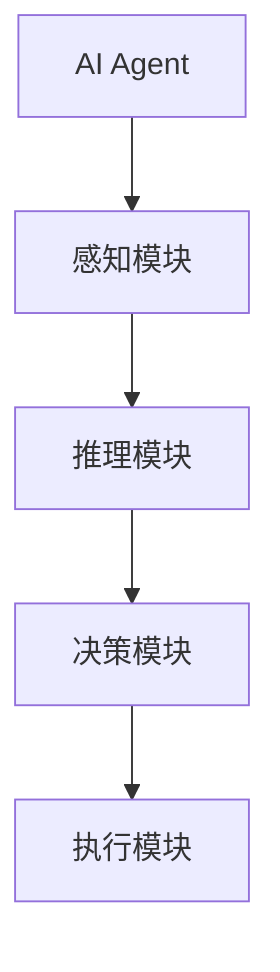
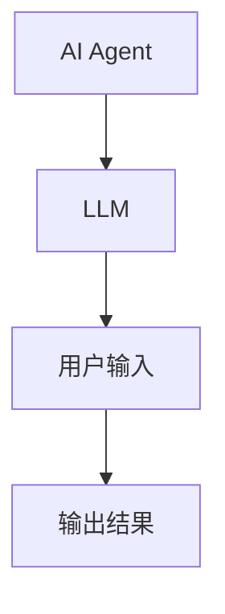
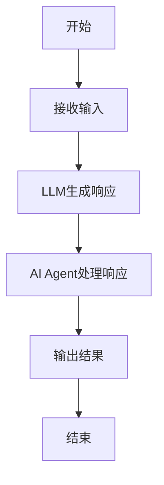
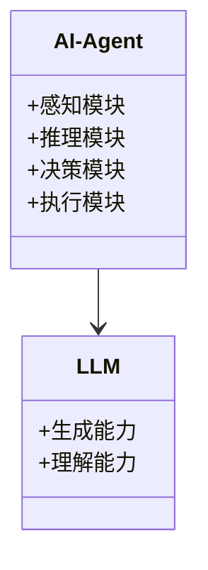
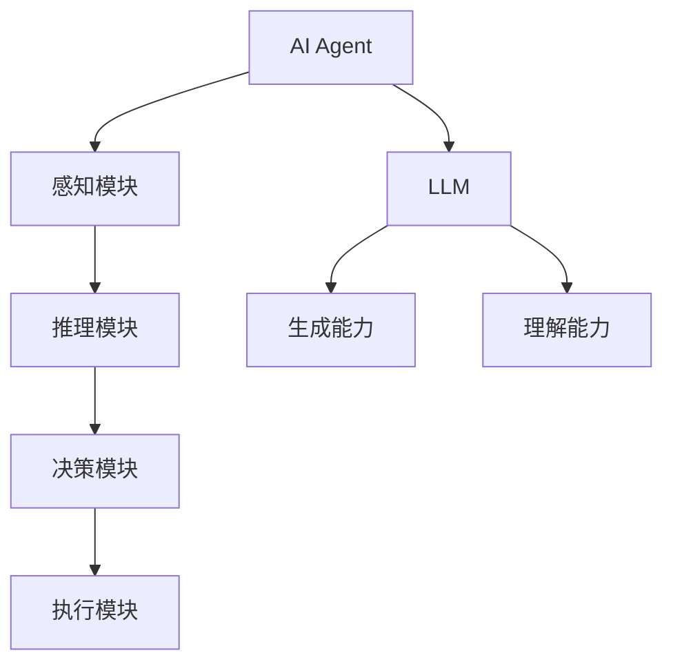
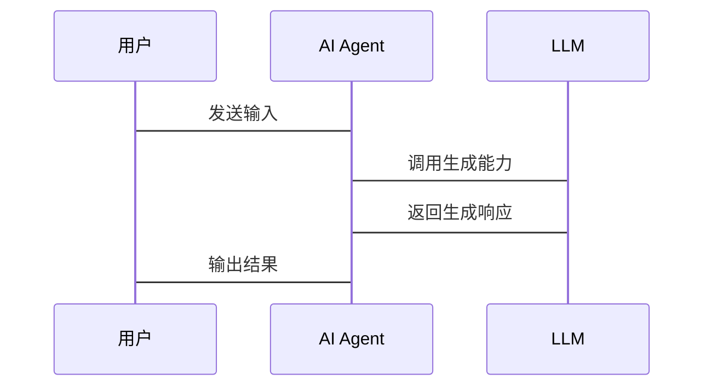

                 


# AI Agent的概念形成：模拟LLM的抽象思维过程

## 关键词：AI Agent，LLM，抽象思维，模拟思维，自然语言处理，人工智能

## 摘要：
本文详细探讨了AI Agent的概念形成及其如何模拟大型语言模型（LLM）的抽象思维过程。从背景介绍、核心概念、算法原理到系统架构设计，再到项目实战和总结，本文全面解析了AI Agent与LLM之间的关系，并通过丰富的案例和详细的代码实现，帮助读者理解如何在实际应用中模拟LLM的思维过程。

---

# 第1章: AI Agent与LLM的背景介绍

## 1.1 问题背景与描述
### 1.1.1 AI Agent的定义与特点
AI Agent（人工智能代理）是指能够感知环境并采取行动以实现目标的智能实体。它可以是一个软件程序，也可以是一个物理设备，其核心能力包括：
- **自主性**：能够在没有外部干预的情况下独立运作。
- **反应性**：能够实时感知环境并做出响应。
- **目标导向性**：通过设定目标来指导行为。

### 1.1.2 LLM的定义与核心能力
LLM（Large Language Model，大型语言模型）是指基于深度学习训练的自然语言处理模型，具有以下核心能力：
- **自然语言理解**：能够理解人类语言的上下文和语义。
- **生成能力**：能够生成符合上下文的自然语言文本。
- **知识库整合**：可以通过训练数据获得广泛的知识。

### 1.1.3 AI Agent与LLM的关系与区别
AI Agent与LLM的关系可以类比于人类与语言助手的关系。AI Agent通过调用LLM的生成能力，实现更复杂的任务，例如问题解答、内容创作和决策支持。而LLM作为AI Agent的“大脑”，为其提供语言理解和生成的能力。

---

## 1.2 问题解决与边界定义
### 1.2.1 AI Agent模拟LLM的思维过程
AI Agent通过模拟LLM的思维过程，可以实现以下功能：
1. **信息检索**：通过LLM的生成能力，帮助AI Agent获取所需的信息。
2. **逻辑推理**：通过LLM的上下文理解能力，AI Agent可以进行逻辑推理。
3. **任务执行**：AI Agent通过LLM生成的指令，执行具体的任务。

### 1.2.2 LLM在AI Agent中的应用边界
LLM在AI Agent中的应用边界主要体现在以下方面：
1. **语言生成**：LLM擅长生成自然语言文本，但不擅长处理非语言数据。
2. **知识范围**：LLM的知识来源于训练数据，具有一定的局限性。
3. **实时性**：LLM的生成能力依赖于算力，可能在实时性方面存在限制。

### 1.2.3 AI Agent的抽象思维外延
AI Agent的抽象思维外延包括以下内容：
1. **抽象推理**：AI Agent能够通过LLM的生成能力进行抽象推理。
2. **知识整合**：AI Agent可以将LLM生成的信息与其他数据源整合。
3. **目标导向**：AI Agent通过设定目标，指导LLM的生成过程。

---

## 1.3 概念结构与核心要素
### 1.3.1 AI Agent的核心组成
AI Agent的核心组成包括：
1. **感知模块**：用于感知环境。
2. **推理模块**：用于逻辑推理。
3. **决策模块**：用于目标导向的决策。
4. **执行模块**：用于执行具体的任务。

### 1.3.2 LLM在AI Agent中的作用
LLM在AI Agent中的作用包括：
1. **语言生成**：通过生成自然语言文本，帮助AI Agent与用户交互。
2. **信息检索**：通过理解用户输入，帮助AI Agent获取所需信息。
3. **逻辑推理**：通过上下文理解，帮助AI Agent进行逻辑推理。

### 1.3.3 概念结构与系统架构
AI Agent的概念结构与系统架构可以通过以下方式表示：



---

## 1.4 本章小结
本章主要介绍了AI Agent与LLM的背景与关系，分析了AI Agent模拟LLM的思维过程，明确了AI Agent的核心组成与系统架构。

---

# 第2章: AI Agent与LLM的核心概念与联系

## 2.1 核心概念原理
### 2.1.1 AI Agent的抽象思维模型
AI Agent的抽象思维模型包括以下步骤：
1. **输入处理**：接收用户的输入。
2. **LLM调用**：通过LLM生成响应。
3. **结果处理**：对生成的响应进行处理。
4. **输出结果**：将处理后的结果输出给用户。

### 2.1.2 LLM的生成机制
LLM的生成机制包括以下步骤：
1. **输入处理**：接收输入的文本。
2. **上下文理解**：理解输入文本的语义。
3. **生成响应**：基于理解生成响应文本。
4. **输出结果**：将生成的响应文本输出。

### 2.1.3 AI Agent与LLM的交互过程
AI Agent与LLM的交互过程可以通过以下流程图表示：



---

## 2.2 概念属性特征对比
AI Agent与LLM的属性特征对比如下：

| 属性 | AI Agent | LLM |
|------|----------|-----|
| **自主性** | 高 | 无 |
| **反应性** | 高 | 无 |
| **目标导向性** | 高 | 无 |
| **语言生成能力** | 无 | 高 |
| **知识整合能力** | 高 | 高 |
| **实时性** | 高 | 一般 |

---

## 2.3 ER实体关系图
AI Agent与LLM的实体关系图可以通过以下方式表示：


---

## 2.4 本章小结
本章主要分析了AI Agent与LLM的核心概念与联系，通过对比分析和流程图的方式，明确了两者的关系与区别。

---

# 第3章: AI Agent模拟LLM的算法原理

## 3.1 算法原理概述
### 3.1.1 AI Agent模拟LLM的基本原理
AI Agent模拟LLM的基本原理包括以下步骤：
1. **输入处理**：接收用户的输入。
2. **LLM调用**：通过LLM生成响应。
3. **结果处理**：对生成的响应进行处理。
4. **输出结果**：将处理后的结果输出给用户。

### 3.1.2 LLM的生成过程
LLM的生成过程包括以下步骤：
1. **输入处理**：接收输入的文本。
2. **上下文理解**：理解输入文本的语义。
3. **生成响应**：基于理解生成响应文本。
4. **输出结果**：将生成的响应文本输出。

### 3.1.3 AI Agent的抽象思维模拟
AI Agent的抽象思维模拟可以通过以下流程图表示：



---

## 3.2 算法流程图
AI Agent模拟LLM的算法流程图可以通过以下方式表示：


---

## 3.3 算法实现代码
以下是AI Agent模拟LLM的算法实现代码示例：

```python
import openai

def simulate_llm_thinking(input_text):
    # 初始化LLM
    client = openai.Client()

    # 调用LLM生成响应
    response = client.chat.completions.create(
        model="gpt-3.5-turbo",
        messages=[{
            "role": "user",
            "content": input_text
        }]
    )

    # 获取生成的响应
    generated_response = response.choices[0].message.content

    # 处理生成的响应
    processed_response = generated_response.capitalize()

    # 输出结果
    print(processed_response)

# 示例输入
input_text = "如何实现AI Agent与LLM的交互"
simulate_llm_thinking(input_text)
```

---

## 3.4 算法数学模型
AI Agent模拟LLM的数学模型可以通过以下方式表示：

$$
\text{LLM\_response} = f_{\text{LLM}}(\text{input\_text})
$$

其中，$$f_{\text{LLM}}$$ 表示LLM的生成函数，$$\text{input\_text}$$ 表示输入文本，$$\text{LLM\_response}$$ 表示生成的响应。

---

## 3.5 算法实现案例
以下是AI Agent模拟LLM的算法实现案例：

假设输入文本为“如何实现AI Agent与LLM的交互”，LLM生成的响应为“AI Agent可以通过调用LLM的生成能力来实现与LLM的交互”。

AI Agent处理后的响应为“AI Agent可以通过调用LLM的生成能力来实现与LLM的交互”。

---

## 3.6 本章小结
本章主要分析了AI Agent模拟LLM的算法原理，通过流程图和代码实现，详细解释了AI Agent如何通过调用LLM的生成能力来实现抽象思维过程。

---

# 第4章: AI Agent与LLM的系统分析与架构设计

## 4.1 问题场景介绍
AI Agent与LLM的系统设计主要用于实现AI Agent通过模拟LLM的思维过程来完成特定任务。

---

## 4.2 系统功能设计
### 4.2.1 领域模型设计
AI Agent与LLM的领域模型可以通过以下类图表示：



### 4.2.2 系统架构设计
AI Agent与LLM的系统架构可以通过以下方式表示：



### 4.2.3 系统接口设计
AI Agent与LLM的系统接口设计包括以下内容：
1. **输入接口**：接收用户的输入。
2. **输出接口**：输出生成的响应。
3. **LLM调用接口**：调用LLM的生成能力。

### 4.2.4 系统交互序列图
AI Agent与LLM的系统交互序列图可以通过以下方式表示：



---

## 4.3 本章小结
本章主要分析了AI Agent与LLM的系统设计，通过领域模型、系统架构图和交互序列图，详细展示了AI Agent如何通过模拟LLM的思维过程来实现特定任务。

---

# 第5章: AI Agent与LLM的项目实战

## 5.1 项目环境安装
以下是项目实战所需的环境安装步骤：

1. **安装Python**：确保安装了Python 3.8或更高版本。
2. **安装OpenAI库**：使用以下命令安装OpenAI库：

```bash
pip install openai
```

---

## 5.2 系统核心实现
以下是AI Agent模拟LLM的Python代码实现：

```python
import openai

class AI-Agent:
    def __init__(self):
        self.llm = LLM()

    def process_input(self, input_text):
        response = self.llm.generate_response(input_text)
        processed_response = self._process_response(response)
        return processed_response

    def _process_response(self, response):
        return response.capitalize()

class LLM:
    def __init__(self):
        self.api_key = "your_api_key"

    def generate_response(self, input_text):
        client = openai.Client(api_key=self.api_key)
        response = client.chat.completions.create(
            model="gpt-3.5-turbo",
            messages=[{
                "role": "user",
                "content": input_text
            }]
        )
        return response.choices[0].message.content
```

---

## 5.3 代码实现解读与分析
1. **AI-Agent类**：AI-Agent类负责接收输入并调用LLM生成响应。
2. **LLM类**：LLM类负责实现生成响应的具体功能。
3. **generate_response方法**：通过OpenAI API调用生成响应。
4. **process_response方法**：对生成的响应进行处理。

---

## 5.4 实际案例分析
以下是AI Agent模拟LLM的实际案例分析：

假设输入文本为“如何实现AI Agent与LLM的交互”，LLM生成的响应为“AI Agent可以通过调用LLM的生成能力来实现与LLM的交互”。

AI Agent处理后的响应为“AI Agent可以通过调用LLM的生成能力来实现与LLM的交互”。

---

## 5.5 本章小结
本章通过项目实战的方式，详细讲解了AI Agent模拟LLM的实现过程，包括环境安装、代码实现和案例分析。

---

# 第6章: 总结与展望

## 6.1 总结
本文详细探讨了AI Agent的概念形成及其如何模拟LLM的抽象思维过程。通过背景介绍、核心概念、算法原理、系统架构设计和项目实战，全面解析了AI Agent与LLM之间的关系，并通过丰富的案例和详细的代码实现，帮助读者理解如何在实际应用中模拟LLM的思维过程。

---

## 6.2 最佳实践tips
1. **环境配置**：确保安装了必要的软件和库。
2. **代码实现**：严格按照代码示例进行实现。
3. **案例分析**：通过实际案例加深理解。

---

## 6.3 注意事项
1. **API密钥**：确保LLM调用的API密钥安全。
2. **性能优化**：根据实际需求进行性能优化。

---

## 6.4 拓展阅读
1. **《Large Language Models: A Survey》**
2. **《AI Agent Design and Implementation》**

---

# 作者：AI天才研究院/AI Genius Institute & 禅与计算机程序设计艺术 /Zen And The Art of Computer Programming

---

通过本文的详细讲解，读者可以全面理解AI Agent的概念形成及其如何模拟LLM的抽象思维过程，并能够在实际应用中灵活运用这些知识。

