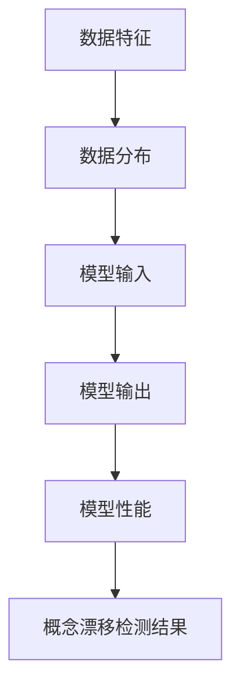
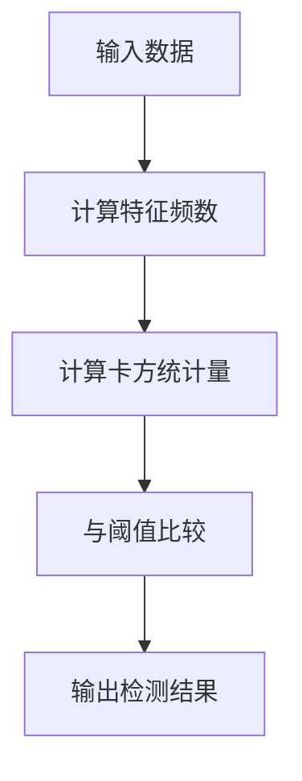
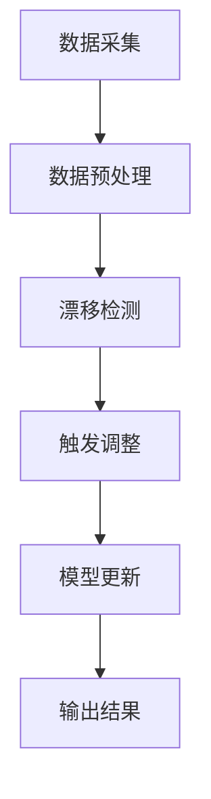
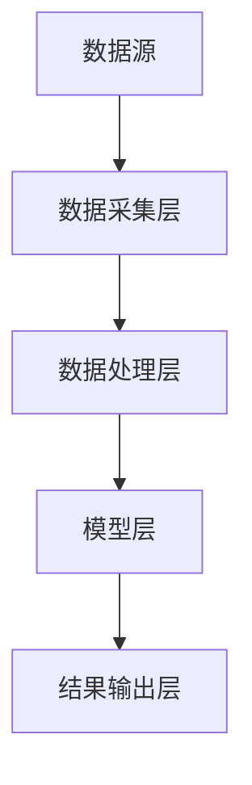
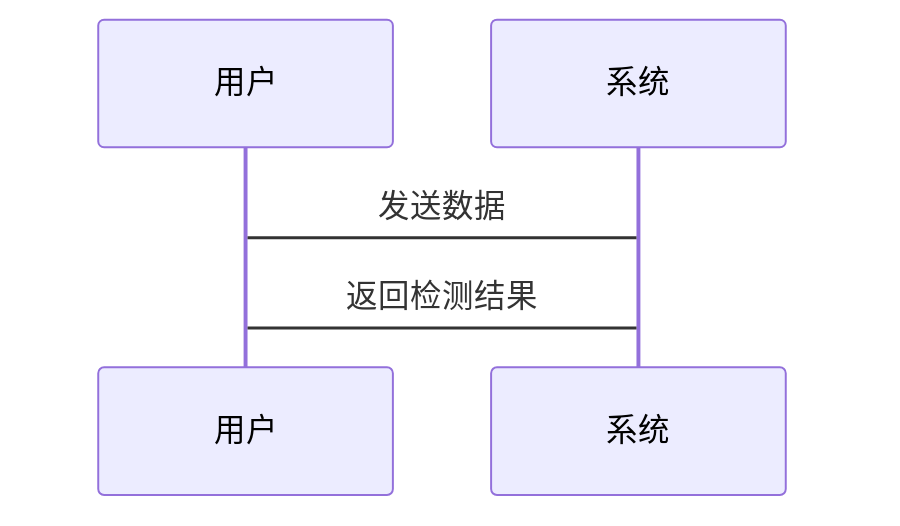

                 


# AI Agent的概念漂移检测与适应

> 关键词：AI Agent, 概念漂移, 检测算法, 适应策略, 自适应系统, 数据分布变化, 模型更新

摘要：  
随着机器学习模型在实时应用中的普及，数据分布的变化（即概念漂移）对模型性能的影响日益显著。本文深入探讨AI Agent在概念漂移检测与适应中的作用，从理论到实践，系统性地分析概念漂移的定义、类型、检测方法及适应策略。文章结合实际案例和系统架构设计，详细阐述了基于统计、模型和分布距离的方法，并通过Python代码实现和系统交互设计，展示了AI Agent在动态环境中的适应能力。最后，本文总结了概念漂移检测与适应的最佳实践，为实际应用提供了有价值的参考。

---

# 第1章：概念漂移的背景与问题

## 1.1 背景介绍

### 1.1.1 数据分布变化的背景
数据分布的变化是机器学习模型失效的主要原因之一。在动态环境中，数据特征的改变可能导致模型预测能力下降，这种现象被称为“概念漂移”。例如，在金融领域，市场趋势的变化可能导致分类模型失效；在自然语言处理中，用户查询习惯的改变可能导致推荐算法效果下降。

### 1.1.2 机器学习模型的局限性
传统机器学习模型（如随机森林、支持向量机）通常假设数据分布是静态的。当数据分布发生变化时，这些模型无法自动适应，导致性能下降甚至完全失效。例如，图像分类模型在光照条件变化时可能无法正确识别目标物体。

### 1.1.3 概念漂移的定义与分类
概念漂移的定义：数据分布的变化导致模型预测能力下降的现象。  
概念漂移的分类：
1. **突然漂移（突然变化）**：数据分布突然发生显著变化。
2. **渐进漂移（逐步变化）**：数据分布缓慢变化。
3. **局部漂移（特定子空间变化）**：仅部分数据分布发生变化。

## 1.2 AI Agent的定义与核心能力

### 1.2.1 AI Agent的基本概念
AI Agent是一种能够感知环境、自主决策并执行任务的智能实体。它结合了感知、推理和执行能力，能够实时适应环境变化。

### 1.2.2 AI Agent的核心能力
1. **感知能力**：通过传感器或数据源获取环境信息。
2. **推理能力**：基于获取的信息进行分析和决策。
3. **执行能力**：根据决策结果采取行动。

### 1.2.3 AI Agent与传统算法的对比
| 特性                | 传统算法                  | AI Agent                  |
|---------------------|---------------------------|---------------------------|
| 自适应性            | 静态，需要人工重新训练    | 动态，自动适应环境变化    |
| 决策能力            | 单一任务，缺乏灵活性      | 多任务，具备自主决策能力  |
| 学习能力            | 需要离线训练              | 支持在线学习和自适应学习  |

---

# 第2章：概念漂移检测的核心概念

## 2.1 概念漂移的定义与类型

### 2.1.1 概念漂移的定义
概念漂移是指数据分布的变化导致模型性能下降的现象。

### 2.1.2 概念漂移的类型
1. **渐进漂移**：数据分布缓慢变化。
2. **突然漂移**：数据分布突然变化。
3. **局部漂移**：特定子空间的数据分布变化。

### 2.1.3 概念漂移与概念转移的对比
| 属性               | 概念漂移              | 概念转移              |
|--------------------|----------------------|----------------------|
| 定义               | 数据分布变化          | 数据类别变化          |
| 检测方法           | 统计检验、分布距离    | 类别标签变化          |
| 应用场景           | 预测模型失效          | 分类任务标签变化      |

### 2.1.4 概念漂移的实体关系图


## 2.2 AI Agent在概念漂移检测中的角色

### 2.2.1 AI Agent作为检测工具
AI Agent通过感知环境数据变化，实时检测概念漂移。

### 2.2.2 AI Agent作为自适应系统
AI Agent能够根据检测结果自动调整模型参数或切换模型。

### 2.2.3 AI Agent与其他检测方法的对比
| 方法               | 统计检验              | 模型重训练            | AI Agent             |
|--------------------|----------------------|----------------------|----------------------|
| 检测频率           | 周期性检测            | 在线检测              | 实时检测              |
| 自适应能力         | 无                   | 有限                 | 强                   |
| 适用场景           | 静态数据              | 动态数据              | 动态、复杂环境         |

---

# 第3章：概念漂移检测的核心算法原理

## 3.1 基于统计的方法

### 3.1.1 卡方检验
卡方检验用于比较两个分布是否相同。



Python代码示例：
```python
import scipy.stats as stats

def chi_square_test(data1, data2):
    observed = np.array([len(data1), len(data2)])
    expected = np.array([len(data1) + len(data2)] * 2) / 2
    chi2, p = stats.chisquare(observed, expected)
    return p < 0.05
```

### 3.1.2 Kolmogorov-Smirnov检验
Kolmogorov-Smirnov检验用于比较两个经验分布函数。

Python代码示例：
```python
import scipy.stats as stats

def ks_test(data1, data2):
    d, p = stats.kstest(data1, data2)
    return p < 0.05
```

### 3.1.3 滑动窗口技术
滑动窗口技术通过比较当前窗口和历史窗口的数据分布变化。

Python代码示例：
```python
def sliding_window(data, window_size):
    windows = [data[i:i+window_size] for i in range(len(data)-window_size+1)]
    # 计算每个窗口的统计量
    # （此处省略具体实现）
    return windows
```

---

## 3.2 基于模型的方法

### 3.2.1 增量学习
增量学习允许模型在新数据上逐步更新。

Python代码示例：
```python
from sklearn.linear_model import SGDClassifier

def incremental_learning(model, X, y):
    model.partial_fit(X, y)
    return model
```

### 3.2.2 模型重训练
模型重训练通过重新训练整个模型来适应新数据。

Python代码示例：
```python
from sklearn.tree import DecisionTreeClassifier

def model_retrain(model, X, y):
    model = DecisionTreeClassifier().fit(X, y)
    return model
```

### 3.2.3 模型漂移检测
模型漂移检测通过监控模型性能变化来判断是否发生漂移。

Python代码示例：
```python
def model_drift_detection(model, X_test, y_test):
    accuracy = model.score(X_test, y_test)
    return accuracy < 0.7
```

---

## 3.3 基于分布距离的方法

### 3.3.1 KL散度
KL散度衡量两个概率分布的差异。

公式：
$$ D_{KL}(P||Q) = \sum P(i) \log \frac{P(i)}{Q(i)} $$

Python代码示例：
```python
import numpy as np

def kl_divergence(P, Q):
    return np.sum(P * np.log(P / Q))
```

### 3.3.2 JS散度
JS散度是KL散度的一种对称形式。

公式：
$$ D_{JS}(P||Q) = \frac{1}{2} \left( D_{KL}(P||M) + D_{KL}(Q||M) \right) $$
其中，$M = \frac{P + Q}{2}$。

Python代码示例：
```python
def js_divergence(P, Q):
    M = (P + Q) / 2
    return 0.5 * (kl_divergence(P, M) + kl_divergence(Q, M))
```

### 3.3.3 流形距离
流形距离考虑数据的几何结构。

Python代码示例：
```python
from sklearn.manifold import TSNE

def manifold_distance(data1, data2):
    model = TSNE(n_components=2)
    emb1 = model.fit_transform(data1)
    emb2 = model.fit_transform(data2)
    # 计算距离（此处省略具体实现）
    return distance
```

---

# 第4章：数学模型与公式

## 4.1 统计假设检验模型

### 4.1.1 卡方检验公式
$$ \chi^2 = \sum \frac{(O_i - E_i)^2}{E_i} $$

### 4.1.2 Z检验公式
$$ Z = \frac{\bar{X}_1 - \bar{X}_2}{\sqrt{\frac{\sigma_1^2}{n_1} + \frac{\sigma_2^2}{n_2}}} $$

## 4.2 基于分布距离的公式

### 4.2.1 KL散度公式
$$ D_{KL}(P||Q) = \sum P(i) \log \frac{P(i)}{Q(i)} $$

### 4.2.2 JS散度公式
$$ D_{JS}(P||Q) = \frac{1}{2} \left( D_{KL}(P||M) + D_{KL}(Q||M) \right) $$
其中，$M = \frac{P + Q}{2}$。

---

# 第5章：系统分析与架构设计

## 5.1 项目介绍

### 5.1.1 项目背景
本项目旨在设计一个实时概念漂移检测系统，应用于在线推荐服务。

## 5.2 系统功能设计

### 5.2.1 系统组件
- 数据采集模块
- 漂移检测模块
- 自适应调整模块

### 5.2.2 功能流程


## 5.3 系统架构设计

### 5.3.1 分层架构


## 5.4 接口设计

### 5.4.1 API接口
- `GET /drift/detect`：获取检测结果
- `POST /model/update`：提交模型更新请求

## 5.5 交互设计

### 5.5.1 用户与系统的交互


---

# 第6章：项目实战

## 6.1 环境安装

### 6.1.1 安装依赖
```bash
pip install numpy scipy scikit-learn
```

## 6.2 核心实现

### 6.2.1 数据采集模块
```python
import requests

def fetch_data(api_url):
    response = requests.get(api_url)
    return response.json()
```

### 6.2.2 漂移检测模块
```python
from sklearn.metrics import accuracy_score

def detect_drift(X_train, y_train, X_test, y_test):
    model = SomeModel().fit(X_train, y_train)
    return accuracy_score(model.predict(X_test), y_test) < 0.7
```

## 6.3 案例分析

### 6.3.1 真实场景应用
在在线推荐系统中，实时检测用户行为变化，动态调整推荐策略。

---

# 第7章：最佳实践与总结

## 7.1 最佳实践

### 7.1.1 检测策略
- 定期采样检测
- 实时监控关键指标

### 7.1.2 适应策略
- 模型重训练
- 参数微调
- 策略切换

## 7.2 小结
概念漂移检测与适应是动态环境下保持模型性能的关键。AI Agent通过实时感知和自主决策，能够有效应对数据分布变化带来的挑战。

## 7.3 注意事项
- 定期模型验证
- 避免过度拟合
- 选择合适的检测方法

## 7.4 拓展阅读
- "Data Stream Mining" by J. Han, M. Kamber, and J. Pei
- "Adaptive Machine Learning" by M. Zhdanovich

---

作者：AI天才研究院/AI Genius Institute & 禅与计算机程序设计艺术/Zen And The Art of Computer Programming

