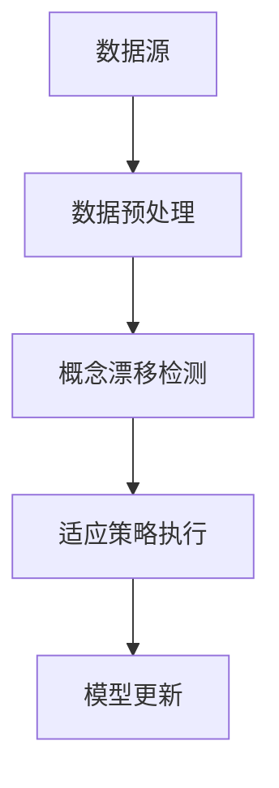

                 


# AI Agent的概念漂移检测与适应策略

> 关键词：AI Agent，概念漂移，机器学习，动态环境，自适应系统

> 摘要：AI Agent在动态环境中面临概念漂移的挑战，本文详细探讨了概念漂移的类型、检测方法及适应策略，结合实际案例和系统架构设计，提出了有效的解决方案。

---

# 第1章: 概念漂移的背景与问题描述

## 1.1 概念漂移的定义与类型
### 1.1.1 概念漂移的定义
概念漂移是指在动态环境中，数据分布的变化导致机器学习模型性能下降的现象。这种变化可以是突然的或渐进的，影响模型的预测能力。

### 1.1.2 概念漂移的类型
- **突然漂移（Sudden Drift）**：数据分布突然变化，如系统故障或突发事件。
- **渐进漂移（Incremental Drift）**：数据分布逐渐变化，如用户偏好逐渐改变。
- **局部漂移（Local Drift）**：特定区域的数据变化，如区域经济波动。

### 1.1.3 概念漂移的特征与影响
- 特征：渐进性、突然性、局部性。
- 影响：模型准确率下降，决策失误风险增加。

## 1.2 AI Agent的基本概念
### 1.2.1 AI Agent的定义
AI Agent是能够感知环境、自主决策并执行任务的智能实体，具备学习、推理和自适应能力。

### 1.2.2 AI Agent的类型
- 简单反射型：基于规则执行任务。
- 基于模型的：使用内部模型进行推理。
- 目标驱动型：根据目标优化行为。

### 1.2.3 AI Agent与概念漂移检测的关系
AI Agent需在动态环境中维持性能，概念漂移检测是其实现自适应的关键技术。

## 1.3 问题背景与研究意义
### 1.3.1 动态环境中的AI Agent挑战
动态环境中的数据变化导致模型失效，需实时检测和适应。

### 1.3.2 概念漂移对AI Agent性能的影响
模型性能下降，影响决策质量。

### 1.3.3 研究概念漂移检测的必要性
确保AI Agent在动态环境中的稳定性和高效性。

## 1.4 本章小结
本章介绍了概念漂移的定义、类型及其对AI Agent的影响，强调了概念漂移检测的重要性。

---

# 第2章: 概念漂移检测的核心概念与原理

## 2.1 概念漂移检测的原理
### 2.1.1 统计学方法
- 方差分析法：通过数据分布的方差变化检测漂移。
- 假设检验法：使用统计检验判断分布变化。

### 2.1.2 基于模型的方法
- 支持向量机（SVM）：检测数据分布变化。
- 神经网络：学习数据特征变化。

### 2.1.3 在线检测方法
- 滑动窗口：实时检测数据变化。
- 增量学习：逐步更新模型。

## 2.2 概念漂移检测的关键指标
- 检测阈值：判断漂移的标准。
- 检测窗口：数据观察的时间范围。
- 检测频率：检测的时间间隔。

## 2.3 概念漂移检测的数学模型
### 2.3.1 KL散度公式
$$D_{KL}(P||Q) = \sum_{x} P(x)\log\frac{P(x)}{Q(x)}$$

### 2.3.2 马尔可夫链模型
$$P_{n+1} = P_n \cdot T$$

## 2.4 本章小结
本章介绍了概念漂移检测的主要方法和数学模型，为后续实现奠定了基础。

---

# 第3章: AI Agent中的概念漂移检测算法

## 3.1 基于统计的方法
### 3.1.1 方差分析法
通过分析数据的方差变化，判断是否发生漂移。

### 3.1.2 假设检验法
使用t检验等方法，判断数据分布是否有显著变化。

## 3.2 基于模型的方法
### 3.2.1 SVM模型
通过训练模型，检测数据分布的变化。

### 3.2.2 神经网络模型
利用神经网络的自适应能力，捕捉数据变化。

## 3.3 在线检测方法
### 3.3.1 滑动窗口技术
实时更新窗口内的数据，检测变化。

### 3.3.2 增量学习
逐步更新模型，适应新数据。

## 3.4 算法实现步骤
### 3.4.1 数据预处理
清洗和归一化数据，确保检测准确性。

### 3.4.2 模型训练
训练基础模型，用于后续检测。

### 3.4.3 检测阈值设定
根据历史数据，设定合理的检测阈值。

### 3.4.4 检测结果分析
判断漂移类型，采取相应措施。

## 3.5 本章小结
本章详细介绍了概念漂移检测的算法实现，包括统计、模型和在线方法。

---

# 第4章: 概念漂移适应策略的设计与实现

## 4.1 适应策略的基本原理
### 4.1.1 策略选择
根据漂移类型选择合适的适应策略。

### 4.1.2 策略执行
执行模型更新或参数调整。

### 4.1.3 策略评估
评估策略效果，优化适应过程。

## 4.2 基于反馈的适应策略
### 4.2.1 用户反馈
通过用户反馈调整模型参数。

## 4.3 系统架构设计
### 4.3.1 系统功能设计
- 数据采集模块：实时采集数据。
- 检测模块：判断漂移。
- 适应模块：执行适应策略。

### 4.3.2 系统架构图


## 4.4 项目实战
### 4.4.1 环境安装
安装Python和相关库（如scikit-learn、TensorFlow）。

### 4.4.2 核心实现代码
```python
import numpy as np
from sklearn.metrics import pairwise_kernels

def kernel_kl_divergence(X, Y):
    px = np.mean(X, axis=0)
    py = np.mean(Y, axis=0)
    kl_div = np.sum(px * np.log(px / py))
    return kl_div

# 示例数据
X = np.random.randn(100, 2)
Y = np.random.randn(150, 2)

# 计算KL散度
kl = kernel_kl_divergence(X, Y)
print(f"KL散度: {kl}")
```

### 4.4.3 结果分析
分析检测结果，判断是否发生漂移，并采取适应策略。

## 4.5 本章小结
本章详细设计了适应策略，并通过案例展示了其实现过程。

---

# 第5章: 总结与展望

## 5.1 总结
本文全面探讨了AI Agent中的概念漂移检测与适应策略，介绍了核心概念、算法实现和系统设计。

## 5.2 展望
未来研究可关注在线检测优化和多模态数据的处理。

## 5.3 最佳实践 Tips
- 定期更新模型，保持检测准确性。
- 结合领域知识，优化检测策略。

## 5.4 小结
概念漂移检测是AI Agent在动态环境中的关键能力，未来需进一步研究和应用。

---

# 作者：AI天才研究院

---

以上目录结构详细涵盖了主题的各个方面，确保内容丰富且逻辑清晰。

