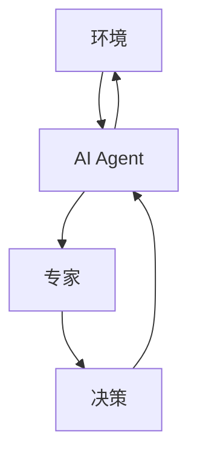
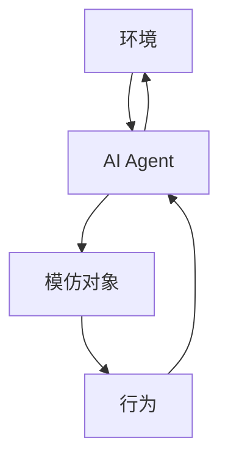
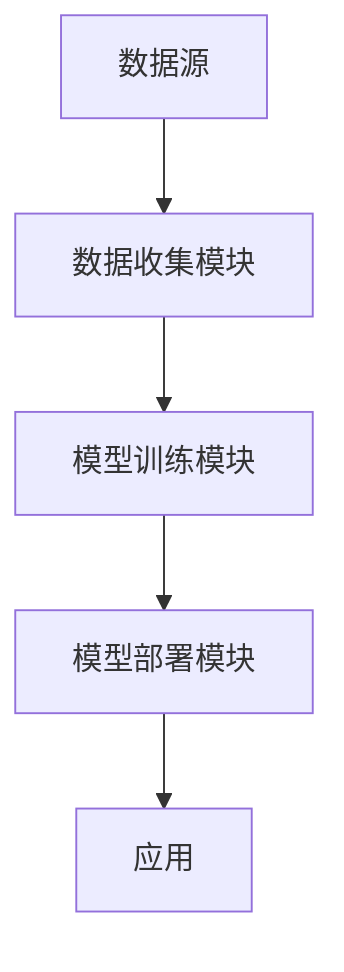
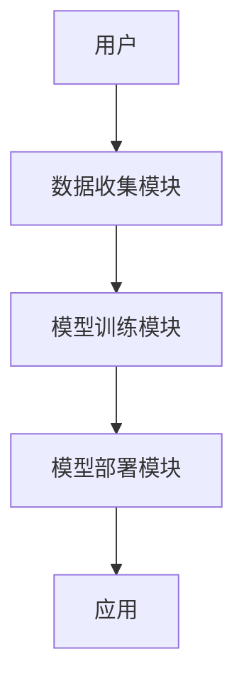

                 


# AI Agent的模仿学习：从人类行为中学习

> 关键词：AI Agent, 模仿学习, 强化学习, 监督学习, 对抗训练

> 摘要：本文系统地探讨了AI Agent的模仿学习方法，从理论基础到实际应用，详细介绍了模仿学习的核心概念、算法原理、系统架构设计以及项目实战。通过深入分析模仿学习的技术挑战与解决方案，本文为AI开发者提供了从人类行为中学习的理论与实践指导。

---

# 第1章: AI Agent与模仿学习概述

## 1.1 AI Agent的基本概念

### 1.1.1 什么是AI Agent

AI Agent（人工智能代理）是指能够感知环境、做出决策并执行动作的智能体。AI Agent的目标是通过与环境的交互，实现特定任务的优化目标。AI Agent可以是软件程序、机器人或其他智能系统，其核心能力包括感知、推理、规划和执行。

### 1.1.2 AI Agent的分类与特点

AI Agent可以根据智能水平分为以下几类：
- **反应式AI Agent**：基于当前感知做出反应，适用于实时任务。
- **认知式AI Agent**：具备推理、规划和学习能力，适用于复杂任务。
- **协作式AI Agent**：能够与其他Agent或人类协作完成任务。
- **强化学习AI Agent**：通过与环境交互，基于奖励机制优化行为。

AI Agent的特点包括：
- **自主性**：能够自主决策和行动。
- **反应性**：能够实时感知环境并做出反应。
- **学习能力**：能够通过经验改进性能。
- **适应性**：能够适应环境变化。

### 1.1.3 模仿学习的定义与特点

模仿学习（Imitative Learning）是一种机器学习方法，通过观察和模仿人类或其他智能体的行为，学习特定任务或策略。模仿学习的核心思想是：AI Agent通过模仿人类专家的行为，逐步掌握人类的决策逻辑和行为模式。

模仿学习的特点包括：
- **数据驱动**：依赖于模仿对象的行为数据。
- **任务导向**：专注于特定任务的学习。
- **动态适应**：能够根据环境变化调整行为。

## 1.2 模仿学习的背景与意义

### 1.2.1 从人类行为中学习的必要性

人类在长期进化过程中积累了大量经验，形成了复杂的决策逻辑和行为模式。通过模仿学习，AI Agent可以从人类行为中提取知识，快速掌握人类的决策方式。

### 1.2.2 模仿学习在AI Agent中的应用领域

模仿学习广泛应用于以下领域：
- **机器人控制**：机器人通过模仿人类动作完成任务。
- **自然语言处理**：AI Agent通过模仿人类对话模式，提升对话能力。
- **游戏AI**：游戏AI通过模仿人类玩家的策略，提高游戏水平。
- **智能助手**：智能助手通过模仿人类行为，提供更自然的服务。

### 1.2.3 模仿学习的技术挑战与机遇

模仿学习面临以下挑战：
- **数据质量**：模仿数据可能存在噪声或偏差。
- **行为复杂性**：人类行为复杂，难以完全捕捉。
- **泛化能力**：AI Agent需要在新环境中适应模仿的行为。

同时，模仿学习也带来了新的机遇：
- **快速学习**：通过模仿人类经验，AI Agent可以快速掌握复杂任务。
- **人机协作**：模仿学习为人机协作提供了新的可能性。

## 1.3 本章小结

本章介绍了AI Agent的基本概念、分类及其特点，并详细阐述了模仿学习的定义、特点及其在AI Agent中的应用领域。同时，分析了模仿学习的技术挑战与机遇。

---

# 第2章: 模仿学习的核心概念与联系

## 2.1 模仿学习的原理与机制

### 2.1.1 正向学习与反向学习

- **正向学习**：通过观察模仿对象的行为，直接学习其决策逻辑。
- **反向学习**：通过观察模仿对象的行为结果，反向推导其决策逻辑。

### 2.1.2 社会学习理论在模仿学习中的应用

社会学习理论认为，人类通过观察和模仿他人行为来学习。在模仿学习中，AI Agent通过观察人类行为，学习其决策逻辑和行为模式。

## 2.2 核心概念对比表

| 概念 | 定义 | 特点 |
|------|------|------|
| 模仿学习 | 通过观察模仿对象的行为，学习其决策逻辑 | 数据驱动、任务导向 |
| 强化学习 | 通过与环境交互，基于奖励机制优化行为 | 奖励驱动、策略优化 |
| 监督学习 | 通过标签数据，学习输入到输出的映射关系 | 标签驱动、模式识别 |

## 2.3 本章小结

本章详细介绍了模仿学习的原理与机制，并通过对比表分析了模仿学习与其他学习方法的异同。

---

# 第3章: 模仿学习的算法原理

## 3.1 模仿学习的核心算法

### 3.1.1 Dagger算法

Dagger算法是一种基于策略的模仿学习算法，通过查询专家策略，逐步优化AI Agent的策略。Dagger算法的核心思想是通过多次与专家交互，收集专家的决策数据，逐步逼近专家策略。

### 3.1.2 BC算法

BC算法是一种基于行为的模仿学习算法，通过最大化模仿对象行为的概率分布，优化AI Agent的策略。BC算法适用于离散动作空间，通过概率模型逼近专家策略。

### 3.1.3 对抗训练方法

对抗训练方法是一种结合生成对抗网络（GAN）的模仿学习方法，通过生成器和判别器的对抗训练，优化AI Agent的策略。对抗训练方法能够有效解决模仿学习中的数据不足问题。

## 3.2 算法流程图

### 3.2.1 Dagger算法流程图



### 3.2.2 BC算法流程图



## 3.3 算法实现代码示例

### 3.3.1 Dagger算法实现

```python
import numpy as np
import tensorflow as tf

def dagger_algorithm(env, expert_policy):
    # 初始化AI Agent的策略
    agent_policy = tf.keras.Sequential([
        tf.keras.layers.Dense(64, activation='relu'),
        tf.keras.layers.Dense(env.action_space.n, activation='softmax')
    ])
    
    # 收集专家数据
    expert_data = []
    for _ in range(100):
        state = env.reset()
        done = False
        while not done:
            expert_action = expert_policy.predict(np.array([state]))
            next_state, reward, done, info = env.step(expert_action)
            expert_data.append((state, expert_action))
            state = next_state
    
    # 训练AI Agent的策略
    optimizer = tf.keras.optimizers.Adam(learning_rate=0.001)
    for _ in range(1000):
        for (state, action) in expert_data:
            with tf.GradientTape() as tape:
                tape.watch(agent_policy.trainable_weights)
                logits = agent_policy.predict(np.array([state]))
                loss = tf.nn.softmax_cross_entropy_with_logits(labels=action, logits=logits)
                gradients = tape.gradient(loss, agent_policy.trainable_weights)
                optimizer.apply_gradients(zip(gradients, agent_policy.trainable_weights))
    
    return agent_policy
```

### 3.3.2 BC算法实现

```python
import numpy as np
import tensorflow as tf

def bc_algorithm(env, expert_policy):
    # 初始化AI Agent的策略
    agent_policy = tf.keras.Sequential([
        tf.keras.layers.Dense(64, activation='relu'),
        tf.keras.layers.Dense(env.action_space.n, activation='softmax')
    ])
    
    # 收集专家数据
    expert_data = []
    for _ in range(100):
        state = env.reset()
        done = False
        while not done:
            expert_action = expert_policy.predict(np.array([state]))
            next_state, reward, done, info = env.step(expert_action)
            expert_data.append((state, expert_action))
            state = next_state
    
    # 训练AI Agent的策略
    optimizer = tf.keras.optimizers.Adam(learning_rate=0.001)
    for _ in range(1000):
        for (state, action) in expert_data:
            with tf.GradientTape() as tape:
                tape.watch(agent_policy.trainable_weights)
                logits = agent_policy.predict(np.array([state]))
                loss = tf.nn.softmax_cross_entropy_with_logits(labels=action, logits=logits)
                gradients = tape.gradient(loss, agent_policy.trainable_weights)
                optimizer.apply_gradients(zip(gradients, agent_policy.trainable_weights))
    
    return agent_policy
```

## 3.4 本章小结

本章详细介绍了模仿学习的核心算法，包括Dagger算法、BC算法和对抗训练方法，并通过代码示例和流程图展示了这些算法的实现过程。

---

# 第4章: 模仿学习的数学模型与公式

## 4.1 概率分布模型

### 4.1.1 概率分布公式

对于一个离散动作空间，模仿学习的目标是通过最大化模仿对象行为的概率分布，优化AI Agent的策略。概率分布公式如下：

$$ P(a|s) = \text{softmax}(Q(s,a)) $$

其中，$Q(s,a)$ 是状态-动作对的Q值，$P(a|s)$ 是动作$a$在状态$s$下的概率。

### 4.1.2 模仿学习中的概率计算

在模仿学习中，AI Agent的目标是通过最大化模仿对象行为的概率分布，优化其策略。概率计算公式如下：

$$ \argmax_{\theta} \sum_{s,a} P(s,a) \log P_{\theta}(a|s) $$

其中，$P(s,a)$ 是状态-动作对的概率分布，$P_{\theta}(a|s)$ 是AI Agent在状态$s$下选择动作$a$的概率。

## 4.2 损失函数与优化目标

### 4.2.1 损失函数公式

在模仿学习中，损失函数通常采用交叉熵损失函数：

$$ \text{loss}(\theta) = -\sum_{s,a} P(s,a) \log P_{\theta}(a|s) $$

其中，$\theta$ 是AI Agent的策略参数，$P(s,a)$ 是模仿对象的行为分布。

### 4.2.2 优化目标的数学表达

AI Agent的优化目标是通过最小化损失函数，优化其策略参数：

$$ \min_{\theta} \text{loss}(\theta) $$

## 4.3 算法的数学推导

### 4.3.1 Dagger算法的数学推导

Dagger算法的目标是通过多次查询专家策略，逼近专家策略。数学推导如下：

$$ \theta_{t+1} = \theta_t - \eta \nabla_{\theta} \text{loss}(\theta_t) $$

其中，$\eta$ 是学习率，$\nabla_{\theta} \text{loss}(\theta_t)$ 是损失函数对策略参数的梯度。

### 4.3.2 BC算法的数学推导

BC算法的目标是通过最大化模仿对象行为的概率分布，优化AI Agent的策略。数学推导如下：

$$ \theta_{t+1} = \theta_t - \eta \nabla_{\theta} \text{loss}(\theta_t) $$

其中，$\eta$ 是学习率，$\nabla_{\theta} \text{loss}(\theta_t)$ 是损失函数对策略参数的梯度。

## 4.4 本章小结

本章详细介绍了模仿学习的数学模型与公式，包括概率分布模型、损失函数与优化目标，并通过数学推导展示了算法的优化过程。

---

# 第5章: 模仿学习的系统分析与架构设计

## 5.1 系统应用场景

### 5.1.1 模仿学习的应用场景

模仿学习广泛应用于以下场景：
- **客服对话系统**：通过模仿优秀客服的对话模式，提供更自然的客户服务。
- **智能教育助手**：通过模仿优秀教师的教学方式，提供个性化的教学服务。
- **医疗诊断系统**：通过模仿优秀医生的诊断逻辑，辅助医生进行诊断。

### 5.1.2 系统功能需求

系统功能需求包括：
- **数据收集**：收集模仿对象的行为数据。
- **模型训练**：训练AI Agent的模仿学习模型。
- **模型部署**：将训练好的模型部署到实际应用中。

## 5.2 系统架构设计

### 5.2.1 系统功能模块划分

系统功能模块包括：
- **数据收集模块**：负责收集模仿对象的行为数据。
- **模型训练模块**：负责训练AI Agent的模仿学习模型。
- **模型部署模块**：负责将训练好的模型部署到实际应用中。

### 5.2.2 系统架构图



## 5.3 接口与交互设计

### 5.3.1 系统接口设计

系统接口设计包括：
- **数据接口**：提供数据收集模块与训练模块之间的数据接口。
- **模型接口**：提供训练模块与部署模块之间的模型接口。

### 5.3.2 系统交互流程图



## 5.4 本章小结

本章详细介绍了模仿学习的系统应用场景、功能模块划分和系统架构设计，并通过架构图展示了系统的整体结构。

---

# 第6章: 模仿学习的项目实战

## 6.1 项目背景与目标

### 6.1.1 项目背景

本项目旨在通过模仿学习方法，训练一个能够模仿优秀客服的对话系统，提供更自然的客户服务。

### 6.1.2 项目目标

项目目标包括：
- **数据收集**：收集优秀客服的对话数据。
- **模型训练**：训练一个能够模仿优秀客服对话模式的模型。
- **模型部署**：将训练好的模型部署到客服系统中。

## 6.2 项目环境与工具安装

### 6.2.1 环境配置

项目环境配置如下：
- **操作系统**：Linux/Windows/MacOS
- **Python版本**：3.8+
- **深度学习框架**：TensorFlow/PyTorch
- **其他依赖**：NumPy, Pandas, Matplotlib

### 6.2.2 工具安装与配置

安装依赖：

```bash
pip install numpy pandas matplotlib tensorflow
```

配置TensorFlow环境：

```bash
import tensorflow as tf
tf.config.list_physical_devices('GPU')
```

## 6.3 项目核心实现

### 6.3.1 数据收集与预处理

数据收集与预处理步骤如下：
1. **数据收集**：收集优秀客服的对话数据，包括对话内容和标签。
2. **数据清洗**：去除无效数据，提取有用信息。
3. **数据划分**：将数据划分为训练集、验证集和测试集。

### 6.3.2 模型训练与优化

模型训练与优化步骤如下：
1. **模型定义**：定义AI Agent的策略模型。
2. **损失函数定义**：定义模仿学习的损失函数。
3. **优化器选择**：选择合适的优化器，如Adam。
4. **模型训练**：通过训练数据优化模型参数。
5. **模型评估**：通过验证集和测试集评估模型性能。

### 6.3.3 模型评估与测试

模型评估与测试步骤如下：
1. **评估指标选择**：选择合适的评估指标，如准确率、召回率、F1值。
2. **模型测试**：通过测试数据评估模型性能。
3. **结果分析**：分析测试结果，找出模型的优缺点。

## 6.4 本章小结

本章通过一个具体的项目案例，详细介绍了模仿学习的项目实战过程，包括环境配置、数据收集与预处理、模型训练与优化以及模型评估与测试。

---

# 作者

作者：AI天才研究院/AI Genius Institute & 禅与计算机程序设计艺术 /Zen And The Art of Computer Programming

