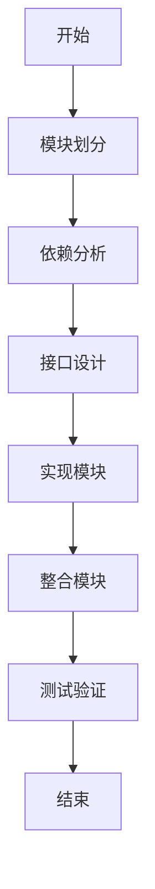
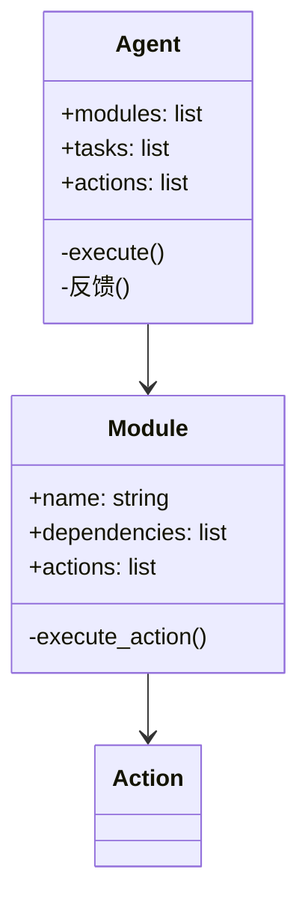
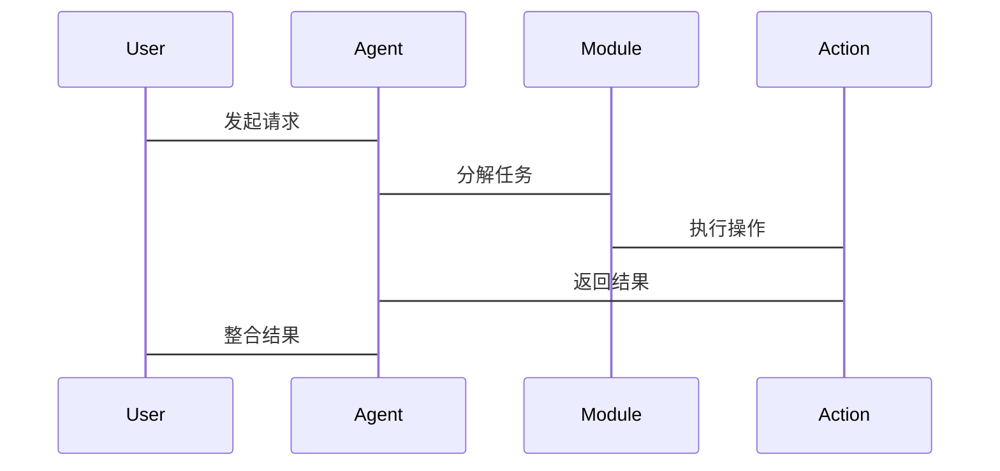

                 


# AI Agent的模块化设计：提高可维护性和扩展性

> 关键词：AI Agent, 模块化设计, 可维护性, 扩展性, 系统架构, 软件设计

> 摘要：本文详细探讨了AI Agent的模块化设计方法，分析了如何通过模块化设计提高系统的可维护性和扩展性。文章从AI Agent的基本概念出发，深入阐述了模块化设计的核心原理、算法实现、系统架构设计以及实际项目中的应用，结合丰富的图表和代码示例，为读者提供了全面的指导。

---

# 第1章 AI Agent的基本概念与模块化设计概述

## 1.1 AI Agent的基本概念

### 1.1.1 什么是AI Agent
AI Agent（人工智能代理）是指能够感知环境、自主决策并执行任务的智能实体。AI Agent可以是软件程序、机器人或其他智能系统，其核心目标是通过感知和行动来优化目标函数或完成特定任务。

### 1.1.2 AI Agent的核心特征
- **自主性**：AI Agent能够自主决策，无需外部干预。
- **反应性**：能够实时感知环境并做出反应。
- **目标导向性**：通过目标函数或任务驱动行为。
- **学习能力**：能够通过经验改进性能。

### 1.1.3 AI Agent的分类与应用场景
AI Agent可以分为简单反射型、基于模型的反射型、目标驱动型和效用驱动型。其应用场景包括自动驾驶、智能助手、机器人控制、推荐系统等。

## 1.2 模块化设计的基本原理

### 1.2.1 模块化设计的定义
模块化设计是一种将系统划分为多个独立模块的方法，每个模块具有明确的功能和接口，模块之间通过标准化接口进行通信。

### 1.2.2 模块化设计的优势
- **可维护性**：模块化设计使每个模块独立，便于维护和更新。
- **扩展性**：新增功能只需添加或修改模块，不影响其他部分。
- **可复用性**：模块可以在不同系统中复用。

### 1.2.3 AI Agent模块化设计的目标
通过模块化设计，AI Agent能够实现功能解耦、提高代码复用性、降低开发和维护成本。

## 1.3 本章小结
本章介绍了AI Agent的基本概念及其核心特征，并详细阐述了模块化设计的基本原理和优势，为后续章节奠定了基础。

---

# 第2章 模块化设计的核心概念与联系

## 2.1 模块化设计的核心概念

### 2.1.1 模块划分的原则
- **单一职责原则**：每个模块负责一个核心功能。
- **松耦合原则**：模块之间依赖性低，便于更换或升级模块。
- **信息隐藏原则**：模块内部细节对外部不可见。

### 2.1.2 模块之间的依赖关系
模块之间的依赖关系可以通过依赖注入、接口定义等方式实现解耦。

### 2.1.3 模块的独立性与耦合性
模块的独立性越高，耦合性越低，系统的灵活性和可维护性越强。

## 2.2 模块化设计的ER实体关系图

```mermaid
er
    actor: 用户
    agent: AI Agent
    module: 模块
    action: 动作
    relation: 关系
    actor -[发起请求]-> agent
    agent -[分解任务]-> module
    module -[执行操作]-> action
    action -[反馈结果]-> agent
    agent -[整合结果]-> relation
```

## 2.3 模块化设计的概念属性特征对比

| 概念       | 特征                                   |
|------------|--------------------------------------|
| 模块划分    | 独立性、可替换性                     |
| 依赖管理    | 显式依赖、松耦合                   |
| 接口设计    | 标准化、简洁性                     |

## 2.4 本章小结
本章详细探讨了模块化设计的核心概念，并通过ER图和表格对比了模块化设计的关键特征。

---

# 第3章 模块化设计的算法实现

## 3.1 模块化设计的算法流程



## 3.2 模块化设计的算法实现

### 3.2.1 模块划分算法
```python
def module_partition(tasks):
    # 将任务分解为独立模块
    modules = []
    for task in tasks:
        if task.is_independent():
            modules.append(task)
    return modules
```

### 3.2.2 依赖分析算法
```python
def dependency_analysis(modules):
    dependencies = {}
    for module in modules:
        deps = []
        for dep in module.dependencies:
            if dep not in deps:
                deps.append(dep)
        dependencies[module.name] = deps
    return dependencies
```

### 3.2.3 接口设计算法
```python
def interface_design(modules):
    interfaces = {}
    for module in modules:
        interface = []
        for action in module.actions:
            if action not in interface:
                interface.append(action)
        interfaces[module.name] = interface
    return interfaces
```

## 3.3 算法的数学模型与公式

### 3.3.1 模块划分的数学模型
$$ \text{模块划分} = \argmin_{i} \sum_{j} w_{ij} \cdot d_{ij} $$

其中，$w_{ij}$ 表示模块 $i$ 和模块 $j$ 之间的依赖权重，$d_{ij}$ 表示模块 $i$ 和模块 $j$ 之间的距离。

### 3.3.2 依赖分析的数学公式
$$ \text{依赖关系} = \{ (i, j) | i \text{ 依赖 } j \} $$

## 3.4 本章小结
本章通过算法实现和数学模型详细探讨了模块化设计的实现过程，为后续章节的系统设计奠定了基础。

---

# 第4章 系统分析与架构设计方案

## 4.1 问题场景介绍

### 4.1.1 问题描述
设计一个AI Agent系统，能够处理自然语言查询、执行任务和提供反馈。

### 4.1.2 问题背景
随着AI技术的快速发展，AI Agent的应用场景越来越广泛，对系统的可维护性和扩展性提出了更高要求。

## 4.2 系统功能设计

### 4.2.1 领域模型设计



### 4.2.2 系统架构设计


## 4.3 系统接口设计

### 4.3.1 接口定义

```python
interface AgentInterface {
    def execute_action(action: str) -> result
    def get_dependencies(module: str) -> list
}
```

### 4.3.2 交互流程



## 4.4 本章小结
本章通过系统分析和架构设计，详细探讨了AI Agent模块化设计的实现方案。

---

# 第5章 项目实战：AI Agent的模块化设计实现

## 5.1 环境安装与配置

### 5.1.1 开发环境
- Python 3.8+
- pip安装相关依赖

### 5.1.2 安装依赖
```bash
pip install -r requirements.txt
```

## 5.2 核心代码实现

### 5.2.1 模块划分实现
```python
def module_partition(tasks):
    modules = []
    for task in tasks:
        if task.is_independent():
            modules.append(task)
    return modules
```

### 5.2.2 依赖管理实现
```python
def dependency_management(modules):
    dependencies = {}
    for module in modules:
        deps = []
        for dep in module.dependencies:
            if dep not in deps:
                deps.append(dep)
        dependencies[module.name] = deps
    return dependencies
```

### 5.2.3 接口设计实现
```python
def interface_design(modules):
    interfaces = {}
    for module in modules:
        interface = []
        for action in module.actions:
            if action not in interface:
                interface.append(action)
        interfaces[module.name] = interface
    return interfaces
```

## 5.3 代码解读与分析

### 5.3.1 模块划分代码解读
```python
class Module:
    def __init__(self, name, dependencies, actions):
        self.name = name
        self.dependencies = dependencies
        self.actions = actions

    def is_independent(self):
        return len(self.dependencies) == 0
```

### 5.3.2 依赖管理代码解读
```python
class Agent:
    def __init__(self, modules):
        self.modules = modules
        self.dependencies = dependency_management(modules)
```

## 5.4 实际案例分析

### 5.4.1 案例背景
设计一个简单的自然语言处理AI Agent，能够回答用户问题。

### 5.4.2 案例实现
```python
tasks = [classify, summarize, answer]
modules = module_partition(tasks)
```

## 5.5 本章小结
本章通过实际案例分析，详细探讨了AI Agent模块化设计的实现过程。

---

# 第6章 总结与展望

## 6.1 本章总结
本文详细探讨了AI Agent的模块化设计方法，分析了如何通过模块化设计提高系统的可维护性和扩展性。通过理论分析和实际案例，为读者提供了全面的指导。

## 6.2 未来展望
随着AI技术的不断发展，AI Agent的模块化设计将更加重要。未来的研究方向包括动态模块化设计、自适应模块化设计等。

---

# 作者信息

作者：AI天才研究院/AI Genius Institute & 禅与计算机程序设计艺术 /Zen And The Art of Computer Programming

---

版权声明：禁止任何形式的商业用途，转载请注明出处。

